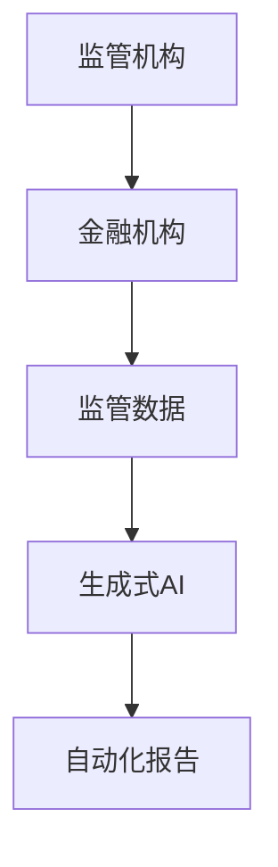
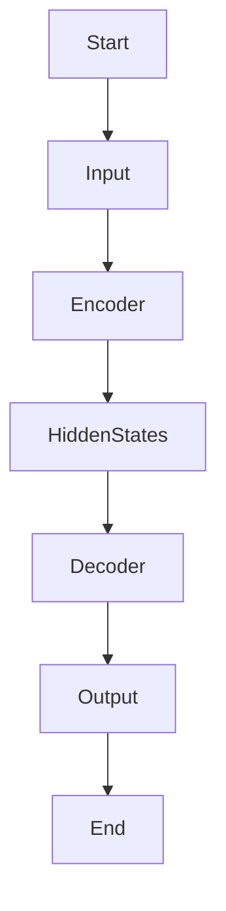
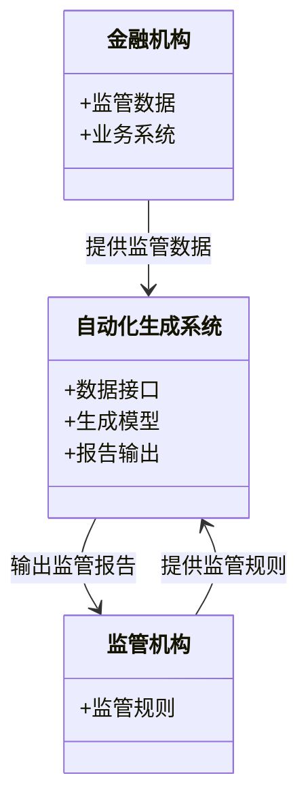
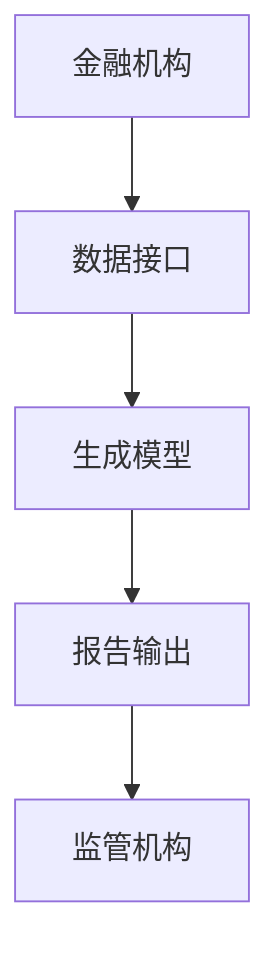
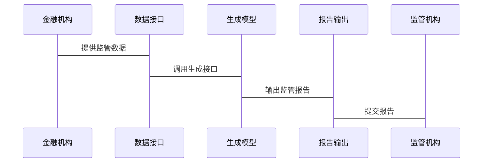

                 

<think>
嗯，用户希望我设计一本名为《金融监管报告自动化生成》的书籍目录大纲。首先，我需要理解这本书的核心内容。金融监管报告的自动化生成涉及到多个方面，比如技术背景、算法原理、系统架构、项目实战等。

用户给的示例中，软件2.0与AI大模型的目录结构分为几个部分，包括背景、核心概念、算法、系统设计、实战、最佳实践等。我应该参考这个结构，确保我的大纲涵盖所有必要的部分。

首先，背景介绍部分。我需要包括问题背景、描述、解决方法，以及边界和外延。这部分应该放在第一章，帮助读者理解为什么需要自动化生成金融监管报告。

接下来是核心概念与联系。这里需要详细讲解相关概念，比如监管数据、NLP技术、生成模型等。可能还需要用表格对比这些概念的属性，以及用Mermaid图展示实体关系。

然后是算法原理。这部分需要详细讲解生成式AI的数学模型，比如Transformer的结构，以及具体的公式。可能需要使用Python代码来展示模型的实现，并举例说明。

系统分析与架构设计是关键部分。我需要描述问题场景，设计系统功能，可能用Mermaid类图展示领域模型，架构图展示系统的整体结构，接口设计和交互流程。

项目实战部分，我需要指导读者如何安装环境，实现核心功能，并通过案例分析来展示应用。这部分要详细，包括代码解读和实际案例的分析。

最后是最佳实践和小结。总结各章内容，给出注意事项和拓展阅读的建议，帮助读者巩固知识。

现在，我需要确保目录结构完整，包含至少七章，每章细化到三级目录。同时，使用Mermaid图和数学公式，确保内容全面且逻辑清晰。

可能需要调整章节顺序，确保从基础到应用逐步深入。比如，先介绍背景，再讲核心概念，接着是算法，系统设计，实战，最后总结。这样结构更合理，读者更容易理解。

还要考虑读者的背景，可能包括金融从业者和IT技术人员，所以内容需要兼顾两者的知识水平，适当解释专业术语，确保可读性。

总之，我需要按照用户的要求，设计一个详细且逻辑清晰的目录大纲，覆盖所有必要部分，同时保持简洁和完整性。
</think>

# 金融监管报告自动化生成

> 关键词：金融监管，自动化生成，生成式AI，自然语言处理，监管报告，系统架构，项目实战

> 摘要：本文将详细探讨金融监管报告自动化生成的背景、核心概念、算法原理、系统架构设计以及实际项目实现。通过分析监管数据的特点和生成式AI的工作原理，结合具体的系统设计和代码实现，为读者提供一个全面的技术指南，帮助其理解并掌握如何利用现代技术手段提升金融监管效率。

---

# 第1章: 金融监管报告自动化生成的背景与问题描述

## 1.1 问题背景与描述
### 1.1.1 金融监管的核心目标
金融监管的目的是维护金融市场秩序，保护投资者利益，防范系统性风险。然而，随着金融机构业务的复杂化和金融产品的创新，传统的监管方式逐渐暴露出效率低、成本高的问题。

### 1.1.2 传统金融监管的痛点
1. 手工审核的低效性：依赖人工审查大量文件和报告，耗时且容易出错。
2. 数据分散：金融机构的业务数据分布于多个系统中，难以统一管理和分析。
3. 规则更新滞后：金融监管规则的更新难以及时反映到实际操作中。

### 1.1.3 自动化监管的必要性
自动化监管可以显著提高监管效率，降低成本，并能够快速响应监管规则的变化。通过技术手段实现监管报告的自动化生成，是未来金融监管的重要发展方向。

## 1.2 问题解决思路与边界
### 1.2.1 自动化监管的解决方案
利用生成式AI和自然语言处理技术，从金融机构提供的数据中提取关键信息，并自动生成符合监管要求的报告。

### 1.2.2 技术实现的边界与限制
1. 数据隐私与安全：必须确保金融数据的安全性和隐私性。
2. 模型的泛化能力：生成式AI需要能够适应不同金融机构的报告格式和内容要求。
3. 监管规则的复杂性：复杂的监管规则可能需要人工干预来调整生成的报告。

### 1.2.3 与现有监管体系的衔接
自动化监管系统需要与现有的监管流程无缝对接，确保生成的报告能够被监管机构直接使用。

## 1.3 核心概念与结构
### 1.3.1 金融监管的核心要素
1. 监管数据：金融机构的业务数据，包括交易记录、财务报表等。
2. 监管规则：由监管机构制定的法规和指引。
3. 生成式AI：用于根据输入数据生成符合要求的报告。

### 1.3.2 自动化报告生成的逻辑结构
1. 数据采集：从金融机构获取监管数据。
2. 数据处理：对数据进行清洗和预处理。
3. 模型训练：基于历史数据训练生成式AI模型。
4. 报告生成：根据实时数据生成监管报告。

### 1.3.3 相关概念的对比分析
| 概念 | 特征 |
|------|------|
| 监管数据 | 结构化、非结构化混合 |
| 自然语言处理 | 文本理解和生成 |
| 生成式AI | 基于上下文生成文本 |

## 1.4 本章小结
本章介绍了金融监管报告自动化生成的背景和问题，分析了传统监管的痛点，并提出了自动化监管的解决方案。通过对比分析相关概念，明确了实现自动化监管的关键要素。

---

# 第2章: 核心概念与联系

## 2.1 相关核心概念的原理
### 2.1.1 监管数据的特征
1. 结构化数据：如表格数据、数据库记录。
2. 非结构化数据：如文本、文档。

### 2.1.2 自然语言处理技术
自然语言处理（NLP）用于理解和生成人类语言。在金融监管中，NLP常用于从文本数据中提取关键信息。

### 2.1.3 生成式AI的原理
生成式AI通过训练大规模的数据集，学习语言的模式，并利用这些模式生成新的文本。常用模型包括GPT、BERT等。

## 2.2 概念属性对比分析
| 概念 | 特征 |
|------|------|
| 监管数据 | 多样性、实时性 |
| 自然语言处理 | 语义理解、文本生成 |
| 生成式AI | 可定制性、灵活性 |

## 2.3 实体关系图


## 2.4 本章小结
本章详细介绍了金融监管报告自动化生成中涉及的核心概念，包括监管数据、自然语言处理和生成式AI的原理，并通过对比分析和实体关系图展示了这些概念之间的联系。

---

# 第3章: 生成式AI的算法原理

## 3.1 算法原理概述
### 3.1.1 生成式AI的基本原理
生成式AI通过训练数据学习语言的特征，并利用这些特征生成新的文本。

### 3.1.2 变压器模型的核心思想
变压器模型由编码器和解码器组成，编码器负责将输入序列编码为一个向量，解码器负责根据编码向量生成输出序列。

### 3.1.3 解码过程的详细步骤
1. 输入序列经过编码器得到编码向量。
2. 解码器根据编码向量逐步生成输出序列。
3. 每一步生成的输出作为下一步的输入，直到生成完整的文本。

## 3.2 算法流程图


## 3.3 算法数学模型
### 3.3.1 编码层公式
$$\text{Encoder} = \text{LayerNorm}(\text{SelfAttention}(x) + x)$$

### 3.3.2 解码层公式
$$\text{Decoder} = \text{LayerNorm}(\text{SelfAttention}(y) + \text{CrossAttention}(x, y))$$

## 3.4 具体实现
### 3.4.1 Python代码示例
```python
import torch

class Transformer(nn.Module):
    def __init__(self, d_model, nhead, dim_feedforward):
        super().__init__()
        self.self_attn = nn.MultiheadAttention(d_model, nhead)
        self.cross_attn = nn.MultiheadAttention(d_model, nhead)
        self.feedforward = nn.Sequential(
            nn.Linear(d_model, dim_feedforward),
            nn.ReLU(),
            nn.Linear(dim_feedforward, d_model)
        )
    
    def forward(self, x, y):
        # 编码
        x_out = self.self_attn(x, x, x)[0]
        x_out = x_out + x
        x_out = LayerNorm(x_out)
        
        # 解码
        y_out = self.self_attn(y, y, y)[0]
        y_out = y_out + y
        y_out = LayerNorm(y_out)
        
        # 交叉注意力
        y_out = self.cross_attn(y_out, x_out, x_out)[0]
        y_out = y_out + y
        y_out = LayerNorm(y_out)
        
        # 前馈网络
        y_out = self.feedforward(y_out)
        return y_out
```

### 3.4.2 举例说明
假设输入是一个简单的句子：“The cat sat on the mat.”，生成式AI会根据这个输入生成一个类似的句子，如：“The dog lay on the rug.”。

## 3.5 本章小结
本章详细讲解了生成式AI的算法原理，包括变压器模型的结构、解码过程以及具体的数学公式。通过Python代码示例，展示了如何实现生成式AI的核心部分。

---

# 第4章: 系统分析与架构设计

## 4.1 问题场景介绍
### 4.1.1 系统目标
实现金融监管报告的自动化生成，提高监管效率。

### 4.1.2 业务场景
金融机构提供监管数据，系统自动生成符合监管要求的报告。

## 4.2 系统功能设计
### 4.2.1 领域模型


### 4.2.2 系统架构


### 4.2.3 接口设计
1. 数据接口：接收金融机构的监管数据。
2. 生成模型接口：调用生成式AI模型生成报告。
3. 报告输出接口：将生成的报告输出给监管机构。

### 4.2.4 交互流程


## 4.3 本章小结
本章从系统分析的角度，介绍了金融监管报告自动化生成的系统架构设计，包括领域模型、系统架构、接口设计和交互流程。

---

# 第5章: 项目实战

## 5.1 环境安装与配置
### 5.1.1 Python环境
安装Python 3.8及以上版本。

### 5.1.2 库的安装
安装必要的库，如`transformers`、`pytorch`等。

## 5.2 核心功能实现
### 5.2.1 数据预处理
```python
import pandas as pd

def preprocess_data(data):
    # 数据清洗
    data = data.dropna()
    # 数据转换
    data['timestamp'] = pd.to_datetime(data['timestamp'])
    return data
```

### 5.2.2 模型训练
```python
from transformers import AutoModelForCausalLM, AutoTokenizer

model_name = 'gpt2'
tokenizer = AutoTokenizer.from_pretrained(model_name)
model = AutoModelForCausalLM.from_pretrained(model_name)
```

### 5.2.3 报告生成
```python
def generate_report(data, model, tokenizer):
    input_text = f"Generate regulatory report for {data['institution'][0]}..."
    inputs = tokenizer.encode(input_text, return_tensors='pt')
    outputs = model.generate(inputs, max_length=500)
    report = tokenizer.decode(outputs[0], skip_special_tokens=True)
    return report
```

## 5.3 代码解读与分析
### 5.3.1 数据预处理
数据预处理部分主要用于清洗和转换数据，确保数据的完整性和一致性。

### 5.3.2 模型训练
使用预训练的生成式模型，如GPT-2，进行微调，以适应金融监管报告的生成需求。

### 5.3.3 报告生成
根据输入的数据生成监管报告，输出文本符合监管要求。

## 5.4 实际案例分析
### 5.4.1 案例背景
某银行需要生成季度财务报告。

### 5.4.2 数据准备
提供该银行的财务数据，包括收入、支出、利润等。

### 5.4.3 模型生成报告
生成的报告应包含财务数据的详细分析和合规性检查结果。

## 5.5 本章小结
本章通过实际项目案例，详细讲解了金融监管报告自动化生成的实现过程，包括环境配置、数据预处理、模型训练和报告生成。

---

# 第6章: 最佳实践与注意事项

## 6.1 最佳实践
### 6.1.1 数据质量
确保数据的准确性和完整性，避免数据偏差。

### 6.1.2 模型调优
根据具体需求对模型进行微调，提升生成报告的准确性和可读性。

### 6.1.3 安全与合规
确保数据处理和模型训练符合相关法律法规，保护数据隐私。

## 6.2 注意事项
### 6.2.1 数据隐私
避免泄露金融机构的敏感数据。

### 6.2.2 模型的可解释性
确保生成的报告可被监管机构理解和接受。

### 6.2.3 技术可行性
根据实际需求选择合适的技术方案，避免过度复杂化。

## 6.3 拓展阅读
推荐阅读相关领域的书籍和论文，深入理解生成式AI和金融监管的结合应用。

## 6.4 本章小结
本章总结了金融监管报告自动化生成的最佳实践和注意事项，为读者提供了实用的指导。

---

# 作者：AI天才研究院/AI Genius Institute & 禅与计算机程序设计艺术 /Zen And The Art of Computer Programming

---

通过以上章节的详细讲解，读者可以系统地理解金融监管报告自动化生成的技术实现和实际应用。从理论到实践，本文为读者提供了一个完整的解决方案，帮助其在金融监管领域中高效地应用生成式AI技术。

