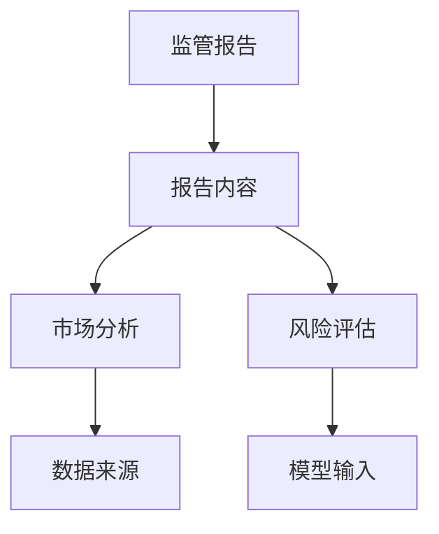
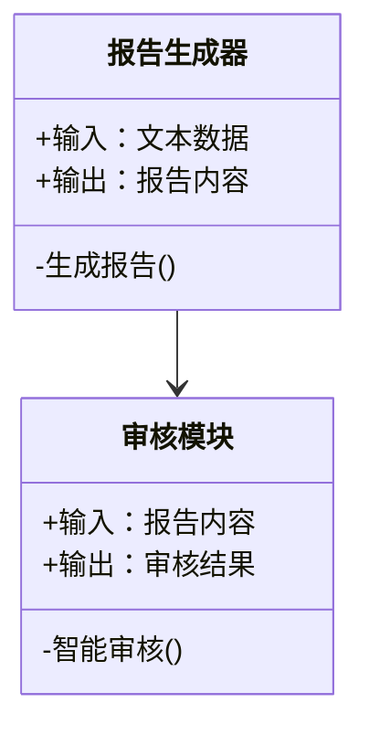
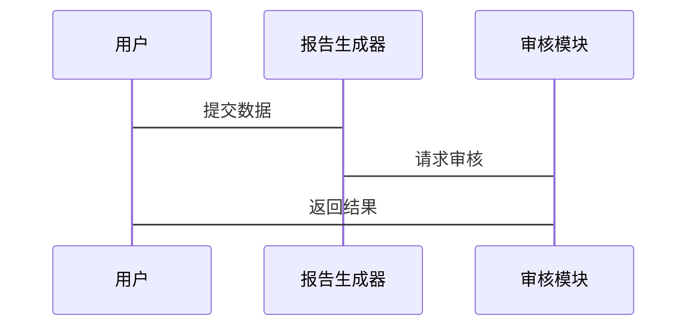
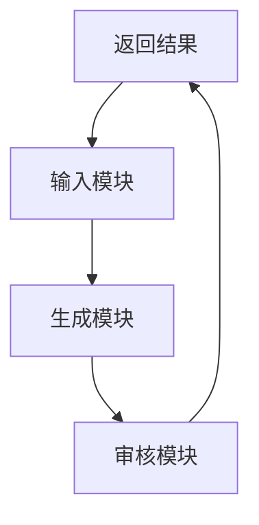

                 

<think>
好，我需要为《金融监管报告自动化生成与审核系统》这本书设计一个目录大纲。这本书的核心在于利用自然语言处理和机器学习技术，来实现金融监管报告的自动化生成和审核。首先，我需要明确这本书的结构，确保涵盖必要的章节和内容。

首先，我应该从背景介绍开始，解释为什么需要这样的系统，以及它在金融监管中的重要性。接着，介绍自然语言处理和机器学习技术在金融监管中的具体应用，让读者理解这些技术如何帮助生成和审核报告。

然后，我需要详细讲解算法的原理，包括NLP和机器学习的核心算法，以及它们在风险评估中的应用。这部分需要结合数学模型和实际案例，使读者能够理解这些技术的实际应用。

接下来，系统架构设计是关键。我需要描述系统功能模块的划分，各个模块之间的交互，以及系统的整体架构。这有助于读者理解系统的整体结构和运行流程。

之后，项目实战部分需要提供具体的实现步骤，包括环境搭建、核心功能实现和案例分析。这不仅帮助读者理解理论，还能让他们掌握实际操作技能。

最后，总结部分应该包括最佳实践、小结和注意事项，帮助读者巩固所学内容，并指导他们在实际应用中如何优化和维护系统。

在撰写每个章节时，我需要确保内容详细且易于理解。例如，在介绍自然语言处理技术时，可以结合具体的算法流程图和实现代码，帮助读者更好地理解。同时，数学模型和公式需要用Latex表示，并用简单的例子进行解释，以便读者能够掌握。

总体来说，我需要确保这本书的结构清晰，内容全面，从理论到实践，让读者能够系统地学习和掌握金融监管报告自动化生成与审核系统的开发和应用。

通过这样的思考，我整理出了一个详细的目录大纲，确保每个部分都有足够的细节和深度，满足读者的学习需求。
</think>

# 《金融监管报告自动化生成与审核系统》

## 关键词：金融监管，自动化生成，自然语言处理，机器学习，风险管理，系统架构

## 摘要：本书详细探讨了金融监管报告自动化生成与审核系统的设计与实现。通过结合自然语言处理和机器学习技术，系统能够自动生成符合监管要求的报告，并通过智能审核确保报告的准确性和合规性。本书从背景分析、核心概念、算法原理到系统架构、项目实战，全面解析了该系统的开发过程，为金融行业提供了高效的解决方案。

---

# 第1章: 金融监管报告自动化生成与审核系统背景介绍

## 1.1 问题背景与需求分析

### 1.1.1 传统金融监管报告的痛点
- 传统金融监管报告依赖人工撰写，效率低且容易出错。
- 监管要求复杂，人工审核耗时且成本高。
- 数据分散，难以快速整合生成报告。

### 1.1.2 自动化生成与审核的需求
- 提高报告生成效率，降低人工成本。
- 确保报告内容的准确性和合规性。
- 实现数据的快速整合与分析。

### 1.1.3 系统目标与边界
- 系统目标：实现金融监管报告的自动化生成与智能审核。
- 边界：仅限于报告的生成与审核，不涉及其他业务系统。

## 1.2 问题描述与解决方案

### 1.2.1 金融监管报告的核心要素
- 报告内容包括市场分析、风险评估、合规性检查等。

### 1.2.2 系统解决的关键问题
- 通过NLP技术实现报告自动生成。
- 利用机器学习进行智能审核。

### 1.2.3 解决方案的技术路线
1. 数据采集与预处理。
2. 自然语言生成模块。
3. 机器学习审核模块。

## 1.3 系统核心概念与联系

### 1.3.1 核心概念原理
- 自然语言处理（NLP）用于生成报告。
- 机器学习用于审核报告。

### 1.3.2 核心概念属性特征对比表
| 特征 | NLP | 机器学习 |
|------|-----|----------|
| 核心任务 | 文本生成 | 风险评估 |
| 输入 | 文本数据 | 结构化数据 |
| 输出 | 自然语言文本 | 风险评分 |

### 1.3.3 ER实体关系图（Mermaid流程图）


---

# 第2章: 自然语言处理与金融监管的结合

## 2.1 自然语言处理技术

### 2.1.1 NLP核心算法介绍
- 分词、句法分析、文本生成。

### 2.1.2 NLP在金融领域的应用
- 用于生成市场分析报告。

### 2.1.3 NLP模型训练流程（Mermaid流程图）


## 2.2 金融监管报告生成的NLP实现

### 2.2.1 文本分类与主题识别
- 使用文本分类技术识别报告主题。

### 2.2.2 文本摘要与报告生成
- 利用文本摘要生成报告内容。

### 2.2.3 报告自动生成的实现代码（Python）
```python
import nltk
from gensim import summarization

text = "市场分析：近期股市波动较大..."
summary = summarization.summarize(text, 3)
print(summary)
```

---

# 第3章: 机器学习与风险评估

## 3.1 机器学习算法原理

### 3.1.1 机器学习基础概念
- 监督学习、无监督学习。

### 3.1.2 常见机器学习算法对比表
| 算法 | 监督/无监督 | 主要用途 |
|------|-------------|----------|
| 线性回归 | 监督 | 预测 |
| 聚类 | 无监督 | 分群 |

### 3.1.3 机器学习模型训练流程（Mermaid流程图）


## 3.2 金融风险评估的数学模型

### 3.2.1 风险评估的数学公式（Latex）
$$
\text{风险评分} = \alpha \times \text{市场风险} + \beta \times \text{信用风险}
$$

### 3.2.2 风险评估模型的实现代码（Python）
```python
import numpy as np
from sklearn.linear_model import LinearRegression

# 假设X为输入特征，y为输出标签
model = LinearRegression()
model.fit(X, y)
print(model.coef_)
```

### 3.2.3 案例分析与举例说明
- 使用模型预测某金融产品的风险评分。

---

# 第4章: 系统架构与设计

## 4.1 系统功能设计

### 4.1.1 领域模型类图（Mermaid）


### 4.1.2 系统功能模块划分
- 输入模块、生成模块、审核模块。

### 4.1.3 功能模块交互流程（Mermaid序列图）


## 4.2 系统架构设计

### 4.2.1 系统架构图（Mermaid）


### 4.2.2 模块间接口设计
- 输入模块与生成模块通过API交互。

### 4.2.3 系统性能优化方案
- 使用分布式架构提高处理速度。

---

# 第5章: 项目实战与实现

## 5.1 环境搭建与配置

### 5.1.1 开发环境安装
- 安装Python、Jupyter Notebook。

### 5.1.2 依赖库安装与配置
- 安装nltk、gensim、scikit-learn。

## 5.2 核心功能实现

### 5.2.1 报告生成模块实现
```python
import nltk
from gensim import summarization

def generate_report(text):
    summary = summarization.summarize(text, 3)
    return summary
```

### 5.2.2 自动化审核模块实现
```python
from sklearn.linear_model import LinearRegression

def risk_assessment(X):
    model = LinearRegression()
    model.fit(X, y)
    return model.predict(X)
```

## 5.3 案例分析与优化

### 5.3.1 实际案例分析
- 案例1：生成市场分析报告。
- 案例2：智能审核信用报告。

### 5.3.2 系统优化建议
- 使用更复杂的模型提高准确性。

---

# 第6章: 最佳实践与系统维护

## 6.1 系统维护与更新

### 6.1.1 系统维护策略
- 定期更新模型参数。

### 6.1.2 数据更新与模型优化
- 定期收集新数据重新训练模型。

### 6.1.3 系统安全与风险控制
- 加强数据加密和访问控制。

---

## 作者：AI天才研究院/AI Genius Institute & 禅与计算机程序设计艺术 /Zen And The Art of Computer Programming

---

这本书系统地介绍了金融监管报告自动化生成与审核系统的开发过程，从理论到实践，帮助读者掌握相关技术和方法。通过丰富的案例和详细的代码实现，读者可以深入理解如何利用NLP和机器学习技术解决实际问题。

