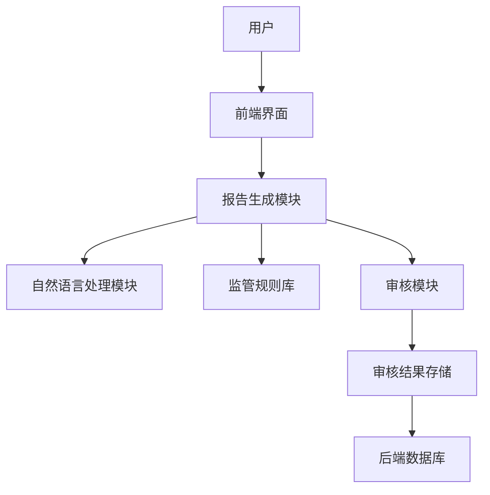
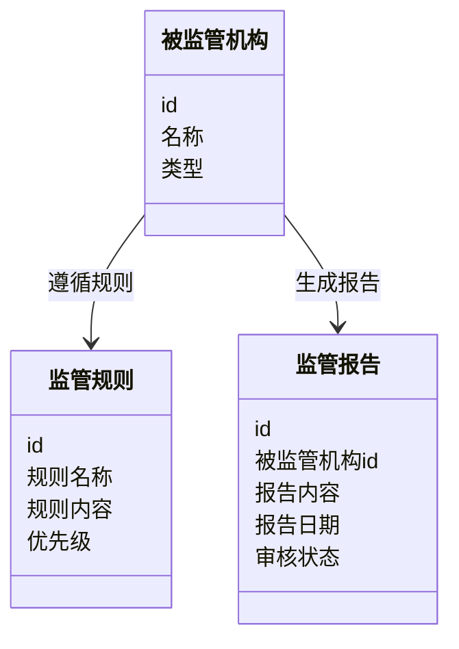

                 


# 《金融监管报告自动化生成与审核系统》

> 关键词：金融监管，自动化生成，自然语言处理，机器学习，文本审核，系统架构

> 摘要：本文详细探讨了金融监管报告的自动化生成与审核系统的构建与实现。通过分析传统监管报告的痛点与不足，结合自然语言处理和机器学习等技术，提出了一种高效的监管报告自动化解决方案。文章从系统背景、核心概念、算法原理、系统架构到项目实战，全面阐述了该系统的实现过程，并提供了实际案例和代码示例，为金融领域的技术实现者提供了有价值的参考。

---

# 第1章: 问题背景与需求分析

## 1.1 金融监管的重要性

### 1.1.1 金融监管的基本概念
金融监管是指通过对金融机构和金融市场行为的监控和管理，确保金融市场的稳定和合规性。监管机构需要定期收集和分析金融机构的报告，以评估其风险状况和合规性。

### 1.1.2 金融监管的核心目标
金融监管的核心目标包括：
1. **维护金融市场稳定**：通过监管防止系统性风险的发生。
2. **保护投资者利益**：确保金融机构的行为符合法律法规，避免投资者损失。
3. **促进金融创新**：在合规的前提下，鼓励金融机构进行创新。

### 1.1.3 金融监管的现状与挑战
随着金融市场的复杂化和全球化，传统的监管方式面临以下挑战：
1. **数据量庞大**：金融机构产生的数据量急剧增加，人工处理效率低下。
2. **监管规则复杂**：金融监管规则日益复杂，人工解读和执行难度增大。
3. **合规成本高**：金融机构需要投入大量资源来确保合规，增加了运营成本。

## 1.2 监管报告的痛点

### 1.2.1 传统监管报告的生成方式
传统的监管报告生成方式通常依赖于人工填写和审核，流程繁琐且效率低下。金融机构需要手动整理数据、编写报告内容，并提交给监管机构。

### 1.2.2 传统监管报告的痛点与不足
1. **效率低下**：人工生成报告耗时长，容易出错。
2. **一致性差**：不同机构的报告格式和内容不统一，增加了监管机构的审核难度。
3. **合规风险高**：人工操作容易导致遗漏或错误，增加合规风险。

### 1.2.3 自动化监管报告的需求与价值
自动化监管报告生成系统能够显著提高效率、降低成本，并减少合规风险。通过自动化生成和审核报告，金融机构可以更快捷、更准确地满足监管要求，同时降低合规成本。

## 1.3 本章小结
本章介绍了金融监管的重要性和现状，分析了传统监管报告生成方式的痛点，并提出了自动化监管报告生成的需求和价值。

---

# 第2章: 系统核心概念与架构

## 2.1 核心概念与实体关系

### 2.1.1 系统核心概念
金融监管报告自动化生成与审核系统的核心概念包括：
1. **被监管机构**：需要生成监管报告的金融机构。
2. **监管规则库**：存储所有监管规则和标准的数据库。
3. **监管报告**：由系统自动生成的符合监管要求的报告。
4. **自然语言处理模块**：用于理解和生成文本的模块。
5. **审核模块**：用于自动审核生成的报告是否符合监管要求。

### 2.1.2 实体关系图
以下是系统中实体关系的ER图：

```mermaid
er
    entity 被监管机构 {
        key id
        string 名称
        string 类型
    }
    entity 监管规则 {
        key id
        string 规则名称
        string 规则内容
        int 优先级
    }
    entity 监管报告 {
        key id
        foreign key 被监管机构 (id)
        string 报告内容
        date 报告日期
        status 审核状态
    }
    被监管机构 -->> 监管规则: 遵循规则
    被监管机构 -->> 监管报告: 生成报告
```

## 2.2 系统架构设计

### 2.2.1 系统功能模块划分
系统主要包括以下功能模块：
1. **用户界面**：供用户输入数据和查看报告。
2. **报告生成模块**：根据监管规则生成报告。
3. **自然语言处理模块**：理解和生成文本。
4. **监管规则库**：存储和管理监管规则。
5. **审核模块**：自动审核生成的报告是否符合监管要求。

### 2.2.2 系统架构图
以下是系统的架构图：



## 2.3 本章小结
本章详细介绍了系统的核心概念和架构设计，通过ER图和架构图展示了系统各部分之间的关系。

---

# 第3章: 自然语言处理与文本生成算法

## 3.1 自然语言处理基础

### 3.1.1 NLP的基本概念
自然语言处理（NLP）是指计算机对人类自然语言的理解和生成。在金融监管报告中，NLP主要用于从文本中提取信息和生成符合要求的文本。

### 3.1.2 常见的NLP任务
常见的NLP任务包括：
1. **文本分类**：将文本归类到特定类别。
2. **信息抽取**：从文本中提取特定信息。
3. **文本生成**：根据输入生成输出文本。

### 3.1.3 NLP在监管报告中的应用
在监管报告中，NLP主要用于：
1. **自动提取关键信息**：从金融机构的业务数据中提取关键信息。
2. **自动生成报告内容**：根据提取的信息生成符合监管要求的报告。

## 3.2 文本生成算法

### 3.2.1 基于规则的文本生成
基于规则的文本生成方法是通过预定义的规则和模板生成文本。这种方法简单易懂，但在处理复杂情况时灵活性较差。

### 3.2.2 基于模型的文本生成
基于模型的文本生成方法利用预训练的语言模型（如GPT）生成文本。这种方法具有较高的灵活性和生成能力，但需要大量的训练数据和计算资源。

### 3.2.3 监管报告文本生成的挑战
在监管报告中，文本生成需要满足以下要求：
1. **符合监管规则**：生成的文本必须符合监管机构的要求。
2. **语言规范**：文本语言必须规范、准确，避免歧义。
3. **高效生成**：生成速度要快，以满足实时监管需求。

## 3.3 算法实现

### 3.3.1 基于预训练模型的文本生成
我们可以使用预训练的语言模型（如GPT）进行文本生成。以下是一个简单的Python代码示例：

```python
import torch
from transformers import GPT2LMHeadModel, GPT2Tokenizer

model_name = "gpt2"
tokenizer = GPT2Tokenizer.from_pretrained(model_name)
model = GPT2LMHeadModel.from_pretrained(model_name)

input_text = "根据监管规则，本报告需要包含以下内容："
inputs = tokenizer.encode(input_text, return_tensors="pt")
outputs = model.generate(inputs, max_length=500, do_sample=True)

print("生成的报告内容：")
print(tokenizer.decode(outputs[0], skip_special_tokens=True))
```

### 3.3.2 文本生成的优化策略
为了提高生成文本的质量和准确性，可以采取以下优化策略：
1. **微调模型**：在监管报告数据上进行微调，使模型更适应特定任务。
2. **规则约束**：在生成过程中加入监管规则的约束，确保生成文本符合要求。
3. **多轮生成**：多次生成并优化文本，确保内容的准确性和规范性。

### 3.3.3 示例代码
以下是基于GPT-2的文本生成代码示例：

```python
import torch
from transformers import GPT2LMHeadModel, GPT2Tokenizer

model_name = "gpt2"
tokenizer = GPT2Tokenizer.from_pretrained(model_name)
model = GPT2LMHeadModel.from_pretrained(model_name)

input_text = "根据监管规则，本报告需要包含以下内容："
inputs = tokenizer.encode(input_text, return_tensors="pt")
outputs = model.generate(inputs, max_length=500, do_sample=True)

print("生成的报告内容：")
print(tokenizer.decode(outputs[0], skip_special_tokens=True))
```

---

# 第4章: 系统分析与架构设计方案

## 4.1 问题场景介绍

### 4.1.1 监管报告生成的场景
金融机构需要定期向监管机构提交监管报告。传统的报告生成方式效率低下，容易出错，且成本高昂。

### 4.1.2 系统需求分析
系统需要满足以下需求：
1. **自动化生成报告**：根据监管规则自动生成监管报告。
2. **实时审核报告**：自动审核生成的报告是否符合监管要求。
3. **易于扩展**：支持新增监管规则和机构类型。

## 4.2 项目介绍

### 4.2.1 项目目标
本项目旨在开发一个金融监管报告自动化生成与审核系统，提高监管效率和准确性。

### 4.2.2 项目范围
系统将支持以下功能：
1. **监管规则管理**：存储和管理监管规则。
2. **报告生成**：根据监管规则生成报告。
3. **报告审核**：自动审核生成的报告。
4. **报告存储与查询**：存储生成的报告，并支持查询功能。

## 4.3 系统功能设计

### 4.3.1 领域模型设计
以下是系统的领域模型图：



### 4.3.2 系统架构设计
以下是系统的架构图：


### 4.3.3 接口设计
系统需要以下接口：
1. **报告生成接口**：接收被监管机构的信息，生成监管报告。
2. **监管规则接口**：管理监管规则的增删改查。
3. **审核接口**：接收生成的报告，返回审核结果。

### 4.3.4 交互流程
以下是系统的交互流程图：

```mermaid
sequenceDiagram
    participant 用户
    participant 前端界面
    participant 报告生成模块
    participant 自然语言处理模块
    participant 监管规则库
    participant 审核模块
    participant 审核结果存储
    participant 后端数据库

    用户 -> 前端界面: 提交被监管机构信息
    前端界面 -> 报告生成模块: 调用报告生成接口
    报告生成模块 -> 自然语言处理模块: 获取监管规则
    报告生成模块 -> 监管规则库: 获取监管规则
    报告生成模块 -> 审核模块: 生成报告
    审核模块 -> 审核结果存储: 存储审核结果
    审核结果存储 -> 后端数据库: 存储报告
    用户 <- 前端界面: 返回生成的报告
```

## 4.4 本章小结
本章详细分析了系统的功能需求，并设计了系统的架构和交互流程。

---

# 第5章: 项目实战

## 5.1 环境安装

### 5.1.1 安装Python
需要安装Python 3.6或更高版本。

### 5.1.2 安装依赖库
安装以下依赖库：
```bash
pip install transformers torch
```

## 5.2 系统核心实现

### 5.2.1 报告生成模块实现
以下是报告生成模块的代码实现：

```python
from transformers import GPT2LMHeadModel, GPT2Tokenizer

def generate_report(input_text):
    model_name = "gpt2"
    tokenizer = GPT2Tokenizer.from_pretrained(model_name)
    model = GPT2LMHeadModel.from_pretrained(model_name)
    inputs = tokenizer.encode(input_text, return_tensors="pt")
    outputs = model.generate(inputs, max_length=500, do_sample=True)
    return tokenizer.decode(outputs[0], skip_special_tokens=True)
```

### 5.2.2 监管规则库实现
以下是监管规则库的代码实现：

```python
class RuleBase:
    def __init__(self):
        self.rules = {}

    def add_rule(self, rule_id, rule_name, rule_content, priority):
        self.rules[rule_id] = {
            "name": rule_name,
            "content": rule_content,
            "priority": priority
        }

    def get_rule(self, rule_id):
        return self.rules.get(rule_id, None)
```

### 5.2.3 审核模块实现
以下是审核模块的代码实现：

```python
def review_report(report_content, rule_base):
    # 模拟审核逻辑
    issues = []
    for rule in rule_base.rules.values():
        if not rule["content"] in report_content:
            issues.append(f"Missing {rule['name']}")
    return "通过" if not issues else "未通过"
```

## 5.3 案例分析

### 5.3.1 案例背景
某银行需要生成一份季度监管报告，报告需要包含以下内容：
1. 资产状况
2. 负债状况
3. 盈利能力

### 5.3.2 案例实现
使用上述代码生成报告：

```python
input_text = "根据监管规则，本报告需要包含以下内容：资产状况、负债状况、盈利能力"
print(generate_report(input_text))
```

### 5.3.3 审核结果
审核模块对生成的报告进行审核，返回审核结果。

## 5.4 项目小结
本章通过实际案例展示了系统的实现过程，包括环境安装、核心代码实现和案例分析。

---

# 第6章: 最佳实践与总结

## 6.1 小结
金融监管报告自动化生成与审核系统的实现，显著提高了监管效率和准确性，降低了合规成本。

## 6.2 注意事项
在实际应用中，需要注意以下事项：
1. **数据安全**：确保监管数据的安全性。
2. **模型优化**：不断优化自然语言处理模型，提高生成和审核的准确性。
3. **规则更新**：及时更新监管规则，确保系统合规性。

## 6.3 拓展阅读
1. 《自然语言处理入门》
2. 《机器学习实战》
3. 《金融监管科技的应用与实践》

---

# 作者：AI天才研究院/AI Genius Institute & 禅与计算机程序设计艺术 /Zen And The Art of Computer Programming

---

通过本文的详细阐述，我们深入探讨了金融监管报告自动化生成与审核系统的构建与实现。从系统背景到项目实战，全面介绍了系统的实现过程和关键点，为金融领域的技术实现者提供了有价值的参考。

