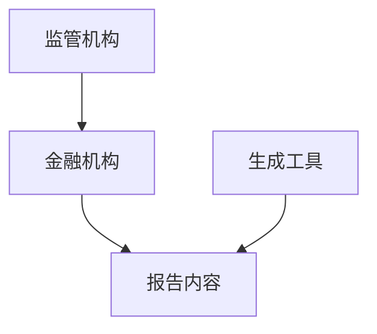
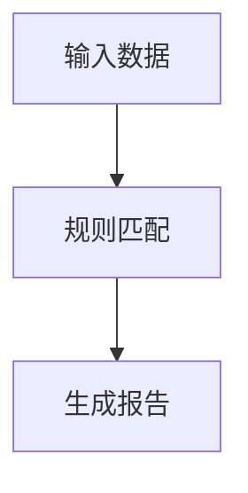
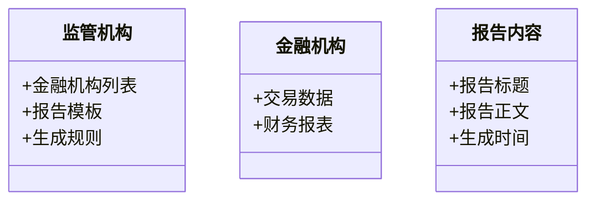
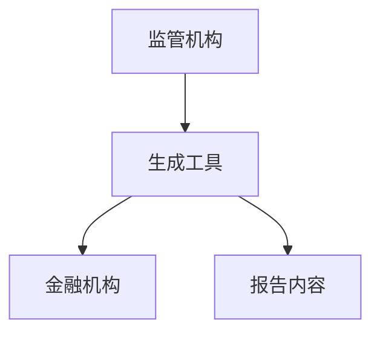

                 

<think>
好的，我现在需要帮用户撰写一篇关于《金融监管报告自动化生成工具》的技术博客文章。用户提供了详细的目录大纲和一些具体的指示，我需要按照这些要求一步步完成。

首先，我需要理解用户的需求。用户希望文章结构清晰，逻辑紧凑，语言专业，同时要包含详细的背景、核心概念、算法原理、系统架构、项目实战等部分。用户还特别提到要使用技术语言，每个章节要有足够的深度，并且包含代码示例、流程图和数学公式。

接下来，我会按照目录大纲逐步撰写每个部分。首先，写摘要和关键词，确保文章的核心内容明确。然后，从背景介绍开始，分析金融监管的现状和挑战，引出自动化生成工具的必要性。在核心概念部分，详细解释监管报告的基本要素和生成工具的关键特性，并使用ER图展示实体关系。

在算法原理部分，我需要详细讲解自然语言处理和生成的算法，使用流程图和代码示例来说明。数学模型部分，我需要给出具体的公式，比如余弦相似度和概率生成模型，并解释它们的应用。

系统分析与架构设计部分，我需要绘制领域模型和系统架构图，描述系统功能、架构设计和接口设计。项目实战部分，我需要提供环境安装步骤、核心代码实现、案例分析和项目小结，让读者能够实际操作。

最后，我还需要添加最佳实践、小结、注意事项和拓展阅读等内容，帮助读者巩固知识，扩展视野。同时，确保文章末尾有作者信息，格式符合要求。

在写作过程中，我需要确保语言简洁专业，逻辑清晰，每个部分都详细具体。同时，注意字数控制在10000到12000字之间，使用markdown格式，并正确嵌入代码、流程图和公式。

现在，我可以开始按照这个思路撰写文章了，确保每个部分都覆盖用户的要求，提供高质量的技术内容。
</think>

# 金融监管报告自动化生成工具

## 关键词：金融监管、自动化生成、自然语言处理、文本生成、系统架构

## 摘要：  
金融监管报告的自动化生成是金融数字化转型的重要组成部分。本文将详细探讨如何利用自然语言处理和生成技术，结合系统架构设计，构建一个高效的金融监管报告自动化生成工具。文章从背景、核心概念、算法原理、系统架构到项目实战，全面解析该工具的设计与实现，并提供实际案例分析。

---

# 第1章: 金融监管报告自动化生成工具的背景与目标

## 1.1 金融监管的现状与挑战

### 1.1.1 传统金融监管的痛点
传统金融监管依赖人工审核，存在效率低、误差大、成本高等问题。监管人员需要手动分析大量的金融数据和文档，导致效率低下。此外，不同机构的报告格式和内容差异大，人工处理难以统一。

### 1.1.2 金融监管数字化转型的必要性
随着金融科技的快速发展，数字化转型成为金融机构和监管机构的必然选择。通过自动化技术，可以显著提高监管效率，降低人为错误，同时节省时间和成本。

### 1.1.3 自动化监管报告生成的行业需求
金融机构需要定期向监管机构提交合规报告，但手动生成报告耗时耗力。自动化生成工具可以快速整合数据，生成符合监管要求的报告，满足行业需求。

## 1.2 问题背景与问题描述

### 1.2.1 金融监管报告生成的痛点分析
- 数据来源多样，格式不统一。
- 报告内容复杂，需要符合严格的监管标准。
- 手工生成效率低，易出错。

### 1.2.2 问题的边界与外延
- 仅限于监管报告的生成，不包括数据采集和初步分析。
- 支持多种监管报告类型，如合规报告、风险评估报告等。

### 1.2.3 核心目标与关键指标
- 核心目标：实现监管报告的自动化生成。
- 关键指标：生成效率、准确率、符合监管要求。

## 1.3 本章小结
本章介绍了金融监管的现状与挑战，分析了传统监管的痛点，提出了自动化生成工具的行业需求，并明确了问题的边界和核心目标。

---

# 第2章: 金融监管报告自动化生成工具的核心概念

## 2.1 核心概念与定义

### 2.1.1 监管报告的基本要素
- 数据来源：金融机构的交易数据、财务报表等。
- 报告模板：固定的格式和内容要求。
- 生成规则：基于数据和模板生成报告的逻辑规则。

### 2.1.2 自动化生成工具的关键特性
- 数据处理能力：支持多种数据格式和接口。
- 自然语言生成能力：能够生成符合监管要求的文本。
- 可扩展性：支持多种报告类型和模板。

### 2.1.3 工具与监管流程的结合
- 工具作为监管流程的一部分，实现数据到报告的自动转换。

## 2.2 核心概念之间的联系

### 2.2.1 实体关系图（ER图）


## 2.3 本章小结
本章详细介绍了金融监管报告生成工具的核心概念，包括基本要素、关键特性和与监管流程的结合，并通过ER图展示了各实体之间的关系。

---

# 第3章: 金融监管报告生成的算法原理

## 3.1 自然语言处理基础

### 3.1.1 分词与实体识别
- 分词：将文本分割成词语或短语。
- 实体识别：识别文本中的关键实体，如机构名称、交易金额等。

### 3.1.2 文本相似度计算
- 使用余弦相似度公式计算文本相似度：
$$ \text{相似度} = \frac{\vec{A} \cdot \vec{B}}{|\vec{A}| |\vec{B}|} $$

### 3.1.3 文本生成模型
- 基于Transformer的文本生成模型，如GPT。

## 3.2 基于规则的报告生成算法

### 3.2.1 规则定义与匹配
- 定义生成规则，如“如果交易金额超过阈值，则生成风险提示”。

### 3.2.2 算法流程图


## 3.3 基于深度学习的生成算法

### 3.3.1 Transformer模型简介
- Transformer模型由编码器和解码器组成，用于生成长文本。

### 3.3.2 解码器结构
- 解码器通过自注意力机制生成文本。

### 3.3.3 模型训练流程
1. 数据预处理：清洗和标注数据。
2. 模型训练：使用生成的文本数据训练模型。
3. 模型优化：调整超参数，提高生成质量。

## 3.4 本章小结
本章详细介绍了自然语言处理的基础和两种生成算法，包括基于规则的算法和基于深度学习的算法，并通过流程图展示了算法的执行流程。

---

# 第4章: 金融监管报告生成的数学模型

## 4.1 文本相似度计算模型

### 4.1.1 余弦相似度公式
$$ \text{相似度} = \frac{\vec{A} \cdot \vec{B}}{|\vec{A}| |\vec{B}|} $$

## 4.2 基于概率的文本生成模型

### 4.2.1 马尔可夫链模型
- 马尔可夫链模型基于当前状态预测下一个状态。

### 4.2.2 贝叶斯网络模型
- 贝叶斯网络模型用于概率推理。

### 4.2.3 概率生成公式
$$ P(w_i | w_{i-1}, w_{i-2}) $$

## 4.3 本章小结
本章介绍了文本相似度计算模型和基于概率的文本生成模型，并给出了相关公式。

---

# 第5章: 系统分析与架构设计

## 5.1 问题场景介绍

### 5.1.1 金融机构监管需求
- 需要定期生成监管报告，满足合规要求。

### 5.1.2 报告生成的典型场景
- 实时生成风险报告，辅助监管决策。

## 5.2 系统功能设计

### 5.2.1 领域模型设计


### 5.2.2 系统架构设计


### 5.2.3 系统接口设计
- 输入接口：接收金融机构的交易数据和财务报表。
- 输出接口：生成并输出监管报告。

### 5.2.4 系统交互流程
```mermaid
sequenceDiagram
参与者 监管机构
参与者 金融机构
参与者 生成工具
监管机构->金融机构: 提供报告模板
金融机构->生成工具: 提交交易数据
生成工具->金融机构: 返回监管报告
```

## 5.3 本章小结
本章通过问题场景介绍和系统功能设计，展示了金融监管报告生成工具的系统架构和交互流程。

---

# 第6章: 项目实战

## 6.1 环境安装

### 6.1.1 安装Python环境
- 使用Anaconda安装Python 3.8及以上版本。

### 6.1.2 安装依赖库
```bash
pip install numpy
pip install matplotlib
pip install transformers
```

## 6.2 系统核心实现

### 6.2.1 数据预处理代码
```python
import pandas as pd

def preprocess_data(data):
    # 数据清洗
    data.dropna(inplace=True)
    # 数据转换
    data['date'] = pd.to_datetime(data['date'])
    return data
```

### 6.2.2 文本生成代码
```python
from transformers import AutoTokenizer, AutoModelForCausalLM

tokenizer = AutoTokenizer.from_pretrained('gpt2')
model = AutoModelForCausalLM.from_pretrained('gpt2')

def generate_report(text):
    inputs = tokenizer.encode(text, return_tensors='pt')
    outputs = model.generate(inputs, max_length=100)
    return tokenizer.decode(outputs[0])
```

### 6.2.3 案例分析
- 输入数据：某金融机构的交易数据。
- 输出报告：自动生成风险评估报告。

## 6.3 项目小结
本章通过实际案例展示了金融监管报告生成工具的环境安装和核心代码实现，并分析了生成结果。

---

# 第7章: 最佳实践与注意事项

## 7.1 最佳实践 tips
1. 数据清洗和预处理是关键，确保数据质量。
2. 选择合适的模型和算法，根据需求调整参数。
3. 定期更新模板和生成规则，适应监管要求的变化。

## 7.2 小结
金融监管报告生成工具的成功实施需要综合考虑技术、数据和业务需求。

## 7.3 注意事项
1. 确保数据安全，避免敏感信息泄露。
2. 定期维护和更新系统，确保生成报告的准确性。

## 7.4 拓展阅读
- 《自然语言处理实战》
- 《深度学习在金融中的应用》

---

# 作者
作者：AI天才研究院/AI Genius Institute  
作者：禅与计算机程序设计艺术/Zen And The Art of Computer Programming

