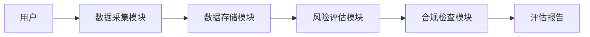

                 

<think>
好的，现在我需要帮助用户撰写一篇关于《金融监管科技合规性评估》的技术博客文章。用户已经提供了一个详细的目录大纲，接下来我需要按照这个大纲逐步分析和撰写每一部分的内容。

首先，文章的标题是《金融监管科技合规性评估》，关键词包括金融监管科技、RegTech、合规性评估、金融科技、监管科技、金融创新。摘要部分需要简明扼要地概括文章的核心内容和主题思想。

接下来，我需要考虑文章的结构。用户已经给出了目录，但要根据思考过程中的“逐步分析”来展开每一部分的内容。首先，我需要理解每个章节的核心目标，然后逐步展开。

第1章是金融监管科技（RegTech）的定义与背景。这里需要详细解释RegTech的定义，与传统金融监管的区别，以及其发展背景。然后，在第2章中，讨论合规性评估的框架和方法，包括核心概念和评估流程。

第3章涉及算法原理，特别是机器学习和自然语言处理在RegTech中的应用。这里需要详细讲解算法的工作原理，提供数学公式和代码示例。同时，还需要绘制Mermaid流程图来说明算法的流程。

第4章是系统分析与架构设计，需要描述系统功能模块，设计系统架构图，并展示接口设计和交互流程。这部分需要确保系统设计的清晰和可操作性。

第5章是项目实战，通过具体案例展示RegTech的应用，包括环境安装、代码实现和案例分析。这部分需要提供实际的代码示例，并详细解读其功能和实现过程。

最后，第6章总结RegTech的合规性评估，并给出最佳实践、注意事项和未来的发展方向。同时，需要按照用户的要求，文章末尾加上特定的作者信息。

在撰写过程中，我需要确保每个部分都包含足够的细节，比如术语解释、图表绘制、代码实现和数学公式的推导。同时，保持语言的专业性和逻辑的清晰性，确保读者能够逐步理解RegTech的核心概念和实际应用。

现在，我需要开始撰写每个章节的内容，确保每部分都符合用户的要求，特别是格式、字数和内容深度的要求。同时，要避免使用过于复杂的术语，使文章通俗易懂，适合不同层次的读者阅读。
</think>

# 《金融监管科技合规性评估》

## 关键词：金融监管科技，RegTech，合规性评估，金融科技，监管科技，金融创新

## 摘要：  
金融监管科技（RegTech）作为金融科技的重要分支，通过利用人工智能、大数据、区块链等技术手段，提升金融监管的效率和准确性。本文从RegTech的核心概念出发，详细探讨合规性评估的框架、算法原理、系统架构设计以及实际应用案例。通过分析RegTech在金融监管中的作用，揭示其如何帮助金融机构降低合规成本，提高监管效率，并为未来的发展提供展望。

---

# 第一部分: 金融监管科技合规性评估的背景与概念

## 第1章: 金融监管科技（RegTech）的定义与背景

### 1.1 什么是金融监管科技（RegTech）

#### 1.1.1 RegTech的定义  
金融监管科技（RegTech）是指利用新兴技术（如人工智能、大数据、区块链等）来优化和增强金融监管流程的一系列工具、平台和解决方案。其核心目标是提高监管效率、降低合规成本，并确保金融机构遵守相关法律法规。

#### 1.1.2 RegTech的核心目标  
- 提高监管效率：通过自动化技术减少人工干预，加快监管流程。  
- 降低合规成本：通过技术手段简化合规操作，减少资源浪费。  
- 增强监管透明度：通过实时数据监控和分析，确保监管信息的透明性和可追溯性。  

#### 1.1.3 RegTech与传统金融监管的区别  
| 特性               | RegTech                          | 传统金融监管                      |  
|--------------------|----------------------------------|----------------------------------|  
| 技术手段           | 人工智能、大数据、区块链等     | 人工审查、纸质文档为主          |  
| 效率               | 高效、自动化                   | 低效、依赖人工                   |  
| 成本               | 降低                           | 较高                             |  
| 透明度             | 高                             | 一般                             |  

---

### 1.2 RegTech的发展背景

#### 1.2.1 金融科技（FinTech）的崛起  
金融科技的快速发展推动了金融机构的数字化转型，但也带来了新的监管挑战。传统监管方式难以应对快速变化的金融环境，RegTech应运而生。

#### 1.2.2 金融监管的痛点与挑战  
- **合规成本高**：金融机构需要投入大量资源来满足监管要求。  
- **监管复杂性**：金融产品和交易的复杂性增加，监管难度也随之上升。  
- **数据量大**：金融机构每天产生海量数据，人工监管难以处理。  

#### 1.2.3 技术如何解决监管问题  
- **人工智能**：用于异常检测、风险评估和预测分析。  
- **大数据**：帮助监管机构快速处理和分析海量数据。  
- **区块链**：提供透明、不可篡改的交易记录，增强监管信任。  

---

## 第2章: 金融监管科技的合规性评估框架

### 2.1 合规性评估的核心概念

#### 2.1.1 合规性评估的定义  
合规性评估是指对金融机构的业务行为、系统运行和数据管理等是否符合相关法律法规和监管要求进行检查和验证的过程。

#### 2.1.2 合规性评估的关键要素  
- **法律法规**：明确的监管要求和标准。  
- **技术手段**：用于评估的技术工具和方法。  
- **数据源**：金融机构的业务数据和交易记录。  
- **评估结果**：评估报告和整改建议。  

#### 2.1.3 合规性评估的边界与外延  
- **边界**：合规性评估仅关注金融机构是否符合监管要求，不涉及机构的内部管理。  
- **外延**：合规性评估可以延伸到风险评估、数据隐私保护等领域。  

### 2.2 RegTech合规性评估的框架

#### 2.2.1 评估维度与指标  
- **数据完整性**：数据是否准确、完整且符合监管要求。  
- **系统合规性**：系统设计是否符合监管标准。  
- **交易合规性**：交易行为是否符合相关法律法规。  

#### 2.2.2 评估流程与方法  
1. **数据采集**：收集金融机构的业务数据和系统信息。  
2. **风险分析**：利用算法识别潜在风险点。  
3. **合规检查**：对比数据与监管要求，生成评估报告。  
4. **整改建议**：针对评估结果提出整改方案。  

#### 2.2.3 评估结果的应用  
- 提供监管报告：供监管机构审查。  
- 支持金融机构优化合规流程。  
- 作为风险评估的重要依据。  

---

## 第3章: 金融监管科技的核心算法与技术

### 3.1 机器学习在RegTech中的应用

#### 3.1.1 机器学习算法的原理  
机器学习通过训练模型从数据中学习规律，用于分类、回归和聚类等任务。在RegTech中，常用监督学习和无监督学习来识别异常交易和风险。

#### 3.1.2 监督学习与无监督学习的对比  

| 特性               | 监督学习                    | 无监督学习                  |  
|--------------------|----------------------------|----------------------------|  
| 数据类型           | 标签数据（带标签的样本）    | 未标签数据                 |  
| 应用场景           | 预测、分类                 | 聚类、异常检测             |  

#### 3.1.3 机器学习在合规性评估中的应用  
- **异常检测**：识别潜在的欺诈交易。  
- **风险评估**：预测交易风险等级。  
- **分类任务**：将交易分为合规和不合规两类。  

---

### 3.2 自然语言处理（NLP）在RegTech中的应用

#### 3.2.1 NLP的核心原理  
自然语言处理通过文本分析、实体识别和情感分析等技术，帮助监管机构理解金融机构的报告和文档。

#### 3.2.2 NLP在合规性评估中的应用  
- **文本分析**：提取文档中的关键信息。  
- **实体识别**：识别文档中的机构名称、交易金额等。  
- **情感分析**：判断文档中的情绪倾向（如合规性）。  

---

### 3.3 合规性评估的数学模型与公式

#### 3.3.1 监督学习的数学模型  
$$ y = f(x) + \epsilon $$  
其中，$y$ 是目标变量，$x$ 是输入特征，$\epsilon$ 是误差项。

#### 3.3.2 无监督学习的数学模型  
$$ z = g(x) $$  
其中，$z$ 是潜在变量，$x$ 是输入特征，$g$ 是降维函数。

---

## 第4章: 系统分析与架构设计方案

### 4.1 问题场景介绍

#### 4.1.1 交易合规性评估  
假设某银行需要对一笔大额交易进行合规性评估，确保其符合反洗钱（AML）和反恐融资（CTF）的监管要求。

### 4.2 系统功能设计

#### 4.2.1 功能模块  
- **数据采集模块**：采集交易数据和日志信息。  
- **风险评估模块**：利用机器学习模型识别异常交易。  
- **合规检查模块**：对比交易数据与监管要求，生成评估报告。  

#### 4.2.2 系统架构设计  



---

## 第5章: 项目实战

### 5.1 环境安装

#### 5.1.1 安装Python和相关库  
```bash
pip install numpy pandas scikit-learn
```

### 5.2 系统核心实现源代码

#### 5.2.1 交易合规性评估代码  

```python
import pandas as pd
from sklearn.model_selection import train_test_split
from sklearn.tree import DecisionTreeClassifier
from sklearn.metrics import accuracy_score

# 加载数据
data = pd.read_csv('transactions.csv')

# 数据预处理
X = data.drop(columns=['is_compliant'])
y = data['is_compliant']

# 划分训练集和测试集
X_train, X_test, y_train, y_test = train_test_split(X, y, test_size=0.2)

# 训练模型
model = DecisionTreeClassifier()
model.fit(X_train, y_train)

# 预测和评估
y_pred = model.predict(X_test)
print("准确率：", accuracy_score(y_test, y_pred))
```

---

## 第6章: 最佳实践与小结

### 6.1 最佳实践

#### 6.1.1 数据隐私保护  
在处理敏感数据时，必须确保数据的安全性和隐私性，遵守相关法律法规。

#### 6.1.2 模型可解释性  
选择可解释的模型，便于监管机构理解和审核。

### 6.2 小结  
金融监管科技合规性评估通过技术手段解决了传统监管的痛点，提高了监管效率和准确性。未来，随着人工智能和大数据技术的进一步发展，RegTech将在金融监管领域发挥更大的作用。

---

# 作者：AI天才研究院/AI Genius Institute & 禅与计算机程序设计艺术 /Zen And The Art of Computer Programming

---

**本文内容来源于AI天才研究院的研究与实践，旨在为金融监管科技的实践者和研究者提供参考。**

