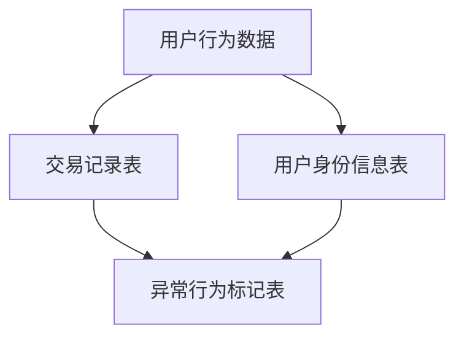
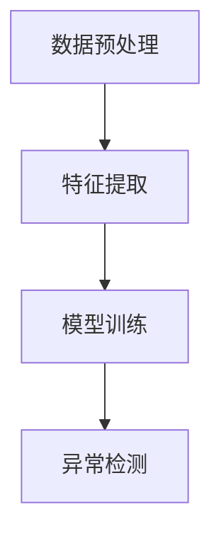

                 


```markdown
# 金融监管科技异常行为检测与追踪系统

> 关键词：金融监管科技，异常行为检测，追踪系统，大数据分析，人工智能，金融科技

> 摘要：本文详细探讨了金融监管科技中异常行为检测与追踪系统的构建与应用。通过分析金融市场的复杂性与风险，结合大数据和人工智能技术，提出了一个高效、准确的异常行为检测与追踪系统设计方案。文章从系统设计背景、核心概念、算法原理、系统架构到实际案例进行了全面阐述，为金融监管机构和从业者提供了理论支持和实践指导。

---

## 第一部分: 金融监管科技异常行为检测与追踪系统概述

### 第1章: 异常行为检测与追踪的背景与意义

#### 1.1 异常行为检测的定义与重要性
##### 1.1.1 什么是异常行为
异常行为是指在金融交易、资金流动等过程中，偏离正常模式或预期的活动。这些行为可能包括欺诈、洗钱、市场操纵等，对金融系统的稳定性和合规性构成威胁。

##### 1.1.2 异常行为检测在金融监管中的作用
- **风险控制**：及时发现并阻止潜在的金融犯罪行为。
- **合规性保障**：确保金融机构和交易活动符合监管法规。
- **市场稳定性**：维护金融市场的公平与透明。

##### 1.1.3 异常行为检测的边界与外延
- **边界**：聚焦于金融领域的异常行为，不涉及其他行业的检测。
- **外延**：涵盖交易数据、资金流动、用户行为等多个维度。

#### 1.2 金融监管科技的基本概念
##### 1.2.1 金融监管科技的定义
金融监管科技（FinTech）是指利用技术手段（如大数据、人工智能、区块链等）来优化和提升金融监管效率的新兴领域。

##### 1.2.2 金融监管科技的核心要素
- **数据源**：包括交易数据、用户行为数据、市场数据等。
- **技术手段**：如大数据分析、机器学习、自然语言处理等。
- **监管目标**：包括风险防控、合规检查、市场监控等。

##### 1.2.3 金融监管科技与传统监管的区别
- **效率**：传统监管依赖人工审查，效率较低；金融监管科技通过自动化技术提升效率。
- **精准性**：传统监管可能漏检或误检，而金融监管科技通过算法模型提高准确性。
- **实时性**：金融监管科技能够实现实时监控和预警，而传统监管往往滞后。

#### 1.3 异常行为检测与追踪系统的目标
##### 1.3.1 系统设计目标
- **实时性**：能够实时监测和分析金融数据。
- **准确性**：确保异常行为的检测准确率高，降低误报和漏报。
- **可扩展性**：系统能够适应数据量和业务规模的增长。

##### 1.3.2 系统实现目标
- **数据采集**：从多种数据源获取金融数据。
- **特征提取**：从数据中提取有用的特征用于异常检测。
- **模型训练**：建立机器学习模型，训练出能够识别异常行为的模型。

##### 1.3.3 系统应用目标
- **风险预警**：及时发现潜在的金融风险。
- **合规检查**：确保金融机构的交易行为符合监管要求。
- **市场监控**：实时监控市场动态，维护市场秩序。

#### 1.4 本章小结
本章介绍了异常行为检测与追踪系统的背景和意义，阐述了金融监管科技的基本概念及其与传统监管的区别，并明确了系统的目标和实现路径。

---

## 第二部分: 异常行为检测的核心概念与联系

### 第2章: 异常行为检测的核心原理

#### 2.1 异常行为检测的核心原理
##### 2.1.1 数据源分析
- **交易数据**：包括交易金额、交易时间、交易地点等。
- **用户行为数据**：包括用户的登录时间、操作频率、操作类型等。
- **市场数据**：包括股价、指数、成交量等。

##### 2.1.2 特征工程
- **特征选择**：从大量数据中筛选出对异常检测有影响力的特征。
- **特征提取**：通过数据变换提取更有代表性的特征。
- **特征标准化**：对不同量纲的特征进行标准化处理，便于模型训练。

##### 2.1.3 模型训练与评估
- **训练数据集**：使用历史数据训练模型，使其能够识别正常和异常行为。
- **评估指标**：如准确率、召回率、F1分数等。

#### 2.2 异常行为检测的核心要素对比
##### 2.2.1 数据特征对比
| 特征维度 | 正常行为 | 异常行为 |
|----------|----------|----------|
| 交易金额 | 小额、频繁 | 大额、集中 |
| 时间分布 | 均匀分布 | 集中分布 |
| 用户行为 | 符合习惯 | 违反习惯 |

##### 2.2.2 模型性能对比
| 模型类型   | 优点                               | 缺点                               |
|------------|------------------------------------|------------------------------------|
| 时间序列分析 | 能捕捉时间依赖性                   | 对异常点的鲁棒性较差               |
| 深度学习    | 高精度，适合复杂模式               | 训练时间长，需要大量数据            |

##### 2.2.3 算法复杂度对比
| 算法类型 | 复杂度 | 适用场景                     |
|----------|--------|-----------------------------|
| 时间序列分析 | O(n)  | 数据量小，实时性要求高       |
| 深度学习    | O(n^2) | 数据量大，模式复杂           |

#### 2.3 系统架构的ER实体关系图


#### 2.4 本章小结
本章详细阐述了异常行为检测的核心原理，通过对比分析不同数据特征和模型性能，帮助读者更好地理解系统的构建基础。

---

## 第三部分: 异常行为检测的算法原理

### 第3章: 时间序列分析算法

#### 3.1 时间序列分析的基本原理
时间序列分析是一种基于时间顺序数据的分析方法，常用于检测金融市场的异常波动。

##### 3.1.1 ARIMA模型
ARIMA（Autoregressive Integrated Moving Average）模型是一种常用的时序分析模型，适用于非平稳序列。

$$ ARIMA(p, d, q) $$
- p：自回归阶数
- d：差分阶数
- q：移动平均阶数

##### 3.1.2 ARIMA模型的实现步骤
1. 数据预处理：检查数据的平稳性，必要时进行差分处理。
2. 模型参数选择：通过网格搜索或自动算法确定最优参数。
3. 模型训练：使用训练数据拟合ARIMA模型。
4. 异常检测：通过模型预测值与实际值的差异判断异常点。

##### 3.1.3 ARIMA模型的优缺点
- **优点**：适合处理趋势性和季节性数据。
- **缺点**：对异常点敏感，模型复杂度高。

#### 3.2 基于深度学习的异常检测

##### 3.2.1 LSTM（长短期记忆网络）
LSTM是一种特殊的RNN（循环神经网络），能够有效捕捉时间序列中的长期依赖关系。

##### 3.2.2 LSTM模型的实现流程
1. 数据预处理：将时间序列数据转换为适合LSTM输入的格式。
2. 模型搭建：定义LSTM网络结构，包括输入层、LSTM层、全连接层和输出层。
3. 模型训练：使用训练数据训练模型。
4. 异常检测：通过模型预测值与实际值的差异判断异常点。

##### 3.2.3 LSTM模型的优缺点
- **优点**：能够捕捉复杂的时间序列模式，对异常点具有较强的鲁棒性。
- **缺点**：训练时间长，需要大量计算资源。

#### 3.3 算法实现的流程图


#### 3.4 本章小结
本章详细介绍了时间序列分析和深度学习在异常检测中的应用，通过对比分析帮助读者选择适合的算法。

---

## 第四部分: 系统分析与架构设计

### 第4章: 系统分析与架构设计

#### 4.1 项目背景与目标
##### 4.1.1 项目背景
随着金融交易的复杂化和多样化，传统的监管手段已难以应对新型金融犯罪，因此需要引入科技手段提升监管效率。

##### 4.1.2 项目目标
- 实现金融交易数据的实时监测。
- 建立高效的异常行为检测模型。
- 提供可视化界面辅助监管人员分析和决策。

#### 4.2 系统功能设计
##### 4.2.1 数据采集模块
- **功能**：从多种数据源采集金融数据，如交易记录、用户行为数据等。
- **实现**：通过API接口实时获取数据，支持多种数据格式。

##### 4.2.2 数据处理模块
- **功能**：对采集到的数据进行清洗、转换和特征提取。
- **实现**：使用Python的Pandas库进行数据处理，生成适合模型训练的数据集。

##### 4.2.3 异常检测模块
- **功能**：基于训练好的模型，实时检测异常行为。
- **实现**：采用时间序列分析或深度学习模型进行异常检测。

##### 4.2.4 追踪分
```python
import pandas as pd
from sklearn.model_selection import train_test_split
from sklearn.ensemble import IsolationForest

# 数据加载
data = pd.read_csv('financial_data.csv')

# 数据分割
X_train, X_test = train_test_split(data, test_size=0.2)

# 模型训练
model = IsolationForest(random_state=42)
model.fit(X_train)

# 异常检测
y_pred = model.predict(X_test)
```

#### 4.3 本章小结
本章详细设计了系统的架构，从数据采集到异常检测的每个模块都进行了详细说明，并给出了具体的实现代码。

---

## 第五部分: 项目实战

### 第5章: 项目实战

#### 5.1 环境安装与配置
##### 5.1.1 安装Python
```bash
python --version
pip install --upgrade pip
```

##### 5.1.2 安装依赖库
```bash
pip install numpy pandas scikit-learn tensorflow matplotlib
```

#### 5.2 系统核心实现源代码
##### 5.2.1 数据预处理
```python
import pandas as pd
import numpy as np

# 加载数据
data = pd.read_csv('financial_data.csv')

# 删除缺失值
data.dropna(inplace=True)

# 标准化处理
from sklearn.preprocessing import StandardScaler
scaler = StandardScaler()
data_scaled = scaler.fit_transform(data)
```

##### 5.2.2 模型训练
```python
from sklearn.ensemble import IsolationForest
import joblib

# 训练模型
model = IsolationForest(random_state=42)
model.fit(data_scaled)

# 保存模型
joblib.dump(model, 'isolation_forest.pkl')
```

##### 5.2.3 异常检测
```python
# 加载模型
model = joblib.load('isolation_forest.pkl')

# 预测异常
data_pred = model.predict(data_scaled)

# 输出结果
for i in range(len(data_pred)):
    if data_pred[i] == -1:
        print(f'异常点：{i+1}')
```

#### 5.3 项目小结
本章通过实际案例展示了系统的实现过程，从环境配置到数据处理，再到模型训练和异常检测，为读者提供了完整的实战指导。

---

## 第六部分: 最佳实践与注意事项

### 第6章: 最佳实践

#### 6.1 小结
通过本文的阐述，读者可以全面了解金融监管科技异常行为检测与追踪系统的构建与应用。从理论到实践，系统地掌握了相关知识和技术。

#### 6.2 注意事项
- **数据隐私**：在处理金融数据时，必须遵守相关法律法规，保护用户隐私。
- **模型优化**：定期更新模型，避免模型失效。
- **系统维护**：及时修复系统漏洞，确保系统稳定运行。

#### 6.3 未来趋势
随着人工智能和大数据技术的不断发展，金融监管科技将更加智能化和自动化。未来，异常行为检测与追踪系统将更加精准，监管效率将显著提升。

#### 6.4 拓展阅读
- 《大数据金融》
- 《机器学习实战》
- 《区块链与金融监管》

#### 6.5 本章小结
本章总结了全文的主要内容，提出了未来的研究方向和实践建议，为读者提供了进一步学习和应用的指导。

---

## 作者

作者：AI天才研究院/AI Genius Institute & 禅与计算机程序设计艺术/Zen And The Art of Computer Programming
```

