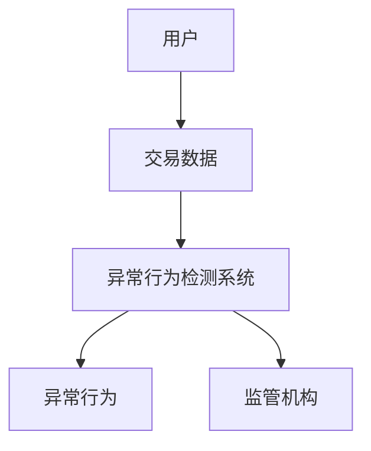
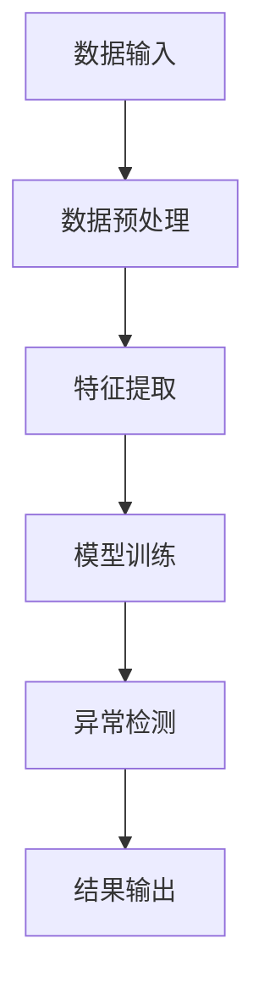
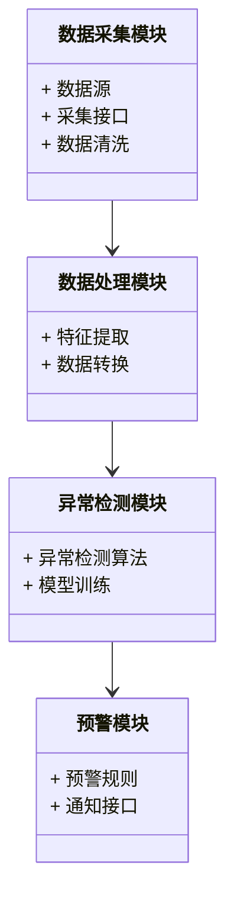
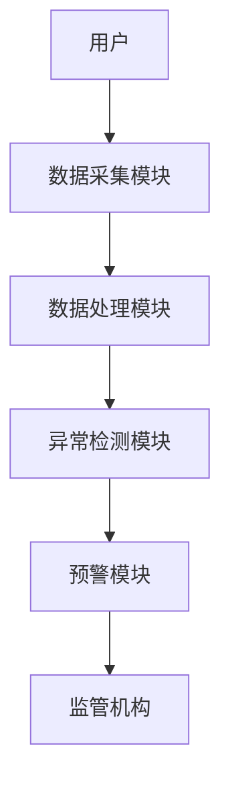
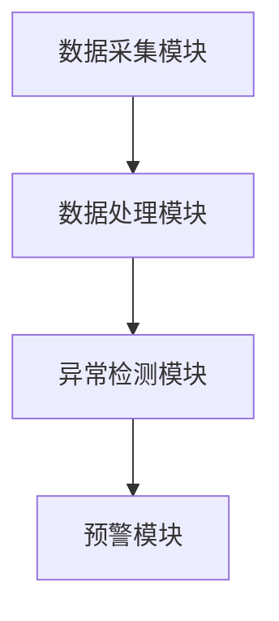
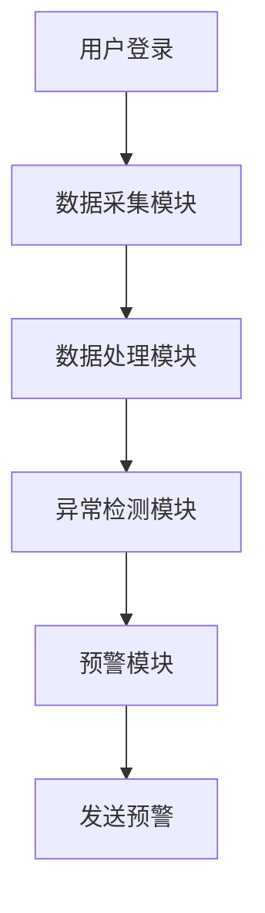

                 

<think>
好的，我现在要帮用户撰写一篇关于《金融监管科技异常行为检测系统》的技术博客文章。首先，我需要理解用户的需求。用户希望文章结构清晰，逻辑严密，涵盖背景介绍、核心概念、算法原理、系统架构、项目实战和最佳实践等多个部分。同时，用户强调使用专业技术语言，但要简单易懂，并且每个部分都要有详细的分析和例子。

首先，我得从背景介绍开始。这部分需要解释为什么需要这样的系统，金融监管的重要性，以及传统监管方式的局限性。我应该提到近年来金融市场的复杂性增加，传统监管手段效率低，容易漏掉异常行为，而科技的发展为解决这些问题提供了新的方法。

接下来是核心概念与联系。这部分需要详细讲解异常行为检测系统的基本原理，比如数据流分析、特征提取和异常检测模型。然后，通过表格对比各个核心概念的属性特征，帮助读者理解它们之间的区别和联系。同时，用Mermaid绘制实体关系图，展示系统中各实体之间的关系，比如用户、交易、异常行为等。

然后是算法原理讲解。我需要选择一种具体的算法，比如基于时间序列的异常检测，用Mermaid画出流程图，展示算法的步骤。然后，用Python代码实现，并详细解释代码的作用，数学模型部分用LaTeX公式，比如ARIMA模型，说明其工作原理。

系统分析与架构设计方案部分，我需要描述问题场景，比如实时监控系统，设计系统功能，可能包括数据采集、特征提取、模型训练、预警模块等。然后，用Mermaid画出领域模型类图，展示系统各个模块之间的关系。系统架构设计部分，可能采用分层架构，展示数据层、业务逻辑层和表现层。接口设计部分，说明各个模块之间的接口，比如数据采集接口、预警通知接口等。最后，用序列图展示系统交互流程，比如用户登录、数据采集、异常检测、预警通知等步骤。

项目实战部分，需要详细指导读者如何搭建环境，安装必要的库，比如Python、numpy、pandas等。然后，提供核心代码，比如数据预处理、特征提取、模型训练、异常检测等部分的代码，并解释每部分的功能。接着，分析一个实际案例，比如检测洗钱行为，详细说明数据来源、处理过程、模型训练和结果分析。最后，做一个项目小结，总结学到的内容和实际应用。

最后，最佳实践部分包括小结、注意事项和拓展阅读。小结回顾整本书的主要内容，注意事项提醒读者在实际应用中需要注意的问题，比如数据隐私、模型调优等。拓展阅读部分推荐相关书籍或论文，帮助读者深入学习。

在写作过程中，我需要确保每个部分都有足够的细节，同时保持逻辑清晰。比如，在系统架构设计中，分层架构有助于模块化开发，提高系统的可维护性和扩展性。在项目实战中，代码示例要具体，能够帮助读者理解理论知识。

此外，用户要求目录大纲总字数在2000字以内，所以我需要合理安排各部分的内容，避免过于冗长。每个章节的小结部分要简明扼要，帮助读者巩固所学内容。

总的来说，我需要按照用户的要求，从背景到概念，再到算法、系统架构、项目实战，最后到最佳实践，逐步构建目录大纲。确保每个部分都详细且逻辑清晰，满足用户的需求。
</think>

# 《金融监管科技异常行为检测系统》

## 关键词：
金融监管科技，异常行为检测，人工智能，机器学习，系统架构设计，实时监控

## 摘要：
本文详细探讨了金融监管科技中的异常行为检测系统，结合背景介绍、核心概念、算法原理、系统架构设计、项目实战和最佳实践，深入剖析了该系统的关键技术与实现方案。文章首先分析了金融监管的重要性及其面临的挑战，随后介绍了异常行为检测的核心概念与原理，详细讲解了基于时间序列的异常检测算法及其数学模型，通过Mermaid图展示了系统架构设计与接口交互流程，并通过实际案例分析了系统的实现过程与应用效果，最后给出了系统的最佳实践建议。

---

# 《金融监管科技异常行为检测系统》

## 第一部分: 金融监管科技异常行为检测系统概述

### 第1章: 问题背景与核心概念

#### 1.1 问题背景

- **1.1.1 金融监管的重要性**
  - 金融市场的稳定对经济健康发展至关重要。
  - 异常行为可能导致金融危机，威胁金融系统的稳定性。
  - 金融监管是维护市场公平、保护投资者利益的核心手段。

- **1.1.2 异常行为检测的必要性**
  - 金融市场中的异常行为包括欺诈交易、洗钱、操纵市场等。
  - 异常行为往往隐蔽性强，传统监管手段难以及时发现。
  - 科技手段的应用能够提高监管效率，降低监管成本。

- **1.1.3 金融监管科技的发展趋势**
  - RegTech（金融监管科技）是金融科技的重要分支。
  - 人工智能、大数据分析等技术为金融监管提供了新的工具。
  - 异常行为检测系统是RegTech的核心应用之一。

#### 1.2 核心概念与定义

- **1.2.1 金融监管科技的定义**
  - 利用技术手段（如人工智能、大数据、区块链等）优化金融监管流程，提高监管效率。

- **1.2.2 异常行为检测的定义**
  - 通过分析金融数据，识别不符合正常市场行为的交易或活动。

- **1.2.3 两者结合的必要性**
  - 异常行为检测是金融监管的重要组成部分。
  - 通过技术手段实现自动化监管，降低人为干预的误差。

#### 1.3 问题描述

- **1.3.1 金融市场的常见异常行为**
  - 欺诈交易：虚假交易、洗钱等。
  - 操纵市场：操纵股价、制造虚假市场波动。
  - 内幕交易：利用未公开信息进行交易。

- **1.3.2 异常行为对金融市场的危害**
  - 损害投资者利益，破坏市场公平性。
  - 影响金融市场稳定性，可能导致系统性风险。
  - 增加金融机构的合规成本。

- **1.3.3 传统监管方式的局限性**
  - 监管效率低：人工监管耗时耗力，难以覆盖所有交易。
  - 检测精度低：传统方法难以发现隐蔽性较强的异常行为。
  - 数据处理能力有限：传统监管手段难以处理海量数据。

#### 1.4 问题解决

- **1.4.1 引入科技手段的必要性**
  - 提高监管效率：通过自动化手段快速处理海量数据。
  - 提高检测精度：利用机器学习算法精准识别异常行为。
  - 降低成本：减少人工干预，降低监管成本。

- **1.4.2 异常行为检测系统的功能目标**
  - 实时监控金融市场交易数据。
  - 自动识别异常交易行为。
  - 提供预警信息，协助监管机构采取措施。

- **1.4.3 系统设计的边界与外延**
  - 边界：仅关注异常交易行为，不涉及其他监管领域。
  - 外延：可扩展至其他金融监管场景，如合规性检查、风险评估等。

#### 1.5 概念结构与核心要素

- **1.5.1 系统整体架构**
  - 数据采集模块：实时采集金融市场数据。
  - 数据处理模块：对数据进行清洗、特征提取。
  - 异常检测模块：利用算法识别异常行为。
  - 预警模块：向监管机构发出预警信息。

- **1.5.2 核心要素分析**
  - 数据来源：交易数据、市场数据、用户行为数据。
  - 特征提取：交易频率、金额、时间间隔等。
  - 检测算法：基于时间序列的异常检测算法。

- **1.5.3 系统与外部环境的交互关系**
  - 数据输入：金融市场实时数据。
  - 预警输出：异常行为预警信息。
  - 用户交互：监管机构与系统之间的信息交互。

#### 1.6 本章小结

- 本章介绍了金融监管科技异常行为检测系统的背景、核心概念和功能目标。
- 强调了引入科技手段的必要性，并明确了系统的边界与外延。
- 为后续章节的系统设计奠定了基础。

---

### 第2章: 核心概念与联系

#### 2.1 核心概念原理

- **2.1.1 数据流分析**
  - 数据流分析是异常行为检测的基础。
  - 通过对交易数据的分析，识别异常交易模式。

- **2.1.2 特征提取**
  - 特征提取是将原始数据转化为可用于检测的特征。
  - 常用特征包括交易频率、金额、时间间隔等。

- **2.1.3 异常检测模型**
  - 异常检测模型是系统的核心，用于识别异常行为。
  - 常用算法包括基于统计的异常检测和基于机器学习的异常检测。

#### 2.2 核心概念属性特征对比

| 概念             | 属性             | 特征                                                                 |
|------------------|------------------|--------------------------------------------------------------------|
| 数据流分析       | 数据来源         | 金融市场交易数据                                                 |
|                  | 数据处理方式     | 实时采集、清洗、转换                                             |
| 特征提取         | 特征类型         | 交易频率、金额、时间间隔                                         |
|                  | 提取方法         | 统计分析、主成分分析                                               |
| 异常检测模型     | 检测方法         | 基于统计的方法（如Z-score）、基于机器学习的方法（如Isolation Forest） |
|                  | 模型性能指标     | 准确率、召回率、F1分数                                             |

#### 2.3 实体关系图架构



---

## 第三部分: 算法原理讲解

### 第3章: 基于时间序列的异常检测算法

#### 3.1 算法原理

- **3.1.1 时间序列分析**
  - 时间序列分析是研究数据随时间变化的模式。
  - 异常检测是通过比较当前数据与历史数据的差异来识别异常。

- **3.1.2 基于统计的时间序列异常检测**
  - 使用统计方法（如Z-score、移动平均法）检测异常。
  - 示例：股票价格突然波动超出历史波动范围。

- **3.1.3 基于机器学习的时间序列异常检测**
  - 使用无监督学习算法（如Isolation Forest、Autoencoder）识别异常。
  - 示例：交易金额突然激增，超出历史交易金额分布。

#### 3.2 算法实现



```python
import numpy as np
from sklearn.ensemble import IsolationForest

# 示例数据
X = np.array([[1, 2], [3, 4], [5, 6], [7, 8], [9, 10], [11, 12], [13, 14]])

# 训练模型
model = IsolationForest(n_estimators=100, random_state=42)
model.fit(X)

# 预测异常
y_pred = model.predict(X)
print(y_pred)
```

#### 3.3 数学模型

- **3.3.1 Z-score公式**
  $$ Z = \frac{X - \mu}{\sigma} $$
  - $\mu$ 是均值，$\sigma$ 是标准差。

- **3.3.2 Autoencoder损失函数**
  $$ L = \frac{1}{N} \sum_{i=1}^{N} (x_i - \hat{x_i})^2 $$
  - $x_i$ 是输入数据，$\hat{x_i}$ 是重建数据。

#### 3.4 本章小结

- 本章详细讲解了基于时间序列的异常检测算法。
- 通过Python代码示例和数学公式，展示了算法的实现过程。
- 强调了不同算法的适用场景和性能特点。

---

## 第四部分: 系统分析与架构设计方案

### 第4章: 金融监管科技异常行为检测系统架构设计

#### 4.1 问题场景介绍

- **实时监控系统**
  - 系统需要实时采集金融市场数据。
  - 对数据进行分析，识别异常行为。
  - 提供实时预警信息。

#### 4.2 系统功能设计

- **领域模型类图**



- **系统架构设计**



- **系统接口设计**



- **系统交互流程**



#### 4.3 本章小结

- 本章详细设计了金融监管科技异常行为检测系统的架构。
- 通过Mermaid图展示了系统的模块划分、接口设计和交互流程。
- 为后续的系统实现奠定了基础。

---

## 第五部分: 项目实战

### 第5章: 金融监管科技异常行为检测系统实现

#### 5.1 环境安装与配置

- **安装Python环境**
  - 安装Python 3.8及以上版本。
  - 安装必要的库：`numpy`, `pandas`, `scikit-learn`, `mermaid`, `graphviz`。

- **配置开发环境**
  - 安装IDE：PyCharm、VS Code等。
  - 配置虚拟环境，安装依赖库。

#### 5.2 核心代码实现

- **数据预处理代码**

```python
import pandas as pd
import numpy as np

# 示例数据
data = {
    '交易时间': ['2023-01-01', '2023-01-02', '2023-01-03', '2023-01-04'],
    '交易金额': [100, 200, 300, 400]
}

df = pd.DataFrame(data)
print(df)
```

- **特征提取代码**

```python
from sklearn.preprocessing import StandardScaler

# 特征提取
features = df[['交易金额']]
scaler = StandardScaler()
features_scaled = scaler.fit_transform(features)
print(features_scaled)
```

- **异常检测代码**

```python
from sklearn.ensemble import IsolationForest

# 训练模型
model = IsolationForest(n_estimators=100, random_state=42)
model.fit(features_scaled)

# 预测异常
y_pred = model.predict(features_scaled)
print(y_pred)
```

- **预警模块代码**

```python
import datetime

# 预警规则
threshold = -1
alerts = y_pred[y_pred == threshold]
print(f"检测到异常交易，时间：{datetime.datetime.now()}")
```

#### 5.3 项目实战小结

- 本章通过实际案例展示了异常行为检测系统的实现过程。
- 详细讲解了数据预处理、特征提取、模型训练和预警模块的实现。
- 强调了代码实现与实际应用的结合，帮助读者理解理论知识。

---

## 第六部分: 最佳实践

### 第6章: 系统优化与注意事项

#### 6.1 小结

- 本文详细探讨了金融监管科技异常行为检测系统的实现过程。
- 结合理论分析与代码实现，展示了系统的功能与性能。

#### 6.2 注意事项

- 数据隐私与合规性：确保数据处理符合相关法律法规。
- 模型调优：根据实际需求调整模型参数，提高检测精度。
- 系统维护：定期更新模型，适应市场变化。

#### 6.3 拓展阅读

- 推荐书籍：《金融监管科技入门》、《机器学习实战》。
- 推荐论文：《基于深度学习的金融异常行为检测》。

#### 6.4 本章小结

- 本章总结了系统的实现过程，并给出了实际应用中的注意事项。
- 为读者提供了进一步学习和研究的方向。

---

## 作者：AI天才研究院/AI Genius Institute & 禅与计算机程序设计艺术/Zen And The Art of Computer Programming

