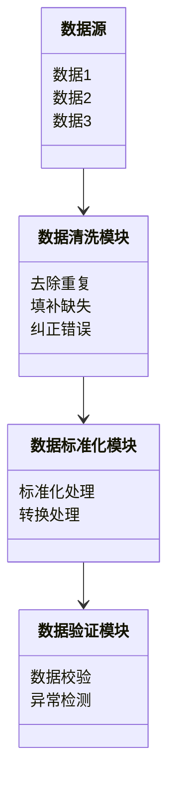
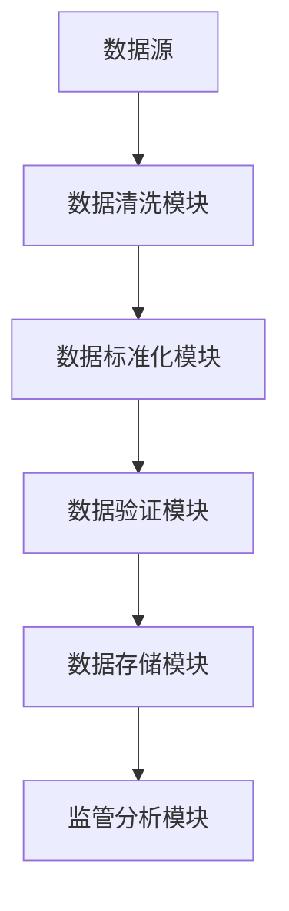

                 


# 金融监管科技数据质量控制

> 关键词：金融监管科技，数据质量控制，数据清洗，数据标准化，数据质量管理

> 摘要：随着金融监管科技的快速发展，数据质量控制在金融监管中的重要性日益凸显。本文从金融监管科技的背景出发，详细探讨了数据质量控制的核心概念、算法原理、系统架构以及实际应用。通过理论与实践相结合的方式，本文旨在为金融监管科技领域的从业者提供一套系统化的数据质量控制解决方案。

---

## 第1章 金融监管科技与数据质量控制概述

### 1.1 金融监管科技的背景与现状

#### 1.1.1 金融监管科技的定义与特点
金融监管科技（FinTech Regulation）是指利用新兴技术手段（如大数据、人工智能、区块链等）对金融行业进行监管和合规管理的创新模式。其特点包括：
- **技术驱动**：依托新兴技术实现监管目标。
- **实时性**：能够快速响应金融市场变化。
- **数据密集性**：依赖高质量数据进行决策。
- **合规性**：确保监管活动符合法律法规。

#### 1.1.2 金融监管科技的发展历程
1. **传统监管模式**：依赖人工审核和事后监管，效率低且成本高。
2. **技术辅助监管**：引入信息技术，如自动化报告和数据分析工具。
3. **智能监管**：结合人工智能、大数据等技术，实现智能化、实时化的监管。

#### 1.1.3 数据质量控制在金融监管中的重要性
数据质量是金融监管科技的核心，直接影响监管决策的准确性和有效性。低质量数据可能导致错误的监管结论，甚至引发系统性风险。

---

### 1.2 数据质量控制的核心概念

#### 1.2.1 数据质量的定义与维度
数据质量（Data Quality）是指数据的准确性、完整性、一致性和可靠性。其核心维度包括：
- **完整性**：数据是否完整无缺失。
- **一致性**：数据格式和含义是否统一。
- **准确性**：数据是否真实反映实际情况。
- **及时性**：数据是否能够及时更新。
- **可比性**：数据是否可以在不同时间或机构之间进行比较。

#### 1.2.2 数据质量控制的目标与原则
- **目标**：通过清洗、转换和验证等技术手段，确保数据的高质量。
- **原则**：一致性、完整性、准确性、可追溯性。

#### 1.2.3 金融监管中的数据质量问题
在金融监管中，数据质量问题主要体现在：
- 数据来源多样，格式不统一。
- 数据存在缺失或错误。
- 数据更新频率不一致，影响实时性。

---

## 第2章 数据质量控制的理论基础

### 2.1 数据质量的核心维度分析

#### 2.1.1 数据完整性
数据完整性确保数据无缺失，例如在交易数据中，必须包含交易时间、金额、参与者等字段。

#### 2.1.2 数据一致性
数据一致性确保不同数据源中的同一数据在格式和含义上保持一致。例如，同一客户在不同系统中的标识必须唯一。

#### 2.1.3 数据准确性
数据准确性要求数据真实反映实际情况，例如交易金额必须与实际发生金额一致。

#### 2.1.4 数据及时性
数据及时性要求数据能够及时更新，例如实时交易数据必须在交易发生后几秒内更新。

#### 2.1.5 数据可比性
数据可比性要求不同时间或机构的数据可以进行比较。例如，不同机构的交易数据必须符合统一的会计准则。

---

### 2.2 数据质量控制的技术框架

#### 2.2.1 数据清洗与预处理
数据清洗是数据质量管理的核心步骤，包括去除重复数据、填补缺失值、纠正错误数据等。

#### 2.2.2 数据标准化与转换
数据标准化是指将不同数据源中的数据格式统一，例如将日期格式从“YYYY-MM-DD”转换为“MM-DD-YYYY”。

#### 2.2.3 数据验证与校验
数据验证是指通过规则或算法检查数据的准确性，例如通过校验码验证交易数据的完整性。

#### 2.2.4 数据质量管理工具与平台
常用的数据质量管理工具包括：
- **ETL工具**：如Apache NiFi、Talend。
- **数据清洗工具**：如Python的Pandas库。
- **数据质量管理平台**：如IBM Watson Knowledge Catalog、Alation。

---

### 2.3 数据质量控制在金融监管中的应用场景

#### 2.3.1 金融监管中的数据质量问题
- 数据来源多样，格式不统一。
- 数据存在缺失或错误。
- 数据更新频率不一致，影响实时性。

#### 2.3.2 数据质量控制对金融监管效率的提升
- 提高监管决策的准确性。
- 实现数据的实时监控与预警。
- 降低监管成本，提升监管效率。

---

## 第3章 数据质量控制的算法原理与实现

### 3.1 数据清洗算法

#### 3.1.1 数据清洗的定义与流程
数据清洗是指通过一系列算法和技术，去除数据中的噪声，填补缺失值，纠正错误数据。

#### 3.1.2 基于规则的清洗算法
基于规则的清洗算法通过预定义的规则对数据进行清洗，例如：
- 删除重复数据。
- 填补缺失值：使用均值、中位数或插值法。
- 纠正错误值：通过规则判断并替换错误值。

#### 3.1.3 基于统计的清洗算法
基于统计的清洗算法通过统计方法识别异常值，例如：
- 使用箱线图识别异常值。
- 使用Z-score方法检测离群点。

#### 3.1.4 基于机器学习的清洗算法
基于机器学习的清洗算法通过训练模型识别数据中的异常值，例如：
- 使用孤立森林（Isolation Forest）算法检测异常值。

---

### 3.2 数据特征工程

#### 3.2.1 数据特征选择
数据特征选择是指从原始数据中选择最具代表性的特征，例如使用特征重要性评分方法（如信息增益、Gini系数等）。

#### 3.2.2 数据特征变换
数据特征变换是指通过变换技术（如标准化、归一化、维度降维等）改善数据的分布特性，例如：
- 标准化：使用Z-score方法将数据标准化。
- 归一化：将数据映射到[0,1]区间。

#### 3.2.3 数据特征降维
数据特征降维是指通过主成分分析（PCA）等方法降低数据维度，减少计算复杂度。

---

### 3.3 数据质量控制的数学模型

#### 3.3.1 数据清洗的数学模型
数据清洗的数学模型包括：
- 均值填补：$\bar{x} = \frac{1}{n} \sum_{i=1}^{n} x_i$
- 中位数填补：$x_{\text{median}} = \text{排序后中间的数值}$

#### 3.3.2 数据标准化的数学公式
数据标准化的公式为：
$$ z = \frac{x - \mu}{\sigma} $$
其中，$\mu$ 是均值，$\sigma$ 是标准差。

---

### 3.4 数据质量控制的算法实现

#### 3.4.1 数据清洗的Python实现
```python
import pandas as pd

# 读取数据
data = pd.read_csv('data.csv')

# 删除重复数据
data = data.drop_duplicates()

# 填补缺失值
data['missing_col'].fillna(data['missing_col'].mean(), inplace=True)

# 纠正错误值
data['error_col'] = data['error_col'].apply(lambda x: x.strip())
```

#### 3.4.2 数据标准化的Python实现
```python
from sklearn.preprocessing import StandardScaler

# 标准化数据
scaler = StandardScaler()
data_normalized = scaler.fit_transform(data)
```

---

## 第4章 数据质量控制的系统架构与实现

### 4.1 系统功能设计

#### 4.1.1 领域模型


### 4.2 系统架构设计

#### 4.2.1 系统架构图


### 4.3 系统接口设计

#### 4.3.1 接口描述
- 数据输入接口：接收原始数据。
- 数据清洗接口：对数据进行清洗处理。
- 数据标准化接口：对数据进行标准化处理。
- 数据验证接口：对数据进行校验和异常检测。

---

## 第5章 项目实战：金融监管科技数据质量控制

### 5.1 环境安装

#### 5.1.1 安装Python环境
```bash
pip install Python
pip install pandas
pip install numpy
pip install scikit-learn
```

### 5.2 核心代码实现

#### 5.2.1 数据清洗代码
```python
import pandas as pd

# 读取数据
data = pd.read_csv('data.csv')

# 删除重复数据
data = data.drop_duplicates()

# 填补缺失值
data['missing_col'].fillna(data['missing_col'].mean(), inplace=True)

# 纠正错误值
data['error_col'] = data['error_col'].apply(lambda x: x.strip())
```

#### 5.2.2 数据标准化代码
```python
from sklearn.preprocessing import StandardScaler

# 标准化数据
scaler = StandardScaler()
data_normalized = scaler.fit_transform(data)
```

### 5.3 案例分析

#### 5.3.1 案例背景
假设我们有一个金融交易数据集，包含交易时间、交易金额、参与者等字段。

#### 5.3.2 数据清洗与标准化
- 数据清洗：去除重复数据，填补缺失值。
- 数据标准化：将交易金额标准化。

### 5.4 项目小结
通过本项目，我们实现了金融监管科技中的数据质量控制，提高了数据的准确性和一致性。

---

## 第6章 数据质量控制的最佳实践与未来展望

### 6.1 最佳实践

#### 6.1.1 数据质量管理的注意事项
- 数据质量管理需要与业务需求相结合。
- 数据清洗和标准化需要根据具体场景定制。

#### 6.1.2 数据质量管理工具的选择
- 根据数据规模和复杂度选择合适的工具。
- 优先选择支持自动化和可视化的工具。

### 6.2 未来展望

#### 6.2.1 新技术的应用
- 引入更多人工智能技术，如深度学习、自然语言处理等。
- 探索区块链技术在数据质量管理中的应用。

#### 6.2.2 方法的优化
- 提高数据质量管理的自动化水平。
- 建立统一的数据质量管理标准。

---

## 作者：AI天才研究院 & 禅与计算机程序设计艺术

---

以上是《金融监管科技数据质量控制》的技术博客文章的完整目录大纲，涵盖了从背景介绍到实际应用的各个方面，旨在为金融监管科技领域的从业者提供系统化的数据质量控制解决方案。

