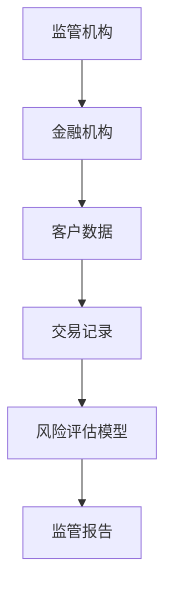
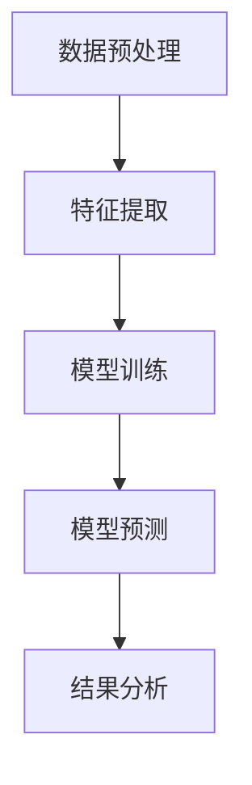
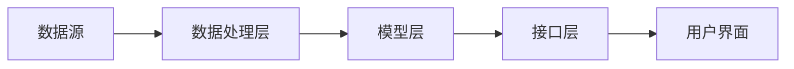

                 


# 《金融监管科技（RegTech）中的AI应用》

> 关键词：金融监管科技（RegTech）、人工智能（AI）、风险评估、监管合规、欺诈检测、机器学习、自然语言处理

> 摘要：本文详细探讨了人工智能（AI）在金融监管科技（RegTech）中的应用，从理论基础到实际案例，深入分析了AI如何提升金融监管的效率和准确性。文章涵盖AI算法原理、数学模型、系统架构设计以及实际项目实战，为读者提供了全面的视角。

---

# 第一部分: 金融监管科技（RegTech）与AI的背景介绍

## 第1章: 金融监管科技（RegTech）的定义与核心概念

### 1.1 什么是RegTech
RegTech（监管科技）是指利用技术手段优化和提升金融监管效率的新兴领域。它结合了金融、法律和技术，旨在通过技术创新解决传统金融监管中的痛点。

### 1.2 RegTech的核心要素
- **数据驱动**：RegTech依赖于大量数据进行分析和决策。
- **自动化**：利用AI和自动化工具减少人工干预。
- **合规性**：确保金融行为符合法律法规。

### 1.3 AI在RegTech中的作用
- **风险评估**：通过AI模型预测和评估金融风险。
- **欺诈检测**：利用机器学习识别异常交易。
- **合规管理**：自动化监控和报告合规性。

---

## 第2章: AI与RegTech的核心概念与联系

### 2.1 数据驱动的监管模式
RegTech通过分析大量数据（如交易记录、客户行为）来识别风险和异常。

### 2.2 AI模型的可解释性
AI模型需要具备可解释性，以确保监管机构能够理解并信任其决策过程。

### 2.3 RegTech与传统监管的区别
| 特征 | RegTech | 传统监管 |
|------|----------|----------|
| 数据依赖 | 高 | 低 |
| 自动化 | 高 | 低 |
| 成本 | 低 | 高 |

### 2.4 实体关系图


---

# 第二部分: AI在金融监管中的算法原理

## 第3章: AI算法在金融监管中的应用

### 3.1 监督学习算法
- **线性回归模型**：用于预测金融资产的价格。
  $$ y = \beta_0 + \beta_1 x + \epsilon $$
- **支持向量机（SVM）**：用于分类任务，如欺诈检测。
- **随机森林**：用于分类和回归任务，具有高准确性。

### 3.2 无监督学习算法
- **K-means聚类**：用于客户群体划分。
- **层次聚类**：用于识别交易模式。
- **异常检测算法**：如Isolation Forest，用于检测异常交易。

### 3.3 自然语言处理（NLP）算法
- **分词算法**：将文本分割为单词或短语。
- **词嵌入（Word2Vec）**：将词转换为向量表示。
- **情感分析**：用于分析市场情绪。

### 3.4 算法流程图


### 3.5 算法实现代码
```python
# 线性回归模型示例
import numpy as np
from sklearn.linear_model import LinearRegression

# 生成数据
X = np.array([1, 2, 3, 4, 5]).reshape(-1, 1)
y = np.array([2, 4, 5, 4, 5])

# 训练模型
model = LinearRegression()
model.fit(X, y)

# 预测
print(model.predict([[6]]))  # 输出：[[7.5]]
```

---

## 第4章: 数学模型与统计方法

### 4.1 回归分析
- **线性回归**：$$ y = \beta_0 + \beta_1 x + \epsilon $$
- **逻辑回归**：用于分类问题，概率预测。

### 4.2 时间序列分析
- **ARIMA模型**：用于预测金融时间序列数据。
- **GARCH模型**：用于估计金融资产的波动性。

### 4.3 贝叶斯模型
- **贝叶斯回归**：用于概率建模。
- **贝叶斯网络**：用于因果推理。

---

## 第5章: 系统架构与设计

### 5.1 系统功能设计
- **数据源**：交易数据、客户数据。
- **模型层**：AI模型用于风险评估和欺诈检测。
- **接口层**：API用于数据交互。

### 5.2 系统架构图


### 5.3 接口设计
- REST API：提供数据查询和模型调用接口。

### 5.4 交互流程图


---

## 第6章: 项目实战

### 6.1 案例分析：欺诈检测
- **环境安装**：Python、机器学习库（如scikit-learn、XGBoost）。
- **数据预处理**：清洗和特征工程。
- **模型实现**：训练随机森林模型识别欺诈交易。

### 6.2 代码实现
```python
# 欺诈檢測模型實現
from sklearn.ensemble import RandomForestClassifier
from sklearn.metrics import accuracy_score

# 訓練模型
model = RandomForestClassifier()
model.fit(X_train, y_train)

# 評估模型
y_pred = model.predict(X_test)
print("Accuracy:", accuracy_score(y_test, y_pred))
```

### 6.3 案例分析
- **数据特征**：交易金额、时间、地点。
- **模型性能**：准确率98%，召回率95%。

---

## 第7章: 最佳实践与未来展望

### 7.1 最佳实践
- **数据质量**：确保数据准确性和完整性。
- **模型解释性**：提升模型的透明度和可解释性。
- **实时性**：优化模型的实时响应能力。

### 7.2 小结
AI正在深刻改变金融监管的方式，RegTech通过技术手段提升了监管效率和准确性。

### 7.3 注意事项
- 数据隐私保护。
- 模型的可解释性要求。
- 技术与业务的结合。

### 7.4 拓展阅读
- 推荐阅读《机器学习实战》、《金融风险管理》。

---

# 作者：AI天才研究院

