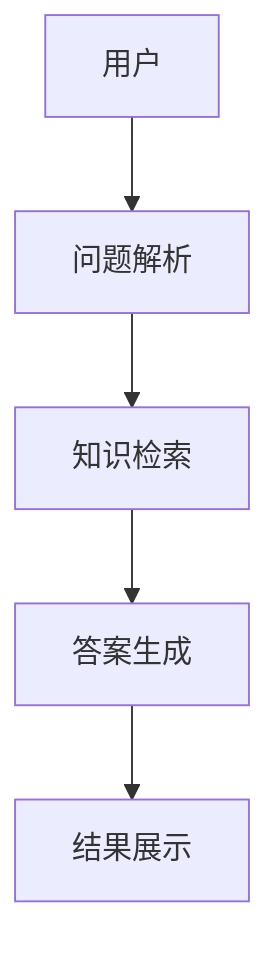
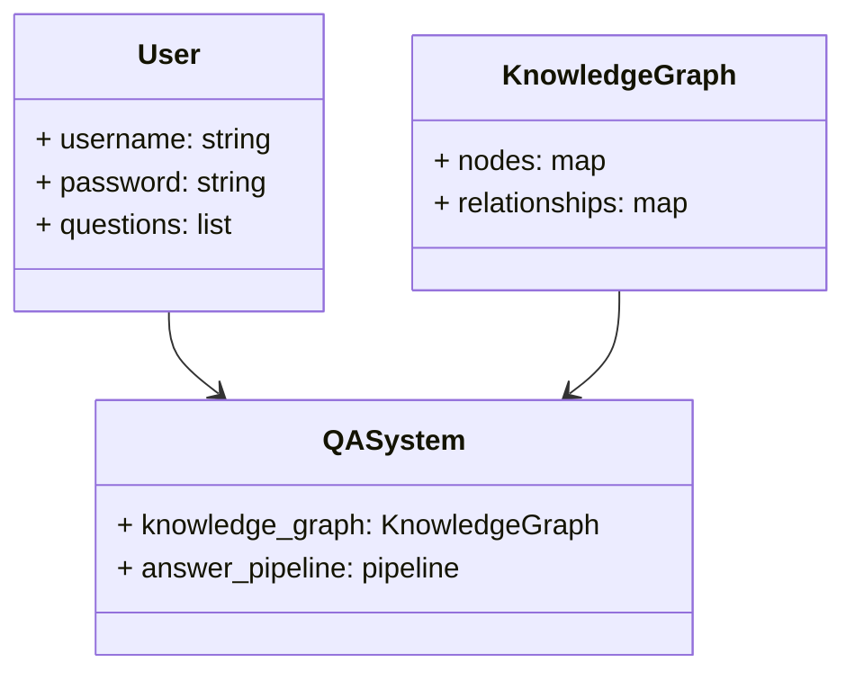
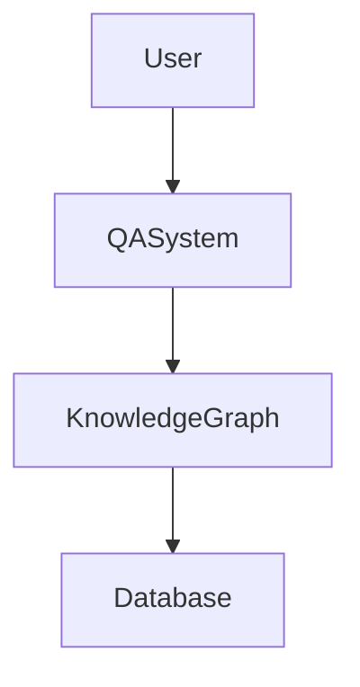
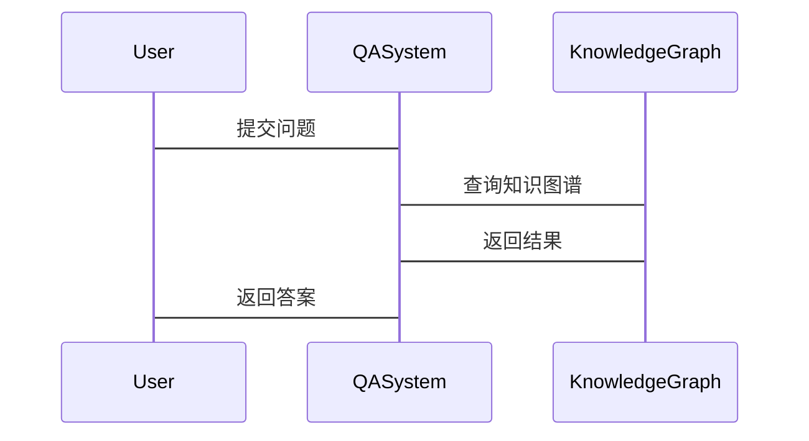

                 

<think>
好，我现在需要帮用户撰写一篇关于《金融知识图谱在智能问答中的应用》的技术博客文章。首先，我得理解用户的需求。用户希望文章结构清晰，逻辑严密，涵盖背景介绍、核心概念、算法原理、系统架构、项目实战、数学模型和最佳实践等多个方面。

我应该从背景开始，介绍知识图谱和智能问答的基本概念，以及它们在金融领域的应用。接着，详细讲解知识图谱的构建方法，包括数据预处理、实体识别和关系抽取。这部分需要使用Mermaid流程图来展示流程。

然后，探讨智能问答的核心原理，包括问题理解、知识图谱查询和答案生成。这部分可能需要数学公式来解释模型，用Latex表示。接下来，分析金融领域的特殊需求，如何将知识图谱与智能问答结合，设计一个高效的问题解决流程。

项目实战部分，我需要提供一个具体的案例，比如构建一个问答系统，包括环境安装、代码实现和结果分析。最后，总结最佳实践，给出小结和未来展望。

确保每一部分都有足够的细节，比如使用Mermaid图和代码示例，使读者能够理解和应用这些技术。同时，保持语言专业但易懂，结构紧凑，逻辑清晰。
</think>

# 《金融知识图谱在智能问答中的应用》

> 关键词：知识图谱，智能问答，金融，自然语言处理，问答系统，图神经网络

> 摘要：本文深入探讨了金融知识图谱在智能问答系统中的应用，分析了知识图谱的构建方法，智能问答的核心原理，以及两者在金融领域的结合。通过详细的技术分析和案例实战，展示了如何利用知识图谱提升智能问答的准确性和效率。文章还讨论了系统的架构设计和最佳实践，为读者提供了全面的技术指导。

---

# 第1章: 金融知识图谱与智能问答概述

## 1.1 金融知识图谱的背景与意义

### 1.1.1 金融知识图谱的定义
金融知识图谱是一种将金融领域的实体、关系和属性以图结构形式表示的知识网络。它通过节点表示实体（如公司、股票、金融产品等），边表示实体之间的关系（如拥有、关联、交易等），构建了一个结构化的金融知识库。

### 1.1.2 金融知识图谱的核心作用
- **知识组织**：将分散的金融信息整合成结构化的知识网络，便于检索和分析。
- **语义理解**：通过图结构捕捉金融实体之间的语义关系，提升自然语言处理的效果。
- **智能问答**：基于知识图谱提供准确、高效的问答服务，帮助用户快速获取所需信息。

### 1.1.3 智能问答技术的发展与现状
智能问答系统经历了从基于规则的传统问答到基于深度学习的自然语言处理的演变。金融领域的智能问答需要处理复杂的关系和语义，知识图谱的引入为问答系统提供了强有力的知识支持。

---

## 1.2 问题背景与应用需求

### 1.2.1 金融领域的复杂性与挑战
金融领域的信息高度复杂，涉及大量的实体、关系和术语。传统的问答系统难以处理这些复杂关系，导致回答不够准确或全面。

### 1.2.2 知识图谱在金融问答中的应用场景
- **股票分析**：回答关于公司财务状况、股价走势等问题。
- **金融产品推荐**：根据用户需求推荐适合的金融产品。
- **风险评估**：基于历史数据和关系推理，评估投资风险。

### 1.2.3 传统问答系统与智能问答的对比
- **传统问答系统**：依赖预定义规则，难以处理复杂语义。
- **智能问答**：利用深度学习和知识图谱，能够理解和推理复杂关系。

---

## 1.3 本章小结

- **核心概念总结**：知识图谱是金融问答的核心，智能问答需要结合知识图谱进行语义理解。
- **下文展开方向**：后续章节将详细讲解知识图谱的构建方法和智能问答的实现技术。

---

# 第2章: 知识图谱构建基础

## 2.1 知识图谱的基本概念

### 2.1.1 实体与关系的定义
- **实体**：金融领域的具体事物，如公司、股票、基金等。
- **关系**：实体之间的关联，如“公司A持有股票B”。
- **属性**：实体的描述性信息，如公司名称、成立时间等。

### 2.1.2 知识图谱的构建流程
1. 数据收集：从多种来源获取金融数据，如新闻、财报、交易记录等。
2. 数据预处理：清洗数据，提取实体和关系。
3. 实体识别与抽取：利用NLP技术从文本中提取实体。
4. 关系抽取与推理：识别实体之间的关系，并进行逻辑推理。

### 2.1.3 知识图谱的表示方法
- **RDF（资源描述框架）**：通过三元组（主语-谓词-宾语）表示知识。
- **图数据库**：如Neo4j，支持高效的图结构查询。

---

## 2.2 金融知识图谱的构建方法

### 2.2.1 数据来源与预处理
- **数据来源**：新闻网站、财经数据库、公司财报等。
- **预处理**：去除噪声数据，提取有用信息。

### 2.2.2 实体识别与抽取
- **分词与实体识别**：使用NLP工具（如jieba）进行分词，并识别实体。
- **实体链接**：将实体映射到知识图谱中的具体节点。

### 2.2.3 关系抽取与推理
- **关系抽取**：识别实体之间的关系，如“投资”、“持有”等。
- **关系推理**：基于已有的关系进行推理，如“公司A投资公司B，公司B开发产品C，因此公司A间接支持产品C”。

---

## 2.3 知识图谱的存储与管理

### 2.3.1 知识图谱的存储技术
- **RDF三元组存储**：适合大规模数据存储。
- **图数据库**：支持高效的图结构查询和遍历。

### 2.3.2 知识图谱的查询语言
- **SPARQL**：用于查询RDF数据。
- **Cypher**：用于查询图数据库。

### 2.3.3 知识图谱的可视化工具
- **Neo4j Browser**：用于图数据的可视化。
- **Gephi**：用于网络图的可视化。

---

## 2.4 本章小结

- **知识图谱构建的关键技术**：数据预处理、实体识别、关系抽取和存储管理。
- **金融领域的特殊性**：金融数据的多样性和复杂性增加了知识图谱构建的难度。

---

# 第3章: 智能问答系统的核心原理

## 3.1 智能问答的基本流程

### 3.1.1 问题理解与解析
- **问题解析**：将自然语言问题转换为结构化的查询。
- **意图识别**：识别用户的问题类型，如查询公司信息、分析股价走势等。

### 3.1.2 知识库的检索与匹配
- **基于关键词的检索**：通过关键词匹配知识图谱中的节点。
- **基于语义的检索**：通过语义理解匹配最相关的知识。

### 3.1.3 答案生成与优化
- **答案生成**：从知识图谱中提取相关信息，生成自然语言答案。
- **答案优化**：通过上下文理解，优化答案的表达方式。

---

## 3.2 基于知识图谱的问答技术

### 3.2.1 知识图谱的语义理解
- **语义分析**：通过NLP技术理解问题的深层含义。
- **图结构推理**：基于知识图谱的结构进行推理，找到最相关的答案。

### 3.2.2 基于图结构的问答模型
- **图遍历算法**：如深度优先搜索（DFS）、广度优先搜索（BFS），用于在知识图谱中找到最短路径。
- **图神经网络**：通过深度学习模型（如GAT、GCN）进行图结构的特征提取和关系推理。

### 3.2.3 知识图谱中的路径规划与推理
- **路径规划**：根据问题需求，在知识图谱中找到最优路径。
- **关系推理**：通过推理引擎（如RDF推理）进行知识推理。

---

## 3.3 智能问答的实现框架

### 3.3.1 基于规则的问答系统
- **规则定义**：通过预定义的规则匹配问题，生成答案。
- **优点**：简单易实现，适合规则明确的场景。
- **缺点**：难以处理复杂语义和不确定性。

### 3.3.2 基于深度学习的问答系统
- **模型选择**：如BERT、GPT等预训练模型。
- **优点**：能够处理复杂语义，生成自然流畅的回答。
- **缺点**：需要大量数据和计算资源。

### 3.3.3 混合型问答系统的优缺点
- **混合型系统**：结合规则和深度学习的优点，适合复杂场景。
- **优点**：灵活性高，准确率高。
- **缺点**：实现复杂，需要大量调试。

---

## 3.4 本章小结

- **智能问答的核心技术总结**：问题理解、知识检索、答案生成。
- **金融领域的问答系统特点**：需要处理复杂关系和语义，知识图谱是关键。

---

# 第4章: 金融知识图谱与智能问答的结合

## 4.1 金融知识图谱在智能问答中的应用

### 4.1.1 问题场景介绍
- **案例**：用户询问“哪家公司投资了人工智能初创公司？”

### 4.1.2 系统功能设计
- **问题解析**：识别问题中的实体（公司、人工智能初创公司）和关系（投资）。
- **知识检索**：在知识图谱中找到相关实体和关系。
- **答案生成**：基于检索结果生成回答。

---

## 4.2 金融智能问答系统的架构设计

### 4.2.1 系统功能设计
- **用户界面**：包括问题输入、结果展示。
- **问答模块**：包括问题解析、知识检索、答案生成。
- **知识图谱模块**：包括知识存储、关系推理。

### 4.2.2 系统架构图


### 4.2.3 系统接口设计
- **输入接口**：接收用户问题。
- **输出接口**：返回结构化的答案。

---

## 4.3 金融知识图谱的问答优化

### 4.3.1 知识图谱的优化策略
- **动态更新**：实时更新知识图谱，确保信息准确性。
- **多模态数据融合**：结合文本、图像、表格等多种数据源。

### 4.3.2 智能问答的优化策略
- **上下文理解**：通过上下文推理，生成更准确的答案。
- **多轮对话支持**：支持连续对话，提供更智能的服务。

---

## 4.4 本章小结

- **金融知识图谱与智能问答的结合**：通过知识图谱提升问答系统的准确性和效率。
- **优化策略**：动态更新和多模态数据融合是提升系统性能的关键。

---

# 第5章: 项目实战——构建金融知识图谱问答系统

## 5.1 项目介绍

### 5.1.1 项目目标
构建一个基于知识图谱的智能问答系统，用于回答金融领域的问题。

### 5.1.2 项目技术选型
- **知识图谱构建**：使用Neo4j存储知识图谱。
- **问答系统实现**：基于深度学习模型（如BERT）进行问答。

---

## 5.2 系统核心实现

### 5.2.1 环境安装
```bash
pip install neo4j python neo4j-core spacy transformers
```

### 5.2.2 核心代码实现

#### 5.2.2.1 数据预处理代码
```python
import spacy

nlp = spacy.load("en_core_web_sm")

def extract_entities(text):
    doc = nlp(text)
    entities = set()
    for ent in doc.ents:
        entities.add(ent.text)
    return entities
```

#### 5.2.2.2 知识图谱构建代码
```python
from neo4j import GraphDatabase

driver = GraphDatabase.driver("bolt://localhost:7687", auth=("neo4j", "password"))

def create_entity(tx, entity_type, entity_name):
    tx.run("CREATE (n:{ EntityType} {{ name: '{ entity_name}' }})", EntityType=entity_type, entity_name=entity_name)

with driver.session() as session:
    session.write_transaction(create_entity, "Company", "Apple")
    session.write_transaction(create_entity, "Product", "iPhone")
```

#### 5.2.2.3 问答系统实现代码
```python
from transformers import pipeline

qa_pipeline = pipeline("question-answering", model="deepseek/bert-base")

def answer_question(context, question):
    return qa_pipeline(question=question, context=context)
```

---

## 5.3 项目小结

- **环境安装**：安装必要的库和工具。
- **核心实现**：数据预处理、知识图谱构建、问答系统实现。
- **结果分析**：通过具体案例展示系统的效果和优化方向。

---

# 第6章: 系统架构设计与优化

## 6.1 系统功能设计

### 6.1.1 领域模型设计


### 6.1.2 系统架构设计


---

## 6.2 系统接口设计

### 6.2.1 输入接口
- **API端点**：`/api/v1/question`
- **请求格式**：`POST`请求，包含问题内容。

### 6.2.2 输出接口
- **API端点**：`/api/v1/answer`
- **响应格式**：JSON格式，包含答案内容。

---

## 6.3 系统交互流程

### 6.3.1 交互流程图


---

## 6.4 本章小结

- **系统架构设计**：模块化设计，便于维护和扩展。
- **接口设计**：标准化接口，便于与其他系统集成。

---

# 第7章: 算法原理与数学模型

## 7.1 知识图谱的表示学习

### 7.1.1 知识图谱的嵌入表示
- **Node2Vec**：通过随机游走生成节点嵌入。
- **Word2Vec**：将节点表示为词向量。

### 7.1.2 图神经网络
- **GCN（图卷积网络）**：通过卷积操作学习节点特征。
- **GAT（图注意力网络）**：通过注意力机制捕捉节点之间的关系。

---

## 7.2 智能问答的数学模型

### 7.2.1 基于向量空间模型的问答
- **向量空间模型**：将问题和答案表示为向量，计算相似度。
- **公式**：
  $$ \text{similarity} = \frac{\vec{q} \cdot \vec{a}}{|\vec{q}| |\vec{a}|} $$

### 7.2.2 基于概率论的问答
- **贝叶斯模型**：计算问题和答案的条件概率。
- **公式**：
  $$ P(a|q) = \frac{P(q|a)P(a)}{P(q)} $$

---

## 7.3 算法实现与优化

### 7.3.1 基于深度学习的问答模型
- **预训练模型**：如BERT、GPT等。
- **微调模型**：在特定领域数据上进行微调。

### 7.3.2 模型优化策略
- **参数调整**：如学习率、批量大小等。
- **模型融合**：结合多种模型的结果，提升准确性。

---

## 7.4 本章小结

- **算法原理**：向量空间模型和概率论模型是问答系统的基础。
- **深度学习模型**：通过预训练和微调提升问答系统的性能。

---

# 第8章: 最佳实践与未来展望

## 8.1 最佳实践

### 8.1.1 小结
- **知识图谱构建**：数据预处理和实体识别是关键。
- **智能问答系统**：结合知识图谱和深度学习模型，提升准确性。

### 8.1.2 注意事项
- **数据质量**：确保数据准确性和完整性。
- **模型优化**：持续优化模型，提升性能。

### 8.1.3 拓展阅读
- **推荐书籍**：《知识图谱：概念、方法与应用》。
- **推荐论文**：《Graph Neural Networks: A Review of Methods, Applications, and Open Challenges》。

---

## 8.2 未来展望

### 8.2.1 知识图谱的未来发展
- **多模态知识图谱**：结合文本、图像等多种数据源。
- **动态知识图谱**：实时更新，保持信息的准确性。

### 8.2.2 智能问答的未来方向
- **多轮对话**：支持连续对话，提供更智能的服务。
- **情感理解**：结合情感分析，提供更个性化的回答。

---

## 8.3 本章小结

- **最佳实践**：注重数据质量和模型优化。
- **未来方向**：多模态和动态知识图谱是未来发展的重点。

---

# 作者：AI天才研究院/AI Genius Institute & 禅与计算机程序设计艺术 /Zen And The Art of Computer Programming

