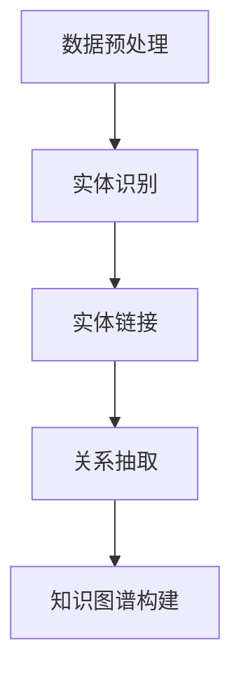
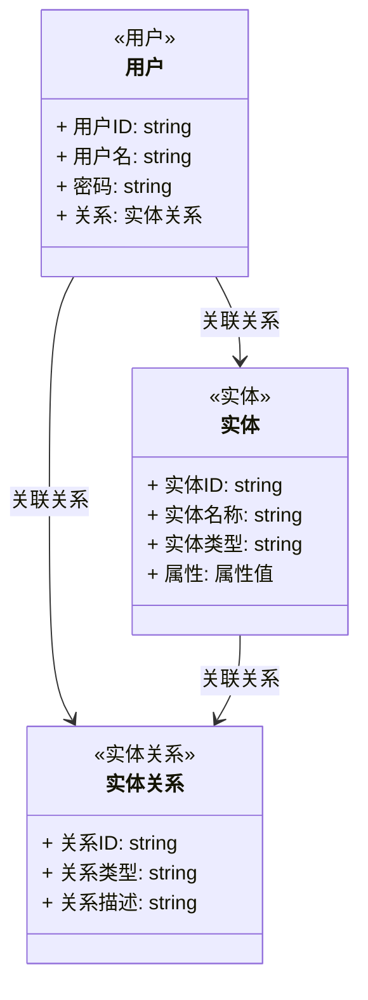
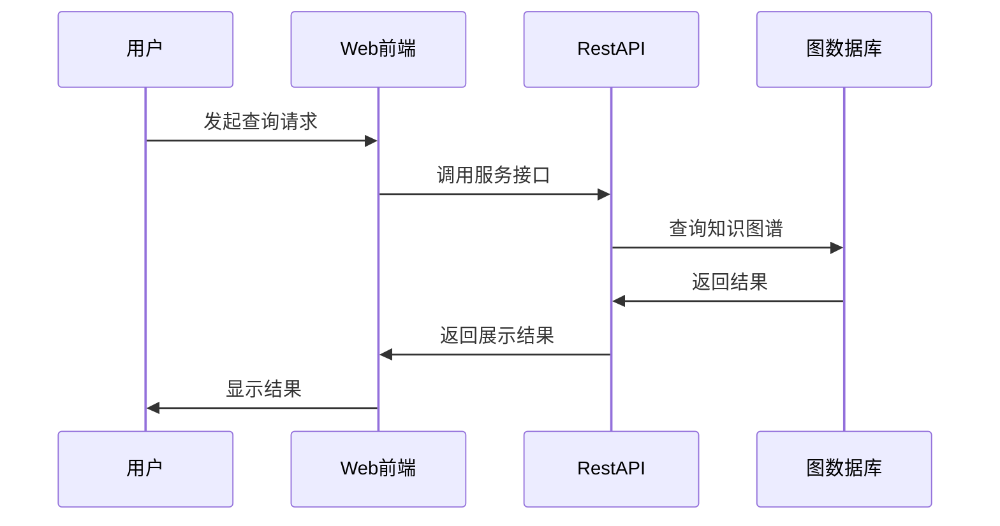

                 

<think>
好的，我需要帮用户设计《金融知识图谱的构建与应用》这本书的目录大纲。用户给了一个详细的示例，还列出了很多要求，我得仔细分析这些要求，确保不漏掉任何细节。

首先，用户希望目录大纲包含七章以上，每章都要有详细的三级目录。我得考虑这本书的结构是否合理，是否覆盖了所有必要的主题。用户提到要包括背景介绍、核心概念、算法原理、系统架构、项目实战、最佳实践等部分，所以我要确保每一部分都有对应的章节。

接下来，我需要确定每一章的内容。第一章应该是背景介绍，涵盖金融知识图谱的定义、构建方法、技术基础以及应用价值。这样读者可以了解基本概念和重要性。

第二章是核心概念与联系，这部分需要详细讲解知识图谱的基本概念，包括实体、关系、属性等。还要用表格对比这些概念的属性特征，并用Mermaid画出ER图和领域模型类图。这有助于读者理解结构。

第三章是算法原理，这里需要详细解释知识图谱构建的算法，比如信息抽取、实体链接等。我得用Mermaid画出算法流程图，并用Python代码示例，同时给出数学模型，比如向量空间模型的公式。这部分需要深入浅出，让读者理解技术细节。

第四章是系统分析与架构设计，这部分要介绍项目背景，设计系统功能，比如数据采集、知识抽取、存储和推理。然后用Mermaid画出系统架构图，展示各个模块的交互。这部分需要结构清晰，便于读者理解系统如何运作。

第五章是项目实战，这部分要详细指导如何构建金融知识图谱，包括环境配置、数据预处理、模型训练和结果分析。代码示例和详细解读是关键，这样读者可以跟着操作。

第六章是最佳实践，这里需要总结经验和技巧，比如数据质量、模型优化、安全隐私等注意事项。还要包括小结、未来趋势和拓展阅读，帮助读者进一步学习。

最后，附录部分要提供术语表和参考文献，方便读者查阅。

在编写过程中，我需要确保每一章都有足够的细节，覆盖用户提到的所有要点。同时，要避免内容重复，保持逻辑连贯。比如，在算法部分，数学公式要用Latex格式，确保正确无误。系统架构部分，用Mermaid图展示，清晰明了。

我还要考虑读者的背景，可能是金融领域的从业者或者技术开发人员，因此内容需要兼顾理论和实践，既有深度又易于理解。每一章的小结部分要简明扼要，帮助读者巩固所学内容。

总的来说，我需要一步步构建目录，确保每个部分都符合用户的要求，同时保持整体结构的完整性和逻辑性。这样设计出来的目录大纲才能真正帮助作者全面覆盖主题内容，满足读者的需求。
</think>

# 金融知识图谱的构建与应用

## 关键词：金融知识图谱、知识图谱构建、自然语言处理、图数据库、智能投资决策

## 摘要：金融知识图谱是一种结合了知识图谱和金融领域的新兴技术，旨在通过结构化和语义化的数据处理，提升金融数据分析的效率和准确性。本文将从金融知识图谱的背景、核心概念、构建算法、系统架构、项目实战以及应用价值等方面进行详细阐述，探讨其在金融领域的广泛应用前景。

---

## 第1章: 金融知识图谱的背景与概述

### 1.1 金融知识图谱的定义与特点
- 1.1.1 知识图谱的基本概念
- 1.1.2 金融知识图谱的核心特点
- 1.1.3 金融知识图谱与传统金融数据的区别

### 1.2 金融知识图谱的构建方法
- 1.2.1 数据来源与采集方式
- 1.2.2 数据清洗与预处理
- 1.2.3 知识抽取与关联规则

### 1.3 金融知识图谱的技术基础
- 1.3.1 知识图谱构建的技术框架
- 1.3.2 语义理解与自然语言处理
- 1.3.3 图数据库与图计算技术

### 1.4 金融知识图谱的应用价值
- 1.4.1 提升金融数据分析效率
- 1.4.2 支持智能投资决策
- 1.4.3 优化金融风险管理

### 1.5 本章小结

---

## 第2章: 金融知识图谱的核心概念与联系

### 2.1 知识图谱的基本概念
- 2.1.1 实体与属性
- 2.1.2 关系与规则
- 2.1.3 知识图谱的结构化表示

### 2.2 金融领域中的实体与关系
- 2.2.1 金融实体的分类
- 2.2.2 实体间的关系类型
- 2.2.3 金融知识图谱的语义网络

### 2.3 核心概念的对比分析
- 2.3.1 实体与关系的属性特征对比
- 2.3.2 知识图谱与传统数据库的对比
- 2.3.3 金融知识图谱的ER实体关系图

```mermaid
erDiagram
actor 用户 {
  string 用户ID
  string 用户名
  string 密码
}
actor 机构 {
  string 机构ID
  string 机构名称
  string 机构类型
}
actor 金融实体 {
  string 实体ID
  string 实体名称
  string 实体类型
}
actor 实体关系 {
  string 关系ID
  string 关系类型
  string 关系描述
}
用户 -> 机构 : 关联关系
用户 -> 金融实体 : 关联关系
金融实体 -> 实体关系 : 关联关系
```

### 2.4 本章小结

---

## 第3章: 金融知识图谱的算法原理

### 3.1 知识图谱构建的算法概述
- 3.1.1 基于规则的实体识别
- 3.1.2 基于统计的实体链接
- 3.1.3 基于深度学习的知识抽取

### 3.2 知识图谱构建的流程与步骤
- 3.2.1 数据预处理
- 3.2.2 实体识别与链接
- 3.2.3 关系抽取与推理

### 3.3 算法原理的数学模型
- 3.3.1 实体表示的向量空间模型
  $$v_i = \sum_{j=1}^{n} w_{ij} \cdots$$
- 3.3.2 基于Word2Vec的关系建模
  $$v_{\text{relation}} = v_{\text{head}} + v_{\text{tail}} \cdots$$



### 3.4 算法实现与代码示例
- 3.4.1 基于TF-IDF的实体识别
  ```python
  from sklearn.feature_extraction.text import TfidfVectorizer

  vectorizer = TfidfVectorizer()
  tfidf = vectorizer.fit_transform(documents)
  ```
- 3.4.2 基于BERT的关系抽取
  ```python
  import torch
  from transformers import BertForQuestionAnswering

  model = BertForQuestionAnswering.from_pretrained('bert-large-uncased-whole-word-masking')
  inputs = tokenizer.encode_plus("What is the relationship between company A and company B?", return_tensors='pt')
  outputs = model(**inputs)
  ```

### 3.5 本章小结

---

## 第4章: 金融知识图谱的系统分析与架构设计

### 4.1 系统分析
- 4.1.1 项目背景与目标
- 4.1.2 业务需求分析
- 4.1.3 系统功能设计

### 4.2 领域模型设计


### 4.3 系统架构设计
```mermaid
docker
frontend
  webapp
    - HTML
    - CSS
    - JavaScript
api
  restapi
    - Python
    - Flask
database
  graphdb
    - Neo4j
    - Cypher
```

### 4.4 系统接口设计
- 4.4.1 数据接口
- 4.4.2 查询接口
- 4.4.3 可视化接口

### 4.5 系统交互设计


### 4.6 本章小结

---

## 第5章: 金融知识图谱的项目实战

### 5.1 项目环境与工具安装
- 5.1.1 安装Python与虚拟环境
- 5.1.2 安装知识图谱相关库
- 5.1.3 安装图数据库与可视化工具

### 5.2 核心功能实现
- 5.2.1 数据预处理与清洗
- 5.2.2 实体识别与关系抽取
- 5.2.3 知识图谱存储与查询

### 5.3 代码实现与解读
- 5.3.1 数据采集与清洗代码
  ```python
  import pandas as pd

  df = pd.read_csv('financial_data.csv')
  df_clean = df.dropna().astype(str)
  ```
- 5.3.2 实体识别与链接代码
  ```python
  from spacy.lang.zh import Chinese

  nlp = Chinese()
  doc = nlp("中国工商银行是一家大型商业银行。")
  for token in doc:
      print(token.text)
  ```

### 5.4 实际案例分析
- 5.4.1 案例背景介绍
- 5.4.2 数据处理与分析
- 5.4.3 知识图谱构建与展示

### 5.5 本章小结

---

## 第6章: 金融知识图谱的最佳实践与未来展望

### 6.1 最佳实践
- 6.1.1 数据质量管理
- 6.1.2 模型优化与调优
- 6.1.3 安全与隐私保护

### 6.2 小结与注意事项
- 6.2.1 关键点回顾
- 6.2.2 常见问题解答
- 6.2.3 实践中的注意事项

### 6.3 未来展望
- 6.3.1 技术发展趋势
- 6.3.2 应用领域的拓展
- 6.3.3 与人工智能的深度融合

### 6.4 拓展阅读
- 6.4.1 推荐书籍与论文
- 6.4.2 在线资源与社区
- 6.4.3 未来学习方向

### 6.5 本章小结

---

## 附录: 术语表与参考文献

## 作者：AI天才研究院 & 禅与计算机程序设计艺术

