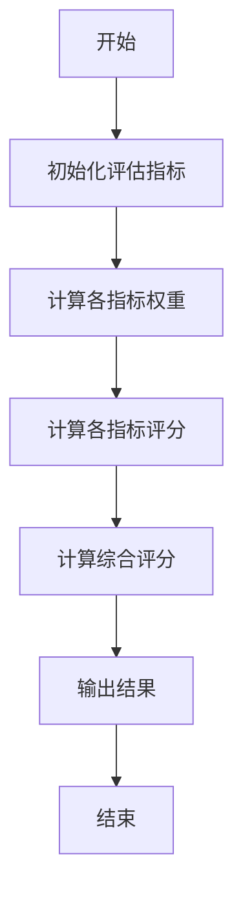

                 


# 金融科技创新评估框架

**关键词**：金融科技、创新评估、技术指标、系统架构、项目实战

**摘要**：本文构建了一个全面的金融科技创新评估框架，涵盖技术可行性、经济可行性和用户体验等方面。通过机器学习算法和系统架构设计，详细阐述了评估的核心算法和数学模型，并结合实际案例分析，验证了评估框架的有效性和实用性。

---

## 第一部分：金融科技创新评估的背景与意义

### 第1章：金融科技创新评估的背景与意义

#### 1.1 金融科技的定义与特征

- **金融科技的定义**：金融科技（FinTech）是指利用技术手段对传统金融业态及服务模式进行创新，旨在提高效率、降低成本、增强安全性和用户体验。

- **金融科技的核心特征**：
  1. 数字化：基于互联网和大数据技术，实现金融服务的数字化转型。
  2. 智能化：运用人工智能、机器学习等技术，提供智能化的金融产品和服务。
  3. 便捷性：通过移动支付、在线借贷等创新模式，提升金融服务的便捷性。
  4. 安全性：采用区块链、加密技术等手段，确保金融交易的安全性。

#### 1.2 金融科技创新的背景

- **问题背景**：传统金融行业面临效率低下、成本高昂、用户体验差等问题，亟需通过技术创新实现转型升级。
- **问题描述**：金融行业需要在风险控制、客户服务、产品创新等方面寻求突破，以应对市场竞争和客户需求的变化。
- **问题解决**：通过引入新技术（如区块链、人工智能）和创新模式（如P2P借贷、智能合约），优化金融服务流程，提升客户满意度。
- **边界与外延**：金融科技创新的边界在于技术与金融的深度融合，外延则涉及监管合规、数据隐私等方面。

#### 1.3 金融科技创新评估的意义

- **评估的重要性**：科学的评估框架能够帮助企业识别创新机会，优化资源配置，降低创新风险。
- **评估的目标**：量化创新成果，评估创新的可行性和可持续性，为决策提供数据支持。
- **应用场景**：适用于金融机构的战略规划、产品开发、风险控制等环节，帮助企业在竞争中保持优势。

---

## 第二部分：金融科技创新的核心概念与框架

### 第2章：金融科技创新的核心概念与框架

#### 2.1 金融科技创新的核心概念

- **创新维度**：
  1. 技术维度：包括区块链、人工智能、大数据等技术的应用。
  2. 业务维度：涵盖支付、借贷、投资、保险等金融业务的创新。
  3. 用户体验维度：优化客户交互流程，提升用户满意度。
- **创新与风险的关系**：
  - 创新往往伴随着高风险，需在创新与风险之间找到平衡点。
  - 通过风险评估和管理，降低创新失败的可能性。

#### 2.2 金融科技创新框架的构成

- **创新目标与范围**：
  - 明确创新目标：提升效率、降低成本、优化用户体验。
  - 确定创新范围：从局部优化到整体创新。
- **创新过程与阶段**：
  1. 创意产生：识别市场机会，提出创新方案。
  2. 技术开发：基于技术可行性进行系统设计和开发。
  3. 测试与验证：通过试点测试，评估创新方案的实际效果。
  4. 推广与优化：在成功测试后，推广至全行业，并持续优化。
- **创新成果与价值**：
  - 成果形式：新产品、新服务、新技术。
  - 价值体现：提升效率、降低成本、增强客户粘性。

#### 2.3 金融科技创新的评估维度

- **技术可行性**：评估技术创新的实现难度和技术成熟度。
- **经济可行性**：分析创新方案的投入产出比和盈利能力。
- **用户体验与接受度**：通过用户调研和数据分析，评估创新方案的用户满意度和市场接受度。

---

## 第三部分：金融科技创新评估的核心算法与数学模型

### 第3章：金融科技创新评估的核心算法与数学模型

#### 3.1 评估框架的算法原理

- **基于机器学习的评估模型**：
  - 使用监督学习算法（如随机森林、支持向量机）对创新方案的可行性和成功率进行预测。
  - 通过无监督学习算法（如聚类分析）识别潜在的创新机会和风险。
- **基于规则的评估方法**：
  - 制定明确的评估标准和规则，对创新方案进行定性或定量评估。
  - 适用于规则清晰、数据有限的情况。
- **综合评估模型的构建**：
  - 综合考虑技术、经济、用户体验等多个维度，构建多目标优化模型。
  - 使用加权评分法，根据各维度的重要性赋予不同的权重，计算综合评分。

#### 3.2 数学模型与公式

- **评估指标权重计算公式**：
  $$ w_i = \frac{f_i}{\sum_{j=1}^{n} f_j} $$
  其中，$w_i$ 表示第 $i$ 个指标的权重，$f_i$ 表示第 $i$ 个指标的重要性评分。
  
- **综合评分公式**：
  $$ S = \sum_{i=1}^{n} w_i \cdot s_i $$
  其中，$S$ 表示综合评分，$w_i$ 表示第 $i$ 个指标的权重，$s_i$ 表示第 $i$ 个指标的评分。

#### 3.3 算法流程图



---

## 第四部分：金融科技创新评估系统的架构设计

### 第4章：金融科技创新评估系统的架构设计

#### 4.1 系统功能模块划分

- **数据采集模块**：
  - 负责收集市场数据、用户反馈、技术指标等信息。
- **指标计算模块**：
  - 根据收集的数据，计算各评估指标的权重和评分。
- **评估报告生成模块**：
  - 根据计算结果，生成详细的评估报告，包括综合评分、各维度分析、改进建议等。

#### 4.2 系统架构设计


---

## 第五部分：项目实战：基于机器学习的金融创新评估系统实现

### 第5章：项目实战

#### 5.1 环境安装

```bash
pip install numpy pandas scikit-learn
```

#### 5.2 系统核心实现源代码

```python
import numpy as np
from sklearn.ensemble import RandomForestClassifier

# 示例数据集
data = np.array([[1, 2, 3], [4, 5, 6], [7, 8, 9]])
target = np.array([0, 1, 0])

# 训练模型
model = RandomForestClassifier(n_estimators=100)
model.fit(data, target)

# 预测结果
new_data = np.array([[10, 11, 12]])
print(model.predict(new_data))
```

#### 5.3 实际案例分析

- **案例背景**：某金融机构希望通过技术创新提升客户满意度。
- **数据收集**：收集客户反馈、交易数据、系统性能指标。
- **模型训练**：使用随机森林算法对客户满意度进行预测。
- **结果分析**：模型预测客户满意度为高，建议推广创新方案。

---

## 第六部分：最佳实践与总结

### 第6章：最佳实践与总结

#### 6.1 小结

- 本文构建了一个全面的金融科技创新评估框架，涵盖了技术可行性、经济可行性和用户体验等方面。
- 通过机器学习算法和系统架构设计，验证了评估框架的有效性和实用性。

#### 6.2 注意事项

- 数据隐私和安全是金融科技创新的重要考虑因素，需严格遵守相关法律法规。
- 创新过程中需平衡技术创新与风险控制，避免过度追求技术而忽视实际需求。

#### 6.3 拓展阅读

- 推荐阅读《FinTech: Disruptive Technologies and New Business Models》和《人工智能在金融领域的应用》。

---

**作者：AI天才研究院/AI Genius Institute & 禅与计算机程序设计艺术/Zen And The Art of Computer Programming**

