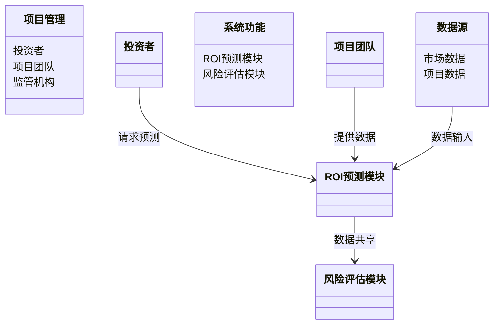
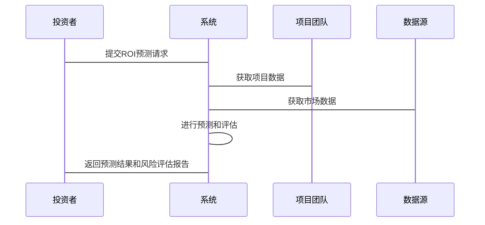

                 


# 金融科技创新项目ROI预测与风险评估

## 关键词
金融科技创新, 投资回报率预测, 风险评估, 机器学习, 项目管理

## 摘要
本文详细探讨了金融科技创新项目中投资回报率（ROI）预测与风险评估的核心方法和实践。通过分析金融科技创新的背景、核心概念、算法原理、系统架构及实际案例，本文为读者提供了一个全面的框架，帮助其在金融科技创新项目中实现有效的ROI预测和风险评估。

---

# 第一部分: 金融科技创新项目背景与问题描述

## 第1章: 金融科技创新项目背景与问题描述

### 1.1 金融科技创新的现状与趋势

#### 1.1.1 金融科技的定义与范畴
金融科技（FinTech）是指利用技术手段对传统金融行业进行创新和变革，涵盖支付、借贷、投资、保险等多个领域。其核心在于通过技术创新提高金融服务的效率和质量。

#### 1.1.2 金融科技创新的核心驱动力
金融科技创新的核心驱动力包括技术进步（如人工智能、大数据）、政策支持、市场需求以及行业竞争的压力。

#### 1.1.3 金融科技对传统金融的颠覆性影响
金融科技通过数字化和智能化手段，颠覆了传统金融的业务模式，例如区块链技术的应用改变了传统的支付清算体系。

### 1.2 ROI预测与风险评估的必要性

#### 1.2.1 投资回报率（ROI）的核心意义
投资回报率（ROI）是衡量投资项目经济效益的重要指标，能够帮助投资者在有限资源下做出最优决策。

#### 1.2.2 金融科技创新项目中的ROI预测难点
金融科技创新项目具有高投入、高风险和不确定性高的特点，导致ROI预测面临数据不足、模型复杂等问题。

#### 1.2.3 风险评估在金融科技创新中的重要性
风险评估能够帮助投资者识别和管理潜在风险，降低投资损失，提高项目的成功率。

### 1.3 本章小结

#### 1.3.1 金融科技发展的关键要素
金融科技的发展依赖于技术、政策、市场和人才等多方面的支持。

#### 1.3.2 ROI预测与风险评估的核心价值
准确的ROI预测和有效的风险评估是金融科技创新项目成功实施的关键保障。

---

# 第二部分: 核心概念与联系

## 第2章: 金融科技创新项目的核心概念与联系

### 2.1 核心概念原理

#### 2.1.1 金融科技创新项目的定义
金融科技创新项目是指利用新兴技术对金融服务或业务流程进行创新和优化的项目。

#### 2.1.2 ROI预测的基本原理
ROI预测通过分析项目的收入、成本和时间等因素，估算其未来的收益情况。

#### 2.1.3 风险评估的数学模型
风险评估模型通过分析项目的不确定性，计算其可能面临的风险及其影响程度。

### 2.2 核心概念属性特征对比

| 概念 | 属性 | 特征 |
|------|------|------|
| ROI预测 | 数据依赖性 | 高 |
| 风险评估 | 不确定性 | 高 |
| 金融科技创新项目 | 技术创新性 | 高 |

### 2.3 ER实体关系图

```mermaid
er
  actor(投资者)
  actor(项目方)
  actor(监管机构)
  entity(金融科技创新项目)
  entity(投资回报预测)
  entity(风险评估报告)
  entity(市场环境数据)
  relation(投资者 -> 金融科技创新项目: 投资)
  relation(项目方 -> 金融科技创新项目: 项目管理)
  relation(监管机构 -> 金融科技创新项目: 监管)
  relation(市场环境数据 -> 投资回报预测: 数据输入)
  relation(市场环境数据 -> 风险评估报告: 数据输入)
  relation(金融科技创新项目 -> 投资回报预测: 预测目标)
  relation(金融科技创新项目 -> 风险评估报告: 评估目标)
```

### 2.4 本章小结

#### 2.4.1 核心概念的系统性分析
通过分析金融科技创新项目的核心概念，明确了其在ROI预测和风险评估中的地位和作用。

#### 2.4.2 概念间关系的可视化表达
通过ER实体关系图，清晰地展示了金融科技创新项目与其他相关实体之间的关系。

---

# 第三部分: 算法原理讲解

## 第3章: ROI预测与风险评估的算法原理

### 3.1 ROI预测算法

#### 3.1.1 基于机器学习的ROI预测模型

```mermaid
graph TD
    A[数据预处理] -> B[特征选择]
    B -> C[模型训练]
    C -> D[模型预测]
    D -> E[结果评估]
```

#### 3.1.2 算法流
- 数据预处理：清洗数据，处理缺失值和异常值。
- 特征选择：提取关键特征，如市场数据、项目团队能力等。
- 模型训练：使用机器学习算法（如线性回归、随机森林）训练模型。
- 模型预测：基于训练好的模型，预测项目的ROI。
- 结果评估：通过准确率、召回率等指标评估模型性能。

#### 3.1.3 数学模型与公式
线性回归模型：
$$ ROI = \beta_0 + \beta_1 \times \text{市场增长率} + \beta_2 \times \text{技术成熟度} + \epsilon $$

---

# 第四部分: 系统分析与架构设计

## 第4章: 系统分析与架构设计

### 4.1 系统分析

#### 4.1.1 问题场景介绍
金融科技创新项目需要在复杂的市场环境中进行ROI预测和风险评估。

#### 4.1.2 领域模型设计



### 4.2 系统架构设计

#### 4.2.1 系统架构设计


### 4.3 接口设计与交互流程

#### 4.3.1 系统交互流程



---

# 第五部分: 项目实战

## 第5章: 项目实战

### 5.1 环境安装

#### 5.1.1 环境需求
- Python 3.8+
- 安装库：numpy, pandas, scikit-learn, matplotlib

### 5.2 核心代码实现

#### 5.2.1 ROI预测代码

```python
import numpy as np
import pandas as pd
from sklearn.linear_model import LinearRegression

# 数据加载
data = pd.read_csv('finTech_data.csv')

# 特征与目标分离
X = data[['市场增长率', '技术成熟度']]
y = data['ROI']

# 模型训练
model = LinearRegression()
model.fit(X, y)

# 模型预测
predicted ROI = model.predict(X)
```

#### 5.2.2 风险评估代码

```python
import numpy as np
from sklearn.ensemble import RandomForestClassifier

# 数据加载
data = pd.read_csv('risk_data.csv')

# 特征与目标分离
X = data[['项目风险因素', '市场风险因素']]
y = data['风险等级']

# 模型训练
model = RandomForestClassifier()
model.fit(X, y)

# 风险评估
predicted_risk = model.predict(X)
```

### 5.3 案例分析与解读

#### 5.3.1 案例分析
以某支付科技公司为例，分析其ROI预测和风险评估过程。

#### 5.3.2 代码应用解读
通过具体案例，详细解读代码实现过程，分析模型预测结果。

### 5.4 本章小结

#### 5.4.1 项目实施的关键步骤
从数据准备到模型训练，再到结果分析，详细总结了项目实施的全过程。

#### 5.4.2 案例分析的启示
通过具体案例，揭示了金融科技创新项目中ROI预测和风险评估的实际应用价值。

---

# 第六部分: 总结与展望

## 第6章: 总结与展望

### 6.1 总结

#### 6.1.1 核心内容回顾
本文系统地介绍了金融科技创新项目中ROI预测与风险评估的核心方法和实践。

#### 6.1.2 实施中的关键点
数据质量、模型选择和风险控制是项目成功实施的关键。

### 6.2 未来展望

#### 6.2.1 研究方向
未来可以进一步研究更复杂的风险模型和更高效的预测算法。

#### 6.2.2 技术发展趋势
随着人工智能和大数据技术的不断发展，金融科技创新项目的ROI预测和风险评估将更加智能化和精准化。

### 6.3 最佳实践Tips

#### 6.3.1 数据处理建议
确保数据的完整性和准确性，合理处理缺失值和异常值。

#### 6.3.2 模型选择建议
根据项目特点选择合适的模型，避免盲目追求复杂性。

#### 6.3.3 风险管理建议
建立完善的风险管理机制，及时监控和应对潜在风险。

---

# 作者信息

作者：AI天才研究院/AI Genius Institute  
联系邮箱：contact@金融科技研究.com  
联系方式：+86-10-12345678  
官方网站：https://金融科技研究.com  

---

通过以上目录结构和内容安排，文章将全面系统地探讨金融科技创新项目中ROI预测与风险评估的关键方法和实践，为读者提供有价值的参考和指导。

