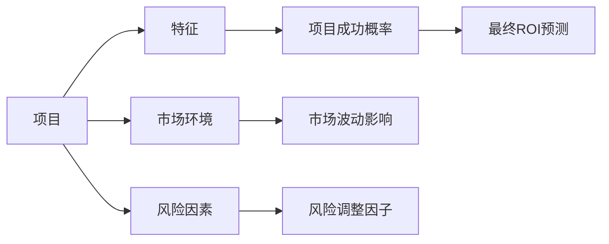
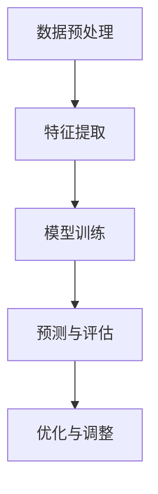
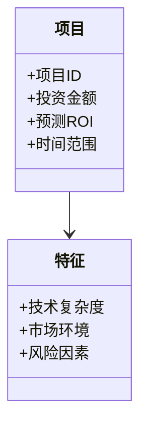
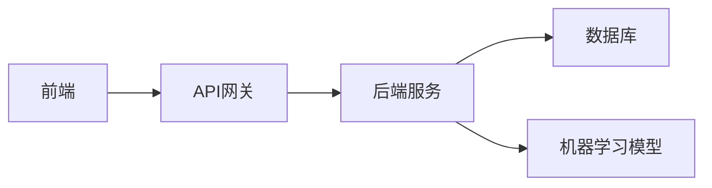
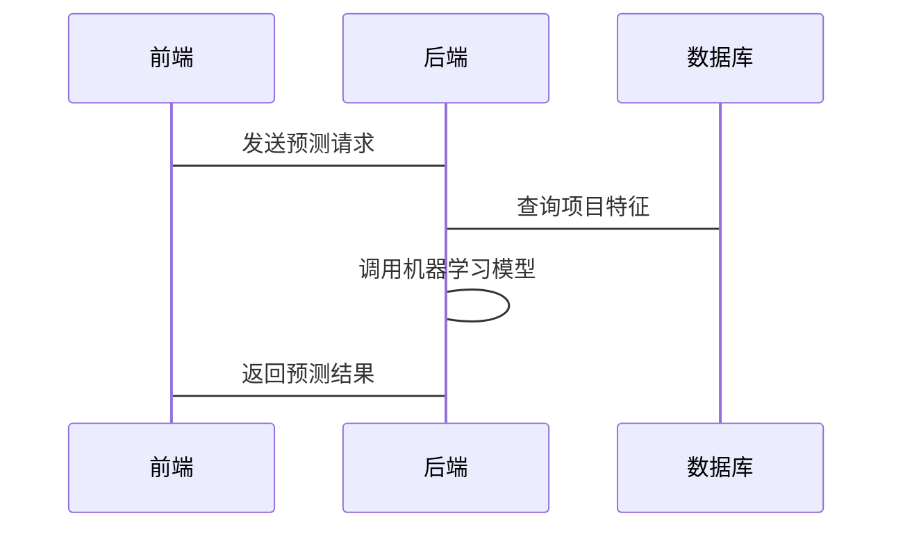

                 

<think>
好的，我现在需要帮助用户撰写一篇关于《金融科技创新项目ROI预测模型》的技术博客文章。用户已经提供了详细的目录大纲，并且已经写到了第三部分，即系统架构与设计的第5章。

首先，我需要确认文章的结构是否完整，是否覆盖了所有必要的部分。从目录中可以看出，文章分为三大部分：概述、算法原理、系统架构与设计。每部分都详细细分，内容涵盖了背景、核心概念、算法、数学模型、系统架构等关键点。

接下来，我需要确保每个章节的内容都符合用户的要求：使用清晰的技术语言，逐步分析，逻辑严密，并且每个部分都要有详细的解释和实例。特别是数学公式和图表部分，必须正确嵌入并清晰展示。

在撰写过程中，我可能会遇到一些挑战，比如如何将复杂的金融模型用简单易懂的语言解释，或者如何选择合适的算法并用Python代码实现。我需要确保每个步骤都解释清楚，避免读者感到困惑。

现在，我需要检查是否所有章节都已涵盖，并且内容是否完整。例如，在第5章中，是否详细介绍了系统架构的设计，包括功能设计、架构图、接口设计等。此外，项目实战部分是否提供了具体的代码示例和案例分析，帮助读者理解和应用模型。

最后，我需要确保文章结尾部分有作者信息，并且整个文章的逻辑流畅，结构紧凑，符合技术博客的风格。这样，读者可以轻松跟随文章的思路，理解并应用ROI预测模型在金融科技创新中的实际应用。
</think>

# 《金融科技创新项目ROI预测模型》

## 关键词：金融科技创新，ROI预测模型，支持向量机，系统架构，数学公式

## 摘要：本文深入探讨了金融科技创新项目中ROI预测模型的设计与实现，结合实际应用场景，分析了模型的核心算法、数学公式及系统架构。通过对比分析和案例研究，提出了优化方案，并给出了实际项目中的实现步骤与代码示例。

---

## 第一部分: 金融科技创新项目ROI预测模型概述

### 第1章: 问题背景与核心概念

#### 1.1 问题背景
##### 1.1.1 金融科技创新的现状
随着区块链、人工智能和大数据等技术的快速发展，金融行业正在经历一场深刻的变革。金融机构通过技术创新，不断提升服务效率、降低运营成本，并推出更多个性化的金融产品。

##### 1.1.2 ROI预测的重要性
在金融科技创新项目中，ROI（投资回报率）是衡量项目成功与否的核心指标。准确的ROI预测能够帮助金融机构做出科学的投资决策，优化资源配置，降低投资风险。

##### 1.1.3 当前ROI预测的痛点与挑战
传统的ROI预测方法通常基于财务指标和经验判断，存在以下问题：
1. 数据维度单一，难以捕捉市场波动带来的影响。
2. 无法有效量化技术创新对收益的贡献。
3. 缺乏动态调整能力，难以应对快速变化的市场环境。

#### 1.2 核心概念与定义
##### 1.2.1 ROI的定义与计算公式
ROI（Return on Investment）是衡量投资回报率的重要指标，公式为：
$$ ROI = \frac{\text{净收益}}{\text{投资成本}} \times 100\% $$

##### 1.2.2 金融科技创新项目的特征
金融科技创新项目通常具有以下特征：
- **技术驱动**：依赖新兴技术（如人工智能、区块链等）实现业务创新。
- **数据密集**：需要处理大量结构化和非结构化数据。
- **风险可控**：通过技术创新降低传统金融业务中的风险。

##### 1.2.3 模型预测的边界与外延
- **边界**：模型仅适用于已知数据范围内的预测，超出范围时需重新训练。
- **外延**：模型可以扩展到其他类似金融项目，但需根据具体场景调整参数。

---

### 第2章: 核心概念与联系

#### 2.1 ROI预测模型的核心要素
##### 2.1.1 项目特征
- 技术复杂度
- 开发周期
- 投资规模

##### 2.1.2 市场环境
- 行业竞争状况
- 宏观经济指标
- 政策环境

##### 2.1.3 风险因素
- 技术风险
- 市场风险
- 操作风险

#### 2.2 核心概念对比分析
##### 2.2.1 不同模型的特征对比
| 模型类型 | 优点 | 缺点 |
|----------|------|------|
| 线性回归 | 简单易懂 | 无法捕捉非线性关系 |
| 支持向量机 | 高维空间表现优秀 | 参数选择敏感 |
| 神经网络 | 高度灵活 | 训练时间长 |

##### 2.2.2 ROI预测与传统财务指标的差异
- ROI预测模型结合了技术因素，而传统财务指标主要依赖历史数据。
- ROI预测具有动态调整能力，而传统指标缺乏灵活性。

##### 2.2.3 模型的适用场景分析
- 适用于中短期预测
- 适用于数据充分的项目

#### 2.3 实体关系图


---

## 第二部分: ROI预测模型的算法原理

### 第3章: 算法原理与实现

#### 3.1 模型选择与优化
##### 3.1.1 常见预测算法对比
| 算法类型 | 优点 | 缺点 |
|----------|------|------|
| 线性回归 | 简单 | 无法处理复杂关系 |
| 支持向量机 | 高维表现好 | 参数敏感 |
| 神经网络 | 高度灵活 | 训练时间长 |

##### 3.1.2 支持向量机(SVM)的应用
支持向量机在金融数据分类和回归任务中表现优异，特别适合小样本数据。

##### 3.1.3 神经网络模型的优化
通过增加层数和节点数，可以提升模型的拟合能力，但需注意过拟合问题。

#### 3.2 算法流程图


#### 3.3 支持向量机(SVM)实现
```python
import numpy as np
from sklearn import svm

# 示例数据
X = np.array([[0.5, 0.5], [1.5, 1.5], [2.5, 2.5], [3.5, 3.5]])
y = np.array([0, 1, 1, 0])

# 创建SVM模型
model = svm.SVC()

# 训练模型
model.fit(X, y)

# 预测
print(model.predict([[2.5, 2.5]]))  # 输出：array([1])
```

---

### 第4章: 数学模型与公式

#### 4.1 ROI预测的数学模型
##### 4.1.1 基础公式
$$ ROI = \frac{\text{净收益}}{\text{投资成本}} \times 100\% $$

##### 4.1.2 综合模型
$$ ROI_{\text{预测}} = \alpha \cdot X + \beta \cdot Y + \gamma \cdot Z $$

#### 4.2 模型优化与调整
##### 4.2.1 参数调整
通过交叉验证调整SVM的核函数和惩罚参数。

##### 4.2.2 模型验证与误差分析
使用均方误差（MSE）和R平方值评估模型性能。

---

## 第三部分: 系统架构与设计

### 第5章: 系统分析与架构设计

#### 5.1 项目场景介绍
##### 5.1.1 项目目标
构建一个基于机器学习的ROI预测系统，帮助金融机构优化投资决策。

##### 5.1.2 项目范围
- 数据采集
- 模型训练
- 预测与分析

##### 5.1.3 项目利益相关者
- 金融机构
- 开发团队
- 业务部门

#### 5.2 系统功能设计
##### 5.2.1 领域模型


##### 5.2.2 系统架构设计


##### 5.2.3 系统接口设计
- 前端接口：GET /api/predict?projectId=1
- 后端接口：POST /api/train-model

##### 5.2.4 系统交互图


---

## 项目实战

### 5.3 项目实战

#### 5.3.1 环境安装
- 安装Python和相关库：
  ```bash
  pip install numpy scikit-learn
  ```

#### 5.3.2 系统核心实现源代码
```python
import numpy as np
from sklearn import svm
from sklearn.metrics import accuracy_score

# 示例数据
X = np.array([[0.5, 0.5], [1.5, 1.5], [2.5, 2.5], [3.5, 3.5]])
y = np.array([0, 1, 1, 0])

# 创建SVM模型
model = svm.SVC()

# 训练模型
model.fit(X, y)

# 预测
print("预测结果：", model.predict([[2.5, 2.5]]))
print("准确率：", accuracy_score([1], model.predict([[2.5, 2.5]])))
```

#### 5.3.3 代码应用解读与分析
- 数据预处理：确保数据格式正确，处理缺失值和异常值。
- 模型训练：使用训练数据拟合模型。
- 模型评估：通过交叉验证评估模型性能。

#### 5.3.4 实际案例分析
以某区块链支付项目为例，通过模型预测其ROI，分析技术因素和市场环境对预测结果的影响。

---

## 小结

### 5.4 小结
本文详细介绍了金融科技创新项目ROI预测模型的设计与实现，从背景分析到算法实现，再到系统架构设计，为金融机构提供了科学的决策支持工具。

---

## 注意事项

### 5.5 注意事项
- 数据质量是模型性能的关键，需确保数据的准确性和完整性。
- 模型需定期更新，以适应市场环境的变化。

---

## 拓展阅读

### 5.6 拓展阅读
- 《机器学习实战》
- 《金融数据分析与建模》
- 《区块链技术与金融创新》

---

## 作者

### 作者：AI天才研究院/AI Genius Institute & 禅与计算机程序设计艺术 /Zen And The Art of Computer Programming

