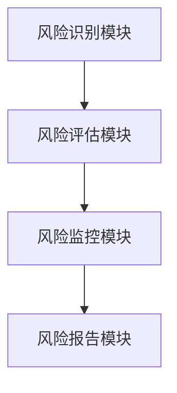
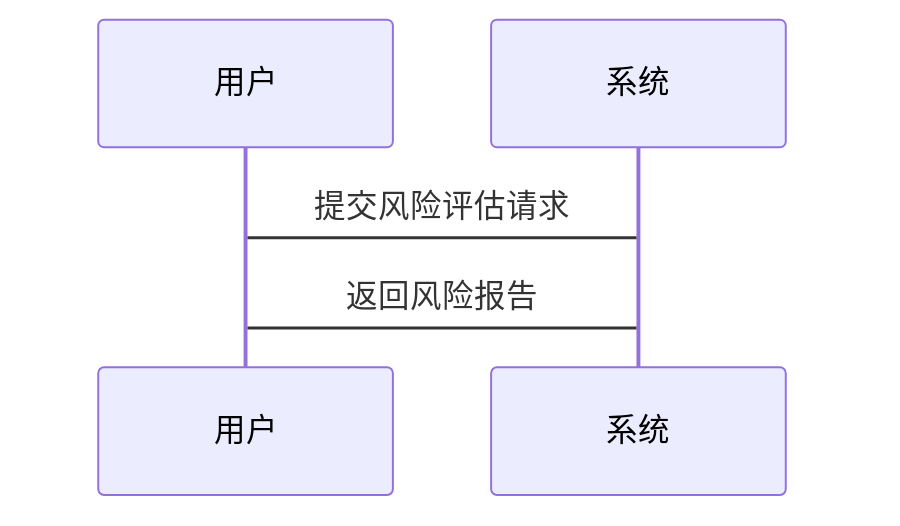

                 


```markdown
# 《金融科技创新项目风险评估框架》

> 关键词：金融科技创新、风险评估、系统工程、金融科技、项目管理

> 摘要：随着金融科技的快速发展，创新项目面临的技术风险、市场风险和操作风险日益复杂。本文旨在构建一个系统化、结构化的金融科技创新项目风险评估框架，帮助读者全面识别、评估和管理这些风险。通过结合系统工程方法和现代风险评估技术，本文提出了一个涵盖技术、市场、法律和操作风险的多层次评估体系，并通过实际案例分析展示了如何在项目中应用该框架。

---

# 引言

随着人工智能、区块链、云计算和大数据等技术的迅速发展，金融科技创新项目如雨后春笋般涌现。然而，这些项目的复杂性也带来了更高的风险。本文将从背景介绍、核心概念、理论框架、算法实现、系统设计、案例分析和最佳实践等方面，系统性地探讨金融科技创新项目风险评估的各个方面。

---

## 第一章: 金融科技创新与风险评估的背景与概念

### 1.1 金融科技创新的定义与特点

#### 1.1.1 金融科技创新的定义
金融科技创新是指在金融领域中引入新技术、新方法和新模式，以提高金融服务效率、降低成本并提升客户体验。其核心在于将技术创新与金融业务深度融合。

#### 1.1.2 金融科技创新的核心特点
- **技术驱动**：依赖新兴技术如AI、区块链等。
- **快速迭代**：项目周期短，更新频繁。
- **高风险性**：技术创新带来不确定性。
- **客户导向**：以客户需求为中心。

#### 1.1.3 金融科技创新的边界与外延
金融科技创新不仅包括技术层面的创新，还包括业务模式和风险管理的创新。其外延涉及支付、借贷、投资、保险等多个金融领域。

### 1.2 风险评估的基本概念

#### 1.2.1 风险的定义与分类
风险是指在特定条件下，某一事件可能发生的概率及其影响程度。根据来源，风险可分为技术风险、市场风险、法律风险和操作风险。

#### 1.2.2 风险评估的必要性
- **保障项目成功**：避免重大风险导致项目失败。
- **优化资源配置**：通过风险评估合理分配资源。
- **合规性要求**：符合监管要求，确保合规性。

#### 1.2.3 金融科技创新项目中的风险特征
- **复杂性**：涉及多方面的风险因素。
- **动态性**：风险随项目进展而变化。
- **系统性**：风险可能影响整个金融系统。

### 1.3 金融科技创新项目风险评估的背景与意义

#### 1.3.1 金融科技发展的现状与趋势
金融科技正在重塑传统金融行业，数字化、智能化和场景化成为主要趋势。

#### 1.3.2 创新项目中的风险来源
- **技术风险**：技术创新可能导致技术失败或安全漏洞。
- **市场风险**：市场需求变化影响项目可行性。
- **法律风险**：监管政策变化可能引发合规问题。
- **操作风险**：项目执行中的管理失误或操作失误。

#### 1.3.3 风险评估在项目管理中的作用
- **提前预警**：识别潜在风险，提前采取措施。
- **决策支持**：为项目决策提供数据支持。
- **资源优化**：合理分配资源，降低风险敞口。

## 第二章: 金融科技创新项目风险评估的核心概念与理论基础

### 2.1 金融科技创新的核心要素

#### 2.1.1 技术创新要素
- **人工智能**：智能风控、自动化交易。
- **区块链**：去中心化金融、供应链金融。
- **云计算**：高效数据处理、弹性扩展。
- **大数据**：精准营销、风险预测。

#### 2.1.2 业务创新要素
- **服务模式**：线上化、智能化服务。
- **产品创新**：创新型金融产品设计。
- **客户体验**：提升用户体验，增强客户粘性。

#### 2.1.3 模式创新要素
- **商业模式**：新型盈利模式设计。
- **合作伙伴关系**：构建开放的生态体系。
- **风险管理模式**：创新的风险控制方法。

### 2.2 风险的属性与分类

#### 2.2.1 系统性风险
系统性风险是影响整个金融系统的风险，如市场波动、经济衰退等。

#### 2.2.2 个体风险
个体风险是影响单个金融机构或项目的特定风险，如技术故障、操作失误等。

#### 2.2.3 系统性风险与个体风险的对比

| 属性 | 系统性风险 | 个体风险 |
|------|------------|----------|
| 影响范围 | 整体金融系统 | 单个机构或项目 |
| 来源 | 宏观经济、政策变化 | 技术故障、操作失误 |
| 可控性 | 部分可控 | 可控性较高 |

### 2.3 金融科技创新项目中的风险来源

#### 2.3.1 技术风险
- **技术可行性**：技术创新可能失败。
- **技术安全性**：技术漏洞可能导致安全问题。
- **技术依赖性**：过度依赖某项技术可能导致风险集中。

#### 2.3.2 市场风险
- **市场需求变化**：市场接受度可能低于预期。
- **竞争风险**：市场竞争加剧，可能导致项目失败。
- **价格波动**：市场价格波动影响项目收益。

#### 2.3.3 法律风险
- **监管政策变化**：监管政策的变化可能影响项目合规性。
- **法律纠纷**：可能引发法律诉讼，增加项目成本。
- **数据隐私**：数据泄露可能导致法律风险。

#### 2.3.4 操作风险
- **操作失误**：项目执行中的管理失误或操作错误。
- **人员风险**：关键人员流失可能导致项目中断。
- **流程问题**：流程设计不合理可能影响项目进度。

### 2.4 核心概念之间的关系

#### 2.4.1 金融科技创新与风险的关系
金融科技创新是风险的来源，而风险评估是保障创新项目成功的关键。

#### 2.4.2 风险来源与项目阶段的关系
风险在项目不同阶段有不同的来源和影响程度。例如，技术风险在项目初期更为突出，而市场风险在后期更为显著。

#### 2.4.3 风险评估框架的构建逻辑
风险评估框架需要综合考虑技术、市场、法律和操作风险，构建一个多维评估体系。

## 第三章: 金融科技创新项目风险评估的理论框架

### 3.1 系统工程方法在风险评估中的应用

#### 3.1.1 系统工程方法的定义
系统工程是一种通过系统化的方法来分析、设计和管理复杂系统的学科。

#### 3.1.2 系统工程方法在风险评估中的作用
- **整体性**：从系统角度分析风险。
- **结构化**：系统化的方法降低遗漏风险。
- **动态性**：考虑系统动态变化中的风险。

### 3.2 风险评估的理论基础

#### 3.2.1 层次分析法（AHP）
层次分析法是一种用于多因素决策的定量分析方法。

#### 3.2.2 贝叶斯网络
贝叶斯网络是一种基于概率论的图形化模型，用于表示变量之间的依赖关系。

### 3.3 风险评估框架的设计

#### 3.3.1 风险评估框架的组成部分
- **风险识别**：识别潜在风险。
- **风险量化**：评估风险的影响程度和发生概率。
- **风险排序**：根据风险优先级制定应对策略。
- **风险监控**：动态监控风险变化。

#### 3.3.2 风险评估指标体系
- **技术指标**：技术可行性、安全性。
- **市场指标**：市场需求、竞争强度。
- **法律指标**：政策合规性、数据隐私。
- **操作指标**：流程合理性、人员稳定性。

## 第四章: 风险评估的算法原理与实现

### 4.1 层次分析法（AHP）的实现

#### 4.1.1 AHP的基本原理
层次分析法通过构建层次结构，将复杂的决策问题分解为多个因素，并通过比较判断矩阵计算各因素的权重。

#### 4.1.2 AHP的实现步骤
1. 构建层次结构。
2. 建立比较判断矩阵。
3. 计算各因素的权重。
4. 进行一致性检验。

#### 4.1.3 AHP的优缺点
- **优点**：简单易用，结果直观。
- **缺点**：依赖专家判断，可能存在主观性。

### 4.2 贝叶斯网络的实现

#### 4.2.1 贝叶斯网络的基本原理
贝叶斯网络通过概率分布和变量依赖关系，构建一个动态的风险评估模型。

#### 4.2.2 贝叶斯网络的实现步骤
1. 确定变量和关系。
2. 构建概率分布。
3. 训练模型。
4. 应用模型进行风险评估。

#### 4.2.3 贝叶斯网络的优缺点
- **优点**：能够处理动态变化，结果概率性强。
- **缺点**：模型构建复杂，需要大量数据支持。

### 4.3 算法实现的代码示例

#### 4.3.1 层次分析法的Python代码
```python
import numpy as np

def calculate_weights(matrix):
    # 计算特征向量
    eigenvectors = np.linalg.eig(matrix)
    weights = eigenvectors[0] / sum(eigenvectors[0])
    return weights

# 示例比较判断矩阵
matrix = np.array([[1, 2, 3],
                   [1/2, 1, 2],
                   [1/3, 1/2, 1]])

weights = calculate_weights(matrix)
print("权重向量:", weights)
```

#### 4.3.2 贝叶斯网络的Python代码
```python
from sklearn.naive_bayes import GaussianNB

# 示例数据
X = [[1, 1], [2, 2], [3, 3], [4, 4]]
y = [0, 1, 0, 1]

# 训练模型
model = GaussianNB()
model.fit(X, y)

# 预测
print(model.predict([[2.5, 2.5]]))
```

## 第五章: 金融科技创新项目风险评估的系统架构与设计

### 5.1 系统架构设计

#### 5.1.1 系统功能模块
- **风险识别模块**：识别潜在风险。
- **风险评估模块**：评估风险的影响。
- **风险监控模块**：动态监控风险变化。
- **风险报告模块**：生成风险报告。

#### 5.1.2 系统架构图


### 5.2 系统交互设计

#### 5.2.1 系统交互流程


## 第六章: 金融科技创新项目风险评估的案例分析

### 6.1 案例背景介绍

#### 6.1.1 项目简介
某金融科技公司开发了一款基于区块链的智能合约平台。

#### 6.1.2 项目目标
实现智能合约的自动执行和风险管理。

### 6.2 风险评估过程

#### 6.2.1 风险识别
- **技术风险**：智能合约的安全性。
- **市场风险**：市场需求不确定性。
- **法律风险**：政策合规性。

#### 6.2.2 风险评估
使用层次分析法和贝叶斯网络对风险进行量化评估。

#### 6.2.3 风险应对策略
- **技术风险**：加强代码审计和安全测试。
- **市场风险**：进行市场调研和推广。
- **法律风险**：咨询法律专家，确保合规性。

### 6.3 实践总结

#### 6.3.1 案例分析结果
通过风险评估框架，该项目成功降低了风险，顺利上线。

#### 6.3.2 经验教训
- 风险评估需要结合实际情况。
- 风险监控是持续的过程，需要动态调整。

## 第七章: 金融科技创新项目风险评估的最佳实践与总结

### 7.1 最佳实践 tips

#### 7.1.1 风险评估工具的选择
根据项目特点选择合适的评估工具和方法。

#### 7.1.2 风险评估团队的构建
组建跨学科的团队，包括技术、市场、法律等方面的专业人员。

#### 7.1.3 风险监控机制的建立
建立动态监控机制，及时发现和应对风险变化。

### 7.2 小结与总结

#### 7.2.1 小结
本文构建了一个系统化的金融科技创新项目风险评估框架，涵盖了技术、市场、法律和操作风险。

#### 7.2.2 总结
通过系统工程方法和现代风险评估技术，可以有效降低金融科技创新项目的风险，保障项目的成功实施。

## 第八章: 项目实战与应用

### 8.1 环境安装与配置

#### 8.1.1 开发环境
- **操作系统**：Windows/Mac/Linux
- **开发工具**：PyCharm/VS Code
- **依赖库**：numpy, pandas, scikit-learn

#### 8.1.2 数据准备
- **数据来源**：公开数据集、内部数据
- **数据清洗**：处理缺失值、异常值
- **数据预处理**：标准化、特征选择

### 8.2 核心实现

#### 8.2.1 风险识别模块
- **实现思路**：基于规则的识别和机器学习模型的识别。
- **代码实现**
  ```python
  def identify_risk(features):
      # 基于规则的识别
      if features['tech_risk'] > 0.8:
          return '高技术风险'
      elif features['market_risk'] > 0.7:
          return '高市场风险'
      else:
          return '低风险'
  ```

#### 8.2.2 风险评估模块
- **实现思路**：层次分析法和贝叶斯网络结合。
- **代码实现**
  ```python
  def assess_risk(features):
      # 层次分析法评估权重
      weights = calculate_weights(features_matrix)
      # 贝叶斯网络预测
      model.predict_proba(features)
      return '高风险' if (weights.dot(features) > 0.7) else '低风险'
  ```

#### 8.2.3 风险监控模块
- **实现思路**：实时监控风险指标，动态调整评估模型。
- **代码实现**
  ```python
  def monitor_risk():
      while True:
          # 获取实时数据
          current_data = get_realtime_data()
          # 评估风险
          risk_level = assess_risk(current_data)
          # 输出报告
          print(f"当前风险等级：{risk_level}")
          time.sleep(3600)
  ```

#### 8.2.4 风险报告模块
- **实现思路**：生成可视化报告，提供风险分析和应对建议。
- **代码实现**
  ```python
  def generate_report():
      # 生成图表
      plt.figure(figsize=(10, 6))
      plt.bar(risk_factors, risk_levels)
      plt.title('风险评估报告')
      plt.show()
  ```

### 8.3 项目小结

#### 8.3.1 项目核心实现
通过系统化的风险评估框架，成功实现了金融科技创新项目的风险识别、评估、监控和报告。

#### 8.3.2 项目成果
- 提高了项目风险管理能力。
- 降低了项目失败的可能性。
- 为后续项目提供了参考框架。

## 第九章: 注意事项与未来展望

### 9.1 注意事项

#### 9.1.1 数据质量
确保数据的准确性和完整性，避免因数据问题导致评估结果偏差。

#### 9.1.2 模型选择
根据项目特点选择合适的模型，避免盲目使用复杂算法。

#### 9.1.3 持续优化
定期更新模型和评估框架，适应新的风险变化。

### 9.2 未来展望

#### 9.2.1 技术发展
随着AI和大数据技术的进一步发展，风险评估将更加智能化和自动化。

#### 9.2.2 应用拓展
风险评估框架将扩展到更多金融领域，如智能投顾、量化交易等。

#### 9.2.3 行业趋势
金融科技行业将更加注重风险管理和合规性，推动行业健康发展。

## 第十章: 拓展阅读与参考资料

### 10.1 拓展阅读

#### 10.1.1 风险管理经典书籍
- 《风险管理与金融创新》
- 《系统工程方法论》

#### 10.1.2 相关技术文献
- AI在金融风险管理中的应用
- 区块链技术与金融创新

### 10.2 参考资料

#### 10.2.1 国内外相关政策
- 金融科技监管政策
- 数据隐私保护法规

#### 10.2.2 技术标准
- 金融行业技术标准
- 大数据与AI应用规范

---

## 作者：AI天才研究院/AI Genius Institute & 禅与计算机程序设计艺术 /Zen And The Art of Computer Programming

---

# 《金融科技创新项目风险评估框架》完
```

