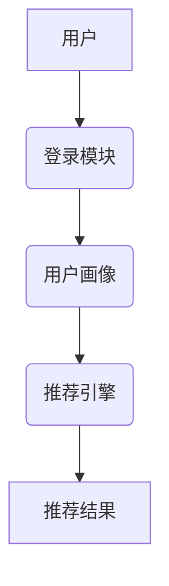

                 


# 《金融科技用户体验优化与个性化定制平台》

---

## 关键词：金融科技、用户体验优化、个性化定制、推荐系统、用户画像、系统架构

---

## 摘要：本文探讨如何通过技术手段优化金融科技领域的用户体验，并构建个性化定制平台。通过分析用户行为、构建用户画像，结合推荐算法，实现精准服务。文章详细阐述系统架构设计、实现方法，并通过案例展示实际应用。

---

## 第1章: 金融科技与用户体验优化的背景

### 1.1 金融科技的发展现状

#### 1.1.1 金融科技的定义与特点

金融科技（FinTech）是指利用技术手段优化或替代传统金融业务的模式。其特点包括数字化、智能化、去中心化和高效性。

#### 1.1.2 金融科技的核心技术驱动

驱动金融科技发展的核心技术包括大数据、人工智能、区块链和云计算等。

#### 1.1.3 金融科技对传统金融的变革

金融科技改变了传统金融的运作方式，提高了效率，降低了成本，并催生了新的金融模式。

---

### 1.2 用户体验优化的重要性

#### 1.2.1 用户体验在金融领域的意义

用户体验优化直接影响用户满意度和忠诚度，进而影响金融机构的竞争力。

#### 1.2.2 用户体验优化的关键因素

包括界面设计、操作流程、响应速度和个性化服务等。

#### 1.2.3 用户体验与金融科技的结合

通过技术手段提升用户体验，增强用户粘性，促进业务增长。

---

### 1.3 个性化定制平台的必要性

#### 1.3.1 个性化服务在金融领域的应用

个性化服务能满足用户的多样化需求，提升用户体验。

#### 1.3.2 平台化服务的优势

平台化服务能够整合资源，提高效率，降低成本。

#### 1.3.3 个性化定制平台的市场价值

满足用户个性化需求，提升金融机构的市场竞争力。

---

## 第2章: 用户行为分析与用户画像构建

### 2.1 用户行为分析的流程

#### 2.1.1 数据收集与处理

通过日志分析、问卷调查等方式收集用户行为数据，并进行清洗和预处理。

#### 2.1.2 行为特征提取

提取用户的行为特征，如操作频率、偏好等。

#### 2.1.3 行为模式识别

通过聚类分析等方法识别用户的行为模式。

---

### 2.2 用户画像的构建方法

#### 2.2.1 数据维度选择

选择用户的基本信息、行为数据、交易记录等作为画像维度。

#### 2.2.2 数据清洗与预处理

对数据进行去重、填补缺失值等处理。

#### 2.2.3 用户画像的可视化

使用图表展示用户画像，便于分析和理解。

---

### 2.3 用户画像与推荐系统的关系

#### 2.3.1 用户画像在推荐系统中的应用

通过用户画像筛选目标用户群体，提升推荐的准确性。

#### 2.3.2 用户画像对推荐效果的影响

详细的用户画像能显著提升推荐系统的个性化能力。

#### 2.3.3 用户画像的动态更新

实时更新用户画像，以反映用户行为的变化。

---

## 第3章: 个性化推荐算法原理

### 3.1 推荐系统的分类

#### 3.1.1 基于协同过滤的推荐

协同过滤分为基于用户的协同过滤和基于物品的协同过滤。

#### 3.1.2 基于内容的推荐

通过分析内容特征进行推荐。

#### 3.1.3 混合推荐

结合多种推荐方法，提升推荐效果。

---

### 3.2 协同过滤算法的实现

#### 3.2.1 基于用户的协同过滤

计算用户之间的相似度，推荐相似用户的偏好。

#### 3.2.2 基于物品的协同过滤

基于物品之间的相似性，推荐相关物品。

#### 3.2.3 协同过滤的优缺点

优点是简单易懂，缺点是计算量大且存在数据稀疏性问题。

---

### 3.3 基于机器学习的推荐算法

#### 3.3.1 基于矩阵分解的推荐

使用矩阵分解技术，如奇异值分解（SVD），降低数据维度。

#### 3.3.2 基于深度学习的推荐

利用神经网络模型，如深度学习推荐系统（DLRM）。

#### 3.3.3 机器学习推荐的数学模型

以矩阵分解为例：

$$
X = U \cdot V^T
$$

其中，$X$ 是用户-物品矩阵，$U$ 和 $V$ 是隐含因子矩阵。

---

## 第4章: 平台架构与技术实现

### 4.1 平台的整体架构设计

#### 4.1.1 分层架构

分为数据层、业务逻辑层和表现层。

#### 4.1.2 微服务架构

将系统功能模块化，便于开发和维护。

#### 4.1.3 混合架构

结合分层和微服务架构，优化系统性能。

---

### 4.2 核心功能实现

#### 4.2.1 数据采集与处理

使用Flume采集用户行为数据，并进行清洗和预处理。

#### 4.2.2 用户画像构建

基于用户数据，构建用户画像，并进行动态更新。

#### 4.2.3 推荐系统实现

选择合适的推荐算法，实现个性化推荐。

---

### 4.3 系统架构设计

#### 4.3.1 系统功能设计

设计系统功能模块，如用户管理、推荐引擎和数据管理。

#### 4.3.2 系统架构图

使用Mermaid图展示系统架构：



#### 4.3.3 接口设计

定义RESTful API接口，如：

- POST /api/login
- GET /api/recommend

---

## 第5章: 项目实战

### 5.1 环境搭建

#### 5.1.1 技术选型

选择Python、Flask、Pandas等工具。

#### 5.1.2 环境配置

安装必要的库和依赖项。

---

### 5.2 核心代码实现

#### 5.2.1 用户行为分析

```python
import pandas as pd
data = pd.read_csv('user_behavior.csv')
print(data.head())
```

#### 5.2.2 用户画像构建

```python
from sklearn.cluster import KMeans
model = KMeans(n_clusters=5)
model.fit(data[['age', 'income']])
```

---

### 5.3 案例分析

#### 5.3.1 实际案例

以某银行为例，分析用户行为并构建推荐系统。

#### 5.3.2 实验结果

展示推荐系统的准确性和用户满意度。

---

## 第6章: 最佳实践与总结

### 6.1 最佳实践 tips

- 数据采集要全面
- 算法选择要合适
- 系统架构要合理

### 6.2 小结

本文详细探讨了金融科技用户体验优化的方法，构建了个性化定制平台，提供了实际案例和代码实现。

### 6.3 注意事项

- 数据隐私保护
- 算法可解释性
- 系统稳定性

### 6.4 拓展阅读

推荐阅读《推荐系统导论》和《FinTech:科技金融》。

---

## 作者：AI天才研究院/AI Genius Institute & 禅与计算机程序设计艺术 /Zen And The Art of Computer Programming

---

**摘要**：本文系统地探讨了金融科技用户体验优化与个性化定制平台的构建方法，结合实际案例和技术实现，为金融科技领域的技术实践提供了深度指导。

