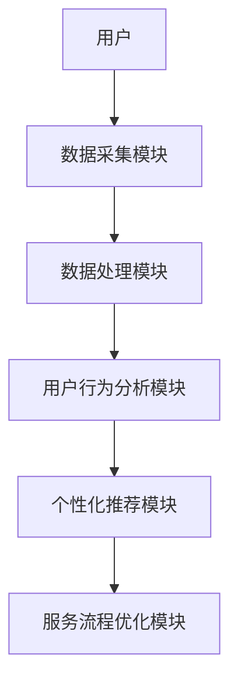

                 


# 金融科技用户体验优化平台

> 关键词：金融科技，用户体验优化，机器学习，系统架构，用户行为分析，个性化推荐

> 摘要：本文详细探讨了金融科技用户体验优化平台的构建与应用，从背景分析、核心概念、算法原理到系统架构设计、项目实战及最佳实践，全面解析了如何通过技术手段提升金融业务的用户体验。

---

# 第1章: 金融科技与用户体验优化平台背景

## 1.1 金融科技的发展与挑战

### 1.1.1 金融科技的定义与现状

金融科技（FinTech）是指通过技术手段优化或替代传统金融业务模式的创新活动。随着人工智能、大数据、区块链等技术的快速发展，金融科技正在重塑金融行业的格局。传统金融机构面临数字化转型的压力，用户需求日益多样化，金融产品的复杂性也在不断增加。

### 1.1.2 用户体验在金融科技中的重要性

用户体验（User Experience, UX）是用户在与金融系统交互过程中所感受到的整体体验。在金融科技领域，用户体验直接关系到用户满意度、忠诚度以及业务转化率。良好的用户体验能够提升金融机构的形象，增强用户粘性，同时降低用户流失率。

### 1.1.3 当前金融科技领域的痛点

- 用户需求多样化与金融产品复杂性的矛盾
- 数据孤岛问题导致的用户信息碎片化
- 传统金融服务流程的低效性
- 用户隐私保护与数据安全的双重挑战

## 1.2 用户体验优化的必要性

### 1.2.1 用户体验对金融业务的影响

用户体验直接影响用户行为，进而影响金融机构的业务表现。例如，复杂的操作流程会导致用户流失，而便捷的服务则能提升用户满意度。

### 1.2.2 金融科技中用户体验的常见问题

- 信息过载导致用户决策困难
- 金融服务流程不够透明
- 用户反馈渠道不畅
- 个性化服务不足

### 1.2.3 优化用户体验的潜在价值

- 提升用户满意度和忠诚度
- 增强品牌竞争力
- 降低用户获取成本
- 提高业务转化率

## 1.3 平台建设的目标与意义

### 1.3.1 平台建设的目标

构建一个能够实时分析用户行为、提供个性化服务、优化服务流程的金融科技用户体验优化平台。

### 1.3.2 平台对金融机构的价值

- 提升用户体验，增强用户粘性
- 降低用户流失率
- 提高业务转化率
- 实现数据驱动的精准营销

### 1.3.3 平台对用户体验的提升作用

- 提供个性化的产品推荐
- 简化操作流程
- 提高服务透明度
- 实现实时反馈与优化

## 1.4 本章小结

本章从金融科技的发展背景出发，分析了用户体验在金融科技中的重要性，总结了当前金融科技领域的痛点，并阐述了用户体验优化平台建设的目标与意义。

---

# 第2章: 用户体验优化平台的核心概念

## 2.1 平台功能模块

### 2.1.1 用户行为分析模块

用户行为分析模块通过收集和分析用户的操作数据，挖掘用户的使用习惯和偏好，为后续的个性化推荐和服务优化提供数据支持。

### 2.1.2 个性化推荐模块

个性化推荐模块基于用户行为分析结果，利用机器学习算法为用户提供个性化的产品推荐和信息服务。

### 2.1.3 服务流程优化模块

服务流程优化模块通过对用户行为数据的分析，优化金融服务流程，减少用户等待时间，提高服务效率。

## 2.2 核心技术与实现原理

### 2.2.1 数据采集与处理技术

数据采集技术包括日志采集、API接口采集等方式，数据处理技术则包括数据清洗、特征提取等步骤。

### 2.2.2 机器学习算法的应用

机器学习算法广泛应用于用户行为预测、推荐系统等领域。例如，基于协同过滤的推荐算法可以通过用户行为数据预测用户的兴趣偏好。

### 2.2.3 用户反馈机制的设计

用户反馈机制通过收集用户的实时反馈，动态调整推荐策略和服务流程，确保用户体验的持续优化。

## 2.3 平台架构与功能模块关系

### 2.3.1 平台整体架构图（Mermaid）



## 2.4 本章小结

本章详细介绍了用户体验优化平台的核心功能模块及其相互关系，阐述了平台实现的关键技术与原理。

---

# 第3章: 用户体验优化平台的算法原理

## 3.1 核心算法介绍

### 3.1.1 基于机器学习的推荐算法

推荐算法是用户体验优化平台的核心算法之一。常用的推荐算法包括协同过滤、基于内容的推荐和混合推荐等。

### 3.1.2 用户行为预测模型

用户行为预测模型通过分析用户的历史行为数据，预测用户的未来行为，从而实现个性化推荐和服务优化。

### 3.1.3 服务流程优化算法

服务流程优化算法通过分析用户行为数据，优化服务流程中的关键环节，提高服务效率和用户满意度。

## 3.2 算法实现流程

### 3.2.1 数据预处理

数据预处理包括数据清洗、特征提取和数据标准化等步骤，确保数据的质量和一致性。

### 3.2.2 模型训练

模型训练是通过机器学习算法对数据进行训练，得到能够预测用户行为或推荐产品的模型。

### 3.2.3 结果输出与优化

结果输出与优化是将模型的预测结果应用到实际业务中，并根据实际效果动态调整模型参数，优化推荐策略。

## 3.3 算法数学模型与公式

### 3.3.1 推荐算法的数学模型

基于协同过滤的推荐算法可以表示为：

$$ \text{推荐评分} = \theta^T x + b $$

其中，$\theta$ 是用户特征向量，$x$ 是物品特征向量，$b$ 是偏置项。

### 3.3.2 用户行为预测的公式

用户行为预测模型可以表示为：

$$ P(y=1|x) = \frac{1}{1 + e^{-wx}} $$

其中，$w$ 是模型权重，$x$ 是输入特征向量。

## 3.4 算法实现代码示例

以下是一个基于协同过滤的推荐算法实现示例：

```python
def recommend_user(user_id, data):
    # 数据预处理
    processed_data = preprocess(data)
    # 模型训练
    model = train_model(processed_data)
    # 推荐结果
    recommendations = model.predict(user_id)
    return recommendations
```

---

# 第4章: 用户体验优化平台的系统架构设计

## 4.1 系统功能设计

### 4.1.1 用户行为分析功能

用户行为分析功能包括数据采集、数据处理和行为分析三个步骤，最终输出用户行为分析报告。

### 4.1.2 个性化推荐功能

个性化推荐功能基于用户行为分析结果，利用机器学习算法为用户推荐个性化的产品和服务。

### 4.1.3 服务流程优化功能

服务流程优化功能通过对用户行为数据的分析，优化金融服务流程，提高服务效率。

## 4.2 系统架构设计

### 4.2.1 系统架构图（Mermaid）


## 4.3 系统接口设计

系统接口设计包括数据接口、用户接口和推荐接口三部分，确保系统各模块之间的数据流转和交互顺畅。

## 4.4 系统交互设计

系统交互设计通过用户与系统的交互流程图（Mermaid序列图），展示用户与系统之间的交互过程。

---

# 第5章: 用户体验优化平台的项目实战

## 5.1 项目背景与目标

项目背景包括当前金融科技领域的痛点和用户需求，项目目标是构建一个能够优化用户体验的金融科技平台。

## 5.2 项目实施步骤

### 5.2.1 需求分析

需求分析包括用户需求调研、功能需求分析和非功能性需求分析。

### 5.2.2 系统设计

系统设计包括功能设计、架构设计和数据设计。

### 5.2.3 系统实现

系统实现包括数据采集、数据处理、模型训练和系统集成。

### 5.2.4 测试与优化

测试与优化包括单元测试、集成测试和性能优化。

## 5.3 项目核心代码实现

### 5.3.1 数据采集与处理代码

```python
def preprocess(data):
    # 数据清洗
    cleaned_data = data.dropna()
    # 特征提取
    features = cleaned_data[['age', 'gender', 'income']]
    return features
```

### 5.3.2 推荐算法实现代码

```python
def train_model(features):
    # 模型训练
    model = LinearRegression()
    model.fit(features, target)
    return model
```

## 5.4 项目实施结果与分析

项目实施结果包括系统性能指标、用户反馈和业务效果三部分，通过数据分析验证系统的优化效果。

---

# 第6章: 用户体验优化平台的最佳实践

## 6.1 关键技术总结

关键技术包括用户行为分析、机器学习推荐算法和系统架构设计。

## 6.2 注意事项与建议

注意事项包括数据隐私保护、模型可解释性、系统稳定性等，建议包括持续优化、用户反馈机制和多团队协作。

## 6.3 未来发展方向

未来发展方向包括AI技术的深度应用、区块链技术的融合、用户隐私保护与数据安全的平衡。

---

# 小结

本文从金融科技的发展背景出发，详细探讨了用户体验优化平台的构建与应用，分析了平台的核心算法与系统架构，并通过项目实战展示了平台的实现过程。通过本文的阐述，读者可以全面了解如何通过技术手段优化金融业务的用户体验。

---

# 作者：AI天才研究院/AI Genius Institute & 禅与计算机程序设计艺术 /Zen And The Art of Computer Programming

