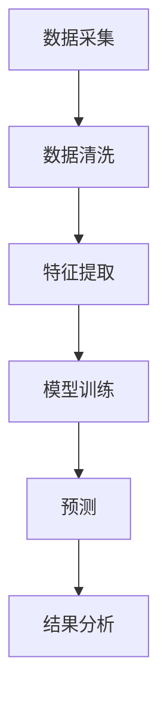
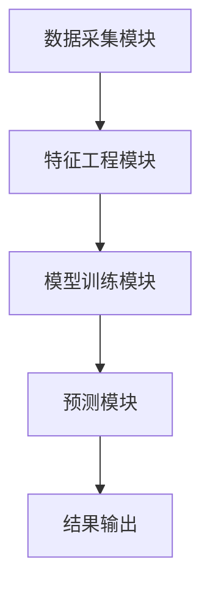

                 


# 金融科技用户行为分析与预测

---

## 关键词
金融科技，用户行为分析，用户行为预测，机器学习，数据挖掘

---

## 摘要
金融科技领域的用户行为分析与预测是通过大数据和机器学习技术，深入挖掘用户在金融场景中的行为特征和模式，从而实现对用户未来行为的精准预测。本文从金融科技的背景出发，系统性地探讨了用户行为分析与预测的核心概念、算法原理、系统架构、项目实战以及最佳实践。通过详细阐述随机森林、支持向量机、神经网络和XGBoost等算法，结合实际案例分析，本文为读者提供了一套完整的用户行为分析与预测的方法论和实践指南。

---

# 第一部分：金融科技用户行为分析与预测的背景与基础

---

## 第1章：金融科技用户行为分析与预测概述

### 1.1 金融科技的概述
金融科技（Financial Technology，简称FinTech）是指通过技术手段优化或替代传统金融活动的模式。它涵盖支付、借贷、投资、保险等多个领域，利用大数据、人工智能、区块链等技术，为用户提供更高效、更智能的金融服务。

#### 1.1.1 金融科技的定义与核心概念
- **定义**：金融科技是指利用技术手段对传统金融业务进行创新和优化，旨在提升金融服务的效率、降低成本、增强用户体验。
- **核心概念**：
  - **大数据分析**：通过海量数据挖掘用户行为特征。
  - **人工智能**：利用机器学习算法预测用户行为。
  - **区块链**：用于金融交易的安全性和透明性。

#### 1.1.2 金融科技的发展历程
金融科技经历了多个阶段：
1. **传统金融阶段**：依赖人工操作，效率低。
2. **互联网金融阶段**：开始引入互联网技术，实现线上支付和交易。
3. **大数据与人工智能阶段**：利用大数据和AI技术进行用户行为分析和预测。
4. **区块链与分布式 ledger阶段**：进一步提升金融交易的透明性和安全性。

#### 1.1.3 金融科技的主要应用场景
- **支付与清算**：通过电子钱包实现快速支付。
- **信贷评估**：利用大数据分析用户的信用风险。
- **投资理财**：通过算法交易优化投资策略。
- **保险理赔**：通过实时数据分析加速理赔流程。

### 1.2 用户行为分析与预测的重要性
在金融科技中，用户行为分析与预测是关键环节，主要用于风险控制、个性化服务和精准营销。

#### 1.2.1 用户行为分析在金融领域的意义
- **风险控制**：通过分析用户行为，识别潜在的欺诈行为。
- **个性化服务**：根据用户行为偏好，提供定制化的产品和服务。
- **精准营销**：通过预测用户行为，优化营销策略。

#### 1.2.2 用户行为预测的典型场景
- **信用评估**：预测用户是否会违约。
- **投资行为预测**：预测用户的投资偏好和交易频率。
- **用户流失预测**：预测用户是否会停止使用金融服务。

#### 1.2.3 金融科技中用户行为分析与预测的边界与外延
- **边界**：仅关注用户在金融场景中的行为，不涉及其他领域。
- **外延**：结合外部数据（如社交媒体数据）丰富用户画像。

### 1.3 本章小结
本章从金融科技的背景出发，阐述了用户行为分析与预测的重要性和应用场景，为后续章节奠定了基础。

---

## 第2章：金融科技用户行为分析与预测的核心概念与联系

### 2.1 用户行为分析与预测的核心概念
用户行为分析与预测涉及多个核心概念，如用户行为模型、特征工程和数据挖掘。

#### 2.1.1 用户行为分析的定义与特征
- **定义**：通过对用户在金融系统中的行为数据进行分析，挖掘其行为特征和模式。
- **特征**：
  - **实时性**：用户行为数据需要实时采集和处理。
  - **多样性**：用户行为可能涉及多个金融场景。

#### 2.1.2 用户行为预测的定义与特征
- **定义**：通过历史数据和机器学习算法，预测用户未来的金融行为。
- **特征**：
  - **预测性**：基于历史数据预测未来行为。
  - **准确性**：预测结果需要高精度以支持决策。

#### 2.1.3 核心概念的对比与联系
通过对比用户行为分析与预测的核心概念，我们可以更好地理解它们的联系和区别。

---

### 2.2 用户行为分析与预测的实体关系图
为了更好地理解用户行为分析与预测的实体关系，我们构建了一个ER实体关系图。

#### 2.2.1 ER实体关系图的构建
以下是ER实体关系图的Mermaid表示：

```mermaid
erDiagram
    customer [用户] {
        id : int
        name : string
        age : int
        gender : string
    }
    transaction [交易] {
        id : int
        amount : float
        time : datetime
        customer_id : int
    }
    prediction [预测结果] {
        id : int
        customer_id : int
        predict_behavior : string
        probability : float
    }
    customer --> transaction : 进行
    customer --> prediction : 关联
    transaction --> prediction : 基于
```

#### 2.2.2 用户行为分析与预测的核心流程
以下是用户行为分析与预测的核心流程：



### 2.3 本章小结
本章通过构建ER实体关系图和核心流程图，详细阐述了用户行为分析与预测的核心概念及其联系。

---

## 第3章：金融科技用户行为分析与预测的算法原理

### 3.1 用户行为分析与预测的主流算法
在金融科技中，常用的用户行为分析与预测算法包括随机森林、支持向量机、神经网络和XGBoost。

#### 3.1.1 随机森林算法
随机森林是一种基于决策树的集成算法，通过随机采样数据和特征，构建多个决策树，最终通过投票或加权的方式得到预测结果。

#### 3.1.2 支持向量机算法
支持向量机是一种监督学习算法，通过构建超平面将数据点分到不同的类别中，适用于小样本和高维数据。

#### 3.1.3 神经网络算法
神经网络是一种模仿人脑结构的算法，通过多层神经元和激活函数，实现对复杂模式的识别和预测。

#### 3.1.4 XGBoost算法
XGBoost是一种基于树的集成算法，通过提升树模型和正则化技术，提升模型的泛化能力和预测精度。

---

### 3.2 算法原理的数学模型与公式
以下是几种算法的数学模型和公式：

#### 3.2.1 随机森林的数学模型
随机森林通过集成多个决策树的结果，最终得到预测结果。其数学模型如下：

$$ E(y) = \sum_{i=1}^{n} w_i(y_i - \hat{y}_i)^2 $$

其中，\( w_i \) 是每个决策树的权重，\( y_i \) 是真实值，\( \hat{y}_i \) 是预测值。

#### 3.2.2 支持向量机的数学模型
支持向量机的目标是最小化以下损失函数：

$$ \text{minimize} \quad \frac{1}{2}||\theta||^2 + C\sum_{i=1}^{n} \xi_i $$

其中，\( \theta \) 是模型参数，\( \xi_i \) 是松弛变量。

#### 3.2.3 神经网络的数学模型
神经网络通过多层感知机和激活函数实现非线性分类。其数学模型如下：

$$ a^{(l)} = \sigma(w^{(l)} a^{(l-1)} + b^{(l)}) $$

其中，\( a^{(l)} \) 是第 \( l \) 层的激活值，\( w^{(l)} \) 是权重矩阵，\( b^{(l)} \) 是偏置项，\( \sigma \) 是激活函数。

#### 3.2.4 XGBoost的数学模型
XGBoost通过提升树模型和正则化技术，其数学模型如下：

$$ \text{损失函数} = \sum_{i=1}^{n} [y_i - \hat{y}_i]^2 + \lambda \sum_{j=1}^{m} \theta_j^2 $$

其中，\( \lambda \) 是正则化参数，\( \theta_j \) 是树模型的参数。

---

### 3.3 本章小结
本章详细介绍了金融科技用户行为分析与预测的主流算法及其数学模型，为后续章节的系统设计和项目实战奠定了基础。

---

## 第4章：金融科技用户行为分析与预测的系统分析与架构设计

### 4.1 问题场景介绍
我们以一个典型的金融场景为例，设计一个用户行为分析与预测系统。

#### 4.1.1 问题描述
假设我们是一家互联网银行，需要预测用户是否会违约。我们需要分析用户的交易记录、信用评分、收入水平等特征，构建一个预测模型。

#### 4.1.2 问题解决
通过用户行为分析与预测，我们可以提前识别潜在的违约用户，降低风险。

#### 4.1.3 边界与外延
系统仅关注用户在银行的金融行为，不涉及其他领域。

---

### 4.2 系统功能设计
系统功能模块包括数据采集、特征工程、模型训练和预测。

#### 4.2.1 数据采集模块
数据采集模块负责从数据库中获取用户行为数据，包括交易记录、用户信息等。

#### 4.2.2 特征工程模块
特征工程模块对原始数据进行清洗、特征提取和特征选择。

#### 4.2.3 模型训练模块
模型训练模块基于特征数据，训练用户行为预测模型。

#### 4.2.4 预测模块
预测模块基于训练好的模型，预测用户未来的金融行为。

---

### 4.3 系统架构设计
以下是系统架构设计的Mermaid表示：



---

### 4.4 本章小结
本章通过系统分析和架构设计，详细阐述了金融科技用户行为分析与预测的系统结构和功能模块。

---

## 第5章：金融科技用户行为分析与预测的项目实战

### 5.1 环境安装与配置
在开始项目之前，我们需要安装以下环境：

#### 5.1.1 安装Python
安装Python 3.8以上版本，并安装以下库：

```bash
pip install numpy pandas scikit-learn xgboost
```

---

#### 5.1.2 安装Jupyter Notebook
安装Jupyter Notebook用于数据可视化和算法实现。

```bash
pip install jupyter
```

---

### 5.2 系统核心实现源代码
以下是项目的核心代码实现：

#### 5.2.1 数据预处理代码
```python
import pandas as pd
import numpy as np

# 读取数据
data = pd.read_csv('user_behavior.csv')

# 数据清洗
data.dropna(inplace=True)
data = pd.get_dummies(data)
```

---

#### 5.2.2 特征工程代码
```python
from sklearn.preprocessing import StandardScaler

# 标准化特征
scaler = StandardScaler()
X = scaler.fit_transform(data.drop('target', axis=1))
y = data['target']
```

---

#### 5.2.3 模型训练代码
```python
from sklearn.ensemble import RandomForestClassifier
from xgboost import XGBClassifier

# 随机森林模型
rf_model = RandomForestClassifier(n_estimators=100, max_depth=5, random_state=42)
rf_model.fit(X, y)

# XGBoost模型
xgb_model = XGBClassifier(n_estimators=100, learning_rate=0.1, max_depth=3, random_state=42)
xgb_model.fit(X, y)
```

---

#### 5.2.4 模型预测代码
```python
# 预测
rf_predictions = rf_model.predict(X_test)
xgb_predictions = xgb_model.predict(X_test)

# 评估
from sklearn.metrics import accuracy_score

print("随机森林准确率:", accuracy_score(y_test, rf_predictions))
print("XGBoost准确率:", accuracy_score(y_test, xgb_predictions))
```

---

### 5.3 项目实战案例分析
通过实际案例分析，我们可以看到用户行为分析与预测在金融科技中的实际应用。

---

## 第6章：金融科技用户行为分析与预测的最佳实践

### 6.1 实战经验总结
在项目实战中，我们总结了以下经验：

#### 6.1.1 数据质量的重要性
数据质量直接影响模型的预测精度。

#### 6.1.2 特征选择的重要性
选择合适的特征可以显著提升模型性能。

#### 6.1.3 模型调优的重要性
通过调参和优化模型性能。

---

### 6.2 注意事项
在实际应用中，需要注意以下几点：

#### 6.2.1 数据隐私与安全
保护用户数据隐私，遵守相关法律法规。

#### 6.2.2 模型的可解释性
确保模型的可解释性，便于后续优化和调整。

#### 6.2.3 模型的实时性
确保模型能够实时处理用户行为数据。

---

### 6.3 拓展阅读
以下是一些推荐的拓展阅读书籍和资源：

- 《Python机器学习实战》
- 《数据挖掘导论》
- 《金融科技：大数据与人工智能的应用》

---

## 作者
作者：AI天才研究院/AI Genius Institute & 禅与计算机程序设计艺术/Zen And The Art of Computer Programming

---

以上是《金融科技用户行为分析与预测》的技术博客文章的完整目录和内容概要。

