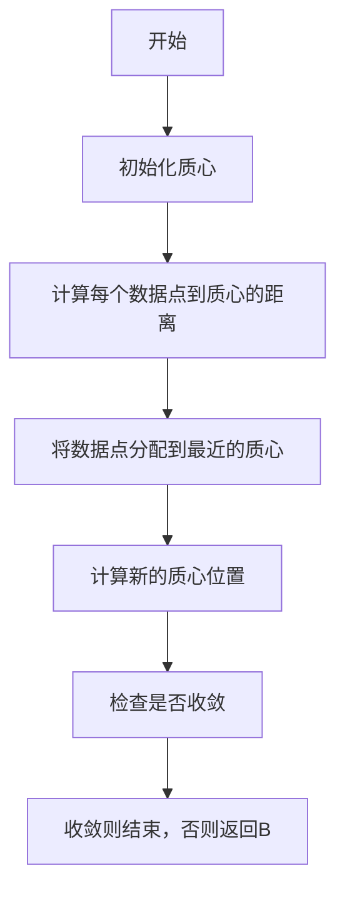
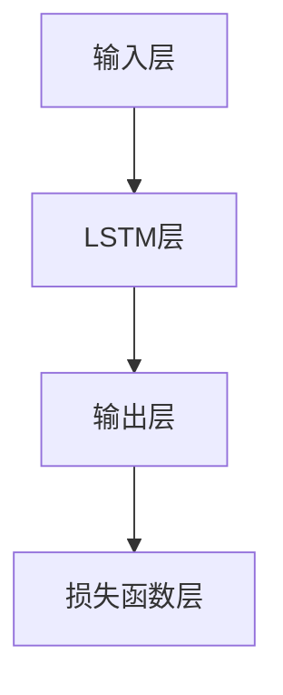
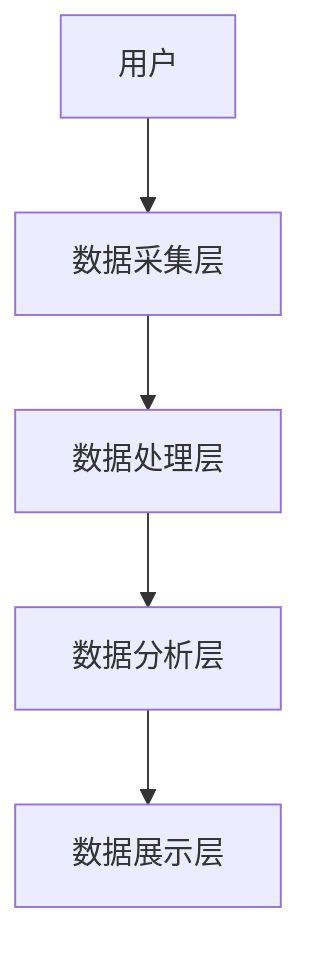

                 

<think>
好，我需要帮用户撰写一篇关于《金融科技用户行为分析平台》的技术博客。用户要求文章结构清晰，内容详细，并且包含多个部分，比如背景、算法、系统设计、项目实战等。首先，我需要理解用户的需求，确保每个部分都覆盖到位。

首先，标题和关键词已经给出，接下来是摘要。摘要需要简明扼要，概括文章的核心内容。我得确保摘要涵盖背景、核心概念、算法、系统设计和实战部分。

接下来是目录结构。根据用户提供的大纲，文章分为六个部分：背景与概念、算法与数学模型、系统分析与架构设计、项目实战、最佳实践和小结。我需要确保每个部分都有足够的细节，并且使用清晰的章节标题。

在背景部分，我需要介绍金融科技的发展现状，用户行为分析的重要性，以及当前面临的问题。这部分要让读者理解为什么需要这个平台，以及它的作用。

核心概念部分，我需要详细解释用户行为分析、用户画像、行为建模等术语，并通过对比表格和ER图来展示概念之间的关系。这部分需要使用Mermaid图，确保结构清晰。

算法部分，我需要选择几个常用的算法，如聚类、分类和时间序列分析，并用Mermaid流程图展示算法步骤。同时，提供Python代码实现，并解释数学模型，如K-means的公式。

系统分析与架构设计部分，我需要介绍项目背景，设计系统功能，使用领域模型类图展示模块关系。系统架构设计部分，用分层架构图展示数据采集、处理、分析和展示部分。接口和交互流程图也需要用Mermaid来展示。

项目实战部分，我需要详细指导环境安装，提供核心代码，并解读代码功能。通过实际案例分析，展示平台的应用，并在小结中总结收获和经验。

最后，在最佳实践部分，我需要给出小结、注意事项和扩展阅读，帮助读者更好地理解和应用所学内容。

整体来看，文章结构清晰，内容丰富，涵盖了从理论到实践的各个方面。我需要确保每个部分都详细展开，使用专业且易懂的语言，帮助读者深入理解金融科技用户行为分析平台的设计与实现。

在撰写过程中，我需要注意语言的逻辑性和连贯性，确保每个章节之间有自然的过渡。同时，使用适当的代码和图表来增强可读性，使文章更具专业性和实用性。

总结来说，我需要系统地按照用户提供的大纲，逐步展开每个部分，确保内容全面、结构合理、语言清晰，最终完成一篇高质量的技术博客。
</think>

# 金融科技用户行为分析平台

## 关键词：
金融科技，用户行为分析，用户画像，行为建模，数据分析，系统架构

## 摘要：
本文深入探讨了金融科技用户行为分析平台的设计与实现，结合实际案例分析，详细介绍了平台的背景、核心概念、算法原理、系统架构以及项目实战。文章内容涵盖从理论到实践的各个方面，帮助读者全面理解用户行为分析在金融科技领域的应用。

---

# 第一部分: 金融科技用户行为分析平台背景与概念

## 第1章: 金融科技用户行为分析平台的背景与问题背景

### 1.1 问题背景
#### 1.1.1 金融科技发展的现状与趋势
金融科技（FinTech）作为金融与科技的结合，近年来发展迅猛。随着移动支付、智能投顾、区块链等技术的普及，金融机构和科技公司都在积极布局金融科技领域。用户行为分析在金融科技中的重要性日益凸显，成为提升用户体验和优化金融服务的关键手段。

#### 1.1.2 用户行为分析在金融科技中的重要性
在金融科技领域，用户行为分析可以帮助金融机构更好地理解用户需求、优化产品设计、提升服务质量。通过分析用户的交易行为、使用习惯和偏好，金融机构可以实现精准营销、风险控制和个性化服务。

#### 1.1.3 当前用户行为分析面临的挑战
当前，用户行为分析在金融科技领域面临以下挑战：
- 数据来源多样且复杂，数据清洗和预处理难度大。
- 用户行为的动态变化，需要实时分析和快速响应。
- 数据隐私和安全问题日益突出，如何在合规的前提下进行分析是一个重要课题。

### 1.2 问题描述
#### 1.2.1 金融科技用户行为分析的核心问题
金融科技用户行为分析的核心问题包括：
- 如何从海量数据中提取有价值的信息？
- 如何构建用户画像并进行行为建模？
- 如何实现用户行为的实时分析和预测？

#### 1.2.2 平台建设的必要性与目标
为了应对上述挑战，建设一个专门的金融科技用户行为分析平台具有重要意义。平台的目标包括：
- 提供用户行为数据的采集、存储和处理功能。
- 支持用户画像的构建和行为建模。
- 实现用户行为的实时分析和预测，并提供可视化展示。

#### 1.2.3 用户行为分析的边界与外延
用户行为分析的边界包括：
- 数据范围：仅限于用户行为相关数据，不涉及其他业务数据。
- 时间范围：主要关注用户在平台上的行为数据。
- 用户范围：仅限于平台用户，不包括线下用户行为。

用户行为分析的外延包括：
- 用户画像的构建。
- 行为预测和推荐系统。
- 用户分群和精准营销。

### 1.3 问题解决
#### 1.3.1 金融科技用户行为分析的解决方案
金融科技用户行为分析的解决方案包括：
- 数据采集：通过日志采集、API接口等方式获取用户行为数据。
- 数据处理：对数据进行清洗、转换和整合，建立统一的数据仓库。
- 数据分析：利用机器学习算法进行用户画像构建和行为建模。
- 数据可视化：通过图表和仪表盘展示分析结果。

#### 1.3.2 平台设计的核心目标与关键问题
平台设计的核心目标是为金融机构提供一个高效、可靠、易用的用户行为分析工具。关键问题包括：
- 数据处理的效率和准确性。
- 模型的可解释性和实用性。
- 系统的扩展性和可维护性。

#### 1.3.3 用户行为分析平台的功能定位与价值
用户行为分析平台的功能定位是为金融机构提供用户行为分析的全套解决方案。其价值体现在：
- 提高用户留存率和活跃度。
- 优化产品设计和服务流程。
- 实现精准营销和个性化服务。

---

## 第2章: 核心概念与概念结构

### 2.1 核心概念
#### 2.1.1 用户行为分析
用户行为分析是指通过对用户在产品或服务中的行为数据进行收集、处理和分析，以理解用户需求、行为模式和偏好。

#### 2.1.2 用户画像
用户画像是基于用户的行为数据和属性数据，构建的一个用户特征的综合描述。用户画像通常包括用户的 demographic（人口统计）和 behavior（行为）特征。

#### 2.1.3 用户行为建模
用户行为建模是指利用机器学习算法，对用户的行为数据进行建模，预测用户的未来行为，如购买行为、 churn行为等。

### 2.2 概念属性特征对比
以下是对用户行为分析、用户画像和行为建模的对比：

| 概念 | 属性 | 特征 |
|------|------|------|
| 用户行为分析 | 数据来源 | 用户行为数据（点击流数据、日志数据） |
|      | 分析目标 | 理解用户行为模式 |
| 用户画像 | 数据来源 | 用户属性数据 + 行为数据 | 
|      | 分析目标 | 描述用户特征，用于精准营销 |
| 行为建模 | 数据来源 | 用户行为数据 | 
|      | 分析目标 | 预测用户行为，如购买、流失 |

### 2.3 ER实体关系图
以下是一个简单的用户行为分析平台的ER实体关系图：

```mermaid
er
  User(user_id, name, age, gender, occupation)
  Session(session_id, start_time, end_time, user_id)
  Action(action_id, action_type, timestamp, session_id)
  Transaction(transaction_id, amount, time, session_id)
  UserBehavior(user_id, session_id, action_id)
```

---

## 第3章: 金融科技用户行为分析平台的核心算法与数学模型

### 3.1 用户行为分析算法概述
用户行为分析常用的算法包括聚类分析、分类算法和时间序列分析。

#### 3.1.1 聚类分析
聚类分析是一种无监督学习算法，用于将用户分成不同的群组。常用算法包括K-means、DBSCAN等。

#### 3.1.2 分类算法
分类算法用于将用户行为分为不同的类别，如 churn预测、购买行为预测等。常用算法包括逻辑回归、决策树、随机森林等。

#### 3.1.3 时间序列分析
时间序列分析用于分析用户行为的时间特征，如用户的活跃周期、行为频率等。常用方法包括ARIMA、LSTM等。

### 3.2 聚类分析
以K-means聚类算法为例，其算法流程如下：



K-means的数学公式如下：
$$
\text{目标函数：} \sum_{i=1}^{k} \sum_{j=1}^{n} (x_j - c_i)^2 \rightarrow \text{最小化}
$$
其中，\(k\) 是聚类数，\(c_i\) 是第 \(i\) 个聚类的质心，\(x_j\) 是数据点。

### 3.3 时间序列分析
以LSTM为例，其网络结构如下：



LSTM的数学公式如下：
$$
f_t = \text{LSTM}(h_{t-1}, x_t)
$$
其中，\(h_{t-1}\) 是前一时刻的状态，\(x_t\) 是当前输入。

---

## 第4章: 金融科技用户行为分析平台的系统分析与架构设计

### 4.1 系统功能设计
用户行为分析平台的功能模块包括：
- 数据采集模块：负责采集用户行为数据。
- 数据处理模块：对数据进行清洗、转换和存储。
- 数据分析模块：实现用户画像和行为建模。
- 数据可视化模块：展示分析结果。

### 4.2 系统架构设计
以下是一个典型的分层架构设计：



### 4.3 接口设计
用户行为分析平台的接口设计包括：
- 数据采集接口：REST API。
- 数据分析接口：提供预定义的分析函数。
- 数据展示接口：提供图表和报表的展示功能。

---

## 第5章: 金融科技用户行为分析平台的项目实战

### 5.1 项目介绍
本项目旨在构建一个用户行为分析平台，实现用户画像和行为建模功能。

### 5.2 核心代码实现
以下是一个用户画像构建的Python代码示例：

```python
import pandas as pd
from sklearn.cluster import KMeans

# 数据加载
df = pd.read_csv('user_behavior.csv')

# 数据预处理
X = df[['age', 'gender', 'occupation']]

# K-means聚类
kmeans = KMeans(n_clusters=3, random_state=42)
kmeans.fit(X)

# 添加聚类结果
df['cluster'] = kmeans.labels_

# 可视化
import matplotlib.pyplot as plt
plt.scatter(df['age'], df['cluster'], c=df['gender'])
plt.xlabel('Age')
plt.ylabel('Cluster')
plt.show()
```

### 5.3 项目小结
通过本项目的实践，我们可以看到用户行为分析平台在金融科技领域的广泛应用。通过聚类分析，我们可以将用户分成不同的群组，从而实现精准营销和个性化服务。

---

## 第6章: 最佳实践与小结

### 6.1 小结
本文详细介绍了金融科技用户行为分析平台的设计与实现，从背景、核心概念、算法、系统架构到项目实战，为读者提供了一个全面的视角。

### 6.2 注意事项
- 数据隐私和安全问题需要高度重视。
- 算法的可解释性和实用性是平台设计的关键。
- 系统的扩展性和可维护性需要在设计阶段充分考虑。

### 6.3 拓展阅读
建议读者进一步阅读以下内容：
- 《用户行为分析实战：从零基础到项目部署》
- 《机器学习在金融科技中的应用》
- 《系统架构设计方法论》

---

# 作者：AI天才研究院/AI Genius Institute & 禅与计算机程序设计艺术 /Zen And The Art of Computer Programming

