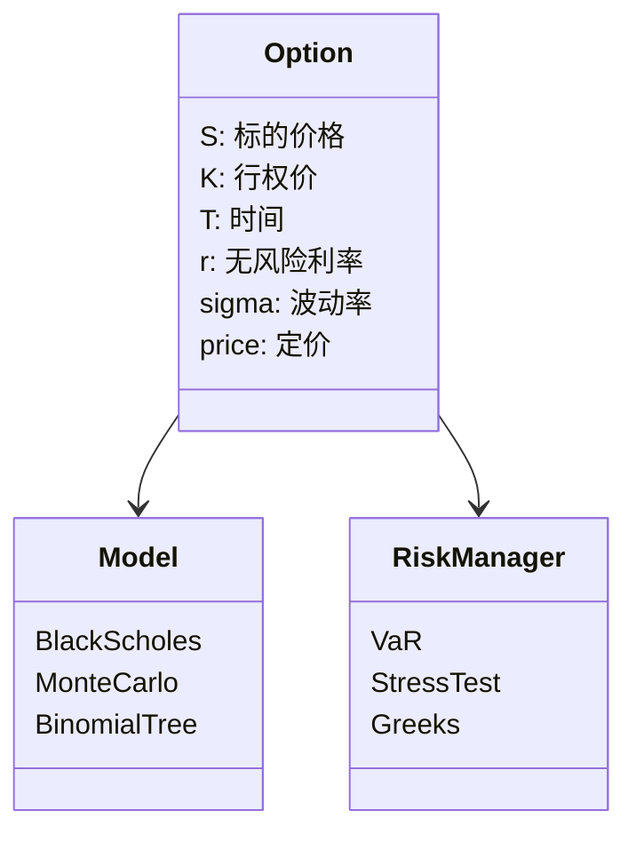
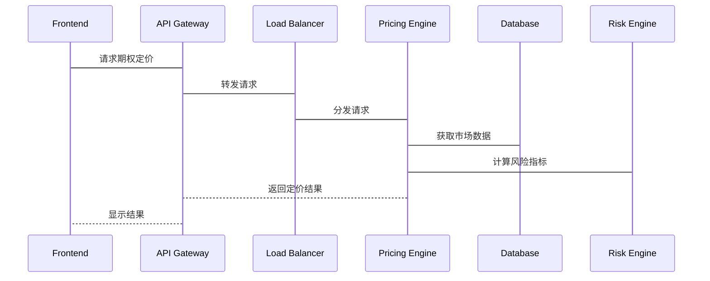

                 


# 《金融衍生品定价模型优化》

> 关键词：金融衍生品定价模型、蒙特卡洛模拟、Black-Scholes模型、数值优化、风险管理

> 摘要：本文系统地探讨了金融衍生品定价模型的优化方法，从基础概念到高级算法，结合数学推导和实际案例，分析了如何通过优化模型提高定价效率和准确性。文章涵盖蒙特卡洛模拟、数值方法、风险管理等多个方面，并提供了详细的代码示例和系统架构设计。

---

# 第1章: 金融衍生品定价模型概述

## 1.1 金融衍生品的基本概念

### 1.1.1 金融衍生品的定义与分类

- 金融衍生品的定义：金融衍生品是基于标的资产（如股票、指数、外汇等）的派生金融工具，其价值依赖于标的资产的价格变动。
- 分类：远期合约、期权、期货、互换等。

### 1.1.2 衍生品市场的基本结构

- 交易所交易与场外交易（OTC）的对比。
- 主要参与者：买方、卖方、清算所、经纪商。

### 1.1.3 衍生品定价的核心问题

- 定价问题：确定衍生品的公平价值。
- 风险管理：对冲价格波动带来的风险。

## 1.2 定价模型的基本原理

### 1.2.1 定价模型的数学基础

- 随机过程与金融建模。
- 无套利定价原理：在无套利市场中，衍生品的定价应确保无 arbitrage机会。

### 1.2.2 无套利定价原理

- 无套利套利的机会：如果存在套利机会，则市场处于非均衡状态。
- 套利定价定理（APT）：资产的预期收益由其风险因子的组合决定。

### 1.2.3 随机过程与金融建模

- Brownian运动：描述资产价格的随机波动。
- 随机微分方程（SDE）：用于建模资产价格的动态过程。

## 1.3 主流定价模型简介

### 1.3.1 Black-Scholes模型

- 欧式期权的定价公式：$$ C = S_0 N(d_1) - K e^{-rT} N(d_2) $$
- 假设：无摩擦市场、波动率恒定、连续复利等。

### 1.3.2 二叉树模型

- 适用于美式期权定价。
- 树状结构模拟资产价格的上行和下行运动。

### 1.3.3蒙特卡洛模拟

- 随机抽样方法：通过模拟大量资产价格路径来估计期权的期望值。
- 适用于高维问题和复杂金融工具。

## 1.4 定价模型的优化目标

### 1.4.1 提高计算效率

- 减少计算时间：优化算法、并行计算。
- 降低计算复杂度：改进数值方法。

### 1.4.2 提升模型准确性

- 改进模型假设：考虑更多市场因素。
- 使用更精确的数值方法：如高阶有限差分法。

### 1.4.3 适应复杂金融工具

- 处理奇异期权：障碍期权、 Asian期权等。
- 处理多资产相关性：使用Copula方法。

## 1.5 本章小结

- 介绍了金融衍生品的基本概念和定价模型的重要性和必要性。
- 概述了主要的定价模型及其应用场景。
- 强调了优化定价模型的目标和意义。

---

# 第2章: 金融衍生品定价模型的数学基础

## 2.1 随机微分方程与金融建模

### 2.1.1 Brownian运动

- 定义：$W_t$ 是标准Brownian运动，满足$E[W_t] = 0$，$Var(W_t) = t$。
- 性质：独立增量、马尔可夫性质。

### 2.1.2 随机微分方程(SDE)

- 标准形式：$$ dS_t = \mu S_t dt + \sigma S_t dW_t $$
- 解的结构：使用Ito引理求解。

### 2.1.3 Ito引理

- 用于计算随机过程的微分：$$ df(S_t, t) = \frac{\partial f}{\partial t} dt + \frac{\partial f}{\partial S} dS_t + \frac{1}{2} \frac{\partial^2 f}{\partial S^2} (dS_t)^2 $$
- 应用：推导Black-Scholes方程。

## 2.2 Black-Scholes模型的数学推导

### 2.2.1 期权定价公式

- 欧式看涨期权定价公式：$$ C = S_0 N(d_1) - K e^{-rT} N(d_2) $$
- 其中，$$ d_1 = \frac{\ln(S_0/K) + (r + \sigma^2/2)T}{\sigma \sqrt{T}} $$
$$ d_2 = d_1 - \sigma \sqrt{T} $$

### 2.2.2 Greeks参数的计算

- Delta：$$ \Delta = N(d_1) $$
- Gamma：$$ \Gamma = \frac{N'(d_1)}{S_0 \sigma \sqrt{T}} $$
- Vega：$$ \nu = S_0 \sigma N'(d_1) \sqrt{T} $$

### 2.2.3 模型假设与限制

- 无股息资产假设。
- 无交易成本和税收。
- 波动率恒定。

## 2.3蒙特卡洛模拟的数学原理

### 2.3.1 随机数生成

- 均匀分布随机数生成：使用伪随机数生成器。
- 正态分布随机数：利用Box-Muller方法转换。

### 2.3.2 金融路径模拟

- 资产价格模拟：使用SDE生成路径。
- 模拟步骤：时间步进、路径生成、期权 payoff 计算。

### 2.3.3 期权定价应用

- 模拟大量路径：计算 payoff 的期望值。
- 计算期权价格：$$ C = e^{-rT} E[e^{rT} payoff] $$

## 2.4 数值方法在定价中的应用

### 2.4.1 二叉树模型的构建

- 树节点计算：$$ u = e^{\sigma \sqrt{\Delta t}} $$，$$ d = 1/u $$
- 股票价格在上行和下行的概率：$$ p = \frac{e^{r \Delta t} - d}{u - d} $$

### 2.4.2 差分方程的求解

- 时间步进法：显式、隐式、交替方向隐式（ADI）方法。
- 空间离散化：有限差分法。

### 2.4.3 高维问题的数值解法

- 多资产期权：使用Fourier变换或蒙特卡洛方法。
- 信用衍生品：考虑信用风险因素。

## 2.5 本章小结

- 推导了Black-Scholes模型的数学基础。
- 介绍了蒙特卡洛模拟的数学原理及其应用。
- 讨论了数值方法在金融定价中的重要性。

---

# 第3章: 金融衍生品定价模型的数值方法

## 3.1蒙特卡洛模拟的实现

### 3.1.1 随机数生成算法

- 均匀分布：使用线性同余生成器。
- 正态分布：Box-Muller方法。

### 3.1.2 金融路径模拟

- 资产价格模拟：使用SDE生成路径。
- 路径生成步骤：时间步进、随机数生成、价格计算。

### 3.1.3 期权定价应用

- 计算 payoff 的期望值：$$ C = e^{-rT} \times \text{平均 payoff} $$

### 3.1.4 代码示例

```python
import numpy as np
def monte_carlo_option Pricing(S0, K, T, r, sigma, n_paths):
    np.random.seed(42)
    W = np.random.randn(n_paths)
    S = S0 * np.exp((r - 0.5*sigma**2)*T + sigma*np.sqrt(T)*W)
    payoff = np.maximum(S - K, 0)
    C = np.mean(payoff) * np.exp(-r*T)
    return C
```

## 3.2 二叉树模型的实现

### 3.2.1 树的构建与节点计算

- 计算u和d：$$ u = e^{\sigma \sqrt{\Delta t}} $$，$$ d = 1/u $$
- 计算概率p：$$ p = \frac{e^{r \Delta t} - d}{u - d} $$

### 3.2.2 期权价格的回溯计算

- 计算每层节点的期权价格：从到期日回溯到当前时间。
- 递归公式：$$ C = e^{-r \Delta t} \times p \times C_u + (1-p) \times C_d $$

### 3.2.3 模型参数的敏感性分析

- 分析波动率、时间和波动率对期权价格的影响。

## 3.3 差分方法的实现

### 3.3.1 时间步进法

- 显式方法：直接计算下一个时间点的值。
- 隐式方法：求解方程组。

### 3.3.2 空间离散化

- 有限差分法：将连续的问题离散化到网格中。

### 3.3.3 方程求解与收敛性分析

- 稳定性和收敛性：确保数值解准确反映真实解。

## 3.4 高维问题的数值解法

### 3.4.1 交替方向隐式方法(ADI)

- 适用于二维或高维问题。
- 分解计算步骤，提高计算效率。

### 3.4.2 Fourier变换方法

- 用于计算期权价格的解析解。
- 使用Fourier变换处理无限维问题。

### 3.4.3 深度学习在高维问题中的应用

- 使用神经网络近似期权定价问题。
- 训练神经网络拟合定价函数。

## 3.5 本章小结

- 介绍了蒙特卡洛模拟和二叉树模型的具体实现。
- 讨论了差分方法和高维问题的数值解法。
- 提供了代码示例和实际应用中的注意事项。

---

# 第4章: 金融衍生品定价模型的优化方法

## 4.1 参数优化的数学基础

### 4.1.1 优化问题的定义

- 目标函数：最大化或最小化某个指标。
- 约束条件：模型参数的限制。

### 4.1.2 无约束优化方法

- 梯度下降法：使用导数寻找最优解。
- 牛顿法：利用二阶导数加速收敛。

### 4.1.3 有约束优化方法

- 内点法：处理不等式约束。
- 切线法：处理等式约束。

## 4.2蒙特卡洛模拟的优化

### 4.2.1 减少方差的方法

- 重要性抽样：提高关键区域的采样密度。
- 分层抽样：将问题分成多个层次进行抽样。

### 4.2.2 平行计算

- 并行生成随机数：利用多核处理器加速计算。
- 分布式计算：在分布式系统中并行处理。

## 4.3 二叉树模型的优化

### 4.3.1 时间复杂度优化

- 优化循环结构：减少不必要的计算。
- 使用向量化操作：提高计算效率。

### 4.3.2 空间复杂度优化

- 压缩存储：减少内存占用。
- 动态调整网格：根据需要调整计算精度。

## 4.4 数值方法的优化

### 4.4.1 高阶差分方法

- 使用更高阶的差分方法：提高计算精度。
- 处理边界条件：减少误差。

### 4.4.2 预处理技术

- 共轭梯度法：处理线性系统。
- 多重网格法：加速收敛。

## 4.5 本章小结

- 推讨了参数优化、蒙特卡洛模拟和二叉树模型的优化方法。
- 讨论了数值方法的优化策略。
- 提供了优化方法的具体实现和应用案例。

---

# 第5章: 风险管理与定价模型优化

## 5.1 风险管理的重要性

### 5.1.1 风险的定义与分类

- 市场风险：资产价格波动带来的损失。
- 信用风险：交易对手违约的风险。
- 流动性风险：难以迅速变现的风险。

### 5.1.2 风险管理的目标

- 识别、衡量和控制风险。
- 确保金融系统的稳定性。

## 5.2 定价模型在风险管理中的应用

### 5.2.1 压力测试

- 模拟极端市场条件下的期权价格。
- 评估模型在极端情况下的表现。

### 5.2.2 风险价值（VaR）

- 定义：在给定置信水平下，可能的最大损失。
- 计算方法：历史模拟法、蒙特卡洛模拟、方差-协方差法。

## 5.3 定价模型的市场风险

### 5.3.1 市场风险的来源

- 标的资产价格波动。
- 利率变化。
- 波动率变化。

### 5.3.2 定价模型对市场风险的敏感性

- Delta：资产价格变动对期权价格的影响。
- Vega：波动率变动对期权价格的影响。

## 5.4 优化定价模型以降低市场风险

### 5.4.1 使用更精确的数值方法

- 改进蒙特卡洛模拟的方差缩减技术。
- 使用更高阶的差分方法。

### 5.4.2 结合实时市场数据

- 动态调整模型参数。
- 实时监控风险指标。

## 5.5 本章小结

- 探讨了风险管理在金融衍生品定价中的重要性。
- 讨论了定价模型在风险管理和市场风险中的应用。
- 提供了优化定价模型以降低市场风险的具体方法。

---

# 第6章: 金融衍生品定价模型的系统架构与实现

## 6.1 问题场景介绍

### 6.1.1 系统需求

- 高效计算：处理大量期权定价请求。
- 实时监控：实时更新市场数据和风险指标。
- 可扩展性：支持多资产、多市场环境。

### 6.1.2 系统目标

- 提供准确的期权定价服务。
- 提供实时的风险管理功能。
- 支持高效的交易和结算。

## 6.2 系统功能设计

### 6.2.1 领域模型（mermaid 类图）



### 6.2.2 系统架构设计（mermaid架构图）


### 6.2.3 系统接口设计

- API接口：提供给前端或外部系统的接口。
- 数据接口：与市场数据源和数据库交互。

### 6.2.4 系统交互（mermaid序列图）



## 6.3 项目实战

### 6.3.1 环境安装

- 安装Python和必要的库：NumPy、SciPy、Matplotlib、Pandas。

### 6.3.2 核心实现源代码

```python
import numpy as np
from scipy.stats import norm

def black_scholes(S, K, T, r, sigma):
    d1 = (np.log(S/K) + (r + 0.5*sigma**2)*T) / (sigma*np.sqrt(T))
    d2 = d1 - sigma*np.sqrt(T)
    C = S*norm.cdf(d1) - K*np.exp(-r*T)*norm.cdf(d2)
    return C

def monte_carlo(S0, K, T, r, sigma, n_paths):
    np.random.seed(42)
    W = np.random.randn(n_paths)
    S = S0 * np.exp((r - 0.5*sigma**2)*T + sigma*np.sqrt(T)*W)
    payoff = np.maximum(S - K, 0)
    C = np.mean(payoff) * np.exp(-r*T)
    return C

# 示例：计算一个看涨期权的价格
S0 = 100
K = 105
T = 1
r = 0.05
sigma = 0.2
n_paths = 100000

bs_price = black_scholes(S0, K, T, r, sigma)
mc_price = monte_carlo(S0, K, T, r, sigma, n_paths)
print(f"Black-Scholes价格：{bs_price}")
print(f"蒙特卡洛模拟价格：{mc_price}")
```

### 6.3.3 代码应用解读与分析

- Black-Scholes模型：解析解，计算速度快但假设严格。
-蒙特卡洛模拟：计算时间较长但适用于复杂情况。

### 6.3.4 实际案例分析

- 示例分析：比较Black-Scholes和蒙特卡洛模拟的结果。
- 讨论模型假设的合理性。

## 6.4 项目小结

- 展示了系统架构设计和核心代码实现。
- 分析了不同定价模型的优缺点。
- 提供了实际案例分析和代码解读。

---

# 第7章: 最佳实践与未来展望

## 7.1 最佳实践 tips

### 7.1.1 模型选择

- 根据具体需求选择合适的模型。
- 结合实际市场数据验证模型的准确性。

### 7.1.2 参数校准

- 使用实证数据校准模型参数。
- 考虑模型的稳健性和适用性。

### 7.1.3 计算效率优化

- 并行计算：利用多核处理器加速计算。
- 算法优化：选择高效数值方法。

## 7.2 小结

- 总结了金融衍生品定价模型优化的核心内容。
- 强调了模型选择和参数校准的重要性。

## 7.3 注意事项

- 模型假设的局限性：Black-Scholes模型假设无股息资产、波动率恒定等。
- 市场数据的波动性：影响模型的准确性和稳定性。
- 计算资源的限制：影响计算效率和模型复杂度。

## 7.4 拓展阅读

- 推荐阅读书籍和论文：Stochastic Calculus for Finance I和II。
- 参考文献：蒙特卡洛方法在金融中的应用、数值方法在期权定价中的应用。

---

# 作者：AI天才研究院/AI Genius Institute & 禅与计算机程序设计艺术 /Zen And The Art of Computer Programming

