                 


# 《金融衍生品组合风险分析工具》

> 关键词：金融衍生品、风险分析、组合风险、VaR、CVaR、蒙特卡洛模拟

> 摘要：本文深入探讨了金融衍生品组合风险分析工具的开发与应用。通过分析组合风险的核心概念、数学模型和算法原理，结合实际案例，展示了如何利用蒙特卡洛模拟、方差-协方差矩阵等方法进行风险评估，并提出了系统化的解决方案。本文旨在为金融从业者和软件开发人员提供一套实用的风险分析工具，帮助他们在复杂的金融市场中做出明智的投资决策。

---

# 第一部分: 金融衍生品组合风险分析工具概述

---

## 第1章: 金融衍生品与风险分析概述

### 1.1 金融衍生品的基本概念

#### 1.1.1 金融衍生品的定义
金融衍生品是一种金融合约，其价值取决于基础资产（如股票、债券、商品等）的价格波动。常见的金融衍生品包括期权、期货、掉期和互换等。

#### 1.1.2 金融衍生品的分类
金融衍生品可以分为以下几类：
1. **期权**：买方有权在特定时间内以固定价格购买或出售标的资产。
2. **期货**：双方约定在未来某一特定时间以预定价格买卖标的资产。
3. **掉期**：双方约定在未来某一特定时间交换资产或现金流。
4. **互换**：双方约定在未来某一特定时间交换不同资产或现金流。

#### 1.1.3 金融衍生品的市场现状
近年来，金融衍生品市场迅速发展，成为现代金融市场的重要组成部分。然而，金融衍生品的复杂性和杠杆效应也带来了较高的风险，尤其是当多个衍生品组合在一起时，风险分析变得尤为重要。

---

### 1.2 风险分析的重要性

#### 1.2.1 风险分析的基本概念
风险分析是评估和管理投资组合中潜在损失的过程。它旨在识别和量化可能影响投资组合价值的各种风险因素，如市场风险、信用风险、流动性风险等。

#### 1.2.2 风险分析在金融衍生品中的应用
在金融衍生品中，风险分析主要用于评估单个衍生品和组合衍生品的潜在损失。通过风险分析，投资者可以更好地理解其投资组合的潜在风险，并采取相应的风险管理策略。

#### 1.2.3 风险分析的必要性
随着金融市场的波动性增加，投资者需要更加精确地评估和管理风险。金融衍生品的复杂性使得传统的风险管理方法难以应对，因此需要开发专门的风险分析工具来解决这一问题。

---

### 1.3 金融衍生品组合风险分析的必要性

#### 1.3.1 组合风险的概念
组合风险是指投资组合中多个资产或金融工具的综合风险。与单个资产的风险相比，组合风险考虑了资产之间的相互作用和相关性。

#### 1.3.2 组合风险分析的挑战
组合风险分析的挑战主要在于金融衍生品的非线性特性、高维度数据和复杂性。传统的线性模型难以准确捕捉衍生品组合的风险。

#### 1.3.3 组合风险分析工具的作用
组合风险分析工具通过整合数学模型和算法，帮助投资者量化和管理金融衍生品组合的风险。这些工具可以提供实时风险评估、情景分析和压力测试功能，帮助投资者做出更明智的投资决策。

---

### 1.4 本章小结
本章介绍了金融衍生品的基本概念、风险分析的重要性以及组合风险分析的必要性。通过这些内容，读者可以理解为什么需要开发专门的金融衍生品组合风险分析工具。

---

## 第2章: 金融衍生品组合风险分析的核心概念

---

### 2.1 风险分析的基本原理

#### 2.1.1 风险的来源与分类
风险的来源可以是市场波动、信用违约、流动性不足等。根据来源，风险可以分为市场风险、信用风险、操作风险和流动性风险等。

#### 2.1.2 风险分析的数学模型
风险分析通常基于统计学和概率论，常用的数学模型包括方差-协方差矩阵、VaR（Value at Risk）和CVaR（Conditional Value at Risk）等。

#### 2.1.3 风险分析的步骤
1. **数据收集**：收集金融衍生品的价格、波动率等数据。
2. **模型选择**：选择合适的数学模型进行风险分析。
3. **参数估计**：估计模型的参数。
4. **风险评估**：计算投资组合的风险值。
5. **结果解读**：根据结果制定风险管理策略。

---

### 2.2 金融衍生品组合风险的特殊性

#### 2.2.1 组合风险的叠加效应
金融衍生品组合的风险不仅仅是单个衍生品风险的简单相加，还需要考虑资产之间的相关性和非线性关系。

#### 2.2.2 组合风险的非线性特征
金融衍生品的收益与风险通常是非线性的，尤其是在波动率较高的市场环境下。

#### 2.2.3 组合风险的动态变化
金融市场是动态变化的，组合风险也会随着市场环境的变化而变化，因此需要实时监控和调整。

---

### 2.3 风险分析的核心工具

#### 2.3.1 方差-协方差矩阵
方差-协方差矩阵用于描述资产之间的相关性和波动性。矩阵中的元素表示资产之间的协方差，对角线上的元素表示资产的方差。

#### 2.3.2 蒙特卡洛模拟
蒙特卡洛模拟是一种通过随机抽样来模拟复杂系统行为的方法。在金融衍生品风险分析中，蒙特卡洛模拟可以用来模拟市场价格的变化，评估投资组合的风险。

#### 2.3.3 压力测试
压力测试是一种极端情况下的风险评估方法。它通过模拟市场崩盘、经济衰退等极端情况，评估投资组合在这些情况下的表现。

---

### 2.4 本章小结
本章重点介绍了风险分析的基本原理、金融衍生品组合风险的特殊性以及风险分析的核心工具。这些内容为后续的算法和系统设计奠定了基础。

---

## 第3章: 金融衍生品组合风险分析的算法与数学模型

---

### 3.1 方差-协方差矩阵的构建

#### 3.1.1 方差-协方差矩阵的定义
方差-协方差矩阵是一个二维数组，其中每个元素表示两个资产之间的协方差。对角线上的元素表示资产自身的方差。

#### 3.1.2 方差-协方差矩阵的计算
方差-协方差矩阵的计算通常基于历史数据，通过计算资产收益率的协方差矩阵得到。

#### 3.1.3 方差-协方差矩阵的应用
方差-协方差矩阵可以用于计算投资组合的 VaR 和 CVaR，评估组合风险。

---

### 3.2 蒙特卡洛模拟的原理

#### 3.2.1 蒙特卡洛模拟的基本概念
蒙特卡洛模拟是一种基于随机数的模拟方法，广泛应用于金融、物理、工程等领域。

#### 3.2.2 蒙特卡洛模拟的步骤
1. **定义模型**：确定模拟的数学模型和参数。
2. **生成随机数**：通过随机数生成器生成符合模型的随机数。
3. **模拟过程**：根据随机数模拟系统的运行。
4. **计算结果**：根据模拟结果计算风险指标。

#### 3.2.3 蒙特卡洛模拟的实现
以下是一个简单的蒙特卡洛模拟的 Python 实现：

```python
import numpy as np
import matplotlib.pyplot as plt

# 随机数生成
np.random.seed(42)
n = 1000
mu = 0
sigma = 1
x = np.random.normal(mu, sigma, n)

# 绘制直方图
plt.hist(x, bins=20, alpha=0.7)
plt.xlabel('Value')
plt.ylabel('Frequency')
plt.title('Monte Carlo Simulation: Normal Distribution')
plt.show()
```

---

### 3.3 压力测试的数学模型

#### 3.3.1 压力测试的定义
压力测试是一种极端情况下的风险评估方法，用于评估投资组合在市场崩盘、经济衰退等极端情况下的表现。

#### 3.3.2 压力测试的实现方法
压力测试可以通过情景分析和历史模拟两种方法实现。情景分析基于假设的极端市场情况，而历史模拟则基于历史市场数据。

#### 3.3.3 压力测试的数学公式
压力测试通常通过以下公式计算投资组合的潜在损失：

$$ \text{潜在损失} = \text{投资组合价值} \times (1 - \text{压力情景下的资产回报}) $$

---

### 3.4 本章小结
本章详细介绍了方差-协方差矩阵、蒙特卡洛模拟和压力测试的原理和实现方法，为后续的系统设计提供了算法基础。

---

## 第4章: 金融衍生品组合风险分析的系统架构

---

### 4.1 问题场景介绍

#### 4.1.1 问题背景
金融衍生品组合风险分析需要考虑多个衍生品的组合风险，传统的风险管理方法难以应对复杂性。

#### 4.1.2 问题描述
如何开发一个高效、准确的金融衍生品组合风险分析工具，帮助投资者评估和管理风险。

#### 4.1.3 问题解决
通过系统化的架构设计和算法实现，构建一个功能强大的风险分析工具。

---

### 4.2 系统功能设计

#### 4.2.1 领域模型
以下是领域模型的 Mermaid 类图：

```mermaid
classDiagram

    class 金融衍生品组合风险分析系统 {
        - 输入数据
        - 风险模型
        - 算法选择
        - 风险指标
    }

    class 数据输入模块 {
        - 输入数据
        - 数据清洗
        - 数据转换
    }

    class 模型构建模块 {
        - 方差-协方差矩阵
        - 蒙特卡洛模拟
        - 压力测试
    }

    class 计算模块 {
        - 风险指标计算
        - 结果输出
    }

    数据输入模块 --> 金融衍生品组合风险分析系统
    模型构建模块 --> 金融衍生品组合风险分析系统
    计算模块 --> 金融衍生品组合风险分析系统
```



---

### 4.3 系统架构设计

#### 4.3.1 系统架构图
以下是系统架构的 Mermaid 图：

```mermaid
container 金融衍生品组合风险分析系统 {
    Data Input Module
    Model Construction Module
    Calculation Module
    Output Module
}
```

---

### 4.4 系统接口设计

#### 4.4.1 接口描述
系统提供以下接口：
1. 数据输入接口：用于输入金融衍生品的价格数据。
2. 模型选择接口：允许用户选择不同的风险分析模型。
3. 结果输出接口：输出风险指标和分析报告。

---

### 4.5 本章小结
本章通过系统架构设计，明确了金融衍生品组合风险分析工具的功能模块和接口设计，为后续的实现奠定了基础。

---

## 第5章: 金融衍生品组合风险分析工具的实现

---

### 5.1 环境安装

#### 5.1.1 Python环境
需要安装以下 Python 库：
- NumPy
- Pandas
- Matplotlib
- Scipy

#### 5.1.2 其他工具
可能需要安装金融数据 API 或数据接口。

---

### 5.2 核心代码实现

#### 5.2.1 方差-协方差矩阵的计算
```python
import numpy as np

def compute_variance_covariance_matrix(returns):
    n = returns.shape[1]
    covariance_matrix = np.zeros((n, n))
    for i in range(n):
        for j in range(n):
            covariance_matrix[i, j] = np.cov(returns[:, i], returns[:, j])
    return covariance_matrix
```

---

### 5.3 项目实战

#### 5.3.1 实际案例分析
假设我们有一个包含股票、债券和黄金的组合，我们需要计算其组合风险。

#### 5.3.2 数据获取与清洗
使用 Pandas 获取历史数据并清洗：

```python
import pandas as pd

# 获取历史数据
data = pd.read_csv('financial_data.csv')

# 数据清洗
data = data.dropna()
```

---

### 5.4 本章小结
本章通过实际案例展示了金融衍生品组合风险分析工具的实现过程，包括环境安装、核心代码编写和案例分析。

---

## 第6章: 最佳实践与总结

---

### 6.1 小结
本文详细探讨了金融衍生品组合风险分析工具的开发与应用，介绍了组合风险的核心概念、算法原理和系统架构设计，并通过实际案例展示了工具的实现过程。

---

### 6.2 注意事项
- 数据质量对风险分析结果的影响至关重要，需要确保数据的准确性和完整性。
- 在实际应用中，需要根据市场环境和投资策略调整风险分析模型。

---

### 6.3 拓展阅读
建议读者进一步阅读以下内容：
1. 《金融风险管理》（书籍）
2. 蒙特卡洛模拟在金融中的应用（论文）
3. 压力测试方法论（报告）

---

## 作者：AI天才研究院/AI Genius Institute & 禅与计算机程序设计艺术 /Zen And The Art of Computer Programming

---

以上是《金融衍生品组合风险分析工具》的完整目录和部分正文内容。希望本文能为读者提供有价值的技术见解和实践指导。

