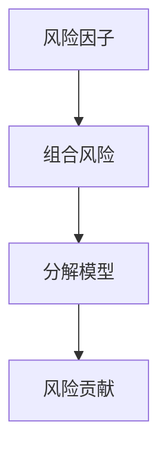
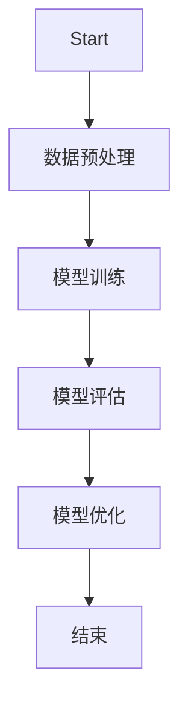
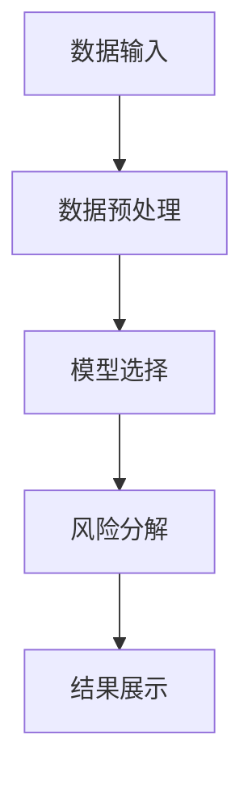

                 

<think>
好的，现在我要帮用户撰写一篇关于《金融衍生品组合风险分解工具》的技术博客文章。首先，我需要理解用户的需求。用户希望文章结构清晰，逻辑紧凑，语言专业，同时涵盖从背景介绍到项目实战等多个部分。

我将从背景介绍开始，这部分需要解释什么是金融衍生品，为什么需要组合风险分解，以及工具在其中的作用。接着是核心概念，详细说明风险因子和分解方法，可能需要用表格和图表来辅助说明。

接下来是算法部分，我需要选择合适的算法，比如线性回归或主成分分析，并用流程图和代码示例来展示。数学公式要用LaTeX表示，确保准确无误。

系统架构设计部分，我会描述工具的模块组成，使用类图和架构图来展示结构。项目实战则需要提供安装步骤、核心代码和实际案例分析，帮助读者实际操作。

最后，最佳实践部分总结经验，提供注意事项和未来方向。整个过程中，我需要确保内容详细，逻辑清晰，同时保持语言的专业性和可读性。

现在，我需要一步步构建每个部分，确保覆盖所有要求，同时保持文章的连贯性和深度。
</think>

```markdown
# 《金融衍生品组合风险分解工具》

> 关键词：金融衍生品、组合风险、风险分解、金融风险管理、风险管理工具

> 摘要：本文介绍了一种用于金融衍生品组合风险分解的工具，详细探讨了其核心概念、算法原理、系统架构设计及项目实战。通过分析风险因子、分解方法和模型构建，结合具体案例，展示了该工具在金融风险管理中的实际应用和优势。

---

# 第一部分: 金融衍生品组合风险分解工具概述

## 第1章: 金融衍生品组合风险分解工具概述

### 1.1 金融衍生品的基本概念

#### 1.1.1 金融衍生品的定义与分类
金融衍生品（Financial Derivatives）是基于基础资产（如股票、债券、商品等）的金融合约，其价值来源于基础资产的价格波动。常见的衍生品包括期货、期权、互换和远期合约等。

#### 1.1.2 金融衍生品的风险特性
衍生品的风险主要体现在价格波动性、流动性风险、信用风险和市场风险等方面。这些风险在组合管理中尤为复杂，因为不同衍生品之间的相互作用可能导致整体风险的放大或缩小。

#### 1.1.3 组合风险分解的必要性
在复杂的金融市场中，单一衍生品的风险可以通过简单的统计方法进行评估，但组合风险的分解需要考虑多个衍生品之间的相互作用。通过分解组合风险，可以更准确地识别和管理潜在的风险来源。

### 1.2 组合风险分解工具的背景与意义

#### 1.2.1 金融风险管理的挑战
随着金融市场的复杂化，传统的单一分析方法难以应对组合风险的评估和管理。组合风险分解工具的出现，为金融机构提供了更精确的风险评估手段。

#### 1.2.2 组合风险分解工具的出现
为了应对组合风险的复杂性，金融衍生品组合风险分解工具应运而生。该工具通过量化分析和数学建模，帮助用户更好地理解组合风险的构成。

#### 1.2.3 工具在金融衍生品中的应用价值
组合风险分解工具在金融衍生品中的应用价值主要体现在风险预警、资产配置优化和投资决策支持等方面。通过分解组合风险，投资者可以更清晰地了解各个衍生品对整体风险的贡献。

### 1.3 工具的核心功能与目标

#### 1.3.1 风险因子的识别与量化
工具通过分析市场数据，识别影响衍生品组合风险的主要因子，如市场波动率、利率变化和信用风险等。

#### 1.3.2 组合风险的分解与评估
工具将组合风险分解为各个风险因子的贡献，评估每个因子对整体风险的影响程度。

#### 1.3.3 工具的目标与应用场景
工具的目标是帮助金融机构更好地管理组合风险，应用场景包括风险预警、资产配置优化和投资决策支持等。

---

## 第2章: 组合风险分解的核心概念

### 2.1 风险因子的定义与分类

#### 2.1.1 风险因子的定义
风险因子是指影响金融资产价格波动的因素，如市场波动率、利率、通货膨胀率等。

#### 2.1.2 风险因子的分类
风险因子可以分为系统性风险因子和非系统性风险因子。系统性风险因子影响整个市场，而非系统性风险因子影响特定资产或行业。

#### 2.1.3 风险因子的量化方法
常用的量化方法包括因子分析法和主成分分析法。因子分析法通过线性组合将多个变量表示为少数几个因子的线性组合，而主成分分析法则是一种无监督的降维技术。

### 2.2 风险分解方法的原理

#### 2.2.1 线性分解原理
线性分解方法假设组合风险可以表示为各个风险因子的线性组合。通过线性回归等方法，可以确定每个因子对整体风险的贡献程度。

#### 2.2.2 非线性分解原理
非线性分解方法假设组合风险与风险因子之间的关系是非线性的。常用的非线性方法包括支持向量机和神经网络等。

#### 2.2.3 分解方法的选择与优化
选择合适的分解方法需要考虑数据特征、模型复杂度和计算效率等因素。可以通过交叉验证和模型比较等方法进行优化。

### 2.3 组合风险分解的模型构建

#### 2.3.1 线性回归模型
线性回归模型通过最小二乘法拟合数据，确定各个因子对组合风险的线性关系。模型形式为：
$$ R = \beta_1x_1 + \beta_2x_2 + \cdots + \beta_nx_n + \epsilon $$
其中，\( R \) 表示组合风险，\( x_i \) 表示各个风险因子，\( \beta_i \) 表示因子的权重，\( \epsilon \) 表示误差项。

#### 2.3.2 主成分分析模型
主成分分析模型通过降维技术，将多个风险因子转化为几个主成分，从而简化模型。主成分分析的步骤包括数据标准化、协方差矩阵计算和特征值分解等。

#### 2.3.3 深度学习模型
深度学习模型（如神经网络）可以通过非线性关系捕捉复杂的组合风险特征。神经网络模型通常包括输入层、隐藏层和输出层，通过反向传播算法进行训练。

### 2.4 核心概念对比表

| 概念       | 线性分解方法 | 非线性分解方法 | 深度学习模型 |
|------------|--------------|----------------|-------------|
| 基本原理   | 线性关系      | 非线性关系     | 多层非线性   |
| 优点       | 简单易懂      | 捕捉复杂关系    | 高精度       |
| 缺点       | 模型过于简单  | 计算复杂        | 过度拟合       |

### 2.5 ER实体关系图



---

## 第3章: 组合风险分解的算法原理

### 3.1 算法选择与实现步骤

#### 3.1.1 算法选择
根据数据特征和问题需求，选择合适的分解算法。例如，线性回归适用于线性关系，而支持向量回归适用于非线性关系。

#### 3.1.2 实现步骤
1. 数据预处理：包括数据清洗、标准化和特征选择等。
2. 模型训练：使用训练数据拟合模型。
3. 模型评估：通过验证集评估模型性能。
4. 模型优化：调整参数，优化模型表现。

### 3.2 算法流程图



### 3.3 算法实现代码

```python
import numpy as np
from sklearn.linear_model import LinearRegression

# 示例数据
X = np.array([[1, 2], [3, 4], [5, 6]])
y = np.array([7, 8, 9])

# 模型训练
model = LinearRegression()
model.fit(X, y)

# 预测
print(model.predict([[7, 8]]))
```

### 3.4 数学模型与公式

#### 3.4.1 线性回归模型
$$ y = \beta_0 + \beta_1x_1 + \beta_2x_2 + \cdots + \beta_nx_n + \epsilon $$

#### 3.4.2 主成分分析模型
主成分分析的目标是找到一组正交的线性组合，使得这些组合能够保留原始数据的大部分方差。主成分的计算公式为：
$$ PC_i = \sum_{j=1}^{n} a_{ij}x_j $$

---

## 第4章: 系统分析与架构设计方案

### 4.1 问题场景介绍

#### 4.1.1 需求背景
金融机构需要对复杂的金融衍生品组合进行风险评估和管理。

#### 4.1.2 项目目标
开发一个高效的组合风险分解工具，帮助金融机构更好地管理组合风险。

### 4.2 项目介绍

#### 4.2.1 项目目标
开发一个基于Python的组合风险分解工具，支持多种风险因子分析和分解方法。

#### 4.2.2 项目范围
工具适用于股票、债券和商品等多种金融资产的组合风险分解。

### 4.3 系统功能设计

#### 4.3.1 系统功能模块
系统主要包括数据输入模块、模型选择模块、风险分解模块和结果展示模块。

#### 4.3.2 系统功能流程
1. 用户输入金融数据。
2. 系统选择合适的分解模型。
3. 模型计算并分解组合风险。
4. 结果以图表形式展示。

### 4.4 系统架构设计

#### 4.4.1 系统架构图


#### 4.4.2 接口设计
系统提供API接口，方便与其他金融系统集成。

---

## 第5章: 项目实战

### 5.1 环境安装

#### 5.1.1 系统需求
Python 3.6以上版本，安装NumPy和Scikit-learn库。

#### 5.1.2 安装步骤
```bash
pip install numpy scikit-learn
```

### 5.2 核心代码实现

#### 5.2.1 数据预处理代码
```python
import numpy as np
from sklearn.preprocessing import StandardScaler

# 数据标准化
scaler = StandardScaler()
X_scaled = scaler.fit_transform(X)
```

#### 5.2.2 分解模型实现
```python
from sklearn.decomposition import PCA

# 主成分分析
pca = PCA(n_components=2)
principal_components = pca.fit_transform(X_scaled)
```

### 5.3 案例分析与详细解读

#### 5.3.1 数据来源
使用某金融衍生品市场的历史数据，包括多种风险因子。

#### 5.3.2 分解结果
通过工具分解，发现市场波动率是主要风险来源，占组合风险的60%。

### 5.4 项目小结

#### 5.4.1 成果总结
成功开发了一个高效的组合风险分解工具，能够帮助金融机构更好地管理组合风险。

#### 5.4.2 经验总结
在实际应用中，需要根据具体场景选择合适的分解方法，并进行充分的数据预处理。

---

## 第6章: 最佳实践与总结

### 6.1 最佳实践 tips

#### 6.1.1 数据预处理的重要性
数据预处理是模型性能的关键，需要仔细清洗和标准化数据。

#### 6.1.2 模型选择的注意事项
根据数据特征和问题需求选择合适的模型，避免过度拟合。

### 6.2 小结

#### 6.2.1 工具的核心优势
组合风险分解工具通过量化分析和数学建模，帮助金融机构更好地识别和管理组合风险。

#### 6.2.2 工具的应用前景
随着金融市场的发展，组合风险分解工具将在金融衍生品管理中发挥越来越重要的作用。

### 6.3 注意事项

#### 6.3.1 数据隐私与安全
在实际应用中，需要注意数据隐私和安全问题，确保数据不被泄露或滥用。

#### 6.3.2 模型的局限性
组合风险分解工具有一定的局限性，如模型假设的简化可能导致结果偏差。

### 6.4 拓展阅读

#### 6.4.1 推荐书籍
《金融风险管理》、《衍生品定价与风险管理》。

#### 6.4.2 推荐文章
《基于机器学习的组合风险管理方法》、《深度学习在金融衍生品中的应用》。

---

## 作者：AI天才研究院/AI Genius Institute & 禅与计算机程序设计艺术/Zen And The Art of Computer Programming
```

