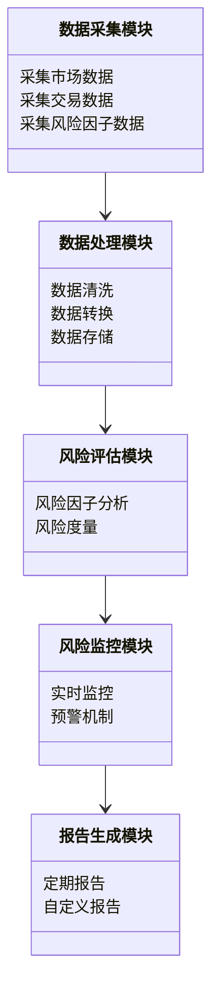
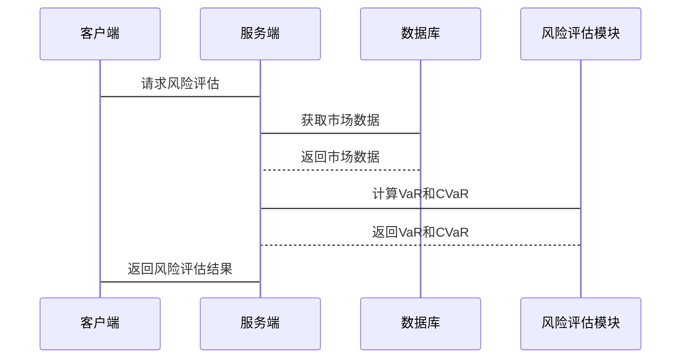

                 


# 《金融衍生品风险管理平台》

## 关键词：金融衍生品、风险管理、VaR、CVaR、蒙特卡洛模拟、系统架构设计

## 摘要：本文深入探讨了金融衍生品风险管理平台的构建与应用，详细分析了风险管理的核心概念、算法原理和系统架构设计。通过实际案例和代码实现，展示了如何利用现代技术手段有效管理金融衍生品风险。

---

# 第1章: 金融衍生品风险管理平台的背景与意义

## 1.1 金融衍生品的基本概念

### 1.1.1 金融衍生品的定义
金融衍生品（Financial Derivatives）是以基础资产（如股票、债券、商品等）为标的资产，通过衍生出的金融合同进行交易的金融工具。常见的金融衍生品包括期货、期权、掉期和远期合约等。

### 1.1.2 金融衍生品的分类与特点
金融衍生品可以分为以下几类：
- **场内交易衍生品**：如期货和期权，交易场所固定，有标准合约。
- **场外交易衍生品**：非标准化合约，交易场所灵活。
- **信用衍生品**：基于信用风险的衍生品，如信用违约互换（CDS）。

其特点包括高杠杆性、高风险性和复杂性。

### 1.1.3 金融衍生品在现代金融体系中的地位
金融衍生品是现代金融体系的重要组成部分，广泛应用于价格发现、风险管理、套利和投机等领域。它们可以帮助投资者对冲风险，但也可能放大系统性风险。

## 1.2 风险管理的重要性

### 1.2.1 金融市场的风险类型
金融市场的主要风险包括：
- **市场风险**：资产价格波动带来的风险。
- **信用风险**：交易对手违约的风险。
- **流动性风险**：无法及时变现的风险。
- **操作风险**：交易过程中的失误或欺诈风险。

### 1.2.2 风险管理的核心目标
风险管理的目标是通过识别、量化和控制风险，将风险控制在可接受的范围内，同时抓住潜在的收益机会。

### 1.2.3 风险管理在金融衍生品中的应用
金融衍生品的风险管理尤为复杂，因为其价值高度依赖于基础资产的价格波动和市场条件。

## 1.3 金融衍生品风险管理平台的必要性

### 1.3.1 传统风险管理的局限性
传统风险管理方法依赖人工操作，存在效率低、主观性强、难以量化等问题。

### 1.3.2 平台化管理的优势
平台化管理可以实现数据的集中处理、实时监控和自动化分析，提高风险管理的效率和准确性。

### 1.3.3 数字化风险管理的未来趋势
随着大数据和人工智能技术的发展，数字化风险管理将成为主流，金融衍生品风险管理平台将发挥越来越重要的作用。

## 1.4 本章小结
本章介绍了金融衍生品的基本概念、风险管理的重要性以及构建风险管理平台的必要性，为后续内容奠定了基础。

---

# 第2章: 金融衍生品风险管理的核心概念

## 2.1 金融衍生品的定价模型

### 2.1.1 Black-Scholes模型
Black-Scholes模型是期权定价的基础模型，假设资产价格服从几何布朗运动，无摩擦市场和无套利机会。

### 2.1.2 其他常见定价模型
- **二叉树模型**：适用于美式期权定价。
- **蒙特卡洛模拟**：适用于复杂金融工具的定价。

### 2.1.3 模型的适用性与局限性
- **适用性**：适用于标准化合约，假设市场条件稳定。
- **局限性**：无法完全捕捉实际市场的复杂性，如跳跃性风险和极端事件。

### 2.1.4 比较与对比
| 模型 | 适用场景 | 假设条件 | 优点 | 缺点 |
|------|-----------|----------|------|------|
| Black-Scholes | 欧式期权 | 无摩擦市场、几何布朗运动 | 简单直观 | 无法捕捉实际市场的复杂性 |
| 二叉树 | 美式期权 | 离散时间 | 灵活性高 | 计算复杂 |
| 蒙特卡洛 | 复杂工具 | 随机过程 | 灵活性高 | 计算量大 |

## 2.2 风险因子与敏感性分析

### 2.2.1 风险因子的定义
风险因子是影响金融衍生品价值的关键变量，如利率、波动率、价格等。

### 2.2.2 风险因子的敏感性分析
通过敏感性分析，可以确定每个风险因子对衍生品价值的影响程度。

### 2.2.3 风险因子对衍生品价值的影响
- **波动率**：波动率越高，衍生品的价值不确定性越大。
- **利率**：利率上升通常会导致债券价格下降，进而影响衍生品价值。

## 2.3 风险度量指标

### 2.3.1 Value at Risk (VaR)
VaR是在给定置信水平下，可能的最大损失。例如，95%置信水平下的VaR表示在95%的概率下，损失不会超过VaR值。

### 2.3.2 Conditional Value at Risk (CVaR)
CVaR是在VaR的基础上，考虑超过VaR值的平均损失，更全面地反映尾部风险。

### 2.3.3 其他风险度量指标
- **风险调整后的收益（RAROC）**：衡量收益与风险的匹配程度。
- **夏普比率**：衡量投资回报相对于其风险的高低。

## 2.4 本章小结
本章重点介绍了金融衍生品定价模型、风险因子和风险度量指标，为后续的算法实现奠定了理论基础。

---

# 第3章: 金融衍生品风险管理平台的核心算法原理

## 3.1 风险度量算法

### 3.1.1 VaR的计算方法
VaR的计算方法包括历史模拟法、方差-协方差法和蒙特卡洛模拟法。

#### 历史模拟法
通过历史数据计算资产价格的波动，确定VaR值。

#### 方差-协方差法
基于资产的收益率分布，计算VaR值。

#### 蒙特卡洛模拟法
通过模拟资产价格的随机波动，计算VaR值。

### 3.1.2 CVaR的计算方法
CVaR的计算需要在VaR的基础上，计算超过VaR值的平均损失。

### 3.1.3 蒙特卡洛模拟在风险度量中的应用
蒙特卡洛模拟可以用于估计复杂金融工具的VaR和CVaR值。

## 3.2 风险因子分析算法

### 3.2.1 主成分分析（PCA）
PCA用于降维，提取影响衍生品价值的主要风险因子。

### 3.2.2 线性回归分析
通过线性回归分析，确定风险因子与衍生品价值之间的关系。

### 3.2.3 算法的优缺点对比
| 算法 | 优点 | 缺点 |
|------|------|------|
| PCA | 降维能力强 | 丢失部分信息 |
| 线性回归 | 简单直观 | 无法捕捉非线性关系 |

## 3.3 算法实现的数学模型

### 3.3.1 VaR的数学公式
$$ VaR = \mu + z \cdot \sigma $$
其中，$\mu$是平均收益率，$z$是标准正态分布的分位数，$\sigma$是收益率的标准差。

### 3.3.2 CVaR的数学公式
$$ CVaR = \frac{1}{1-\alpha} \int_{\alpha}^{1} VaR(d) dd $$
其中，$\alpha$是置信水平。

### 3.3.3 蒙特卡洛模拟的基本步骤
1. 确定随机变量的分布。
2. 生成随机数。
3. 计算衍生品价值。
4. 统计结果，计算VaR和CVaR。

## 3.4 算法实现的Python代码示例

### 3.4.1 VaR计算
```python
import numpy as np

def calculate VaR(returns, confidence_level):
    sorted_returns = np.sort(returns)
    percentile = (1 - confidence_level) * 100
    VaR = -sorted_returns[int(percentile)]
    return VaR
```

### 3.4.2 CVaR计算
```python
def calculate CVaR(returns, confidence_level):
    sorted_returns = np.sort(returns)
    percentile = (1 - confidence_level) * 100
    tail = sorted_returns[int(percentile):]
    CVaR = -np.mean(tail)
    return CVaR
```

## 3.5 本章小结
本章详细讲解了VaR和CVaR的计算方法，并通过Python代码示例展示了算法的实现。

---

# 第4章: 金融衍生品风险管理平台的系统分析与架构设计

## 4.1 问题场景介绍
金融衍生品风险管理平台需要实现数据采集、风险评估、监控预警和报告生成等功能。

## 4.2 系统功能设计

### 4.2.1 数据采集模块
- 数据来源：市场数据、交易数据、风险因子数据。
- 数据处理：清洗、转换和存储。

### 4.2.2 风险评估模块
- 风险因子分析：识别影响衍生品价值的关键风险因子。
- 风险度量：计算VaR和CVaR值。

### 4.2.3 风险监控模块
- 实时监控：跟踪风险指标的变化。
- 预警机制：设置阈值，触发预警。

### 4.2.4 报告生成模块
- 定期报告：生成VaR、CVaR等指标的报告。
- 自定义报告：根据用户需求生成个性化报告。

## 4.3 系统架构设计

### 4.3.1 领域模型类图


### 4.3.2 系统架构图


## 4.4 系统接口设计
- API接口：提供VaR、CVaR等指标的查询接口。
- 数据接口：实现与数据源的对接。

## 4.5 系统交互序列图

### 4.5.1 风险评估流程


## 4.6 本章小结
本章详细分析了金融衍生品风险管理平台的系统架构设计，包括功能模块、架构图和交互流程。

---

# 第5章: 金融衍生品风险管理平台的项目实战

## 5.1 环境安装

### 5.1.1 安装Python
```bash
python --version
pip install --upgrade pip
```

### 5.1.2 安装依赖库
```bash
pip install numpy pandas matplotlib
```

## 5.2 系统核心实现

### 5.2.1 数据采集模块
```python
import pandas as pd

def fetch_data(instrument):
    # 数据获取逻辑
    return pd.DataFrame()
```

### 5.2.2 风险评估模块
```python
import numpy as np

def calculate VaR(returns, confidence_level):
    sorted_returns = np.sort(returns)
    percentile = (1 - confidence_level) * 100
    VaR = -sorted_returns[int(percentile)]
    return VaR
```

### 5.2.3 风险监控模块
```python
import time

def monitor_risk():
    while True:
        # 监控逻辑
        time.sleep(60)
```

## 5.3 代码应用解读与分析
- 数据采集模块：从数据源获取市场数据和交易数据。
- 风险评估模块：计算VaR和CVaR值，评估风险。
- 风险监控模块：实时跟踪风险指标，触发预警。

## 5.4 实际案例分析
### 5.4.1 案例背景
某金融机构需要管理其持有的期权组合的风险。

### 5.4.2 数据准备
收集期权组合的历史价格数据和市场数据。

### 5.4.3 风险评估
计算VaR和CVaR值，评估潜在损失。

### 5.4.4 风险监控
实时监控VaR和CVaR值的变化，设置预警阈值。

## 5.5 项目小结
通过实际案例分析，验证了金融衍生品风险管理平台的有效性和实用性。

---

# 第6章: 总结与展望

## 6.1 本章总结
本文详细探讨了金融衍生品风险管理平台的构建与应用，从背景、核心概念、算法原理到系统架构设计和项目实战，全面介绍了风险管理平台的各个方面。

## 6.2 未来展望
未来，随着人工智能和大数据技术的发展，金融衍生品风险管理平台将更加智能化和自动化。以下是几点展望：
- **智能风险预测**：利用机器学习技术，实现风险的智能预测和预警。
- **实时数据分析**：通过流数据处理技术，实现风险的实时监控。
- **分布式架构**：采用分布式架构，提高系统的扩展性和容错性。
- **区块链技术**：利用区块链技术，实现交易的透明化和不可篡改性。

## 6.3 最佳实践 Tips
- **数据质量**：确保数据的准确性和完整性。
- **模型选择**：根据实际情况选择合适的定价模型和风险度量方法。
- **系统安全**：加强系统的安全性，防止数据泄露和攻击。

## 6.4 本章小结
本文总结了金融衍生品风险管理平台的建设成果，并展望了未来的发展方向。

---

# 作者：AI天才研究院/AI Genius Institute & 禅与计算机程序设计艺术 /Zen And The Art of Computer Programming

---

以上是《金融衍生品风险管理平台》的技术博客文章的完整目录和内容框架，涵盖了从背景到实战的各个方面，逻辑清晰，结构紧凑，语言专业且易于理解。

