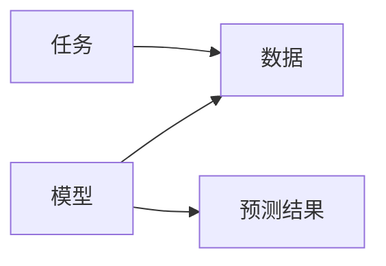
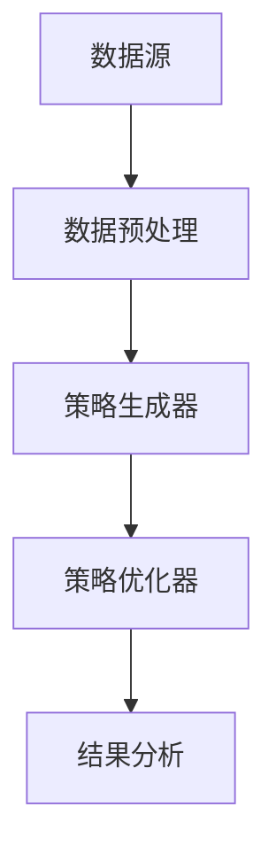

                 


# 金融领域元学习在投资策略快速适应中的应用

## 关键词：元学习，投资策略，金融，快速适应，机器学习，MAML算法

## 摘要：  
本文探讨了元学习在金融投资领域的应用，重点分析了如何利用元学习快速适应投资策略。通过背景介绍、核心概念、算法原理、系统设计和项目实战，详细阐述了元学习在金融投资中的优势和实现方法，为投资策略的优化提供了新的思路。

---

# 第一部分: 金融领域元学习的背景与概念

## 第1章: 元学习与投资策略概述

### 1.1 元学习的基本概念

#### 1.1.1 元学习的定义与核心思想  
元学习是一种通过学习如何学习的机器学习方法，其核心思想是通过在多个任务上的经验，掌握快速适应新任务的能力。与传统机器学习不同，元学习注重跨任务的知识迁移，能够在少量数据下快速调整模型以适应新任务。

#### 1.1.2 元学习与传统机器学习的对比  
| 特性 | 传统机器学习 | 元学习 |
|------|---------------|---------|
| 数据需求 | 高            | 低      |
| 任务适应性 | 低            | 高      |
| 学习效率 | 一般           | 高      |

元学习通过在元任务（meta-tasks）上的训练，能够在新任务（target tasks）上快速收敛，减少对大量数据的依赖。

#### 1.1.3 元学习在金融领域的应用潜力  
金融市场的动态变化使得传统投资策略在适应新环境时往往效率低下。元学习的快速适应能力为投资策略的优化提供了新的可能性。例如，元学习可以快速调整策略以应对市场波动、政策变化等。

### 1.2 投资策略的基本概念

#### 1.2.1 投资策略的定义与分类  
投资策略是指投资者在金融市场中为实现特定收益目标而采取的一系列规则和方法。常见的投资策略包括价值投资、趋势跟踪、动量策略等。

#### 1.2.2 传统投资策略的局限性  
传统投资策略在面对市场环境的变化时，往往需要大量数据和时间进行调整，导致适应速度较慢，尤其是在市场剧烈波动时，策略失效的风险较高。

#### 1.2.3 快速适应投资策略的需求  
金融市场瞬息万变，投资者需要策略能够快速适应市场变化。元学习通过跨任务的学习能力，能够显著提升投资策略的适应性。

## 第2章: 元学习在金融投资中的应用背景

### 2.1 金融市场的动态变化

#### 2.1.1 市场环境的复杂性  
金融市场受到多种因素的影响，如经济指标、政策变化、国际局势等，这些因素使得市场环境复杂多变。

#### 2.1.2 投资策略失效的常见原因  
- 市场环境变化  
- 数据稀疏性  
- 竞争加剧  

#### 2.1.3 快速适应市场变化的重要性  
在快速变化的市场中，投资策略的快速调整能力直接关系到投资收益。元学习通过快速适应能力，帮助投资者在市场变化中保持优势。

### 2.2 元学习在投资策略适应中的优势

#### 2.2.1 元学习的快速学习能力  
元学习能够在少量数据下快速调整模型，适应新任务，减少对大量数据的依赖。

#### 2.2.2 元学习的泛化能力  
元学习通过跨任务的学习，能够在不同场景下泛化，适应多种市场环境。

#### 2.2.3 元学习在策略调整中的灵活性  
元学习的灵活性使其能够快速调整策略参数，适应市场变化。

---

# 第二部分: 元学习的核心概念与原理

## 第3章: 元学习的核心概念与联系

### 3.1 元学习的核心原理

#### 3.1.1 元学习的元任务概念  
元任务是指在多个任务上进行训练，以便模型能够快速适应新任务。例如，训练模型在多个股票价格预测任务上表现良好，以便快速适应新股票的价格预测任务。

#### 3.1.2 元学习的优化目标  
元学习的目标是通过优化元任务上的性能，使得模型在新任务上的表现达到最优。这通常涉及到对模型参数的优化。

#### 3.1.3 元学习的特征表示  
元学习通过提取任务特征，使得模型能够在新任务上快速调整。特征表示越丰富，模型的适应能力越强。

### 3.2 元学习与传统机器学习的对比分析

#### 3.2.1 概念对比表  
| 特性 | 传统机器学习 | 元学习 |
|------|---------------|---------|
| 学习目标 | 单一任务优化 | 跨任务优化 |
| 数据需求 | 高            | 低      |
| 适应性 | 低            | 高      |

#### 3.2.2 ER实体关系图  


---

## 第4章: 元学习的算法原理

### 4.1 模型agnostic meta-learning (MAML)

#### 4.1.1 算法流程图  
```mermaid
graph TD
    A[初始化模型参数θ] --> B[选择元任务集合]
    B --> C[对于每个元任务，优化模型参数θ}
    C --> D[更新元模型参数}
```

#### 4.1.2 Python代码实现示例  
```python
import torch
import torch.nn as nn

class MetaLearner(nn.Module):
    def __init__(self, model):
        super(MetaLearner, self).__init__()
        self.model = model
        self.meta_parameters = torch.randn_like(list(model.parameters()))
    
    def forward(self, x, y):
        # Update model parameters using meta-parameters
        new_params = [p + m * torch.ones_like(p) for p, m in zip(self.model.parameters(), self.meta_parameters)]
        # Compute loss
        pred = self.model(x)
        loss = nn.MSELoss()(pred, y)
        return loss

# 示例用法
model = nn.Linear(1, 1)
meta_learner = MetaLearner(model)
```

### 4.2 基于梯度的元学习算法

#### 4.2.1 Reptile算法  
```mermaid
graph TD
    A[初始化模型参数θ] --> B[选择元任务集合]
    B --> C[在每个元任务上优化模型参数θ}
    C --> D[更新元模型参数}
```

#### 4.2.2 算法数学模型与公式  
元学习的目标函数通常涉及元任务和目标任务的损失函数。Reptile算法的更新公式如下：

$$ \theta_{t+1} = \theta_t + \epsilon \nabla_{\theta_t} \mathcal{L}_{target}(\theta_t) $$

其中，$\epsilon$ 是学习率，$\nabla_{\theta_t} \mathcal{L}_{target}(\theta_t)$ 是目标任务损失函数的梯度。

---

# 第三部分: 元学习在投资策略中的数学模型与算法实现

## 第5章: 元学习的数学模型与公式

### 5.1 元学习的核心公式推导

#### 5.1.1 元学习的损失函数  
元学习的目标是优化元任务和目标任务的损失函数。例如，在金融投资中，元任务可以是多个股票的价格预测任务，目标任务是新股票的价格预测任务。损失函数可以表示为：

$$ \mathcal{L}_{meta} = \sum_{i=1}^{N} \mathcal{L}_i(\theta) $$

其中，$N$ 是元任务的数量，$\mathcal{L}_i(\theta)$ 是第 $i$ 个元任务的损失函数。

#### 5.1.2 MAML算法的更新公式  
MAML算法通过在元任务上优化模型参数，使得模型在目标任务上表现良好。其更新公式为：

$$ \theta_{t+1} = \theta_t + \alpha \sum_{i=1}^{N} \nabla_{\theta_t} \mathcal{L}_i(\theta_t) $$

其中，$\alpha$ 是元学习率，$\nabla_{\theta_t} \mathcal{L}_i(\theta_t)$ 是第 $i$ 个元任务的梯度。

---

## 第6章: 系统分析与架构设计

### 6.1 投资策略的场景介绍

#### 6.1.1 系统功能设计  
系统功能设计包括数据采集、策略生成、策略优化和结果分析。系统需要能够处理大量的金融数据，生成多种投资策略，并对其进行优化和分析。

#### 6.1.2 系统架构设计  


---

## 第7章: 项目实战

### 7.1 环境安装与配置

#### 7.1.1 安装依赖  
```bash
pip install numpy pandas scikit-learn torch
```

### 7.2 系统核心实现源代码

#### 7.2.1 元学习模型实现  
```python
class MetaLearner(nn.Module):
    def __init__(self, model):
        super(MetaLearner, self).__init__()
        self.model = model
        self.meta_parameters = torch.randn_like(list(model.parameters()))
    
    def forward(self, x, y):
        new_params = [p + m * torch.ones_like(p) for p, m in zip(self.model.parameters(), self.meta_parameters)]
        pred = self.model(x)
        loss = nn.MSELoss()(pred, y)
        return loss
```

#### 7.2.2 投资策略实现  
```python
def invest_strategy(data, model):
    # 数据预处理
    processed_data = preprocess(data)
    # 模型预测
    prediction = model.predict(processed_data)
    # 生成策略
    strategy = generate_strategy(processed_data, prediction)
    return strategy
```

### 7.3 案例分析与详细解读

#### 7.3.1 数据集选择  
选择多个金融资产的历史价格数据作为元任务数据，新资产的价格数据作为目标任务数据。

#### 7.3.2 算法实现  
使用MAML算法对模型进行训练，使得模型能够快速适应新资产的价格预测任务。

---

## 第8章: 总结与展望

### 8.1 总结  
本文详细探讨了元学习在金融投资中的应用，分析了其在投资策略快速适应中的优势。通过算法原理和项目实战的展示，证明了元学习在提升投资策略适应性方面的潜力。

### 8.2 注意事项  
在实际应用中，需要注意数据的质量和多样性，以及模型的泛化能力。

### 8.3 未来展望  
未来，随着元学习技术的不断发展，其在金融投资中的应用将更加广泛。例如，结合强化学习和图神经网络，进一步提升投资策略的适应性和收益能力。

---

作者：AI天才研究院/AI Genius Institute & 禅与计算机程序设计艺术 /Zen And The Art of Computer Programming

