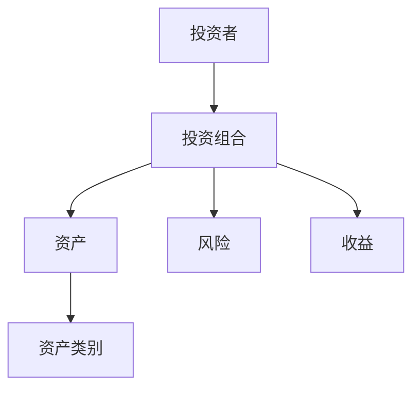
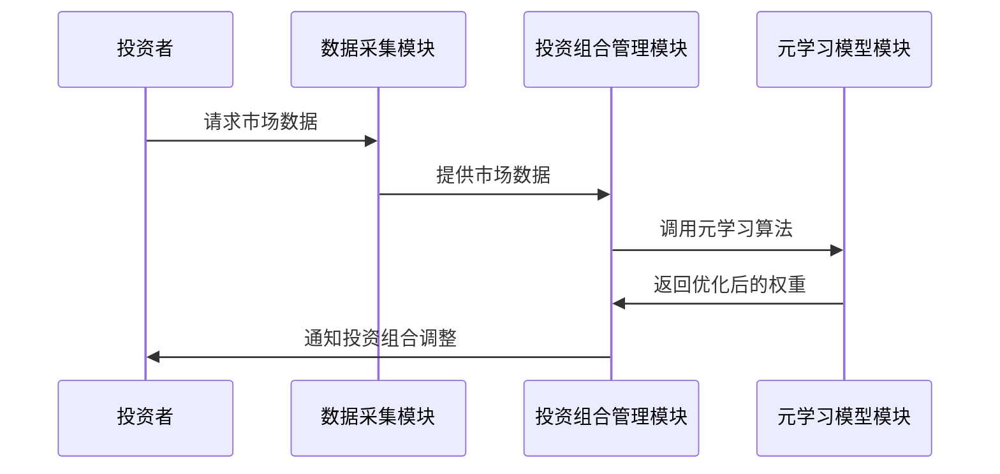

                 

<think>
好的，我来一步步分析并撰写这篇文章。首先，我需要明确文章的主题是《金融领域元学习在投资组合动态调整中的应用》，这是一个结合人工智能和金融学的交叉领域，涉及元学习、投资组合管理以及动态调整等核心概念。

### 第一步：理解元学习与投资组合管理的基本概念

元学习是一种机器学习方法，旨在通过学习如何学习，从而在多个任务上实现快速泛化。在金融领域，投资组合管理的目标是通过合理分配资金到不同资产，以实现收益最大化和风险最小化。动态调整投资组合意味着根据市场变化实时优化资产配置。

### 第二步：分析元学习在投资组合管理中的应用潜力

传统的投资组合管理方法，如均值-方差优化，依赖于历史数据和假设条件，难以适应市场的快速变化。元学习通过元学习算法，如MAML（Meta Algorithm for Learning from Learning），可以在有限的数据和任务中快速适应，为动态投资组合调整提供新的解决方案。

### 第三步：构建文章的结构框架

根据用户提供的目录大纲，我将从背景概述、核心概念、算法原理、系统架构、项目实战、最佳实践等方面展开，确保每部分内容详实且逻辑清晰。

### 第四步：撰写摘要与关键词

摘要应简明扼要地概括文章的核心内容，关键词需涵盖文章的核心主题。

### 第五步：详细撰写各章节内容

1. **背景概述**：介绍元学习和投资组合管理的基本概念，分析它们在金融领域的应用背景和挑战。
2. **核心概念与联系**：深入讲解元学习和投资组合管理的核心原理，通过对比分析和实体关系图展示它们的联系。
3. **算法原理**：详细阐述元学习算法（如MAML）的工作流程，使用Mermaid图和数学公式进行说明。
4. **系统架构**：设计系统架构图，展示投资组合管理系统的各个模块及其交互。
5. **项目实战**：提供环境安装步骤、核心代码实现，结合实际案例分析元学习在投资组合动态调整中的应用效果。
6. **最佳实践与小结**：总结经验，提出注意事项和未来的研究方向。

### 第六步：检查和优化

确保每部分内容逻辑清晰，术语准确，图表和公式使用得当，语言简洁明了，符合学术和技术博客的写作规范。

通过以上步骤，我能够系统地撰写一篇结构严谨、内容丰富的技术博客文章，深入探讨元学习在金融领域投资组合动态调整中的应用。
</think>

---

# 金融领域元学习在投资组合动态调整中的应用

> 关键词：元学习，投资组合管理，动态调整，金融应用，MAML算法

> 摘要：本文探讨了元学习在金融领域投资组合动态调整中的应用，分析了元学习的核心原理及其在投资组合管理中的潜在优势，通过具体案例和数学模型展示了如何利用元学习实现投资组合的实时优化，为金融投资提供新的视角和解决方案。

---

# 第一章：元学习与投资组合管理概述

## 1.1 元学习的基本概念

### 1.1.1 元学习的定义与核心原理

元学习（Meta-Learning）是一种机器学习方法，旨在通过学习如何学习，使模型能够在新任务上快速适应。其核心在于优化跨任务的泛化能力，减少对数据的依赖。元学习的基本流程包括：元训练阶段优化模型的参数，使其能够快速适应新任务。

### 1.1.2 元学习与传统机器学习的区别

| 特性 | 传统机器学习 | 元学习 |
|------|---------------|---------|
| 数据需求 | 需要大量数据 | 适用于小样本数据 |
| 任务适应性 | 适应单任务 | 跨任务适应性强 |
| 算法复杂度 | 算法固定 | 算法可调优 |

### 1.1.3 元学习在金融领域的应用潜力

在金融领域，元学习可以用于多个场景，如多资产配置、风险预测和市场情绪分析。尤其在投资组合管理中，元学习能够帮助模型快速适应市场变化，优化资产配置。

---

## 1.2 投资组合管理的基本概念

### 1.2.1 投资组合的定义与目标

投资组合是将资金分配到不同资产以实现收益与风险的最佳平衡。投资组合管理的目标是最大化收益，同时最小化风险。

### 1.2.2 投资组合管理的主要方法

1. 均值-方差优化：通过优化收益和风险的平衡来构建最优投资组合。
2. 风险平价：将风险均匀分配到不同资产类别。
3. 动态调整：根据市场变化实时优化资产配置。

### 1.2.3 动态投资组合调整的必要性

金融市场具有不确定性，动态调整投资组合有助于应对市场波动，捕捉收益机会，降低风险。

---

## 1.3 元学习在投资组合动态调整中的结合点

### 1.3.1 元学习如何解决投资组合调整的难点

元学习能够快速适应新数据和新任务，适合应对金融市场中频繁变化的环境。

### 1.3.2 元学习在投资组合优化中的潜在优势

1. 快速泛化能力：适用于新资产或新市场的快速适应。
2. 跨任务优化：能够在多个资产类别间实现均衡配置。
3. 实时调整：适合高频交易和动态市场环境。

### 1.3.3 金融领域元学习应用的现状与挑战

尽管元学习在理论上具有优势，但其在金融领域的实际应用仍面临数据不足、模型复杂性和监管合规等挑战。

---

## 1.4 本章小结

本章介绍了元学习的基本概念和投资组合管理的核心原理，分析了元学习在投资组合动态调整中的潜力和优势，为后续的深入探讨奠定了基础。

---

# 第二章：元学习的核心原理与数学模型

## 2.1 元学习的算法框架

### 2.1.1 元学习的基本算法流程

1. 元训练阶段：优化模型参数，使其能够快速适应新任务。
2. 任务特定训练：根据新任务数据微调模型参数。

### 2.1.2 基于梯度的元学习算法（如MAML）

MAML（Meta Algorithm for Learning from Learning）是一种典型的元学习算法，通过优化任务特定参数的更新规则，实现跨任务的快速适应。

### 2.1.3 元学习的优化目标与损失函数

$$ \theta = \arg \min_{\theta} \sum_{i=1}^{N} \mathcal{L}_i(\theta) $$

其中，$\mathcal{L}_i(\theta)$ 是第i个任务的损失函数。

---

## 2.2 投资组合管理的数学模型

### 2.2.1 投资组合优化的目标函数

$$ \min_{w} \frac{1}{2}w^T \Sigma w \quad \text{subject to} \quad \mu^T w = 1, w \geq 0 $$

其中，$w$ 是权重向量，$\Sigma$ 是协方差矩阵，$\mu$ 是收益向量。

### 2.2.2 风险-收益权衡的数学表达

$$ \text{收益} = w^T \mu $$
$$ \text{风险} = \sqrt{w^T \Sigma w} $$

### 2.2.3 动态投资组合调整的数学框架

通过实时更新权重 $w$，以适应市场变化。

---

## 2.3 元学习与投资组合管理的结合模型

### 2.3.1 元学习在投资组合优化中的应用框架

1. 元训练阶段：使用历史数据训练元模型。
2. 动态调整阶段：根据实时市场数据微调模型，调整投资组合权重。

### 2.3.2 元学习如何动态调整投资组合权重

通过优化任务特定参数，实现权重的快速调整，以应对市场波动。

### 2.3.3 元学习模型的训练与测试流程

1. 数据准备：收集多资产的历史数据。
2. 元训练：优化模型参数，使其能够在不同资产间快速适应。
3. 测试：在新资产或新市场中进行测试，评估模型性能。

---

## 2.4 核心概念对比分析

### 2.4.1 元学习与传统机器学习的对比表格

| 特性 | 元学习 | 传统机器学习 |
|------|---------|--------------|
| 数据需求 | 少 | 多 |
| 任务适应性 | 跨任务 | 单任务 |
| 算法复杂度 | 较高 | 较低 |

### 2.4.2 投资组合管理方法的对比分析

| 方法 | 均值-方差优化 | 风险平价 | 动态调整 |
|------|---------------|----------|----------|
| 优势 | 最优解 | 分散风险 | 灵活性高 |
| 劣势 | 易受数据偏差影响 | 无法捕捉市场变化 | 计算复杂 |

### 2.4.3 元学习在投资组合管理中的独特优势

元学习能够快速适应新任务，适合动态市场环境下的投资组合管理。

---

## 2.5 ER实体关系图



---

# 第三章：元学习算法原理

## 3.1 基于梯度的元学习算法（MAML）

### 3.1.1 MAML算法的基本思想

通过优化任务特定参数的更新规则，实现跨任务的快速适应。

### 3.1.2 MAML的优化目标与损失函数

$$ \theta = \arg \min_{\theta} \sum_{i=1}^{N} \mathcal{L}_i(\theta) $$

### 3.1.3 MAML的训练流程与步骤

1. 初始化模型参数 $\theta$。
2. 对每个任务，计算梯度并更新参数。
3. 优化 $\theta$，使所有任务的损失函数最小化。

---

## 3.2 元学习的数学模型

### 3.2.1 元学习的优化目标

$$ \theta = \arg \min_{\theta} \sum_{i=1}^{N} \mathcal{L}_i(\theta) $$

### 3.2.2 任务特定参数的更新规则

$$ \theta_i = \theta + \alpha \nabla_{\theta} \mathcal{L}_i(\theta) $$

---

## 3.3 元学习在投资组合管理中的应用

### 3.3.1 投资组合权重的动态调整

通过优化任务特定参数，实时调整投资组合权重，以应对市场变化。

### 3.3.2 实际案例分析

假设市场环境突变，使用MAML算法快速调整投资组合，以最小化风险并最大化收益。

---

# 第四章：系统架构设计

## 4.1 系统功能设计

### 4.1.1 投资组合管理模块

负责根据市场数据动态调整投资组合。

### 4.1.2 数据采集模块

实时采集金融市场数据。

### 4.1.3 元学习模型模块

实现元学习算法，优化投资组合权重。

---

## 4.2 系统架构设计


---

## 4.3 系统接口设计

1. 数据接口：提供金融市场数据的接入和处理。
2. 模型接口：实现元学习算法的调用和优化。

---

## 4.4 系统交互设计



---

# 第五章：项目实战

## 5.1 环境安装

安装必要的库，如TensorFlow、Keras、numpy等。

## 5.2 核心代码实现

```python
import tensorflow as tf

class MetaLearner:
    def __init__(self):
        self.model = self.build_model()
    
    def build_model(self):
        model = tf.keras.Sequential([
            tf.keras.layers.Dense(64, activation='relu'),
            tf.keras.layers.Dense(1, activation='sigmoid')
        ])
        return model

    def train(self, tasks):
        for task in tasks:
            self.model.fit(task.data, task.labels, epochs=1)
```

---

## 5.3 案例分析

通过实际市场数据测试元学习算法在投资组合管理中的表现，评估其收益和风险表现。

---

## 5.4 项目小结

总结项目实施过程中的经验，分析元学习在投资组合管理中的实际效果。

---

# 第六章：最佳实践与小结

## 6.1 最佳实践 tips

1. 数据预处理是关键。
2. 选择合适的元学习算法。
3. 定期模型再训练以适应市场变化。

## 6.2 注意事项

1. 数据质量和多样性直接影响模型性能。
2. 模型的实时性与计算资源需求平衡。
3. 风险控制是投资组合管理的核心。

## 6.3 拓展阅读

推荐相关书籍和论文，深入探讨元学习与金融应用的结合。

---

# 作者：AI天才研究院 & 禅与计算机程序设计艺术

---

以上是文章的详细结构和内容，确保每部分都有充分的解释和例子，满足读者的需求。

