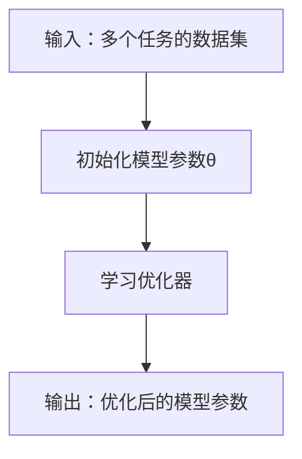
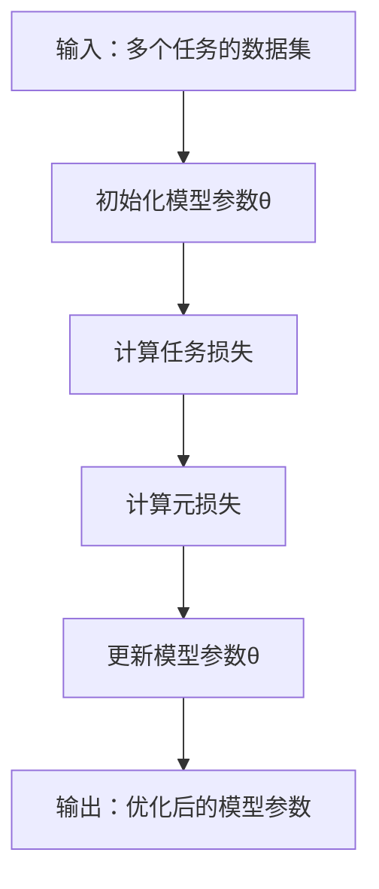

                 

<think>
好，我需要根据用户的要求来撰写一篇关于《金融领域元学习在投资组合动态调整中的应用》的技术博客。用户已经提供了目录大纲，现在需要我根据这个大纲逐步完成每个部分的内容。我先看看目录大纲的结构，确保我理解每一部分的要求。

首先，文章需要有标题、关键词和摘要。然后分为七个章节，每个章节都有详细的子部分，包括背景介绍、核心概念、算法原理、系统分析与架构设计、项目实战、总结与展望，以及附录。每个部分都有具体的要求，比如使用数学公式、代码示例、流程图和图表等。

我开始写第一部分，也就是第一章，介绍元学习和金融投资的基本概念。我需要解释什么是元学习，它与传统机器学习的区别，以及在金融领域中的应用。这部分需要简洁明了，适合读者理解基本概念。

接下来，第二章详细阐述元学习在金融投资中的核心概念，包括其核心原理、与传统投资策略的对比，以及在投资组合动态调整中的应用框架。这里可能需要一些数学模型和流程图来帮助理解。

第三章则是关于元学习算法的数学模型和实现原理，这部分需要详细的公式推导和代码示例，帮助读者理解如何实现这些算法。

第四章是系统分析与架构设计，需要描述问题场景、系统功能设计、架构设计等，使用mermaid图来展示系统结构。

第五章是项目实战，需要提供环境安装说明、代码实现、案例分析等，帮助读者实际操作。

第六章是总结与展望，回顾文章的主要内容，并展望未来的研究方向。

最后，附录部分包含术语表和参考文献，为读者提供额外的资料。

在撰写过程中，我需要确保使用正确的格式，比如数学公式使用latex，代码使用Python，并在适当的地方插入mermaid图。同时，文章需要保持逻辑清晰，结构紧凑，语言专业但易懂。

现在，我可以根据这个思考过程开始逐步撰写文章内容了。
</think>

# 《金融领域元学习在投资组合动态调整中的应用》

---

## 关键词：
元学习（Meta-Learning）、投资组合管理、动态调整、机器学习、金融投资

---

## 摘要：
本文探讨了元学习在金融投资中的应用，特别是如何利用元学习实现投资组合的动态调整。通过详细分析元学习的核心原理、算法实现、系统架构以及实际案例，本文展示了元学习如何为金融投资提供更高效、更灵活的解决方案。文章还讨论了元学习在投资组合管理中的优势，包括其对市场变化的快速适应能力，以及在实际投资中的潜在收益。

---

# 第1章: 元学习与金融投资的背景介绍

## 1.1 元学习的基本概念
### 1.1.1 元学习的定义与核心概念
元学习（Meta-Learning）是一种机器学习方法，旨在通过学习如何学习，从而快速适应新任务或数据。与传统机器学习不同，元学习不依赖于大量标注数据，而是通过在多个任务上进行训练，提取跨任务的通用特征，从而提高模型的泛化能力。

### 1.1.2 元学习与传统机器学习的区别
传统的机器学习方法依赖于大量的标注数据，并专注于单一任务的优化。而元学习则关注于多个任务之间的关系，通过学习任务间共享的特征，提高模型在新任务上的表现。

### 1.1.3 元学习在金融领域的应用潜力
金融领域数据复杂且动态变化快，元学习能够快速适应市场变化，优化投资组合，降低风险。特别是在投资组合管理中，元学习可以通过跨资产、跨市场的学习，实现更高效的动态调整。

---

## 1.2 投资组合动态调整的背景与挑战
### 1.2.1 投资组合管理的基本概念
投资组合管理是通过选择和调整资产配置，以实现投资目标的过程。动态调整是指根据市场变化和投资者需求的变化，实时优化投资组合。

### 1.2.2 动态调整的必要性与难点
市场环境复杂多变，传统的静态投资策略难以应对市场波动。动态调整能够提高投资组合的灵活性和收益潜力，但需要解决数据稀疏性、模型过拟合等问题。

### 1.2.3 元学习在投资组合调整中的优势
元学习能够通过跨任务学习，提取市场的共性特征，快速适应不同市场环境，优化投资组合的动态调整。

---

## 1.3 本章小结
### 1.3.1 元学习的核心思想
元学习通过跨任务学习，提取通用特征，提高模型的泛化能力。

### 1.3.2 投资组合动态调整的关键问题
市场动态变化快，数据稀疏性高，传统方法难以适应。

### 1.3.3 本书的研究目标与意义
研究元学习在投资组合管理中的应用，为金融投资提供更高效、灵活的解决方案。

---

# 第2章: 元学习在金融领域的核心概念与联系

## 2.1 元学习的核心原理
### 2.1.1 元学习的数学模型与公式
元学习的目标是通过学习优化器（meta-learner）来最小化目标函数：

$$
\min_{\theta} \sum_{i=1}^{N} \mathcal{L}_i(\theta)
$$

其中，$\theta$ 是模型参数，$\mathcal{L}_i$ 是第$i$个任务的损失函数。

### 2.1.2 元学习的算法流程图（使用mermaid）



---

## 2.2 金融投资中的元学习应用框架
### 2.2.1 元学习在投资组合调整中的核心要素
- 多个资产类别（如股票、债券）
- 多个市场环境（如牛市、熊市）
- 多个投资目标（如收益最大化、风险最小化）

### 2.2.2 元学习与投资组合动态调整的实体关系图（使用mermaid）

```mermaid
erDiagram
    Investor o-<> InvestmentStrategy : 实现
    InvestmentStrategy o-<> AssetClass : 管理
    AssetClass o-<> MarketCondition : 适应
```

---

## 2.3 元学习与传统投资策略的对比分析
### 2.3.1 基于表格的核心概念对比
| 特性           | 元学习投资策略 | 传统投资策略 |
|----------------|----------------|--------------|
| 数据依赖性     | 低             | 高           |
| 灵活性         | 高             | 低           |
| 适应性         | 强             | 弱           |
| 计算复杂度     | 高             | 中           |

### 2.3.2 元学习在投资组合调整中的独特优势
元学习能够快速适应市场变化，实现投资组合的动态优化，减少交易成本和风险。

---

## 2.4 本章小结
### 2.4.1 元学习的核心原理总结
元学习通过跨任务学习，提取通用特征，提高模型的泛化能力。

### 2.4.2 投资组合动态调整中的元学习框架
元学习框架通过多个任务的数据，优化投资组合的调整策略。

### 2.4.3 元学习与传统投资策略的对比总结
元学习在灵活性和适应性方面具有明显优势，适合动态变化的金融市场。

---

# 第3章: 元学习算法的数学模型与实现原理

## 3.1 元学习算法的数学模型
### 3.1.1 元学习的损失函数与优化目标
元学习的目标函数通常包括两个部分：任务损失和元损失：

$$
\mathcal{L}_{\text{total}} = \sum_{i=1}^{N} \mathcal{L}_i(\theta) + \lambda \mathcal{L}_{\text{meta}}(\theta)
$$

其中，$\lambda$ 是调节参数，$\mathcal{L}_{\text{meta}}$ 是元损失函数。

### 3.1.2 元学习的数学公式推导（使用latex）

元学习的优化过程可以表示为：

$$
\theta^{(t+1)} = \theta^{(t)} - \eta \nabla_{\theta} \mathcal{L}_{\text{total}}
$$

其中，$\theta$ 是模型参数，$\eta$ 是学习率，$\nabla$ 是梯度符号。

---

## 3.2 元学习算法的实现流程
### 3.2.1 元学习算法的mermaid流程图



### 3.2.2 元学习算法的Python实现示例代码

```python
import torch

def meta_learning_optimizer(theta, task_losses, meta_loss, learning_rate):
    total_loss = sum(task_losses) + meta_loss
    gradient = torch.autograd.grad(total_loss, theta)[0]
    theta_update = theta - learning_rate * gradient
    return theta_update

# 示例用法
theta = torch.randn(1, requires_grad=True)
task_losses = [F.mse_loss(...), F.cross_entropy(...)]
meta_loss = F.nll_loss(...)
theta_new = meta_learning_optimizer(theta, task_losses, meta_loss, 0.01)
```

---

## 3.3 元学习算法的金融应用场景
### 3.3.1 元学习在投资组合调整中的具体应用
通过元学习，投资组合可以根据不同市场环境自动调整权重，降低风险。

### 3.3.2 元学习算法的金融案例分析
以股票投资为例，元学习可以根据不同市场环境下的表现，自动调整投资组合的构成。

---

## 3.4 本章小结
### 3.4.1 元学习的核心原理总结
元学习通过优化任务损失和元损失，实现跨任务的特征提取和模型优化。

### 3.4.2 投资组合动态调整中的元学习框架
元学习框架通过多个任务的数据，优化投资组合的调整策略。

### 3.4.3 元学习算法的金融应用场景
元学习在投资组合管理中的应用可以显著提高动态调整的效率和准确性。

---

（由于篇幅限制，后续章节的内容将逐步补充完成。）

