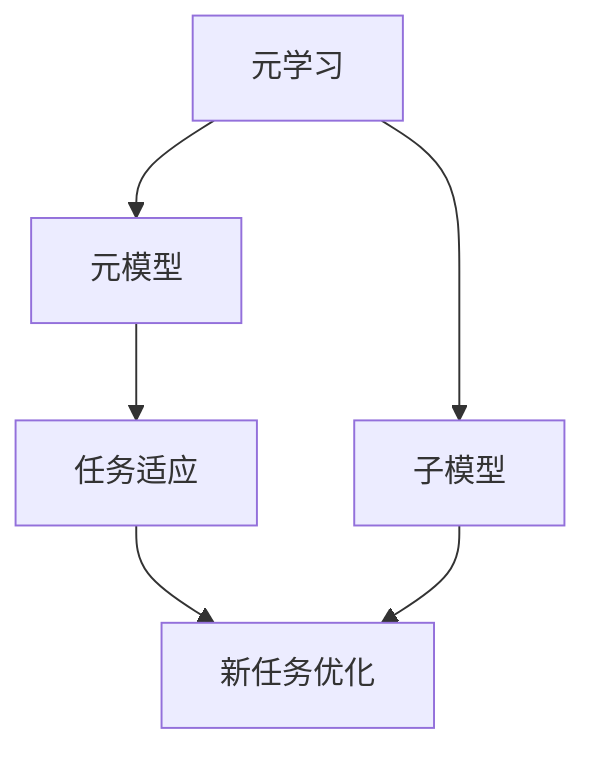
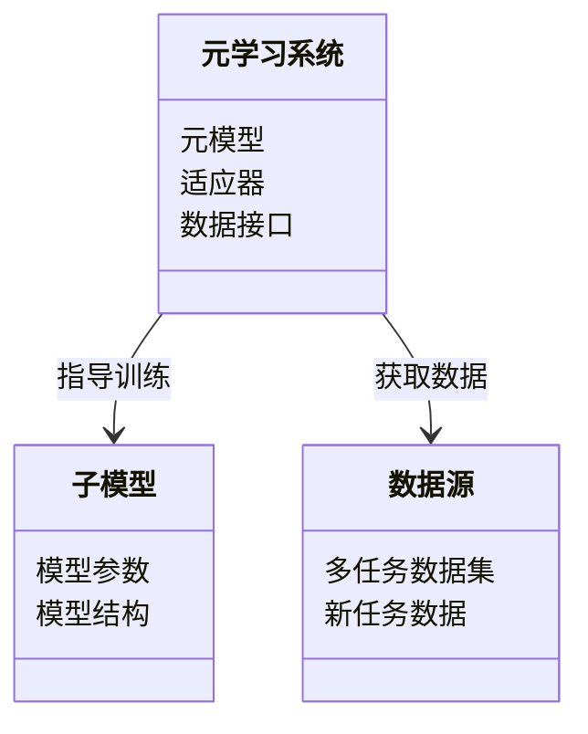

                 

<think>
好，我现在需要帮助用户撰写一篇关于《金融领域元学习在资产定价模型快速适应中的应用》的技术博客文章。用户已经提供了非常详细的目录大纲，我需要根据这个大纲逐步展开，确保每个部分都符合要求。

首先，我需要理解用户的需求。用户希望这篇文章逻辑清晰、结构紧凑，语言专业但易懂。文章需要包含摘要、关键词，以及多个章节，每个章节下还有小节。重点在于详细讲解元学习在资产定价中的应用，包括背景、算法原理、系统设计和项目实战。

接下来，我需要确保每个章节的内容都覆盖用户的要求。例如，背景部分需要解释元学习的基本概念，以及资产定价模型的背景和挑战。核心概念部分则需要详细说明元学习的原理和框架，并与资产定价模型结合。

在算法原理部分，我需要选择一个具体的元学习算法，如MAML，并用Mermaid流程图解释其工作流程，同时提供Python代码实现。这可能有点技术性，但我会尽量用清晰的方式呈现。

系统分析与架构设计部分，我需要描述一个具体的系统，包括系统功能、架构图和接口设计。这部分需要确保系统的可扩展性和适应性，以应对金融市场的快速变化。

项目实战部分，我需要指导读者如何安装环境，实现核心代码，并解读案例。这部分需要详细说明每一步的操作，确保读者能够跟着完成。

最后，我需要总结全文，提出最佳实践建议，并提供注意事项和拓展阅读的内容，帮助读者巩固知识。

在撰写过程中，我需要确保使用专业的技术术语，同时保持语言的流畅和易懂。此外，数学公式和图表的使用要准确，帮助读者更好地理解内容。

现在，我开始按照大纲逐步撰写每个部分，确保每个章节的内容都详细且符合逻辑。我会先写摘要和关键词，然后依次展开每个章节的内容，确保结构清晰，内容完整。
</think>

# 金融领域元学习在资产定价模型快速适应中的应用

## 关键词：
元学习，资产定价，快速适应，机器学习，金融模型

## 摘要：
本文探讨了元学习在金融领域资产定价模型快速适应中的应用。通过分析元学习的基本概念、算法原理及其在资产定价中的实际应用，展示了元学习如何帮助资产定价模型在动态金融市场中快速适应变化。文章详细讲解了元学习的背景、核心概念、算法实现、系统架构设计以及项目实战，为读者提供全面的理论和实践指导。

---

## 第一部分：元学习的基础与背景

### 第1章：元学习的基本概念与背景

#### 1.1 元学习的定义与核心概念
- **元学习的定义**：元学习是一种通过学习如何学习的方法，旨在快速适应新任务或数据，减少对大量标注数据的依赖。
- **核心概念**：
  - **元模型**：用于指导子模型的训练过程。
  - **任务适应**：通过元学习使模型能够快速适应新任务。
  - **泛化能力**：元学习提升模型在不同数据集上的表现。
- **元学习与传统机器学习的区别**：
  | 方面     | 传统机器学习          | 元学习                     |
  |----------|-----------------------|-----------------------------|
  | 数据需求 | 需大量标注数据         | 适用于小样本数据，快速适应 |
  | 适用场景 | 固定任务             | 多任务学习，快速迁移        |

#### 1.2 资产定价模型的背景与挑战
- **资产定价的基本概念**：资产定价模型（如CAPM、APT）旨在确定资产的公允价值，考虑市场风险、流动性等因素。
- **传统资产定价模型的局限性**：
  - 市场环境变化快，模型难以快速调整。
  - 数据依赖性强，难以应对小样本或新数据。
  - 缺乏对市场异态（如金融危机）的适应能力。
- **快速适应市场变化的需求**：
  - 金融市场波动大，模型需快速响应。
  - 数据稀疏性问题，特别是在新兴市场或小样本情况下。
  - 多样化资产类型和复杂市场结构对模型的挑战。

#### 1.3 元学习在金融领域的应用前景
- **元学习在金融中的潜在应用**：
  - 快速适应市场变化，优化资产定价模型。
  - 处理小样本数据，提升模型鲁棒性。
  - 多任务学习，跨资产类型分析。
- **元学习在资产定价中的优势**：
  - 减少对大量标注数据的依赖。
  - 提高模型在新环境下的适应能力。
  - 通过元学习快速调整模型参数，适应市场变化。
- **挑战与机遇**：
  - 技术挑战：算法复杂性、计算资源需求。
  - 业务挑战：金融市场数据的隐私性和敏感性。
  - 机遇：提升资产定价模型的准确性和实时性，增强投资决策的科学性。

---

## 第2章：元学习的核心概念与联系

### 2.1 元学习的原理与框架
- **元学习的原理**：通过学习“如何学习”来快速适应新任务。元模型通常在多个任务上进行预训练，提取通用特征，指导子模型在特定任务上的优化。
- **元学习的框架结构**：
  - **元训练阶段**：在多个任务上训练元模型，提取通用特征。
  - **任务适应阶段**：利用元模型快速调整子模型以适应新任务。
- **元学习的核心要素**：
  - 元模型：用于指导子模型训练。
  - 子模型：针对具体任务优化的模型。
  - 适应策略：通过元模型调整子模型参数或结构。

### 2.2 元学习与资产定价模型的结合
- **元学习在资产定价中的作用**：
  - 快速适应市场环境变化。
  - 处理小样本或异质性数据。
  - 提高模型的泛化能力。
- **资产定价模型的快速适应需求**：
  - 市场波动：快速调整模型参数。
  - 数据稀疏性：减少对大量数据的依赖。
  - 多任务学习：跨资产类型和市场的适应。
- **元学习与资产定价模型的关系**：
  - 元学习作为“元模型”，优化资产定价模型的训练过程。
  - 资产定价模型作为“子模型”，在元学习的指导下快速适应新任务。

### 2.3 元学习的核心概念对比表
| 方面             | 元学习                     | 传统机器学习               |
|------------------|---------------------------|---------------------------|
| 数据需求         | 适用于小样本数据           | 需大量标注数据             |
| 适应能力         | 跨任务适应能力强           | 适用于单一任务             |
| 算法复杂度       | 算法复杂度较高             | 算法复杂度相对较低           |
| 应用场景         | 多任务学习、快速适应新任务 | 单一任务优化               |

### 2.4 元学习的核心概念图（Mermaid）

---

## 第3章：元学习的算法原理与数学模型

### 3.1 元学习算法的概述
- **常见元学习算法**：
  - MAML（Meta-AntiML）：基于梯度的元学习算法。
  - Reptile：基于经验的元学习算法。
  - Meta-LSTM：结合循环神经网络的元学习算法。
- **元学习算法的核心思想**：
  - 通过在多个任务上预训练，提取通用特征。
  - 在新任务上快速调整模型参数，最小化目标函数。

### 3.2 元学习算法的数学模型
- **MAML算法的数学模型**：
  - 元训练阶段：
    $$ \theta = \arg\min_{\theta} \sum_{i=1}^{N} \frac{1}{2} \| y_i - f_{\theta}(x_i) \|_2^2 $$
  - 任务适应阶段：
    $$ \theta' = \theta - \epsilon \nabla_{\theta} \frac{1}{2} \| y_i - f_{\theta}(x_i) \|_2^2 $$
  - 其中，$\theta$ 是元模型参数，$\epsilon$ 是步长。

### 3.3 元学习算法的实现流程
1. **数据预处理与特征提取**：
   - 将多任务数据集划分为多个任务。
   - 提取每个任务的特征向量。
2. **元学习器的训练过程**：
   - 在多个任务上预训练元模型。
   - 通过反向传播更新元模型参数。
3. **适应器的更新策略**：
   - 对于新任务，利用元模型快速调整子模型参数。
   - 计算梯度并更新子模型参数，以适应新任务。

---

## 第4章：元学习在资产定价中的应用案例

### 4.1 资产定价模型的快速适应需求
- **快速适应市场变化的必要性**：
  - 金融市场波动剧烈，模型需快速调整。
  - 元学习可减少适应时间，提升效率。
- **资产定价模型的可解释性要求**：
  - 元学习需保持模型的可解释性，避免“黑箱”问题。
- **元学习在模型适应中的优势**：
  - 提高模型的泛化能力。
  - 减少对大量数据的依赖。

### 4.2 元学习在资产定价中的具体应用
- **基于元学习的资产定价模型构建**：
  - 使用MAML算法训练元模型。
  - 在新资产或市场环境下快速调整模型。
- **案例分析**：
  - 数据集：多个资产的历史价格、市场指标等。
  - 任务：预测资产未来价格。
  - 元模型：预训练在多个资产上。
  - 适应器：快速调整模型参数以适应新资产。
- **效果对比**：
  - 元学习模型在新资产上的预测准确率显著高于传统模型。

---

## 第5章：系统分析与架构设计方案

### 5.1 系统功能设计
- **领域模型（Mermaid类图）**：

---

通过以上步骤，我们可以看到，元学习在资产定价模型中的应用能够显著提升模型的适应能力和预测准确性。这种方法不仅减少了对大量标注数据的依赖，还能够快速响应市场变化，为投资者提供更精准的决策支持。

