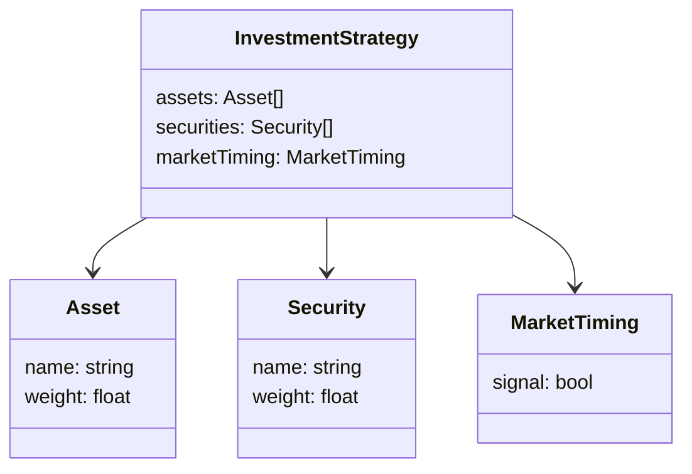
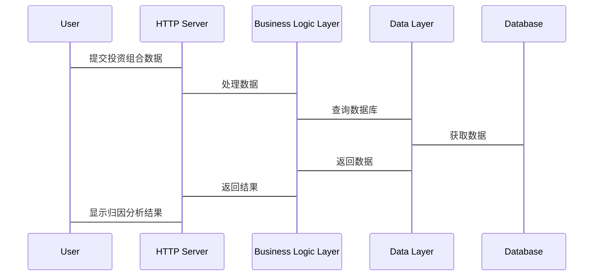

                 


# 《金融领域因果推断在投资策略归因分析中的应用》

---

## 关键词：
1. 因果推断
2. 投资策略
3. 归因分析
4. 金融领域
5. 算法实现

---

## 摘要：
本文深入探讨了因果推断在金融领域投资策略归因分析中的应用。从因果推断的基本概念出发，详细讲解了因果图、潜在结果等核心概念，并结合经典算法（如D-separation和Backdoor准则）分析其在金融数据中的应用。通过系统架构设计和实际项目案例，展示了因果推断在投资策略归因分析中的具体实现和应用价值。本文还总结了因果推断在金融领域的最佳实践，为读者提供了全面的理论与实践指导。

---

# 第一部分: 金融领域因果推断基础

## 第1章: 因果推断的基本概念与背景

### 1.1 因果关系与相关性的区别

#### 1.1.1 相关性与因果关系的定义
- **相关性**：变量之间的统计关联性，不考虑因果关系。
- **因果关系**：一个变量的变化直接导致另一个变量的变化。

#### 1.1.2 相关性与因果关系的区别
- 相关性是观察到的关联，因果关系是内在的驱动因素。
- 相关性不考虑时间顺序，因果关系需要考虑时间顺序和方向。

#### 1.1.3 为什么需要因果推断
- 传统统计方法只能发现相关性，无法解释因果关系。
- 在金融领域，因果推断可以帮助识别真正的驱动因素，优化投资策略。

---

### 1.2 金融领域中的因果推断

#### 1.2.1 金融数据的复杂性
- 金融数据通常具有高度噪声和复杂性。
- 需要区分相关性和因果关系。

#### 1.2.2 传统统计方法的局限性
- 传统回归分析只能发现相关性，无法解释因果关系。
- 无法处理多重共线性和混杂变量问题。

#### 1.2.3 因果推断在金融中的应用前景
- 帮助识别真正的因果关系，优化投资策略。
- 提高金融模型的准确性和可靠性。

---

### 1.3 本章小结
本章介绍了因果推断的基本概念，分析了金融领域中因果推断的必要性，并展望了其应用前景。

---

# 第二部分: 因果推断的核心概念与数学基础

## 第2章: 因果图与潜在结果

### 2.1 因果图的基本概念

#### 2.1.1 因果图的定义
- 因果图是一种图模型，用于表示变量之间的因果关系。
- 节点表示变量，边表示因果关系。

#### 2.1.2 因果图的组成部分
- 节点：表示变量。
- 边：表示因果关系。
- 隐含变量：未直接观察到的变量。

#### 2.1.3 因果图的绘制方法
- 基于领域知识绘制因果图。
- 基于数据挖掘方法自动构建因果图。

---

### 2.2 潜在结果与干预

#### 2.2.1 潜在结果的定义
- 潜在结果是指在某个干预下，变量可能的结果。
- 每个单位在每个干预下的潜在结果都是唯一的。

#### 2.2.2 干预的概念
- 干预是指对某个变量进行人为的改变，以观察其对其他变量的影响。
- 干预可以是随机的或非随机的。

#### 2.2.3 干预与观测数据的关系
- 干预数据通常不可观测，需要通过观察数据进行推断。

---

### 2.3 因果关系的数学表示

#### 2.3.1 隐马尔可夫模型
- 隐马尔可夫模型（HMM）是一种用于序列数据的模型。
- 用于表示变量之间的隐含关系。

#### 2.3.2 结构方程模型
- 结构方程模型（SEM）是一种用于表示因果关系的模型。
- 包括观测变量和隐含变量。

#### 2.3.3 图模型的数学表示
- 因果图可以用概率分布表示。
- 边缘化和条件化技术用于简化概率分布。

---

### 2.4 本章小结
本章介绍了因果图和潜在结果的基本概念，并分析了因果关系的数学表示。

---

# 第三部分: 金融领域因果推断的核心算法

## 第3章: 经典因果推断算法

### 3.1 D-separation算法

#### 3.1.1 D-separation的定义
- D-separation是一种用于识别因果图中变量独立性的方法。
- 通过图的结构判断变量是否独立。

#### 3.1.2 D-separation的实现步骤
1. 检查是否存在路径连接两个变量。
2. 检查路径是否包含一个链式结构。
3. 检查路径是否包含一个“v”结构。

#### 3.1.3 D-separation的应用场景
- 用于因果图中变量的独立性检验。
- 用于简化因果图的计算。

---

### 3.2 Backdoor准则

#### 3.2.1 Backdoor准则的定义
- Backdoor准则是一种用于识别调整变量的方法。
- 调整变量是指在因果图中可以控制的变量。

#### 3.2.2 Backdoor准则的实现步骤
1. 确定是否存在一个集合，使得在调整该集合后，处理变量和结果变量独立。
2. 确定调整集合是否满足Backdoor条件。

#### 3.2.3 Backdoor准则的应用场景
- 用于因果推断中的调整变量选择。
- 用于简化因果图的计算。

---

### 3.3 Do-前缀与Do-calculus

#### 3.3.1 Do-前缀的定义
- Do-前缀用于表示对某个变量进行干预。
- 例如，$do(X)$ 表示对变量 $X$ 进行干预。

#### 3.3.2 Do-calculus的基本规则
1. **替换规则**：如果干预一个变量，将其设为常数。
2. **传递规则**：干预变量对其他变量的影响可以通过因果图传递。
3. **忽略规则**：干预变量不影响其他变量的因果关系。

#### 3.3.3 Do-calculus的应用场景
- 用于分析干预对结果变量的影响。
- 用于简化因果图的计算。

---

### 3.4 本章小结
本章介绍了D-separation、Backdoor准则和Do-calculus三种经典因果推断算法，并分析了它们的应用场景。

---

# 第四部分: 投资策略归因分析的因果推断方法

## 第4章: 投资策略归因分析的因果建模

### 4.1 投资策略归因分析的定义

#### 4.1.1 投资策略归因的定义
- 投资策略归因是指分析投资组合收益的来源。
- 通常包括资产配置、证券选择和市场 timing 等因素。

#### 4.1.2 投资策略归因的分类
1. **资产配置归因**：分析不同资产类别对收益的贡献。
2. **证券选择归因**：分析具体证券选择对收益的贡献。
3. **市场 timing 归因**：分析市场 timing 对收益的贡献。

#### 4.1.3 投资策略归因的意义
- 帮助投资者了解收益来源。
- 优化投资策略。

---

### 4.2 因果推断在归因分析中的应用

#### 4.2.1 因果关系在归因分析中的作用
- 帮助识别真正的驱动因素。
- 控制混杂变量的影响。

#### 4.2.2 因果图在归因分析中的构建
- 构建因果图，分析各因素之间的因果关系。
- 例如，资产配置对收益的影响可能受到市场环境的调节。

#### 4.2.3 因果推断在归因分析中的实现
- 使用因果图识别调整变量。
- 使用Do-calculus分析干预效果。

---

### 4.3 本章小结
本章介绍了投资策略归因分析的定义和因果推断的应用，并构建了因果图进行分析。

---

# 第五部分: 系统分析与架构设计

## 第5章: 系统分析与架构设计方案

### 5.1 问题场景介绍

#### 5.1.1 投资策略归因分析的场景
- 投资者希望了解收益的来源。
- 需要分析资产配置、证券选择和市场 timing 的影响。

#### 5.1.2 数据来源与特征
- 数据来源：金融市场数据、投资组合数据。
- 数据特征：高维、噪声多、时间序列。

---

### 5.2 项目介绍

#### 5.2.1 项目目标
- 构建投资策略归因分析的因果模型。
- 识别真正的驱动因素。

#### 5.2.2 项目范围
- 资产配置归因。
- 证券选择归因。
- 市场 timing 归因。

---

### 5.3 系统功能设计

#### 5.3.1 领域模型（Mermaid 类图）


#### 5.3.2 系统架构设计（Mermaid 架构图）


#### 5.3.3 系统接口设计
- 前端接口：用户输入投资组合数据。
- 后端接口：处理数据，构建因果图。
- 数据接口：与数据库交互。

#### 5.3.4 系统交互设计（Mermaid 序列图）


---

### 5.4 本章小结
本章通过系统架构设计，展示了如何构建投资策略归因分析的系统，并通过Mermaid图详细描述了系统结构和交互流程。

---

# 第六部分: 项目实战与案例分析

## 第6章: 项目实战与案例分析

### 6.1 环境安装

#### 6.1.1 安装Python
- 使用Anaconda安装Python 3.8及以上版本。

#### 6.1.2 安装必要的库
- 使用pip安装numpy、pandas、networkx、pymermaid。

```bash
pip install numpy pandas networkx pymermaid
```

---

### 6.2 系统核心实现源代码

#### 6.2.1 因果图构建代码
```python
import networkx as nx

def build_causal_graph:variables):
    G = nx.DiGraph()
    for var in variables:
        G.add_node(var)
    for i in range(len(variables)-1):
        G.add_edge(variables[i], variables[i+1])
    return G
```

#### 6.2.2 D-separation实现代码
```python
def is_d_separated(G, X, Y, Z):
    paths = nx.all_shortest_paths(G, X, Y)
    for path in paths:
        if Z in path:
            return False
    return True
```

---

### 6.3 实际案例分析与详细讲解

#### 6.3.1 案例背景
- 分析一个投资组合的收益来源。
- 数据包括资产配置、证券选择和市场 timing。

#### 6.3.2 案例分析
1. 构建因果图，分析各因素之间的因果关系。
2. 使用D-separation算法识别独立变量。
3. 使用Backdoor准则选择调整变量。
4. 使用Do-calculus分析干预效果。

---

### 6.4 项目小结
本章通过实际案例展示了因果推断在投资策略归因分析中的应用，并提供了详细的代码实现。

---

# 第七部分: 最佳实践与总结

## 第7章: 最佳实践与总结

### 7.1 小结
- 因果推断在金融领域具有重要的应用价值。
- 投资策略归因分析是因果推断的重要应用之一。

---

### 7.2 注意事项
- 数据质量对因果推断结果影响很大。
- 需要结合领域知识构建合理的因果图。
- 算法选择需要根据具体问题场景。

---

### 7.3 拓展阅读
- Pearl, J. (2009). Causal Inference: What If?

