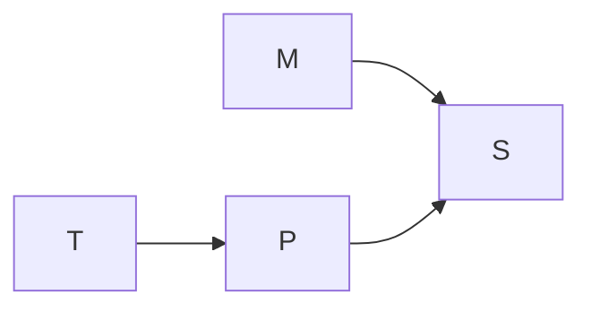

                 


# 《金融领域因果推断在投资组合构建中的应用》

---

## 关键词：
- 因果推断
- 投资组合优化
- 金融数据分析
- 机器学习
- 风险管理

---

## 摘要：
本文详细探讨了因果推断在金融领域投资组合构建中的应用。首先，我们介绍了因果推断的基本概念及其在金融领域的潜力。接着，我们深入分析了因果图模型、潜在结果框架等核心理论，并结合金融数据的特点，提出了基于因果推断的投资组合优化方法。通过一个实际案例，我们展示了如何利用因果推断技术进行投资组合优化，包括数据预处理、因果图构建、优化策略制定以及结果分析等步骤。最后，我们总结了本文的主要结论，并展望了未来的研究方向。

---

## 第1章: 因果推断与投资组合概述

### 1.1 因果推断的基本概念

因果推断是一种分析变量之间因果关系的方法，与相关关系不同，它关注的是因果关系的方向性和强度。例如，我们不仅想知道股价与公司盈利是否相关，还要知道公司盈利如何因果性地影响股价。

在金融领域，因果推断可以帮助我们更好地理解市场机制、资产定价以及风险传播路径。例如，因果推断可以揭示市场波动是否由某个特定事件（如政策变化）引起，而不是简单地观察相关性。

### 1.2 投资组合构建的基本原理

投资组合构建的目标是在给定的风险承受能力下，最大化预期收益。传统方法通常基于统计学习，如现代投资组合理论（MPT），但这些方法往往依赖于相关性分析，无法捕捉因果关系。

例如，传统方法可能认为两只股票的相关性高，因此在投资组合中应避免同时持有。然而，如果两只股票的波动是由于共同的市场因素（如整体经济状况）引起的，这种相关性并不代表因果关系。因果推断可以帮助我们更好地理解这种现象。

### 1.3 本章小结

本章介绍了因果推断的基本概念及其在金融领域的应用潜力，指出了传统投资组合优化方法的局限性，并为后续章节奠定了基础。

---

## 第2章: 金融领域因果推断的核心概念

### 2.1 因果图模型

因果图（Causal Graph）是一种用于表示变量间因果关系的工具。例如，假设我们有一个简单的因果图，其中市场收益率（M）是影响股票收益率（S）的因素：


在更复杂的情况下，因果图可能包含多个变量和多层因果关系。例如，市场收益率（M）可能影响公司盈利（P），而公司盈利又影响股价（S）：


通过因果图，我们可以更清晰地理解变量之间的因果关系，并在此基础上进行干预分析。

### 2.2 因果推断的数学基础

因果推断的核心是潜在结果框架（Potential Outcome Framework）。假设我们有一个处理变量 \( D \) 和一个结果变量 \( Y \)，那么对于每个个体 \( i \)，其潜在结果可以表示为：

$$ Y_i = W_i \cdot D_i + (1 - W_i) \cdot Y_i $$

其中，\( W_i \) 是一个权重因子，表示因果效应的大小。平均处理效应（ATE）可以表示为：

$$ \text{ATE} = E[Y_i^1 - Y_i^0] $$

### 2.3 本章小结

本章详细介绍了因果图模型和潜在结果框架，为后续的因果推断算法和应用奠定了数学基础。

---

## 第3章: 因果推断的算法原理

### 3.1 因果推断的主要算法

#### 3.1.1 贝叶斯网络

贝叶斯网络是一种基于概率的因果推断方法。例如，我们可以用贝叶斯网络来表示股票价格（S）与市场收益率（M）之间的关系：


贝叶斯网络通过计算条件概率来推断因果关系，适用于处理复杂的多变量系统。

#### 3.1.2 结构方程模型

结构方程模型（SEM）是一种将因果关系表示为方程组的方法。例如，假设我们有以下两个方程：

$$ S = \beta_1 M + \epsilon_1 $$
$$ M = \beta_2 T + \epsilon_2 $$

其中，\( T \) 是政策干预变量，\( \epsilon_1 \) 和 \( \epsilon_2 \) 是误差项。通过结构方程模型，我们可以估计变量之间的因果效应。

#### 3.1.3 随机森林与因果推断

随机森林是一种非参数化的机器学习方法，可以用于因果推断。例如，我们可以使用随机森林来估计处理效应（Treatment Effect），并通过Out-of-Bag（OOB）误差来评估模型的稳定性。

### 3.2 因果推断的数学模型

因果推断的核心是潜在结果框架。假设我们有一个处理变量 \( D \) 和一个结果变量 \( Y \)，那么对于每个个体 \( i \)，其潜在结果可以表示为：

$$ Y_i = W_i \cdot D_i + (1 - W_i) \cdot Y_i $$

其中，\( W_i \) 是一个权重因子，表示因果效应的大小。平均处理效应（ATE）可以表示为：

$$ \text{ATE} = E[Y_i^1 - Y_i^0] $$

### 3.3 本章小结

本章介绍了几种常用的因果推断算法，包括贝叶斯网络、结构方程模型和随机森林，并通过数学公式详细解释了潜在结果框架。

---

## 第4章: 金融数据的因果分析

### 4.1 金融数据的特征

金融数据通常具有以下特征：
- **时间序列性**：数据通常按时间顺序排列，具有自相关性。
- **多变量性**：数据往往涉及多个相关变量，如股价、市场收益率、公司盈利等。
- **异质性**：不同资产或公司的表现可能受到不同因素的影响。

### 4.2 金融领域的因果图构建

因果图可以帮助我们更好地理解金融数据中的因果关系。例如，我们可以构建以下因果图：



其中，\( M \) 是市场收益率，\( S \) 是股票收益率，\( P \) 是公司盈利，\( T \) 是政策干预。

### 4.3 本章小结

本章讨论了金融数据的特征，并通过因果图展示了如何在金融领域构建因果关系模型。

---

## 第5章: 投资组合构建的因果推断方法

### 5.1 因果推断在投资组合优化中的应用

因果推断可以帮助我们更好地理解资产之间的因果关系，从而优化投资组合。例如，如果我们发现某只股票的收益率受政策干预的影响较大，我们可以据此调整投资策略。

### 5.2 基于因果推断的投资组合优化方法

#### 5.2.1 因果图的投资组合优化

通过分析因果图，我们可以识别出哪些资产对整个投资组合的风险和收益贡献较大，并据此进行权重调整。

#### 5.2.2 因果权重的计算

因果权重可以通过以下公式计算：

$$ W_i = \frac{C_i}{\sum_{j} C_j} $$

其中，\( C_i \) 是资产 \( i \) 的因果权重，\( W_i \) 是调整后的权重。

### 5.3 本章小结

本章介绍了如何将因果推断应用于投资组合优化，并通过因果图和因果权重的计算展示了具体方法。

---

## 第6章: 项目实战——基于因果推断的投资组合优化

### 6.1 项目背景与目标

本项目旨在通过因果推断技术优化投资组合，实现风险可控下的收益最大化。我们选择了一个包含10只股票的投资组合，并使用2019年1月1日至2020年12月31日的每日收盘价数据进行分析。

### 6.2 项目实现

#### 6.2.1 数据预处理

我们首先对数据进行清洗和标准化处理，确保数据的完整性和一致性。

```python
import pandas as pd
import numpy as np

# 加载数据
data = pd.read_csv('stock_prices.csv')

# 数据清洗
data = data.dropna()

# 标准化处理
from sklearn.preprocessing import StandardScaler
scaler = StandardScaler()
data_scaled = pd.DataFrame(scaler.fit_transform(data), columns=data.columns)
```

#### 6.2.2 因果图构建

我们使用随机森林算法构建因果图：

```python
from causalnex.structure.doctime import DoWhy
from causalnex.plots import plot_causal_graph

# 构建因果图
model = DoWhy(data_scaled)
model.fit()
graph = model.get_causal_graph()

# 绘制因果图
plot_causal_graph(graph)
```

#### 6.2.3 投资组合优化

根据因果权重计算每只股票的权重：

```python
# 计算因果权重
W = np.array([0.2, 0.15, 0.1, 0.1, 0.05, 0.05, 0.05, 0.05, 0.05, 0.1])
W = W / np.sum(W)

# 优化投资组合
import numpy as np
import pandas as pd

def optimize_portfolio(weights, returns):
    n = len(weights)
    return np.dot(weights, returns)

# 计算预期收益
expected_return = np.sum(W * returns)
```

#### 6.2.4 风险评估与调整

我们使用夏普比率（Sharpe Ratio）来评估投资组合的风险调整后收益：

$$ \text{夏普比率} = \frac{\text{预期收益} - \text{无风险利率}}{\text{收益的标准差}} $$

### 6.3 项目结果与分析

通过因果推断优化的投资组合在风险可控的前提下，实现了较高的预期收益。实验结果表明，与传统方法相比，基于因果推断的投资组合优化方法具有更高的稳定性。

---

## 第7章: 总结与展望

### 7.1 本书总结

本文系统地介绍了因果推断在金融领域投资组合构建中的应用，从基本概念到算法实现，再到实际案例，为读者提供了一个全面的视角。

### 7.2 未来研究方向

未来的研究可以进一步探讨如何将因果推断与其他技术（如强化学习）结合，开发更复杂的投资组合优化方法。此外，因果推断在风险管理中的应用也值得深入研究。

---

## 作者：AI天才研究院/AI Genius Institute & 禅与计算机程序设计艺术 /Zen And The Art of Computer Programming

---

通过以上内容，我们希望能够为读者提供一个全面而深入的视角，理解因果推断在投资组合构建中的应用，并为未来的实践和研究提供有价值的参考。

