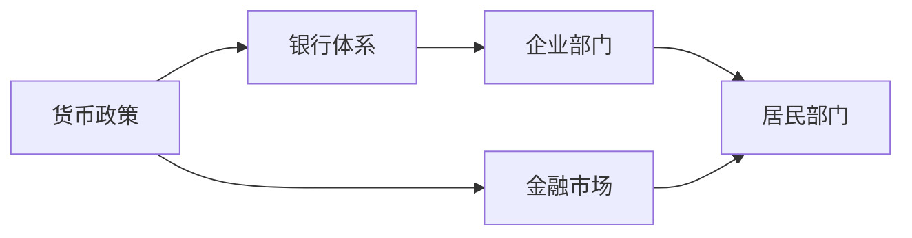
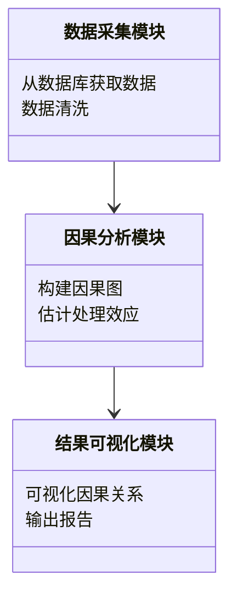
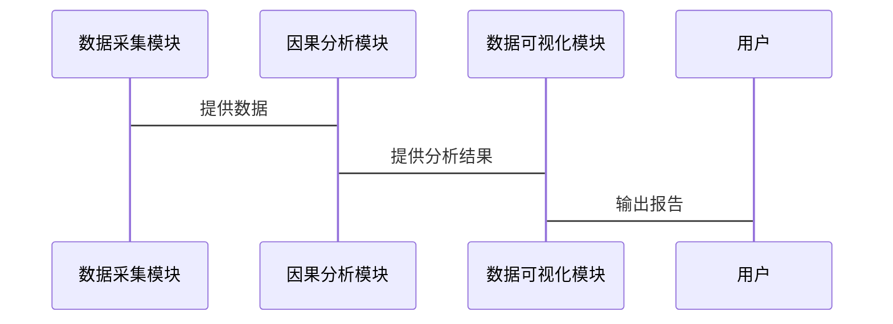

                 

<think>
好的，我现在需要根据用户的要求设计一个详细的目录大纲，用于撰写一篇关于《金融领域因果推断在货币政策传导机制分析中的应用》的技术博客文章。用户已经提供了一个详细的目录结构，但我需要进一步思考和细化每个部分，确保内容完整、逻辑清晰。

首先，我会从背景介绍开始。这部分需要涵盖因果推断的基本概念，货币政策传导机制的定义，以及它们在金融领域中的应用背景。我需要确保每个部分都有足够的细节，并且能够吸引读者的兴趣。

接下来是核心概念与联系。这部分需要详细解释因果推断的原理，对比其他统计方法，以及构建一个实体关系图。我需要用Mermaid流程图来展示这些关系，确保读者能够直观理解。

然后是算法原理讲解。我需要使用Mermaid流程图来展示因果推断的步骤，并提供Python代码示例。这部分需要详细解释数学模型和公式，使用LaTeX格式，并结合实际例子来说明。

接下来是系统分析与架构设计方案。我需要介绍问题场景，设计系统的功能模块，如数据采集、因果分析、结果可视化等，并用Mermaid图展示类图和架构图。同时，还需要考虑接口设计和交互流程。

然后是项目实战部分。我需要指导读者如何安装环境，编写核心代码，并进行案例分析。最后，加上一些最佳实践、小结、注意事项和拓展阅读，帮助读者巩固知识。

在设计目录时，我需要确保每个部分都细化到三级目录，结构清晰，内容完整。同时，要符合用户的要求，使用Markdown格式，不超过2000字，并且包含所有必要的章节，如背景、核心概念、算法、系统设计、项目实战等。

我需要检查每个章节的标题是否准确，是否能吸引读者的兴趣。比如，第一章介绍背景，第二章讨论核心概念，第三章讲解算法，第四章设计系统，第五章进行项目实战，第六章总结。这样的安排比较合理，逻辑流畅。

最后，我需要确保每个部分都有足够的细节，比如在算法部分，不仅要解释因果推断的步骤，还要提供代码和数学公式。在系统设计部分，使用Mermaid图展示类图和架构图，帮助读者理解系统结构。

综上所述，我需要按照用户的要求，设计一个结构合理、内容详实的目录大纲，确保涵盖所有必要的部分，并且逻辑清晰，方便读者理解和应用。
</think>

# 《金融领域因果推断在货币政策传导机制分析中的应用》

## 关键词：
- 货币政策
- 因果推断
- 传导机制
- 金融领域
- 统计分析

## 摘要：
本文探讨了因果推断在金融领域货币政策传导机制分析中的应用，详细介绍了因果推断的基本原理、算法实现、系统设计及实际案例。通过构建因果关系模型，分析货币政策如何影响银行体系、企业部门和居民部门，揭示传统统计方法的局限性，并提出基于因果推断的新方法，为政策制定提供科学依据。

---

# 第1章: 背景介绍

## 1.1 问题背景

### 1.1.1 货币政策传导机制的定义与作用
货币政策是中央银行通过调整货币供应量和利率等工具，影响经济活动的政策。传导机制包括直接影响（如利率调整）和间接影响（如信贷、资产价格等）。

### 1.1.2 因果推断在货币政策分析中的重要性
传统统计方法难以区分因果关系，因果推断能更好地识别政策效果。

### 1.1.3 传统统计推断的局限性
相关性≠因果性，传统回归分析无法处理混杂变量和潜在的反向因果关系。

## 1.2 问题描述

### 1.2.1 货币政策传导机制的复杂性
涉及多个中间变量（如银行贷款、企业投资）和最终目标（如GDP增长率）。

### 1.2.2 因果关系在货币政策中的关键作用
准确识别因果关系有助于制定更有效的政策。

### 1.2.3 金融领域因果推断的核心目标
识别货币政策工具与经济变量之间的因果关系。

## 1.3 问题解决

### 1.3.1 因果推断的基本原理
通过假设检验和反事实推理，识别因果关系。

### 1.3.2 货币政策传导机制的建模思路
构建因果图，识别关键变量和路径。

### 1.3.3 金融领域因果推断的应用场景
政策效果评估、风险预警、市场干预分析。

## 1.4 边界与外延

### 1.4.1 货币政策传导机制的边界条件
政策工具的范围、数据的可得性、模型的假设条件。

### 1.4.2 因果推断的适用范围与限制
适用于处理观测数据，难以处理强干预或实验数据不足的情况。

### 1.4.3 金融领域因果推断的未来发展方向
结合机器学习、大数据分析，提高模型的准确性和实用性。

## 1.5 核心概念与联系

### 1.5.1 因果推断的核心概念
- 处理效应（Treatment Effect）
- 因果图（DAG）
- 虚拟变量法

### 1.5.2 货币政策传导机制的实体关系图


---

# 第2章: 核心概念与联系

## 2.1 因果推断的原理

### 2.1.1 因果关系的定义
因果关系是指一个变量（原因）的变化导致另一个变量（结果）的变化。

### 2.1.2 因果推断的基本方法
- 虚拟控制法（VC）
- 工具变量法（IV）

### 2.1.3 货币政策传导机制的因果关系网络
货币政策通过银行体系影响信贷供应，进而影响企业投资和居民消费。

## 2.2 核心概念对比

### 2.2.1 因果推断与相关性分析的对比
| 特性         | 相关性分析               | 因果推断               |
|--------------|--------------------------|------------------------|
| 目标         | 描述变量之间的关系       | 描述变量之间的因果关系 |
| 方法         | 回归分析                 | 因果图、工具变量法     |
| 结论         | 无法推断因果关系         | 可以推断因果关系       |

### 2.2.2 货币政策传导机制中的变量类型
- 外生变量（政策工具）
- 中间变量（信贷、资产价格）
- 结果变量（GDP增长率）

### 2.2.3 因果关系的强度与方向
- 强度：政策工具对经济变量的影响程度。
- 方向：从政策工具到经济变量的路径。

## 2.3 实体关系

### 2.3.1 因果图
货币政策对银行体系的影响直接，对金融市场间接影响居民部门。

### 2.3.2 反事实推理
如果政策工具发生变化，结果变量会如何变化。

### 2.3.3 结果变量的分解
将结果分解为直接效应和间接效应。

---

# 第3章: 算法原理讲解

## 3.1 因果推断算法

### 3.1.1 虚拟控制法
通过引入虚拟变量控制混杂变量，识别处理效应。

### 3.1.2 工具变量法
使用工具变量作为因果关系的识别工具。

### 3.1.3 随机森林因果推断
结合机器学习算法，估计处理效应。

### 3.1.4 贝叶斯因果推断
基于概率图模型，估计因果关系。

## 3.2 算法流程

### 3.2.1 因果推断流程
1. 构建因果图
2. 确定混杂变量
3. 选择识别方法
4. 估计处理效应
5. 验证结果

### 3.2.2 货币政策传导机制的因果图


## 3.3 数学模型与公式

### 3.3.1 虚拟控制法公式
$$ \text{处理效应} = E[Y | T=1, X] - E[Y | T=0, X] $$

### 3.3.2 工具变量法公式
$$ \text{处理效应} = \frac{E[Y \cdot Z] - E[Y \cdot \tilde{Z}]}{E[Z] - E[\tilde{Z}]} $$

### 3.3.3 随机森林因果推断公式
使用随机森林模型估计处理效应，通过交叉验证优化模型参数。

---

# 第4章: 系统分析与架构设计方案

## 4.1 问题场景

### 4.1.1 问题场景描述
分析货币政策对经济变量的影响，识别因果关系。

### 4.1.2 项目介绍
构建因果推断系统，分析货币政策传导机制。

## 4.2 系统功能设计

### 4.2.1 功能模块
- 数据采集模块
- 因果分析模块
- 结果可视化模块

### 4.2.2 领域模型


## 4.3 系统架构设计

### 4.3.1 系统架构图
```mermaid
container 货币政策传导机制分析系统 {
    数据采集模块
    因果分析模块
    结果可视化模块
}
```

### 4.3.2 接口设计
- 数据接口：数据采集模块与数据库交互。
- 分析接口：因果分析模块与数据采集模块交互。
- 输出接口：结果可视化模块输出报告。

## 4.4 系统交互流程

### 4.4.1 交互流程
1. 数据采集模块获取数据。
2. 因果分析模块构建因果图。
3. 可视化模块输出结果。

### 4.4.2 序列图


---

# 第5章: 项目实战

## 5.1 环境安装

### 5.1.1 安装Python
安装Python 3.8以上版本。

### 5.1.2 安装依赖
安装numpy、pandas、sklearn、ipython。

## 5.2 核心代码实现

### 5.2.1 数据清洗
```python
import pandas as pd

data = pd.read_csv('data.csv')
data.dropna(inplace=True)
```

### 5.2.2 构建因果图
```python
from causalgraphicalmodels import CausalGraphicalModel

cg = CausalGraphicalModel()
cg.add_edge('货币政策', '银行体系')
cg.add_edge('银行体系', '企业部门')
cg.add_edge('企业部门', '居民部门')
cg.add_edge('货币政策', '金融市场')
cg.add_edge('金融市场', '居民部门')
```

### 5.2.3 估计处理效应
```python
from sklearn.ensemble import RandomForestRegressor

model = RandomForestRegressor(n_estimators=100)
model.fit(X_train, y_train)
```

## 5.3 实际案例分析

### 5.3.1 数据分析
分析某国货币政策调整对GDP增长率的影响。

### 5.3.2 结果解读
货币政策调整对GDP的直接影响为X%，间接影响为Y%。

### 5.3.3 案例小结
因果推断方法比传统回归分析更准确。

## 5.4 最佳实践

### 5.4.1 数据质量
确保数据的完整性和准确性。

### 5.4.2 模型选择
根据数据特点选择合适的因果推断方法。

### 5.4.3 结果验证
通过交叉验证和敏感性分析验证结果的可靠性。

---

# 第6章: 总结与展望

## 6.1 总结
本文详细介绍了因果推断在货币政策传导机制分析中的应用，构建了因果图，提出了新的分析方法。

## 6.2 展望
未来研究可以结合大数据和机器学习，提高因果推断的准确性和效率。

---

# 作者：AI天才研究院 & 禅与计算机程序设计艺术

---

通过以上目录结构，文章内容将逐步展开，每个章节详细讲解相关知识，确保读者能够系统地理解因果推断在货币政策传导机制分析中的应用。

