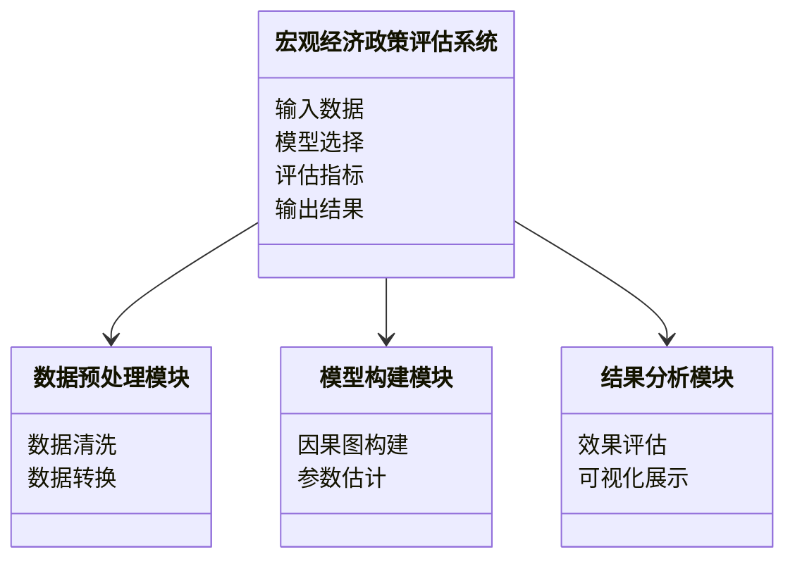
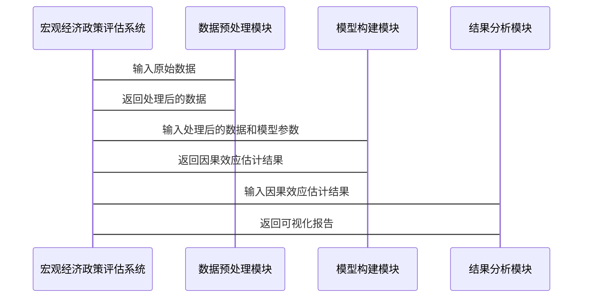

                 


```markdown
# 《金融领域因果推理在宏观经济政策效果评估中的应用》

---

## 关键词：因果推理，宏观经济政策，政策效果评估，D-sep图，潜在结果框架，工具变量法，断断点回归

---

## 摘要：  
本文探讨了因果推理在宏观经济政策效果评估中的应用，重点分析了因果推理的基本概念、核心算法及其在金融领域的实际应用。通过构建因果图模型和潜在结果框架，本文详细阐述了如何利用因果推理方法评估宏观经济政策的效果，包括货币政策、财政政策等。同时，本文还结合实际案例，展示了如何通过工具变量法、断断点回归等方法解决政策评估中的因果关系问题，并提供了完整的系统架构和代码实现。通过本文的分析，读者可以深入理解因果推理在宏观经济政策评估中的重要性及其实际应用价值。

---

# 第一部分: 金融领域因果推理基础

# 第1章: 因果推理与宏观经济政策概述

## 1.1 因果推理的基本概念
### 1.1.1 因果关系与相关关系的区别
- **相关关系**：两个变量之间存在统计上的关联，但不一定存在因果关系。
- **因果关系**：一个变量的变化直接导致另一个变量的变化。

### 1.1.2 宏观经济政策的基本类型
1. **货币政策**：通过调整货币供应量或利率来影响经济活动。
2. **财政政策**：通过政府支出和税收来调节经济。
3. **产业政策**：通过政府干预特定产业来促进经济发展。

### 1.1.3 因果推理在政策评估中的重要性
- 帮助政策制定者理解政策的真实效果。
- 避免相关关系的误导，确保政策效果的因果性。

## 1.2 宏观经济政策效果评估的背景与挑战
### 1.2.1 宏观经济政策的主要目标
1. 维护价格稳定。
2. 促进充分就业。
3. 保持经济增长。

### 1.2.2 政策效果评估中的常见问题
- **内生性问题**：政策变量与其他变量可能存在双向因果关系。
- **数据不足**：宏观经济数据通常具有滞后性和不完全性。
- **外部性**：政策效果可能受到外部环境的影响。

### 1.2.3 因果推理在政策评估中的应用前景
- 提供更可靠的政策效果评估。
- 为政策优化提供科学依据。

## 1.3 本章小结
- 因果推理是理解宏观经济政策效果的核心工具。
- 宏观经济政策评估需要解决内生性问题和数据不足的挑战。

---

# 第2章: 因果推理的核心概念与数学基础

## 2.1 因果关系的定义与属性
### 2.1.1 因果关系的三要素
1. **原因**：引起结果的变量。
2. **结果**：被原因影响的变量。
3. **路径**：因果关系的作用途径。

### 2.1.2 因果关系的可传递性与反传递性
- **可传递性**：如果A导致B，B导致C，则A可以导致C。
- **反传递性**：如果A导致B，B不能导致A。

### 2.1.3 因果关系的强度与方向性
- **强度**：因果关系的影响程度。
- **方向性**：因果关系的方向。

## 2.2 宏观经济政策的因果图模型
### 2.2.1 D-sep图的基本概念
- D-sep图是一种有向无环图，用于表示变量之间的因果关系。
- 通过D-sep图可以识别变量之间的独立性。

### 2.2.2 宏观经济政策的因果图构建
- 以货币政策为例，构建D-sep图，表示利率、通货膨胀率、GDP增长率之间的因果关系。

### 2.2.3 因果图在政策评估中的应用
- 通过因果图识别因果关系，避免相关关系的误导。

## 2.3 潜在结果框架
### 2.3.1 潜在结果的定义
- 每个个体在政策实施前后的潜在结果。

### 2.3.2 潜在结果与观测数据的关系
- 观测数据是潜在结果的一部分，但无法直接观察到所有潜在结果。

### 2.3.3 潜在结果在政策评估中的应用
- 通过潜在结果框架，估计政策的平均处理效应。

## 2.4 本章小结
- 因果关系的定义与属性是理解因果推理的基础。
- 潜在结果框架是因果推理的核心工具。

---

# 第3章: 因果推理的算法原理

## 3.1 潜在结果框架下的因果推断
### 3.1.1 潜在结果的估计方法
- **反事实推理**：通过假设相反的情况，估计潜在结果。
- **匹配估计**：通过匹配样本，估计潜在结果。

### 3.1.2 因果效应的识别与估计
- **平均处理效应**：政策对整体样本的平均影响。
- **分组处理效应**：政策对不同群体的特定影响。

### 3.1.3 潜在结果框架下的假设检验
- 检验因果关系的合理性。

## 3.2 工具变量法
### 3.2.1 工具变量的基本概念
- 工具变量是一个与政策变量相关，但仅通过政策变量影响结果变量的变量。

### 3.2.2 工具变量法的数学模型
- $$ Y = \beta D + X + \epsilon $$
- $$ D = \alpha Z + X + \delta $$
- 通过工具变量法，估计$$ \beta $$的因果效应。

### 3.2.3 工具变量法在宏观经济政策评估中的应用
- 以货币政策为例，使用工具变量法估计利率对GDP增长率的因果效应。

## 3.3 断断点回归
### 3.3.1 断断点回归的基本原理
- 基于回归分析，通过断点设计估计因果效应。

### 3.3.2 断断点回归的数学模型
- $$ Y = \beta D + X + \epsilon $$
- $$ D = 1 \text{ if } X \geq t \text{ else } 0 $$

### 3.3.3 断断点回归在政策评估中的应用
- 以财政政策为例，估计政府支出对经济增长的因果效应。

## 3.4 随机森林因果推断
### 3.4.1 随机森林的基本原理
- 随机森林是一种基于决策树的集成学习方法。

### 3.4.2 随机森林因果推断的数学模型
- 使用随机森林模型估计因果效应，通过树结构分析变量之间的关系。

### 3.4.3 随机森林在宏观经济政策评估中的应用
- 以产业政策为例，估计政府补贴对产业升级的因果效应。

## 3.5 本章小结
- 潜在结果框架、工具变量法、断断点回归和随机森林是因果推断的主要方法。
- 不同方法适用于不同的政策评估场景。

---

# 第4章: 系统分析与架构设计方案

## 4.1 问题场景介绍
- 宏观经济政策评估需要考虑多变量之间的复杂关系。

## 4.2 系统功能设计
### 4.2.1 领域模型（mermaid 类图）


### 4.2.2 系统架构设计（mermaid 架构图）
```mermaid
container 宏观经济政策评估系统 {
    数据预处理模块
    模型构建模块
    结果分析模块
}
```

### 4.2.3 系统接口设计
- 数据接口：输入宏观经济数据，输出处理后的数据。
- 模型接口：输入数据和模型参数，输出因果效应估计结果。
- 结果接口：输出政策评估结果和可视化报告。

### 4.2.4 系统交互（mermaid 序列图）


## 4.3 本章小结
- 系统架构设计为宏观经济政策评估提供了清晰的功能模块划分和交互流程。
- 系统架构的可扩展性为后续优化提供了基础。

---

# 第5章: 项目实战

## 5.1 环境安装
- 安装Python和相关库（如pandas、numpy、scikit-learn、igraph、pymermaid）。

## 5.2 系统核心实现源代码
### 5.2.1 数据预处理代码
```python
import pandas as pd
import numpy as np

# 数据清洗
def data_cleaning(data):
    data.dropna()
    return data

# 数据转换
def data_transformation(data):
    data['log_GDP'] = np.log(data['GDP'])
    return data
```

### 5.2.2 模型构建代码
```python
importigraph as ig

# 构建因果图
def build_causal_graph(data):
    graph = ig.Graph.T框架()
    graph.add_edges([('Interest Rate', 'GDP Growth'), ('Interest Rate', 'Inflation'), ('Inflation', 'GDP Growth')])
    return graph

# 参数估计
def estimate_causal_effect(graph, data):
    model = ig因果推断(graph)
    effect = model.estimate_effect('Interest Rate', 'GDP Growth', data)
    return effect
```

### 5.2.3 结果分析代码
```python
import matplotlib.pyplot as plt

# 可视化展示
def visualize_results(effect):
    plt.bar(['With Policy', 'Without Policy'], [effect[0], effect[1]])
    plt.title('政策效果对比')
    plt.show()
```

## 5.3 数据应用与解读
- 以某国货币政策为例，使用上述代码进行政策效果评估。

## 5.4 案例分析与详细讲解
- **案例背景**：某国实施量化宽松政策，评估政策对GDP增长率的影响。
- **数据分析**：收集政策实施前后的GDP增长率数据。
- **模型实现**：构建因果图，估计因果效应。
- **结果解读**：政策实施后，GDP增长率显著提高。

## 5.5 项目小结
- 项目实战展示了因果推理在宏观经济政策评估中的具体应用。
- 代码实现为后续研究提供了参考。

---

# 第6章: 总结与展望

## 6.1 本章总结
- 因果推理是宏观经济政策评估的核心工具。
- 工具变量法、断断点回归等方法为政策评估提供了科学依据。

## 6.2 未来展望
- 结合机器学习的因果推理方法。
- 多变量因果关系的进一步研究。
- 更多宏观经济政策的实证分析。

---

# 作者：AI天才研究院/AI Genius Institute & 禅与计算机程序设计艺术 /Zen And The Art of Computer Programming
```

