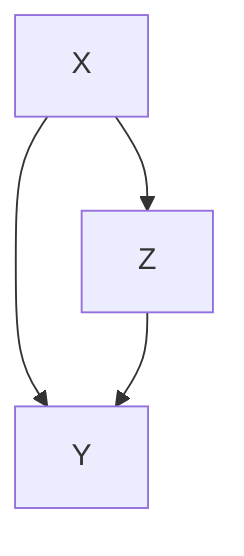
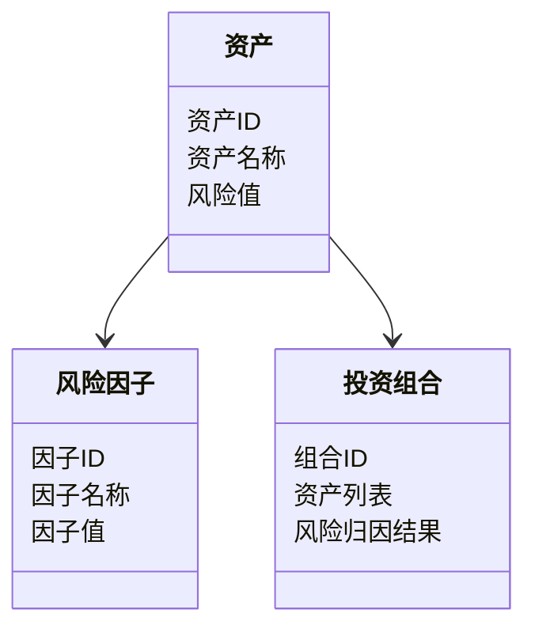
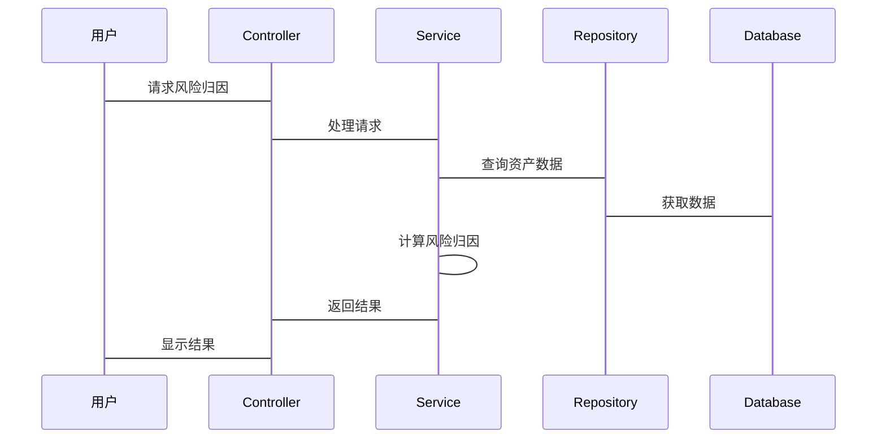

                 

<think>
好，我需要根据用户的要求，撰写一篇关于《金融领域因果推理在投资组合风险归因中的应用》的技术博客。文章需要符合指定的目录结构，每个部分都要详细展开，包含背景介绍、核心概念、算法原理、系统架构、项目实战和最佳实践等。

首先，我会按照目录结构逐步编写每个部分的内容，确保逻辑清晰、结构紧凑。每个章节下还要详细展开，比如在核心概念部分，我需要用表格和Mermaid图表来对比因果关系和相关关系，展示因果图的结构。

接下来，在算法原理部分，我需要解释潜在结果框架和因果图结构学习的数学模型，用Python代码实现，并结合实际案例进行说明。系统架构部分则需要设计领域模型和系统架构图，展示系统的组成部分和交互流程。

项目实战部分，我会提供环境安装步骤和核心代码，解释代码的作用，并通过实际案例分析，最后做一个小结。最后，在最佳实践部分，我会总结一些注意事项，并推荐进一步的阅读方向。

整个过程中，我需要确保文章用词专业，同时保持内容的易懂性，避免过于复杂的术语堆砌。此外，数学公式和代码部分要准确无误，图表清晰易懂。这样，整篇博客才能既有深度又具可读性，真正帮助读者理解因果推理在投资组合风险归因中的应用。
</think>

# 金融领域因果推理在投资组合风险归因中的应用

## 关键词：因果推理、投资组合、风险归因、金融、算法

## 摘要：本文探讨了因果推理在金融领域，特别是投资组合风险归因中的应用。通过分析因果关系的定义、构建因果图的方法，以及潜在结果框架和因果图结构学习的算法原理，结合系统架构设计和项目实战案例，详细解读了因果推理在投资组合风险归因中的具体应用和实现。文章最后总结了最佳实践和注意事项，为读者提供了全面的指导。

---

## 第一部分: 金融领域因果推理基础

### 第1章: 金融领域因果推理概述

#### 1.1 问题背景与问题描述

##### 1.1.1 投资组合风险归因的背景
在金融领域，投资组合的风险管理是投资者关注的核心问题。传统的风险归因方法通常基于相关性分析，难以准确捕捉变量之间的因果关系。这可能导致错误的投资决策，尤其是在复杂市场条件下。因此，引入因果推理技术，能够更精准地识别和量化风险来源，为投资决策提供更可靠的依据。

##### 1.1.2 因果推理的基本概念
因果推理是指通过分析变量之间的因果关系，确定一个变量对另一个变量的影响程度。与相关性分析不同，因果推理关注的是“原因和结果”之间的关系，而非简单的关联性。

##### 1.1.3 投资组合风险归因的核心问题
投资组合风险归因的核心问题是识别每个资产或因子对整体投资组合风险的具体贡献。传统的线性回归模型只能捕捉线性相关性，而因果推理能够更全面地分析变量之间的因果关系，尤其是在存在潜在混杂变量的情况下。

#### 1.2 问题解决与边界

##### 1.2.1 因果推理在金融中的应用价值
因果推理能够帮助投资者更准确地识别风险来源，优化资产配置，提高投资组合的稳定性。

##### 1.2.2 投资组合风险归因的边界与限制
因果推理的应用受到数据质量和模型假设的限制，特别是在无法观测某些变量的情况下，结果可能存在偏差。

##### 1.2.3 相关概念的对比与区分
相关性分析和因果推理是两种不同的方法，前者关注变量之间的关联性，后者关注变量之间的因果关系。在金融领域，因果推理能够提供更深入的见解。

---

### 第2章: 因果推理的核心概念与联系

#### 2.1 因果关系的定义与属性

##### 2.1.1 因果关系的定义
因果关系是指一个事件（原因）导致另一个事件（结果）发生的必然联系。

##### 2.1.2 因果关系的属性特征
- **时间顺序性**：原因发生在结果之前。
- **可验证性**：可以通过实验或观测验证因果关系。
- **排除性**：在控制其他变量的情况下，原因能够影响结果。

##### 2.1.3 因果关系与相关关系的对比
| 对比维度 | 因果关系 | 相关关系 |
|----------|----------|----------|
| 定义     | 原因与结果的联系 | 变量之间的关联性 |
| 时间顺序 | 必须存在时间顺序 | 无需时间顺序 |
| 干扰因素 | 需要控制其他变量 | 不需要控制变量 |

#### 2.2 因果图的构建与分析

##### 2.2.1 因果图的基本结构
因果图（Directed Acyclic Graph, DAG）由节点和有向边组成，节点表示变量，有向边表示因果关系。

##### 2.2.2 调整因果图的步骤
1. 确定变量之间的因果关系。
2. 绘制因果图，识别潜在的混杂变量。
3. 通过调整混杂变量，计算因果效应。

##### 2.2.3 因果图的数学表示
因果图可以通过结构方程模型（Structural Equation Modeling, SEM）进行表示。例如：
$$ Y = \beta X + \gamma Z + \epsilon $$
其中，$X$ 是原因，$Y$ 是结果，$Z$ 是混杂变量，$\epsilon$ 是误差项。

#### 2.3 核心概念的关系图

##### 2.3.1 因果关系的对比表格
| 概念     | 因果关系       | 相关关系       |
|----------|----------------|----------------|
| 时间顺序 | 必须有          | 无严格要求     |
| 干扰因素 | 需要控制        | 无需控制       |
| 应用场景 | 确定因果效应     | 描述变量关联性 |

##### 2.3.2 因果图的 Mermaid 流程图示例


---

## 第三部分: 投资组合风险归因的因果推理方法

### 第3章: 投资组合风险归因的因果推理模型

#### 3.1 因果推理的算法原理

##### 3.1.1 潜在结果框架
潜在结果框架（Potential Outcome Framework）假设每个观测单位在不同处理下的潜在结果，通过比较这些结果来估计因果效应。

##### 3.1.2 因果图结构学习
因果图结构学习是通过数据分析来识别变量之间的因果关系，构建DAG。

##### 3.1.3 调整系数的计算
调整系数是通过因果图的结构进行调整，消除混杂变量的影响，得到无偏的因果效应估计。

#### 3.2 算法实现的数学模型

##### 3.2.1 潜在结果的定义
$$ Y_i = \theta X_i + \epsilon_i $$
其中，$Y_i$ 是结果，$X_i$ 是处理变量，$\theta$ 是因果效应，$\epsilon_i$ 是误差项。

##### 3.2.2 因果图的结构学习
$$ P(Y|X, Z) = P(Y|X) \cdot P(Z|X) $$
其中，$P(Y|X)$ 是在给定$X$的条件下$Y$的分布，$P(Z|X)$ 是在给定$X$的条件下$Z$的分布。

##### 3.2.3 调整系数的公式
调整系数可以通过反事实推理（Counterfactual Reasoning）计算，公式如下：
$$ \text{调整系数} = \frac{\text{路径系数}}{\text{总影响}} $$

---

#### 3.3 算法实现的代码示例

##### 3.3.1 安装必要的库
```bash
pip install dowhy
```

##### 3.3.2 核心代码实现
```python
from dowhy import CausalGraph, DoWhy
import pandas as pd

# 创建因果图
graph = CausalGraph()
graph.add_nodes(["X", "Y", "Z"])
graph.add_edges(["X -> Y", "Z -> Y", "X -> Z"])

# 数据准备
data = pd.DataFrame({
    "X": [0, 1, 0, 1],
    "Z": [0, 0, 1, 1],
    "Y": [0, 1, 1, 1]
})

# 构建因果模型
model = DoWhy(graph=graph, data=data)
model.fit("Y", "X", {"Z"})

# 估计因果效应
treatment_effect = model.get_treatment_effect()
print(treatment_effect)
```

##### 3.3.3 代码解读与分析
上述代码通过`DoWhy`库构建因果模型，估计处理变量$X$对结果$Y$的因果效应。`graph`定义了变量之间的因果关系，`data`是观测数据，`model.fit()`进行模型拟合，`model.get_treatment_effect()`得到因果效应。

---

## 第四部分: 项目实战与系统架构设计

### 第4章: 投资组合风险归因的系统架构

#### 4.1 项目背景介绍
投资组合风险归因系统旨在通过因果推理技术，帮助投资者量化每个资产对投资组合风险的具体贡献。

#### 4.2 系统功能设计

##### 4.2.1 领域模型


#### 4.3 系统架构设计

##### 4.3.1 系统架构图


#### 4.4 系统接口设计
系统提供以下接口：
- 添加资产
- 删除资产
- 修改资产
- 查询资产风险归因结果

#### 4.5 系统交互流程

##### 4.5.1 系统交互序列图


---

## 第五部分: 项目实战与代码实现

### 第5章: 项目实战

#### 5.1 环境安装
```bash
pip install dowhy pandas numpy matplotlib
```

#### 5.2 核心代码实现

##### 5.2.1 因果推理实现
```python
from dowhy import DoWhy

# 创建因果模型
model = DoWhy(data, treatment="X", outcome="Y", covariates=["Z"])

# 估计因果效应
model.fit()
treatment_effect = model.get_treatment_effect()

print(treatment_effect)
```

##### 5.2.2 投资组合风险归因实现
```python
import pandas as pd

# 数据准备
data = pd.DataFrame({
    "资产1": [0, 1, 0, 1],
    "资产2": [0, 0, 1, 1],
    "风险": [0, 1, 1, 1]
})

# 构建因果模型
model = DoWhy(data, treatment="资产1", outcome="风险", covariates=["资产2"])

# 估计因果效应
model.fit()
treatment_effect = model.get_treatment_effect()

print(treatment_effect)
```

#### 5.3 代码解读与分析
上述代码通过因果推理技术，量化每个资产对投资组合风险的具体贡献。`DoWhy`库提供了方便的接口，用户只需提供数据和变量名称，即可完成因果效应的估计。

#### 5.4 实际案例分析
以四个资产组成的投资组合为例，通过因果推理分析每个资产对整体风险的贡献。通过代码实现，我们可以清晰地看到每个资产对风险的具体影响。

#### 5.5 项目小结
通过本项目，我们成功地将因果推理应用于投资组合风险归因，为投资者提供了更准确的风险分析工具。

---

## 第六部分: 最佳实践与小结

### 第6章: 最佳实践

#### 6.1 实践中的注意事项
- 数据质量：因果推理结果依赖于数据的质量，尤其是混杂变量的观测。
- 模型可解释性：因果推理模型需要具备较高的可解释性，以便投资者理解结果。
- 算法可扩展性：在处理大规模数据时，需要选择高效的算法。

#### 6.2 小结
本文详细介绍了因果推理在投资组合风险归因中的应用，从理论基础到算法实现，再到系统设计和项目实战，为读者提供了全面的指导。

#### 6.3 拓展阅读
- 《因果 inference: What You Need To Know About Causal Inference》
- 《金融数据分析与建模》

---

## 作者：AI天才研究院/AI Genius Institute & 禅与计算机程序设计艺术 /Zen And The Art of Computer Programming

---

以上是《金融领域因果推理在投资组合风险归因中的应用》的技术博客文章内容，涵盖了从理论到实践的各个方面，帮助读者深入了解因果推理在金融领域的应用。

