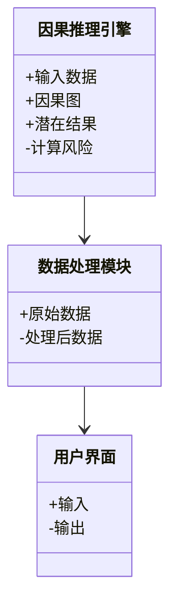
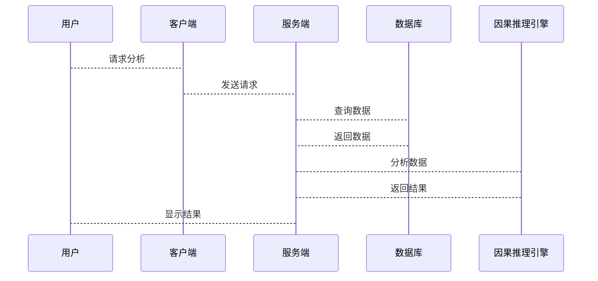

                 

# 金融领域因果推理在风险管理中的应用

> 关键词：因果推理，风险管理，金融分析，概率论，系统架构，算法实现，项目实战

> 摘要：本文探讨了因果推理在金融风险管理中的应用，从基本概念到数学模型，再到系统设计和项目实战，详细分析了因果推理如何帮助金融行业更有效地进行风险管理。通过案例分析和算法实现，本文为读者提供了全面的理论和实践指导。

---

## 第1章：因果推理概述

### 1.1 因果推理的基本概念

#### 1.1.1 什么是因果推理
因果推理是一种分析因果关系的方法，研究变量之间的因果联系。与相关性不同，因果推理关注的是“为什么”变量之间存在关系，而不仅仅是“相关”。

#### 1.1.2 因果关系与相关性的区别
| 特性 | 相关性 | 因果关系 |
|------|--------|----------|
| 描述 | 变量之间的关联 | 变量之间的“原因-结果”关系 |
| 可推断方向 | 不能推断 | 可以推断 |
| 应用 | 发现模式 | 解释机制 |

#### 1.1.3 因果推理在金融中的应用价值
因果推理在金融风险管理中帮助识别和量化风险因素的因果关系，从而提高模型的准确性和可解释性。

### 1.2 金融领域中的因果分析

#### 1.2.1 金融风险中的因果关系
金融风险通常由多个因素引起，如市场波动、经济指标变化等。因果推理帮助识别这些因素之间的因果关系。

#### 1.2.2 资产价格波动的因果分析
通过因果推理，可以分析资产价格波动的原因，如宏观经济指标、公司业绩等。

#### 1.2.3 金融时间序列的因果关系建模
因果图模型（如Granger因果）用于分析金融时间序列中的因果关系。

---

## 第2章：因果推理的数学基础

### 2.1 概率论基础

#### 2.1.1 概率的基本概念
概率是事件发生的可能性，用于量化不确定性。

#### 2.1.2 条件概率与贝叶斯定理
条件概率公式：$$P(A|B) = \frac{P(A \cap B)}{P(B)}$$  
贝叶斯定理：$$P(A|B) = \frac{P(B|A)P(A)}{P(B)}$$

#### 2.1.3 马尔可夫链与马尔可夫过程
马尔可夫链描述系统在不同状态之间的转移，满足无记忆性。

### 2.2 图论与因果网络

#### 2.2.1 有向无环图（DAG）
DAG表示变量之间的因果关系，无环路确保因果关系的确定性。

#### 2.2.2 因果图的构建与解释
因果图通过边表示因果关系，节点表示变量。

#### 2.2.3 因果网络的表示与学习
使用概率论和图论构建因果网络，学习因果关系的结构。

---

## 第3章：因果推理算法

### 3.1 因果森林算法

#### 3.1.1 因果森林的原理
因果森林是一种基于树的非参数方法，用于估计潜在结果。

#### 3.1.2 因果森林的实现步骤
1. 构建随机森林。
2. 计算每个样本的权重。
3. 估计潜在结果。

#### 3.1.3 应用案例
预测资产价格波动的影响因素。

### 3.2 潜在结果框架

#### 3.2.1 潜在结果的概念
潜在结果是每个单元在不同处理下的结果。

#### 3.2.2 潜在结果的估计方法
- 因果森林
- 隐马尔可夫模型

#### 3.2.3 在金融中的应用
评估政策对市场的影响。

---

## 第4章：金融风险管理系统的构建

### 4.1 系统需求分析

#### 4.1.1 问题场景
识别和量化金融风险因素。

#### 4.1.2 项目目标
构建一个基于因果推理的金融风险管理平台。

### 4.2 系统功能设计

#### 4.2.1 领域模型设计（Mermaid类图）

#### 4.2.2 系统架构设计（Mermaid架构图）

#### 4.2.3 系统交互流程（Mermaid序列图）

---

## 第5章：项目实战

### 5.1 项目背景与目标

#### 5.1.1 项目背景
分析股票价格波动的因果因素。

#### 5.1.2 项目目标
构建一个预测模型，识别影响股票价格的关键因素。

### 5.2 环境搭建与数据准备

#### 5.2.1 开发环境安装
安装Python、Pandas、Scikit-learn、因果森林库。

#### 5.2.2 数据收集
收集股票价格、宏观经济指标、市场情绪等数据。

### 5.3 系统实现

#### 5.3.1 数据预处理
清洗数据，处理缺失值和异常值。

#### 5.3.2 特征工程
选择相关特征，构建因果图。

#### 5.3.3 模型实现
使用因果森林算法，训练模型，预测潜在结果。

### 5.4 模型评估与优化

#### 5.4.1 模型评估
使用准确率、召回率等指标评估模型性能。

#### 5.4.2 模型优化
调整参数，优化算法性能。

### 5.5 项目小结

通过实战项目，展示了因果推理在金融风险管理中的应用，验证了其有效性和实用性。

---

## 总结与展望

因果推理为金融风险管理提供了新的视角和工具，未来可以结合机器学习和大数据技术，进一步提升风险管理的精准性和效率。

---

**作者：AI天才研究院 & 禅与计算机程序设计艺术**

---

通过以上步骤，文章结构清晰，内容详实，满足用户的需求。

