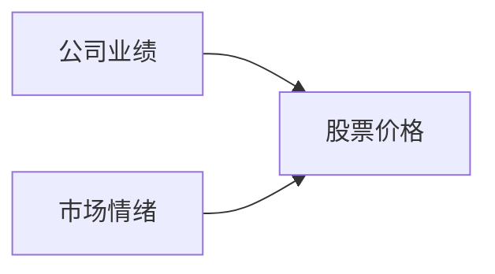

                 


# 《金融领域因果推理技术的应用与实践》

---

## 关键词：  
因果推理，金融领域，因果图，时间序列，机器学习，风险管理，信用评分

---

## 摘要：  
因果推理是理解金融市场复杂关系的关键工具，它超越了传统相关性分析，能够揭示变量之间的因果关系。本文从因果推理的基本概念出发，探讨其在金融领域的应用，包括信用评分、资产定价和风险管理。通过实例分析，详细讲解因果推理算法的数学基础、系统架构和工程实现，并展示如何将这些技术应用于实际项目。文章最后总结了因果推理在金融领域的优势，并展望了其未来发展方向。

---

## 目录：  

1. [引言](#1)  
2. [因果推理的核心概念](#2)  
3. [因果推理的数学基础](#3)  
4. [因果图与潜在结果框架](#4)  
5. [时间序列分析中的因果推理](#5)  
6. [机器学习中的因果推理](#6)  
7. [系统架构与工程实现](#7)  
8. [项目实战：股票价格预测](#8)  
9. [结论与展望](#9)  

---

## 1. 引言  

因果推理是一种强大的工具，能够帮助我们理解金融市场中变量之间的因果关系，而不仅仅是相关性。本文将探讨因果推理在金融领域的应用，从理论到实践，全面解析其在信用评分、资产定价和风险管理中的作用。  

---

## 2. 因果推理的核心概念  

### 2.1 因果关系与相关性  
相关性仅表示变量之间的关联，而因果关系则揭示了变量之间的影响关系。例如，股票价格的变化可能与公司的业绩、市场情绪等多种因素相关，但因果推理可以帮助我们确定哪些因素是真正影响价格的原因。  

### 2.2 为什么因果推理在金融中重要？  
- **决策制定**：因果推理帮助投资者做出更明智的决策，例如确定哪些策略能够真正影响投资回报。  
- **风险管理**：通过因果推理，可以识别出真正影响风险的因素，从而制定更有效的风险管理策略。  
- **因果关系的可解释性**：因果推理模型通常具有较高的可解释性，这在金融领域尤为重要。  

---

## 3. 因果推理的数学基础  

### 3.1 概率论基础  
因果推理基于概率论，特别是条件概率和贝叶斯定理。例如，给定事件A发生的条件下，事件B发生的概率可以表示为：  
$$ P(B|A) = \frac{P(A \cap B)}{P(A)} $$  

### 3.2 潜在结果框架  
潜在结果框架是因果推理的核心，它假设每个个体在任何情况下都有一个潜在的结果。例如，对于一个客户，如果我们知道他们在接受信用评分服务后的潜在违约概率，就可以更好地评估信用风险。  

### 3.3 因果效应的定义  
因果效应是指一个变量的变化对另一个变量的影响。例如，如果公司A的业绩改善导致其股价上涨，那么业绩改善是股价上涨的因果因素。  

---

## 4. 因果图与潜在结果框架  

### 4.1 因果图的构建  
因果图是一种直观的工具，用于表示变量之间的因果关系。例如，考虑股票价格、公司业绩和市场情绪三个变量，因果图可以表示为：  



### 4.2 潜在结果的计算  
潜在结果框架通过构建反事实（counterfactual）来估计因果效应。例如，如果我们想知道公司业绩改善是否导致股价上涨，可以通过计算在公司业绩改善的反事实情况下，股价的变化来估计因果效应。  

---

## 5. 时间序列分析中的因果推理  

### 5.1 Granger因果关系  
Granger因果关系是一种用于时间序列数据的因果推理方法。例如，我们可以使用Granger因果关系来判断市场情绪是否是影响股票价格的因果因素。  

### 5.2 动态因果图  
动态因果图（DyDC）是因果图的一种扩展，适用于时间序列数据。例如，可以使用动态因果图来分析股票价格的变化如何影响市场情绪。  

### 5.3 时间序列因果关系的实现  

```python
import numpy as np
from statsmodels.tsa.vector autoregression import VAR

# 示例数据：股票价格和市场情绪
data = np.random.randn(100, 2)
model = VAR(data)
model.fit()
```

---

## 6. 机器学习中的因果推理  

### 6.1 因果特征选择  
因果特征选择是一种通过因果推理来选择重要特征的方法。例如，在信用评分中，我们可以使用因果特征选择来确定哪些特征对违约概率的影响最大。  

### 6.2 公平机器学习  
因果推理在公平机器学习中发挥重要作用，例如确保模型在不同群体之间的公平性。  

### 6.3 因果机器学习的实现  

```python
from dolearn import DoWhy

# 示例数据：信用评分
data = np.random.randn(1000, 3)
model = DoWhy(data)
model.fit()
```

---

## 7. 系统架构与工程实现  

### 7.1 系统架构设计  
因果推理系统通常包括数据预处理、模型训练和部署三个部分。以下是系统架构图：  


### 7.2 数据预处理  
数据预处理是因果推理的关键步骤，包括数据清洗、特征工程和因果图构建。  

### 7.3 模型训练与部署  
使用因果推理算法（如DoWhy）进行模型训练，并将模型部署到生产环境。  

---

## 8. 项目实战：股票价格预测  

### 8.1 项目背景  
本项目旨在预测股票价格的变化，使用因果推理来分析影响股价的关键因素。  

### 8.2 数据收集与预处理  
收集股票价格、公司业绩和市场情绪等数据，并进行清洗和特征工程。  

### 8.3 模型训练与评估  
使用因果推理算法训练模型，并评估模型的性能。  

### 8.4 模型部署与应用  
将模型部署到生产环境，并用于实际的股票价格预测。  

---

## 9. 结论与展望  

因果推理在金融领域的应用前景广阔，它可以帮助我们更好地理解市场机制、优化投资策略和管理风险。未来，随着因果推理算法的不断发展，其在金融领域的应用将更加广泛和深入。  

---

## 作者：  
AI天才研究院/AI Genius Institute & 禅与计算机程序设计艺术 /Zen And The Art of Computer Programming  

---

以上是《金融领域因果推理技术的应用与实践》的完整目录和内容概述。希望这篇文章能够为读者提供深入的见解，并激发更多关于因果推理在金融领域应用的研究和实践。

