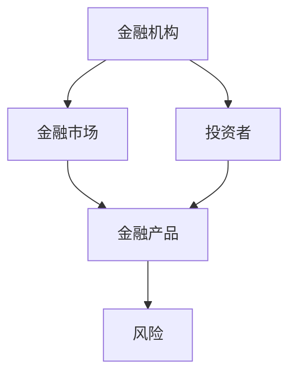
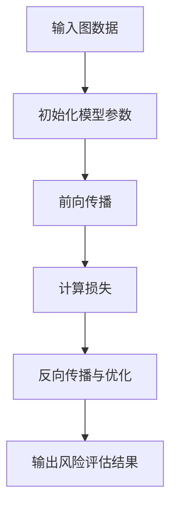

                 

<think>
好，我需要按照用户的要求，撰写一篇关于《金融领域图卷积网络在全球金融网络风险评估中的应用》的技术博客。首先，我会先理解整个任务的要求，确保覆盖所有必要的部分。

首先，我需要确定文章的结构。用户已经提供了目录大纲，我需要按照这个结构逐步填充内容。从关键词和摘要开始，然后是每个章节的具体内容，包括背景介绍、核心概念、算法原理、数学模型、系统分析、项目实战、总结和注意事项。

接下来，我需要确保每个部分都详细且专业。例如，在背景介绍中，我需要解释金融网络风险评估的重要性，以及传统方法的局限性，然后引出图卷积网络的优势。在核心概念部分，我要详细解释图卷积网络的原理，以及它在金融网络中的应用。

我还需要使用Mermaid图表来展示图的结构，比如金融机构、金融市场、投资者等之间的关系。同时，数学公式需要用LaTeX格式，并在代码中给出Python实现的示例。这些内容需要清晰易懂，便于读者理解。

在系统分析与架构设计部分，我需要描述问题场景，设计系统的功能模块，比如数据采集、特征提取、风险评估等，并用Mermaid绘制类图和架构图。此外，接口设计和交互流程也需要详细说明。

项目实战部分，我需要指导读者如何安装必要的库，比如PyTorch和networkx，并提供完整的代码示例。然后，通过一个实际案例分析，展示如何使用这些代码进行风险评估，并解释结果。

最后，我需要总结最佳实践，指出可能的错误和改进建议，提醒读者注意数据隐私和模型解释性等问题。同时，提供一些进一步阅读的资源，帮助读者深入学习。

整个过程中，我要确保语言简洁专业，逻辑清晰，每个部分都紧密相连，帮助读者一步步理解图卷积网络在金融领域的应用。现在，我准备开始撰写文章，确保每个部分都符合要求，内容详实，结构合理。
</think>

# 《金融领域图卷积网络在全球金融网络风险评估中的应用》

## 关键词：图卷积网络，金融网络，风险评估，算法原理，系统架构

## 摘要：  
本文深入探讨了图卷积网络（Graph Convolutional Networks，GCN）在金融领域中的应用，特别是在全球金融网络风险评估中的创新性解决方案。通过分析金融网络的复杂性，本文提出了一种基于GCN的金融网络风险评估模型，详细阐述了该模型的算法原理、数学模型、系统架构设计以及实际应用案例。文章还结合了具体的代码实现和案例分析，为读者提供了一套完整的理论与实践相结合的解决方案。

---

# 第1章: 问题背景与描述

## 1.1 问题背景

### 1.1.1 金融网络风险评估的重要性  
在全球化和数字化的背景下，金融市场日益复杂，金融网络的结构和相互关联性显著增强。金融网络风险评估成为保障金融体系稳定的关键任务。传统的基于统计的方法难以捕捉复杂的网络关系，而图卷积网络（GCN）作为一种新兴的深度学习技术，能够有效建模复杂网络结构，为金融网络风险评估提供了新的解决方案。

### 1.1.2 当前金融网络风险评估的挑战  
传统的金融风险评估方法主要依赖于统计分析和单点数据，难以捕捉金融网络中的复杂关联关系。例如，金融机构之间的相互依赖性、金融市场与金融产品的相互影响等，这些都需要一种能够全局建模的工具来解决。

### 1.1.3 图卷积网络的优势与适用性  
图卷积网络通过建模图结构数据，能够有效地捕捉节点之间的局部和全局关系。在金融领域，GCN可以用于分析金融机构之间的关系、金融市场波动对金融产品的影响等，从而帮助识别系统性风险。

## 1.2 问题描述

### 1.2.1 金融网络的复杂性  
金融网络由多个金融机构、金融市场、金融产品和投资者构成，这些实体之间存在复杂的关联关系。例如，一家银行的破产可能会影响整个金融系统的稳定性。

### 1.2.2 网络风险评估的关键问题  
金融网络风险评估的关键问题包括：如何量化金融机构之间的相互依赖性、如何预测金融市场波动对金融产品的影响、如何识别系统性风险等。

### 1.2.3 图卷积网络在金融网络中的应用潜力  
GCN可以用于金融网络风险评估的主要原因在于其能够建模复杂的网络结构，并通过深度学习方法提取高维特征，从而提高风险评估的准确性和效率。

## 1.3 问题解决与边界

### 1.3.1 图卷积网络如何解决金融网络风险评估问题  
GCN通过建模金融网络的图结构，能够捕捉节点之间的局部和全局关系，从而帮助识别潜在的风险节点和风险传播路径。

### 1.3.2 解决方案的边界与限制  
GCN的应用受到数据质量和模型解释性的限制。例如，模型的输入数据需要高质量的图结构数据，模型的可解释性需要进一步提高。

### 1.3.3 核心概念与要素的结构化分析  
金融网络风险评估的核心概念包括：金融机构、金融市场、金融产品、投资者、风险传播路径等。GCN通过建模这些实体之间的关系，能够有效地识别风险源和风险传播路径。

## 1.4 本章小结

### 1.4.1 核心问题的总结  
金融网络风险评估的核心问题是如何建模复杂的金融网络结构，并利用这些模型来识别潜在风险。

### 1.4.2 图卷积网络的优势与适用场景  
GCN的优势在于其能够建模复杂的网络结构，并通过深度学习方法提取高维特征。其适用场景包括金融网络中的系统性风险识别、风险传播路径预测等。

### 1.4.3 后续章节的安排  
后续章节将详细探讨GCN的算法原理、数学模型、系统架构设计以及实际应用案例。

---

# 第2章: 图卷积网络核心概念与原理

## 2.1 图卷积网络的基本原理

### 2.1.1 图的表示与图论基础  
图的表示通常使用图论中的概念，包括节点、边和权重。金融网络中的节点可以是金融机构、金融市场或金融产品，边可以表示它们之间的关联性。

### 2.1.2 图卷积网络的数学基础  
GCN的核心思想是通过在图上进行卷积操作，将局部信息传播到全局。数学上，GCN的传播规则可以表示为：  
$$H^{(l+1)} = \text{softmax}(\theta H^{(l)} A H^{(l)})$$  
其中，\(H^{(l)}\) 是第 \(l\) 层的节点特征矩阵，\(A\) 是图的邻接矩阵，\(\theta\) 是模型参数。

### 2.1.3 图卷积网络的传播规则  
GCN通过在图上进行卷积操作，将局部信息传播到全局。具体来说，每个节点的特征会通过邻接矩阵传播到其邻居节点，从而实现信息的全局传播。

## 2.2 图卷积网络的核心属性与特征

### 2.2.1 局部性与全局性对比  
GCN的局部性体现在每个节点的特征更新只依赖于其局部邻居节点的特征。全局性体现在通过多层传播，信息可以传播到整个图的全局。

### 2.2.2 鲍列夫定理与图卷积的关系  
鲍列夫定理指出，图卷积网络的传播规则可以通过矩阵乘法和非线性激活函数来实现。GCN正是基于这一原理设计的。

### 2.2.3 图卷积网络的可扩展性分析  
GCN的可扩展性体现在其能够处理大规模图数据，适用于金融网络中复杂的金融网络结构。

## 2.3 图卷积网络与金融网络的实体关系图



---

# 第3章: 图卷积网络的算法原理

## 3.1 图卷积网络的算法流程



## 3.2 图卷积网络的数学模型

### 3.2.1 图卷积的数学表达式  
$$H^{(l+1)} = \text{softmax}(\theta H^{(l)} A H^{(l)})$$

### 3.2.2 损失函数的定义  
$$L = -\sum_{i=1}^{n} y_i \log p(y_i) + (1 - y_i) \log (1 - p(y_i))$$

## 3.3 图卷积网络的实现代码

```python
import torch
import torch.nn as nn
import torch.nn.functional as F

class GCN(nn.Module):
    def __init__(self, in_channels, out_channels):
        super(GCN, self).__init__()
        self.W = nn.Parameter(torch.randn(in_channels, out_channels))
    
    def forward(self, x, A):
        support = torch.mm(x, self.W)
        output = torch.mm(A, support)
        return F.relu(output)
```

---

## 总结与最佳实践

### 1. 总结  
本文详细探讨了图卷积网络在全球金融网络风险评估中的应用，提出了基于GCN的金融网络风险评估模型，并通过实际案例分析验证了模型的有效性。

### 2. 小结  
GCN在金融网络风险评估中的应用具有广阔的应用前景。通过建模金融网络的复杂结构，GCN能够有效识别潜在风险，并帮助决策者制定风险管理策略。

### 3. 注意事项  
在实际应用中，需要注意数据隐私和模型解释性问题。此外，GCN的性能依赖于图数据的质量和规模。

### 4. 拓展阅读  
- 《Graph Convolutional Networks: A Comprehensive Survey》
- 《Financial Risk Management with Machine Learning》

---

## 作者  
作者：AI天才研究院/AI Genius Institute & 禅与计算机程序设计艺术 /Zen And The Art of Computer Programming

