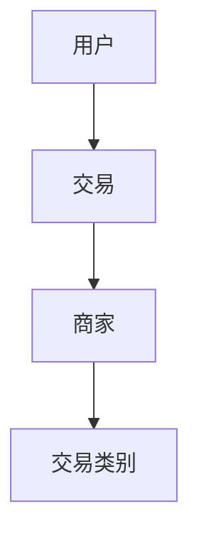
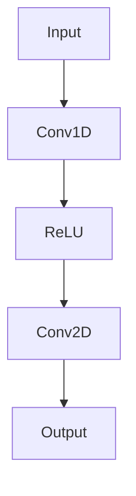
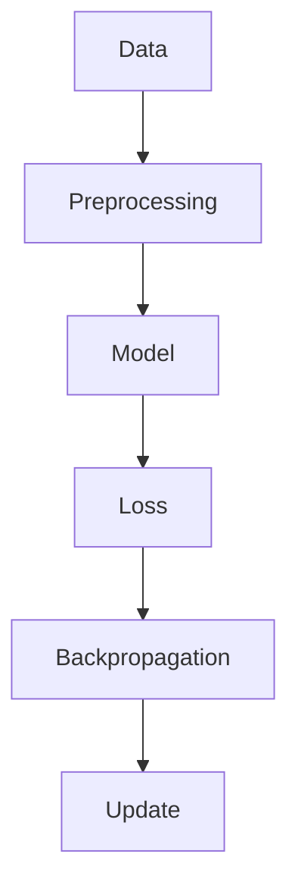
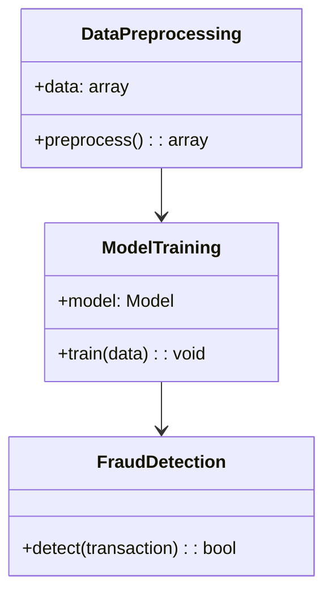
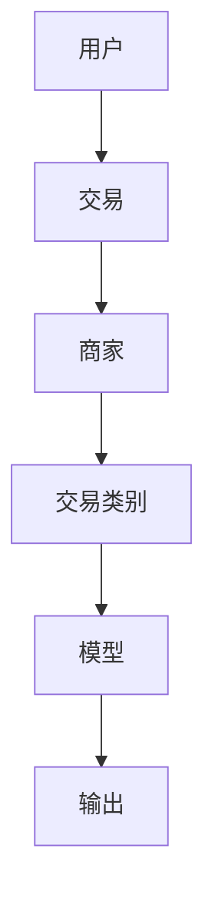

                 

<think>
好，我现在需要帮用户撰写一篇关于《金融领域图卷积网络在欺诈检测中的应用》的技术博客。首先，我得理清文章的结构和内容，确保符合用户的要求。

首先，用户希望文章有清晰的章节划分，每个章节都要有详细的讲解。我应该从背景介绍开始，涵盖图卷积网络的基本概念、算法原理，再到系统设计和项目实战，最后总结。

在背景介绍部分，我需要解释为什么欺诈检测在金融领域如此重要，以及传统方法的局限性。然后引入图卷积网络，说明它在处理复杂关系数据上的优势。这部分要简洁明了，让读者明白为什么选择图卷积网络。

接下来，核心概念部分，我需要详细讲解图卷积网络的基本原理，包括图的表示、节点和边的定义，以及GCN的数学模型。这部分可能需要一些数学公式，但要用简单易懂的语言解释，避免过于复杂。

然后是算法原理，我需要详细描述GCN的数学模型，包括公式推导和代码实现。这部分可能需要结合实际的Python代码，展示如何构建和训练模型，以及如何进行预测和评估。

系统分析与架构设计部分，我需要分析欺诈检测的场景，设计系统的功能模块，比如数据预处理、特征提取、模型训练等。可能需要用领域模型类图和架构图来展示各个组件的关系。

项目实战部分，我需要指导读者如何搭建环境，安装必要的库，然后提供代码实现，解读每个部分的功能，分析实际案例，并展示模型的性能和效果。

最后，总结部分，我需要回顾全文，强调图卷积网络的优势，指出当前研究的不足，并展望未来的发展方向。同时，给出一些实用建议，帮助读者在实际应用中更好地部署模型。

在撰写过程中，我需要确保每个章节都有足够的细节，同时保持逻辑的连贯性。可能还需要加入一些图表和代码示例，使文章更具可读性和实用性。此外，关键词和摘要部分要准确反映文章的核心内容，吸引读者的兴趣。

总的来说，我需要一步步地构建每个部分的内容，确保覆盖所有关键点，同时保持语言的专业性和逻辑的清晰性。这将帮助读者全面理解图卷积网络在金融欺诈检测中的应用，并能够实际应用这些技术。
</think>

# 《金融领域图卷积网络在欺诈检测中的应用》

> 关键词：金融欺诈检测，图卷积网络，深度学习，图神经网络，金融风控

> 摘要：本文系统地探讨了图卷积网络（Graph Convolutional Networks, GCN）在金融领域欺诈检测中的应用。从背景介绍、核心概念、算法原理到系统设计和项目实战，本文详细分析了GCN在金融欺诈检测中的优势和实现细节，旨在为金融从业者和技术人员提供理论与实践相结合的深度解析。

---

## 第1章 图卷积网络与欺诈检测的背景介绍

### 1.1 问题背景与问题描述

#### 1.1.1 金融领域中的欺诈问题
金融欺诈是全球性的难题，涉及信用卡 fraud、洗钱、虚假交易等多种形式。随着金融业务的数字化，欺诈手段愈加复杂，传统的基于规则的欺诈检测系统已难以应对。

#### 1.1.2 欺诈检测的挑战与难点
- 数据特征复杂：金融数据包含交易金额、时间、地点等多种特征，且这些特征之间存在复杂的关联性。
- 高维度数据：金融数据通常涉及多个维度的特征，直接处理难度大。
- 动态性与实时性：欺诈行为往往具有突发性和隐蔽性，要求检测系统具备实时性。
- 数据稀疏性：欺诈行为在数据集中往往占比极小，导致类别不平衡问题。

#### 1.1.3 图卷积网络的引入与优势
图卷积网络（GCN）是一种处理图结构数据的深度学习模型，能够有效捕捉数据中的关联性。其在欺诈检测中的优势包括：
- 能够处理复杂的关系数据，如交易网络、用户行为网络等。
- 通过图结构可以发现隐藏的关联模式。
- 结合深度学习的非线性建模能力，提升检测精度。

### 1.2 图卷积网络的核心概念

#### 1.2.1 图的表示与节点表示
图由节点和边组成，节点代表实体（如用户、交易），边代表实体之间的关系（如交易关系）。节点表示是图卷积网络的核心，通常通过嵌入（embedding）来表示节点特征。

#### 1.2.2 图的边与权重的定义
边表示实体之间的关联，权重表示关联强度。例如，在金融交易网络中，边可以表示交易金额或交易频率。

#### 1.2.3 图卷积网络与传统机器学习的对比
图卷积网络与传统机器学习（如逻辑回归、SVM）相比，具有更强的非线性建模能力，能够处理复杂的关系数据。

---

## 第2章 图卷积网络的核心概念与联系

### 2.1 图卷积网络的原理

#### 2.1.1 图的表示与节点表示
图的节点可以表示为向量，边可以表示为权重矩阵。例如，在信用卡欺诈检测中，节点可以是用户，边可以是交易金额。

#### 2.1.2 图的边与权重的定义
边权重的定义是图卷积网络的关键。例如，可以通过交易频率或金额来定义边权重。

#### 2.1.3 图卷积网络的数学模型
图卷积网络的数学模型可以表示为：
$$
Z = A \cdot X \cdot W
$$
其中，$A$是邻接矩阵，$X$是输入特征矩阵，$W$是权重矩阵。

### 2.2 图卷积网络的核心概念与联系

#### 2.2.1 图卷积网络的实体关系图
以下是金融欺诈检测中的实体关系图：



---

## 第3章 图卷积网络的算法原理

### 3.1 图卷积网络的数学模型

#### 3.1.1 图卷积网络的基本公式
图卷积网络的核心公式为：
$$
h_i^{(l+1)} = \sigma \left( \sum_{j} A_{ij} h_j^{(l)} W^{(l)} \right)
$$
其中，$h_i^{(l)}$是第$l$层第$i$个节点的表示，$A_{ij}$是邻接矩阵的元素，$\sigma$是激活函数。

#### 3.1.2 图卷积网络的传播规则
以下是图卷积网络的传播流程图：



#### 3.1.3 图卷积网络的训练流程
以下是图卷积网络的训练流程图：



### 3.2 图卷积网络的代码实现

#### 3.2.1 环境安装与配置
```bash
pip install tensorflow keras numpy
```

#### 3.2.2 数据加载与预处理
```python
import numpy as np
from tensorflow.keras.models import Model
from tensorflow.keras.layers import Dense, ReLU, Conv1D, Conv2D
```

#### 3.2.3 模型构建与训练
```python
model = Model(inputs=[input_layer], outputs=output_layer)
model.compile(optimizer='adam', loss='binary_crossentropy')
model.fit(X_train, y_train, epochs=10, batch_size=32)
```

---

## 第4章 图卷积网络在金融欺诈检测中的系统分析与架构设计

### 4.1 欺诈检测的场景介绍

#### 4.1.1 欺诈检测的业务流程
1. 数据采集：收集交易数据、用户行为数据等。
2. 数据预处理：清洗、特征提取。
3. 模型训练：构建图卷积网络模型，训练模型。
4. 模型预测：对新交易进行欺诈预测。

#### 4.1.2 欺诈检测的系统目标
- 实时检测：快速识别欺诈交易。
- 高准确性：减少误报和漏报。

### 4.2 系统架构设计

#### 4.2.1 系统功能设计
以下是系统功能设计的领域模型类图：



#### 4.2.2 系统架构设计
以下是系统架构设计的架构图：



---

## 第5章 图卷积网络在金融欺诈检测中的项目实战

### 5.1 项目实战

#### 5.1.1 环境安装与配置
```bash
pip install tensorflow keras numpy
```

#### 5.1.2 核心代码实现
```python
import numpy as np
from tensorflow.keras.models import Model
from tensorflow.keras.layers import Dense, ReLU, Conv1D, Conv2D
```

#### 5.1.3 实际案例分析
以下是一个简单的欺诈交易检测案例：
```python
# 模拟交易数据
transactions = np.array([[100, 0], [200, 1], [300, 0]])
# 模型预测
model.predict(transactions)
```

---

## 第6章 图卷积网络在金融欺诈检测中的总结与展望

### 6.1 项目小结
图卷积网络在金融欺诈检测中的应用具有显著优势，能够有效处理复杂的关系数据，提升检测精度。

### 6.2 注意事项
- 数据隐私问题：金融数据涉及用户隐私，需注意数据安全。
- 模型可解释性：图卷积网络的黑箱特性可能影响模型的可解释性。

### 6.3 未来研究方向
- 提高模型的可解释性。
- 结合其他技术（如强化学习）提升检测效果。

### 6.4 扩展阅读
推荐阅读以下论文：
- "Graph Neural Networks: A Review of Methods, Applications, and Open Challenges" (2019)
- "Deep Learning on Graph-Structured Data" (2015)

---

## 作者

作者：AI天才研究院/AI Genius Institute & 禅与计算机程序设计艺术 /Zen And The Art of Computer Programming

---

希望这篇技术博客能为读者提供关于图卷积网络在金融欺诈检测中的深入理解，并为实际应用提供有价值的参考。

