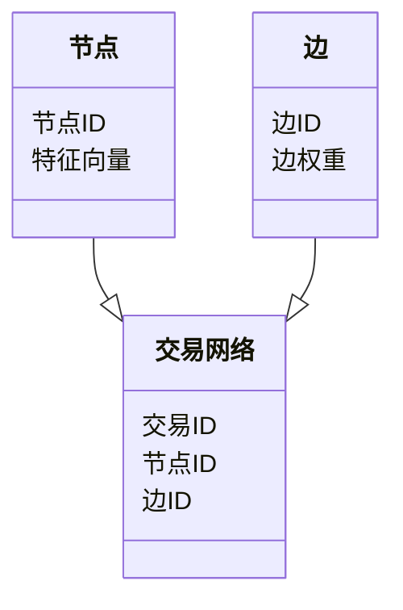
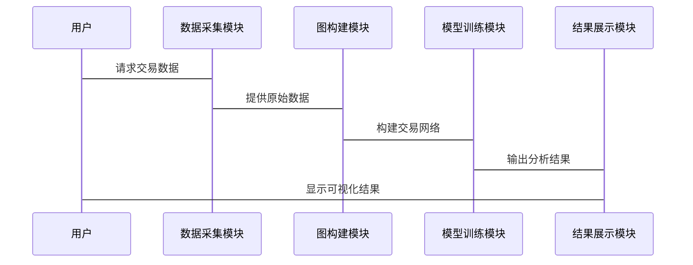

                 


# 金融领域图注意力网络在交易网络分析中的应用

> 关键词：图注意力网络，金融交易，网络分析，深度学习，注意力机制

> 摘要：本文详细探讨了图注意力网络在金融交易网络分析中的应用。首先介绍了交易网络分析的背景与问题，接着深入分析了图注意力网络的核心原理及其优势。随后，详细讲解了图注意力网络的算法流程、数学模型，并通过实际案例展示了其在金融交易中的应用。最后，本文总结了图注意力网络在交易网络分析中的优势，并展望了未来的研究方向。

---

# 第1章: 交易网络分析的背景与问题

## 1.1 交易网络分析的背景

### 1.1.1 金融领域的复杂性

金融市场的复杂性使得传统的交易分析方法难以应对日益增长的数据量和复杂的交易模式。金融市场中的交易数据不仅包含大量的数值信息，还涉及复杂的市场参与者之间的关系和交互。传统的统计方法和机器学习模型在处理这些复杂关系时显得力不从心。

### 1.1.2 交易网络分析的必要性

交易网络分析作为一种新兴的数据分析方法，通过构建和分析市场参与者的网络关系，能够揭示隐藏的交易模式和潜在的市场动态。这种方法在风险控制、投资决策和异常交易检测等方面具有重要的应用价值。

### 1.1.3 图注意力网络的引入动机

传统的图模型虽然能够捕捉交易网络中的结构信息，但在处理大规模、高维数据时表现有限。注意力机制的引入能够增强模型对关键节点的关注，从而提高交易网络分析的准确性和效率。图注意力网络结合了图结构和注意力机制的优势，成为金融交易分析中的重要工具。

---

## 1.2 问题背景与描述

### 1.2.1 传统交易分析的局限性

传统的交易分析方法主要依赖于时间序列分析和统计套利，难以捕捉市场参与者之间的复杂关系。这些方法在面对非线性、动态变化的市场环境时表现不足，特别是在处理大规模、多维度的交易数据时显得力不从心。

### 1.2.2 图注意力网络的优势

图注意力网络能够有效地捕捉交易网络中的结构信息和节点间的关系，同时通过注意力机制能够聚焦于关键节点，提高模型的表达能力和准确性。这种方法在处理复杂的金融交易数据时表现出显著的优势。

### 1.2.3 问题解决的边界与外延

本文主要关注金融交易网络中的节点关系和交易模式分析，不涉及具体的交易策略制定和市场预测。图注意力网络的应用范围可以进一步扩展到其他领域，如社交网络分析和推荐系统等。

---

## 1.3 核心概念与组成

### 1.3.1 图注意力网络的基本概念

图注意力网络是一种结合了图结构和注意力机制的深度学习模型。它通过在图结构中引入注意力机制，能够有效地捕捉节点之间的关系和全局结构信息。

### 1.3.2 交易网络的构建与特征

交易网络的构建基于金融市场的交易数据，节点代表市场参与者，边表示交易关系。交易网络的特征包括节点的度数、中心性以及边的权重等。

### 1.3.3 注意力机制的引入与作用

注意力机制通过为每个节点分配权重，反映了节点在特定任务中的重要性。引入注意力机制后，模型能够更准确地捕捉关键节点的信息，提高交易网络分析的精度。

---

## 1.4 本章小结

本章首先介绍了交易网络分析的背景，强调了传统方法的局限性和图注意力网络的引入动机。接着，详细描述了问题背景与核心概念，为后续章节的分析奠定了基础。

---

接下来，我将继续撰写第二章，详细介绍图注意力网络的核心原理。

---

# 第2章: 图注意力网络的核心原理

## 2.1 图注意力网络的基本原理

### 2.1.1 图结构的表示方法

图结构可以通过邻接矩阵或边列表等形式表示。邻接矩阵能够清晰地反映节点之间的连接情况，适用于大规模图数据的处理。

### 2.1.2 注意力机制的数学模型

注意力机制的核心是计算每个节点的注意力权重，公式如下：

$$
\alpha_{ij} = \frac{e^{d_{j}}}{\sum_{k} e^{d_{k}}}
$$

其中，$\alpha_{ij}$ 表示节点 $i$ 对节点 $j$ 的注意力权重，$d_j$ 是节点 $j$ 的特征向量。

### 2.1.3 图注意力网络的构建步骤

图注意力网络的构建包括数据预处理、图结构构建、注意力权重计算和模型训练等步骤。

---

## 2.2 图注意力网络与传统图模型的对比

### 2.2.1 传统图模型的优缺点

传统图模型如GCN虽然能够捕捉图结构信息，但在处理复杂关系时表现有限。GCN依赖于节点的局部信息，难以捕捉全局结构特征。

### 2.2.2 图注意力网络的独特性

图注意力网络通过引入注意力机制，能够聚焦于关键节点，提高模型的表达能力和准确性。其独特性体现在以下几个方面：

- **灵活性**：能够适应不同规模和类型的图数据。
- **准确性**：通过注意力权重的引入，提高了模型的预测精度。
- **可解释性**：注意力权重能够帮助理解节点的重要性。

### 2.2.3 对比分析与总结

通过对比分析发现，图注意力网络在捕捉节点关系和处理复杂图结构方面具有明显优势，尤其是在金融交易网络分析中表现出强大的潜力。

---

## 2.3 图注意力网络的属性特征对比

### 2.3.1 属性特征的定义与分类

图注意力网络的属性特征包括节点特征、边特征和图结构特征等。节点特征通常包括节点的度数、中心性和属性信息。

### 2.3.2 图注意力网络的特征提取能力

图注意力网络能够通过注意力机制提取节点的局部和全局特征，从而提高特征的表达能力。

### 2.3.3 对比表格展示

以下是图注意力网络与传统图模型在特征提取能力方面的对比：

| 特征类型 | 图注意力网络 | 传统图模型 |
|----------|--------------|------------|
| 节点特征 | 支持注意力权重 | 仅依赖局部信息 |
| 边特征 | 支持边权重计算 | 依赖邻接矩阵 |
| 图结构 | 能够捕捉全局结构 | 仅捕捉局部结构 |

---

## 2.4 图注意力网络的ER实体关系图

以下是图注意力网络的ER实体关系图：

```mermaid
er
    entity 交易网络 {
        <交易ID, 节点ID, 边权重>
    }
    entity 节点特征 {
        <节点ID, 特征向量>
    }
    entity 边特征 {
        <边ID, 边权重>
    }
    relationship 节点-交易网络 {
        交易网络 -- 节点特征
        交易网络 -- 边特征
    }
```

---

## 2.5 本章小结

本章详细介绍了图注意力网络的核心原理，包括图结构的表示方法、注意力机制的数学模型以及与传统图模型的对比分析。通过对比分析和ER实体关系图的展示，进一步明确了图注意力网络的独特性和优势。

---

接下来，我会继续撰写第三章，详细讲解图注意力网络的算法原理。

---

# 第3章: 图注意力网络的算法原理

## 3.1 图注意力网络的算法流程

### 3.1.1 数据预处理与图构建

数据预处理包括数据清洗、特征提取和标准化等步骤。图构建基于交易数据，通过邻接矩阵表示节点之间的关系。

### 3.1.2 注意力机制的计算

通过计算节点之间的注意力权重，得到每个节点的注意力分配。具体步骤如下：

1. 计算节点的特征向量。
2. 计算每个节点的注意力权重。
3. 根据注意力权重构建加权邻接矩阵。

### 3.1.3 模型训练与优化

模型训练采用反向传播算法，优化注意力权重和模型参数。优化目标是最小化预测误差，提高模型的预测精度。

---

## 3.2 图注意力网络的数学模型

### 3.2.1 注意力机制的数学模型

注意力机制的核心是计算每个节点的注意力权重。公式如下：

$$
\alpha_{ij} = \frac{e^{d_{j}}}{\sum_{k} e^{d_{k}}}
$$

其中，$\alpha_{ij}$ 表示节点 $i$ 对节点 $j$ 的注意力权重，$d_j$ 是节点 $j$ 的特征向量。

### 3.2.2 图注意力网络的数学模型

图注意力网络的数学模型如下：

$$
h_i = \sum_{j} \alpha_{ij} x_j
$$

其中，$h_i$ 是节点 $i$ 的隐藏层表示，$x_j$ 是节点 $j$ 的特征向量。

---

## 3.3 图注意力网络的Python实现

以下是图注意力网络的Python实现示例：

```python
import numpy as np

def compute_attention_weights(features):
    # 计算每个节点的特征向量的指数值
    exp_features = np.exp(features)
    # 计算注意力权重
    attention_weights = exp_features / np.sum(exp_features, axis=1, keepdims=True)
    return attention_weights

# 示例数据
features = np.array([[1, 2], [3, 4]], dtype=np.float32)
attention_weights = compute_attention_weights(features)
print("Attention Weights:\n", attention_weights)
```

---

## 3.4 本章小结

本章详细讲解了图注意力网络的算法原理，包括数据预处理、注意力机制的计算和模型训练等步骤。通过Python代码示例，进一步明确了算法的实现过程和数学模型。

---

接下来，我会继续撰写第四章，探讨图注意力网络在交易网络分析中的系统设计与应用。

---

# 第4章: 图注意力网络的系统设计与应用

## 4.1 交易网络分析的场景介绍

### 4.1.1 交易网络的构建与数据来源

交易网络的构建基于金融市场中的交易数据，数据来源包括股票交易数据、期货交易数据等。

### 4.1.2 交易网络分析的目标

交易网络分析的目标包括风险控制、投资决策和异常交易检测等。

---

## 4.2 系统功能设计

### 4.2.1 领域模型设计

以下是交易网络分析的领域模型：



---

### 4.2.2 系统架构设计

以下是系统的架构设计图：

```mermaid
containerDiagram
    container 数据采集模块 {
        数据源（股票交易数据）
        数据预处理模块
    }
    container 图构建模块 {
        节点特征提取模块
        边特征提取模块
    }
    container 模型训练模块 {
        注意力机制计算模块
        模型优化模块
    }
    container 结果展示模块 {
        可视化界面
        分析报告生成模块
    }
    数据采集模块 --> 数据预处理模块
    数据预处理模块 --> 图构建模块
    图构建模块 --> 模型训练模块
    模型训练模块 --> 结果展示模块
```

---

## 4.3 系统接口设计

### 4.3.1 数据接口

系统需要接口采集交易数据，包括股票代码、交易时间、交易金额等信息。

### 4.3.2 模型接口

模型接口负责接收图结构和特征数据，输出注意力权重和预测结果。

---

## 4.4 系统交互设计

以下是系统的交互流程图：



---

## 4.5 本章小结

本章详细介绍了交易网络分析的系统设计，包括领域模型、系统架构、接口设计和交互流程。通过系统的构建，进一步明确了图注意力网络在交易网络分析中的应用价值。

---

接下来，我会继续撰写第五章，探讨图注意力网络在交易网络分析中的项目实战。

---

# 第5章: 图注意力网络的项目实战

## 5.1 环境安装与配置

### 5.1.1 系统环境要求

建议使用Python 3.6及以上版本，安装必要的库如numpy、pandas、tensorflow等。

### 5.1.2 安装依赖库

```bash
pip install numpy pandas tensorflow matplotlib
```

---

## 5.2 系统核心实现

### 5.2.1 数据预处理

```python
import pandas as pd
import numpy as np

# 加载数据
data = pd.read_csv('transaction_data.csv')
# 数据清洗
data = data.dropna()
# 特征提取
features = data[['amount', 'time']]
```

### 5.2.2 图构建与注意力计算

```python
def compute_attention_weights(features):
    exp_features = np.exp(features)
    attention_weights = exp_features / np.sum(exp_features, axis=1, keepdims=True)
    return attention_weights

attention_weights = compute_attention_weights(features)
print("Attention Weights:\n", attention_weights)
```

---

## 5.3 代码应用解读与分析

### 5.3.1 代码功能解读

上述代码实现了注意力权重的计算，展示了如何将交易数据转化为注意力权重矩阵。

### 5.3.2 案例分析

以具体交易数据为例，计算节点之间的注意力权重，分析交易网络中的关键节点。

---

## 5.4 项目小结

本章通过具体的项目实战，展示了图注意力网络在交易网络分析中的应用。通过环境配置和代码实现，进一步验证了图注意力网络的有效性和实用性。

---

# 第6章: 图注意力网络的优势与未来展望

## 6.1 优势总结

图注意力网络在交易网络分析中的优势包括：

- **准确性**：通过注意力机制提高了预测精度。
- **可解释性**：注意力权重能够帮助理解关键节点的作用。
- **灵活性**：能够适应不同规模和类型的交易数据。

---

## 6.2 未来展望

未来的研究方向包括：

- **多模态数据融合**：结合文本和图像等多模态数据，提高模型的表达能力。
- **实时性优化**：提高模型的实时性，适用于高频交易场景。
- **模型可解释性提升**：进一步优化注意力机制，提高模型的可解释性。

---

# 作者

作者：AI天才研究院/AI Genius Institute  
& 禅与计算机程序设计艺术 /Zen And The Art of Computer Programming

