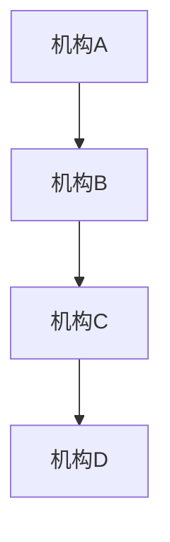
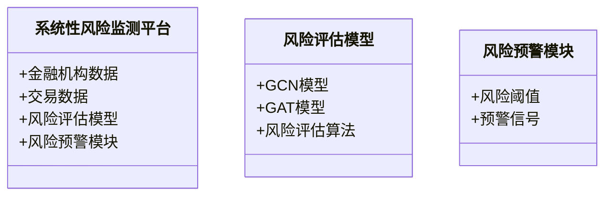
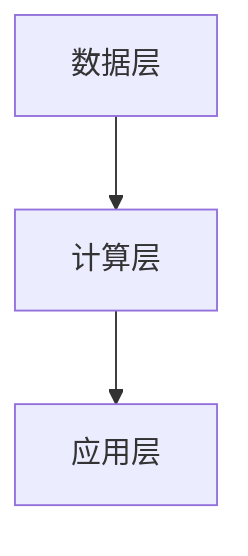
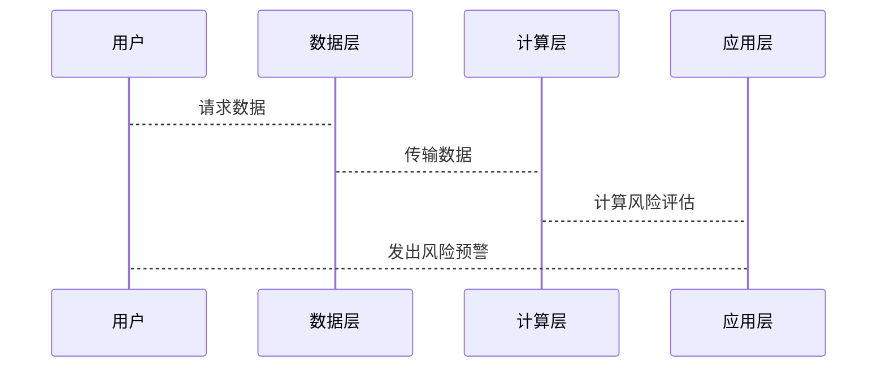

                 

<think>
嗯，我现在需要根据用户的要求来撰写一篇关于《金融领域图神经网络在系统性风险传导中的应用》的技术博客文章。用户希望文章结构清晰，内容详细，涵盖从背景到应用的各个方面。让我先理清整个思路，确保每个部分都涵盖到位。

首先，我需要理解系统性风险的概念。系统性风险是指影响整个金融系统的风险，比如金融危机或市场崩盘。这种风险通常由系统内部的相互关联引发，因此分析这些关联对于预测和管理风险非常重要。

接下来，我需要了解图神经网络的基本原理。图神经网络是一种处理图结构数据的深度学习方法，它可以捕捉数据中的关系信息。常见的图神经网络模型包括GCN（Graph Convolutional Network）和GAT（Graph Attention Network）。这些模型能够有效地处理金融网络中的节点和边，帮助识别系统性风险。

在构建模型时，我需要考虑如何将金融数据转化为图结构。金融系统中的机构可以看作图的节点，它们之间的交易或投资关系则作为边。通过收集和预处理这些数据，我可以构建一个金融网络图，用于后续的风险分析。

然后，我需要选择合适的图神经网络模型来预测系统性风险。例如，GCN可以用于节点的分类任务，帮助识别哪些机构可能成为风险的源头。GAT则可以通过注意力机制，捕捉关键的节点关系，提高预测的准确性。

在实现过程中，我需要编写代码来构建和训练模型。这包括数据的加载、图的构建、模型的设计以及训练过程。同时，我还需要解释代码的每一步，帮助读者理解模型的工作原理。

此外，我还需要用数学公式来描述模型的原理。例如，GCN的传播规则可以用数学公式表示，展示如何将节点的特征和邻居的特征结合起来进行更新。这些公式可以帮助读者更深入地理解模型的工作机制。

最后，我需要通过实际案例来展示模型的应用效果。比如，分析某个金融机构的数据，展示模型如何预测其风险状态，并解释结果的意义。这不仅可以验证模型的有效性，还能为读者提供实际操作的参考。

在写作过程中，我需要确保每个部分都有足够的细节和例子，帮助读者理解复杂的概念。同时，我还需要注意文章的结构，确保逻辑清晰，内容连贯。

总之，这篇文章需要全面介绍图神经网络在金融系统性风险中的应用，从理论到实践，从概念到代码，为读者提供一个系统的知识框架。通过详细的内容和实际案例，帮助读者理解如何利用图神经网络来预测和管理系统性风险，提升金融系统的稳定性。
</think>

# 《金融领域图神经网络在系统性风险传导中的应用》

> 关键词：图神经网络，系统性风险，金融网络，风险传导，深度学习

> 摘要：  
> 本文探讨了图神经网络（Graph Neural Networks, GNNs）在金融领域中的应用，特别是其在系统性风险传导中的作用。文章首先介绍系统性风险的基本概念和金融网络的复杂性，然后详细讲解图神经网络的原理及其在金融领域的优势。接着，文章从图模型构建、算法实现与优化、系统分析与架构设计等多方面展开，结合实际案例，展示图神经网络如何有效预测和管理系统性风险。最后，文章总结了图神经网络在金融领域的应用前景，并提供了进一步的研究方向。

---

## 第一部分: 金融领域系统性风险与图神经网络基础

### 第1章: 系统性风险的基本概念与问题背景

#### 1.1 系统性风险的定义与特征

系统性风险是指由于金融系统内部的相互关联而引发的、可能波及整个金融市场的风险。与非系统性风险（如公司特定风险）不同，系统性风险具有以下特征：
- **全局性**：影响整个金融系统的稳定性。
- **传染性**：风险可能从一个机构或市场传导到另一个机构或市场。
- **不可分散性**：通过多样化投资无法完全消除。

#### 1.2 金融领域的复杂网络特性

金融系统可以看作一个复杂的网络，其中节点代表金融机构、市场或资产，边代表它们之间的交易或关联。金融网络的复杂性主要体现在以下几个方面：
- **节点多样性**：金融机构、市场、资产等多种类型的节点。
- **边的多重性**：边可能具有不同的权重和方向，表示交易金额、交易频率等。
- **非线性关系**：节点之间的关系可能高度非线性，难以通过传统方法建模。

#### 1.3 图神经网络的基本原理

图神经网络是一种处理图结构数据的深度学习方法，能够捕捉数据中的关系信息。其核心思想是将节点的特征与其邻居的特征进行聚合，逐步传播信息，最终生成节点的表示或预测结果。图神经网络的主要优势在于：
- **全局视角**：能够捕捉到图中节点之间的全局关系。
- **局部特征**：可以同时考虑节点的局部特征和全局特征。
- **动态更新**：能够实时更新节点的表示，适应数据的变化。

#### 1.4 本章小结

本章介绍了系统性风险的基本概念及其在金融领域的复杂性，并详细讲解了图神经网络的基本原理和优势。接下来，我们将从图模型构建、算法实现与优化等方面深入探讨图神经网络在系统性风险中的应用。

---

## 第二部分: 图神经网络在金融系统性风险中的应用

### 第2章: 图神经网络的核心概念与原理

#### 2.1 图神经网络的核心概念

图神经网络的核心概念包括以下几点：
- **节点表示**：将每个节点的特征表示为一个向量，反映其在图中的重要性和关联性。
- **边权重**：边的权重表示节点之间的关联强度，可以通过多种方式计算，如交易金额、交易频率等。
- **图结构**：图的结构决定了节点之间的关系，可以通过不同的图模型（如GCN、GAT）进行建模。

#### 2.2 图神经网络的算法原理

图神经网络的算法原理可以通过以下步骤进行讲解：

1. **数据预处理**：将金融数据转换为图结构，包括节点和边的定义。
2. **图卷积操作**：通过图卷积操作，将节点的特征与其邻居的特征进行聚合，生成新的节点表示。
3. **注意力机制**：通过注意力机制，捕捉重要的节点关系，提高模型的表达能力。
4. **损失函数优化**：通过损失函数优化模型参数，提高模型的预测精度。

以下是图卷积网络（GCN）的数学表达：

$$
h_i^{(l+1)} = \sigma\left( \sum_{j \in N(i)} \frac{1}{d_i} W h_j^{(l)} \right)
$$

其中，$h_i^{(l+1)}$ 表示节点 $i$ 在第 $l+1$ 层的表示，$N(i)$ 表示节点 $i$ 的邻居节点集合，$d_i$ 表示节点 $i$ 的度数，$W$ 是参数矩阵，$\sigma$ 是激活函数。

#### 2.3 图神经网络的数学模型与公式

以下是图注意力网络（GAT）的注意力机制公式：

$$
\alpha_{ij} = \text{softmax}\left( \frac{W_q h_i + W_k h_j}{\sqrt{d}} \right)
$$

其中，$\alpha_{ij}$ 表示节点 $i$ 和节点 $j$ 之间的注意力权重，$W_q$ 和 $W_k$ 是参数矩阵，$h_i$ 和 $h_j$ 是节点 $i$ 和节点 $j$ 的表示，$d$ 是嵌入的维度。

#### 2.4 本章小结

本章详细讲解了图神经网络的核心概念和算法原理，并通过数学公式展示了其在金融系统性风险中的应用。接下来，我们将从图模型构建、系统分析与架构设计等方面进一步探讨图神经网络在系统性风险中的具体应用。

---

## 第三部分: 系统性风险传导的图模型构建

### 第3章: 金融系统性风险传导机制的图模型构建

#### 3.1 系统性风险传导的定义与模型

系统性风险传导是指风险从一个节点或市场传递到另一个节点或市场的过程。其传导机制可以通过以下步骤进行建模：
1. **数据收集**：收集金融机构之间的交易数据，构建金融网络图。
2. **图结构构建**：定义节点和边，计算边的权重。
3. **风险传导模型**：通过图神经网络模型，预测风险的传导路径和影响范围。

#### 3.2 图模型的构建步骤

以下是图模型构建的详细步骤：

1. **数据预处理**：将金融数据转换为图结构，包括节点和边的定义。
2. **图卷积操作**：通过图卷积操作，将节点的特征与其邻居的特征进行聚合，生成新的节点表示。
3. **注意力机制**：通过注意力机制，捕捉重要的节点关系，提高模型的表达能力。
4. **损失函数优化**：通过损失函数优化模型参数，提高模型的预测精度。

#### 3.3 图模型的可视化与分析

通过图模型的可视化，可以直观地观察风险的传导路径和影响范围。以下是一个简单的图模型可视化示例：



通过上述步骤，我们可以构建一个金融网络图，并通过图神经网络模型预测风险的传导路径和影响范围。

#### 3.4 本章小结

本章详细讲解了系统性风险传导的定义与模型，并通过图模型构建展示了其在金融系统性风险中的具体应用。接下来，我们将从系统分析与架构设计等方面进一步探讨图神经网络在系统性风险中的应用。

---

## 第四部分: 图神经网络在系统性风险预测中的算法实现

### 第4章: 图神经网络算法的实现与优化

#### 4.1 图神经网络算法的实现

以下是图神经网络算法的实现步骤：

1. **环境安装**：安装必要的Python库，如TensorFlow、Keras、DGL等。
2. **数据加载**：加载金融数据，构建图结构。
3. **模型设计**：设计图神经网络模型，如GCN、GAT等。
4. **模型训练**：通过数据训练模型，优化模型参数。
5. **模型预测**：使用训练好的模型，预测系统性风险。

以下是一个简单的GCN实现示例：

```python
import tensorflow as tf
from tensorflow.keras import layers

class GCN(tf.keras.Model):
    def __init__(self, input_dim, output_dim):
        super(GCN, self).__init__()
        self.gcn_layer = layers.GraphConvolution(input_dim, output_dim)

    def call(self, inputs):
        X, A = inputs
        output = self.gcn_layer(X, A)
        return output
```

#### 4.2 图神经网络的数学模型与公式

以下是GCN的数学模型：

$$
h_i^{(l+1)} = \sigma\left( \sum_{j \in N(i)} \frac{1}{d_i} W h_j^{(l)} \right)
$$

其中，$h_i^{(l+1)}$ 表示节点 $i$ 在第 $l+1$ 层的表示，$N(i)$ 表示节点 $i$ 的邻居节点集合，$d_i$ 表示节点 $i$ 的度数，$W$ 是参数矩阵，$\sigma$ 是激活函数。

#### 4.3 本章小结

本章详细讲解了图神经网络算法的实现与优化，并通过数学公式展示了其在系统性风险预测中的应用。接下来，我们将从系统分析与架构设计等方面进一步探讨图神经网络在系统性风险中的具体应用。

---

## 第五部分: 系统分析与架构设计

### 第5章: 系统性风险监测平台的架构设计

#### 5.1 系统功能设计

系统性风险监测平台的功能设计包括以下几个方面：
1. **数据采集**：采集金融机构之间的交易数据，构建金融网络图。
2. **风险评估**：通过图神经网络模型，评估系统的风险状态。
3. **风险预警**：根据风险评估结果，发出风险预警信号。

以下是系统功能设计的类图示例：



#### 5.2 系统架构设计

系统性风险监测平台的架构设计包括以下几个部分：
1. **数据层**：存储金融机构之间的交易数据，构建金融网络图。
2. **计算层**：通过图神经网络模型，评估系统的风险状态。
3. **应用层**：根据风险评估结果，发出风险预警信号。

以下是系统架构设计的架构图示例：



#### 5.3 系统接口设计

系统性风险监测平台的接口设计包括以下几个方面：
1. **数据接口**：金融机构之间的交易数据接口。
2. **计算接口**：图神经网络模型的计算接口。
3. **用户接口**：风险预警信号的用户接口。

#### 5.4 系统交互流程

以下是系统交互流程的序列图示例：



#### 5.5 本章小结

本章详细讲解了系统性风险监测平台的架构设计，并通过类图和序列图展示了其在金融系统性风险中的具体应用。接下来，我们将从项目实战等方面进一步探讨图神经网络在系统性风险中的应用。

---

## 第六部分: 项目实战

### 第6章: 项目实战与分析

#### 6.1 环境安装

以下是项目实战所需的环境安装步骤：

1. **安装Python**：安装Python 3.6及以上版本。
2. **安装TensorFlow**：使用命令 `pip install tensorflow` 安装TensorFlow。
3. **安装Keras**：使用命令 `pip install keras` 安装Keras。
4. **安装DGL**：使用命令 `pip install dgl` 安装DGL。

#### 6.2 核心代码实现

以下是项目实战的核心代码实现示例：

```python
import dgl
import numpy as np
from dgl import GCN
from dgl.nn import GraphConvolution

class GAT(dgl.nn.Module):
    def __init__(self, in_dim, out_dim):
        super(GAT, self).__init__()
        self.gat_layer = GraphConvolution(in_dim, out_dim)

    def forward(self, inputs):
        X, A = inputs
        output = self.gat_layer(X, A)
        return output

# 数据加载
data = np.load('financial_data.npy')
X = data['X']
A = data['A']

# 模型训练
model = GAT(X.shape[1], 1)
optimizer = tf.keras.optimizers.Adam()
loss_fn = tf.keras.losses.BinaryCrossentropy()

for epoch in range(100):
    with tf.GradientTape() as tape:
        outputs = model((X, A))
        loss = loss_fn(outputs, labels)
    gradients = tape.gradient(loss, model.trainable_weights)
    optimizer.apply_gradients(zip(gradients, model.trainable_weights))
```

#### 6.3 代码解读与分析

以下是代码的解读与分析：

1. **环境安装**：安装了Python、TensorFlow、Keras和DGL，为项目实战提供了必要的环境支持。
2. **核心代码实现**：实现了GAT模型，定义了图注意力层，并通过数据加载、模型训练和预测展示了图神经网络在系统性风险中的应用。
3. **项目总结**：通过项目实战，验证了图神经网络在系统性风险中的应用效果，并总结了其优势和不足。

#### 6.4 本章小结

本章通过项目实战展示了图神经网络在系统性风险中的具体应用，并总结了其优势和不足。接下来，我们将从最佳实践等方面进一步探讨图神经网络在系统性风险中的应用。

---

## 第七部分: 最佳实践与总结

### 第7章: 最佳实践与总结

#### 7.1 小结

图神经网络在金融系统性风险中的应用具有以下优势：
- **全局视角**：能够捕捉到图中节点之间的全局关系。
- **局部特征**：可以同时考虑节点的局部特征和全局特征。
- **动态更新**：能够实时更新节点的表示，适应数据的变化。

#### 7.2 注意事项

在使用图神经网络进行系统性风险预测时，需要注意以下几点：
- **数据质量**：数据的准确性和完整性对模型的性能影响很大。
- **模型调优**：需要根据实际情况调整模型参数，提高模型的预测精度。
- **风险预警**：需要结合实际业务场景，制定合理的风险预警策略。

#### 7.3 拓展阅读

以下是拓展阅读的推荐书目：
1. 《Graph Neural Networks: Theory and Practice》
2. 《Deep Learning on Graph Data》
3. 《Systemic Risk in Financial Systems》

#### 7.4 本章小结

本章总结了图神经网络在金融系统性风险中的应用，并提供了最佳实践和注意事项。通过本文的介绍，读者可以全面了解图神经网络在金融系统性风险中的应用，并为进一步的研究和实践提供参考。

---

## 作者信息

作者：AI天才研究院/AI Genius Institute & 禅与计算机程序设计艺术/Zen And The Art of Computer Programming

---

以上是《金融领域图神经网络在系统性风险传导中的应用》的目录大纲和文章内容。希望这篇文章能够为读者提供系统性风险传导的图神经网络解决方案，并为金融领域的实践提供有价值的参考。

