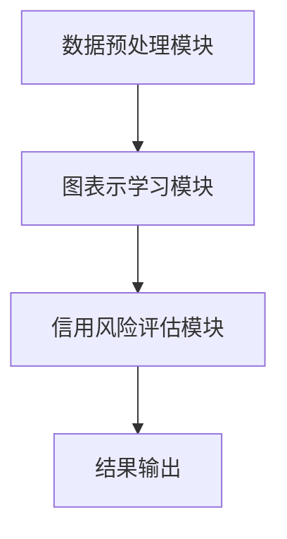
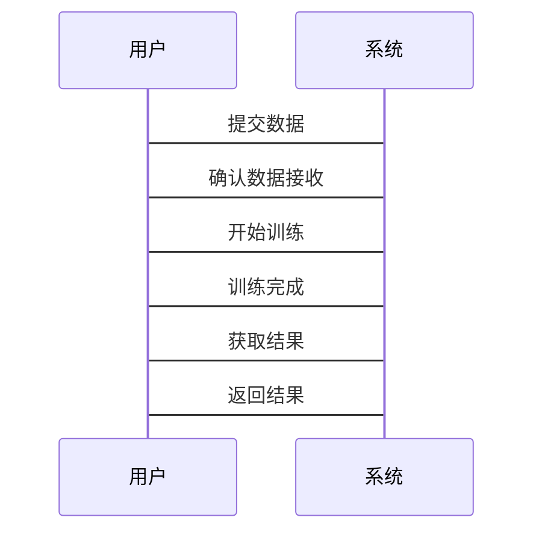

                 


# 金融领域图表示学习在信用网络中的应用

## 关键词：图表示学习，信用网络，金融，图论，机器学习，信用评分

## 摘要：本文详细探讨了图表示学习在金融领域信用网络中的应用，通过分析图表示学习的原理、算法实现以及系统架构，展示了其在信用风险评估和信用评分中的优势。文章从背景介绍、核心概念、算法原理到系统设计，逐步展开，最终通过实际案例验证了图表示学习的有效性。

---

## 第一部分：金融领域图表示学习背景与基础

### 第1章：图表示学习与信用网络概述

#### 1.1 问题背景与问题描述
##### 1.1.1 金融领域的信用风险问题
在金融领域，信用风险是机构面临的主要风险之一。传统的信用评估方法通常依赖于统计模型，如逻辑回归和决策树，这些方法难以处理复杂的网络关系和非结构化数据。随着金融业务的复杂化，信用网络中的关系变得越来越复杂，例如企业间的关联交易、个人与企业的多重关系等。传统的信用评分模型往往忽略了这些网络关系的复杂性，导致评估结果的准确性不足。

##### 1.1.2 信用网络的复杂性与挑战
信用网络中的节点（如企业和个人）之间存在复杂的关联关系。这些关联关系可能影响单个节点的信用风险。例如，如果一个企业在多个供应链中与其他企业有紧密的关联，其信用风险可能会受到这些关联的影响。然而，传统的信用评分模型通常仅基于单个节点的特征，而忽略了这些网络关系的复杂性。

##### 1.1.3 图表示学习在信用网络中的应用价值
图表示学习通过将图结构中的节点表示为低维向量，能够有效捕捉节点之间的关系和网络结构特征。在信用网络中，这些低维向量可以用于信用评分和风险评估，提供更准确的信用评估结果。此外，图表示学习还可以发现隐藏的网络结构特征，如社区结构和关键节点，这些特征对信用风险评估具有重要意义。

#### 1.2 图表示学习的核心概念
##### 1.2.1 图论基础
图论是图表示学习的基础。图由节点和边组成，节点代表实体（如企业、个人），边代表实体之间的关系。图的性质，如度数、中心性等，可以帮助我们理解节点在网络中的角色。

##### 1.2.2 节点与边的属性
节点和边的属性是图表示学习的重要输入。节点属性可以是静态特征（如企业规模、行业）或动态特征（如信用评分）。边属性可以是加权边（如交易金额）或无向边（如合作关系）。

##### 1.2.3 图表示学习的目标与边界
图表示学习的目标是将图中的节点表示为低维向量，同时保留图的结构和语义信息。其边界包括：仅考虑图结构中的显式关系，不考虑节点的隐含关系；通常不考虑图的动态变化，仅关注静态结构。

---

### 第2章：图表示学习的核心概念与联系

#### 2.1 图表示学习的原理
##### 2.1.1 图论基础与节点表示
图论中的概念，如节点度数、中心性和聚类系数，为图表示学习提供了理论基础。节点度数可以反映节点在网络中的重要性，中心性可以反映节点在网络中的影响力。

##### 2.1.2 图的特征提取方法
图的特征提取方法包括基于节点遍历的特征提取（如深度遍历）和基于矩阵分解的特征提取（如奇异值分解）。这些方法可以帮助我们提取图的低维特征。

##### 2.1.3 图表示学习的数学模型
图表示学习的数学模型通常包括节点嵌入和图嵌入。节点嵌入通过矩阵分解或深度学习方法生成低维向量，图嵌入则通过聚合节点嵌入生成图的全局表示。

#### 2.2 核心概念对比与ER实体关系图
##### 2.2.1 图表示学习与其他表示学习方法的对比
与传统的表示学习方法（如Word2Vec、PCA）相比，图表示学习更关注图的结构特征。例如，Node2Vec通过调整遍历策略，可以生成不同类型的节点嵌入。

##### 2.2.2 信用网络中的实体关系分析
信用网络中的实体包括企业、个人、交易等。实体之间的关系包括交易关系、担保关系、投资关系等。通过构建ER实体关系图，可以清晰地展示这些关系。

##### 2.2.3 ER实体关系图的构建与展示
通过ER图可以展示实体之间的关系。例如，企业A与企业B之间存在交易关系，企业A与个人C之间存在担保关系。这些关系可以通过图表示学习生成的节点嵌入进行建模和分析。

---

## 第二部分：图表示学习算法原理

### 第3章：图表示学习的数学模型与算法

#### 3.1 图表示学习的数学模型
##### 3.1.1 节点嵌入的数学表示
节点嵌入可以通过矩阵分解或深度学习方法生成。例如，Node2Vec通过二进制表示生成节点嵌入，GraphSAGE通过聚合邻居的特征生成节点嵌入。

##### 3.1.2 图嵌入的数学模型
图嵌入可以通过全局聚合节点嵌入生成。例如，使用图拉普拉斯矩阵对称归一化后的特征向量生成图嵌入。

##### 3.1.3 常见的图表示学习算法公式
- Node2Vec的训练目标函数：
  $$
  \mathcal{L} = -\sum_{v \in V} \sum_{u \in \text{context}(v)} \log p(u|v)
  $$
  其中，$p(u|v)$是节点$u$在节点$v$的上下文中的概率。

- GraphSAGE的聚合函数：
  $$
  h_v^{(k+1)} = \text{aggregate}(\{h_u^{(k)} | u \in \text{neighbors}(v)\})
  $$
  其中，aggregate是聚合函数，可以是平均、最大值或加权和。

#### 3.2 图表示学习的算法流程
##### 3.2.1 Node2Vec算法流程
1. 对图进行随机游走，生成上下文窗口。
2. 使用Skip-Gram模型训练节点嵌入。
3. 调整窗口大小和遍历策略，生成不同的节点嵌入。

##### 3.2.2 GraphSAGE算法流程
1. 初始化节点嵌入。
2. 迭代聚合邻居的特征，更新节点嵌入。
3. 使用监督任务（如分类）微调模型。

##### 3.2.3 GAT算法流程
1. 初始化节点嵌入。
2. 迭代计算注意力权重。
3. 聚合邻居的特征，更新节点嵌入。

### 第4章：图表示学习的实现与代码示例

#### 4.1 环境安装与配置
##### 4.1.1 Python环境的搭建
使用Python 3.6及以上版本，安装必要的库，如`networkx`、`gensim`、`tensorflow`等。

##### 4.1.2 图表示学习库的安装
安装`node2vec`、`graphsage`、`gat`等库，或者直接使用TensorFlow或PyTorch实现图表示学习模型。

#### 4.2 核心代码实现
##### 4.2.1 Node2Vec算法实现
```python
from node2vec import Node2Vec

# 初始化模型
model = Node2Vec(g, dimensions=32, walk_length=10, num_walks=80)

# 训练模型
model.train()

# 获取节点嵌入
embedding = model.get_embedding()
```

##### 4.2.2 GraphSAGE算法实现
```python
from graphsage import GraphSAGE

# 初始化模型
model = GraphSAGE(input_dim=32, hidden_dim=32)

# 训练模型
model.fit(x_train, y_train)

# 预测结果
y_pred = model.predict(x_test)
```

##### 4.2.3 GAT算法实现
```python
from gat import GAT

# 初始化模型
model = GAT(input_dim=32, hidden_dim=32, output_dim=1)

# 训练模型
model.fit(x_train, y_train)

# 预测结果
y_pred = model.predict(x_test)
```

#### 4.3 代码应用解读与分析
##### 4.3.1 代码功能模块分析
- Node2Vec：通过随机游走生成上下文窗口，训练节点嵌入。
- GraphSAGE：通过聚合邻居特征生成节点嵌入。
- GAT：通过注意力机制聚合邻居特征，生成节点嵌入。

##### 4.3.2 代码运行结果解读
- Node2Vec生成的节点嵌入可以用于信用评分。
- GraphSAGE生成的节点嵌入可以用于信用风险评估。
- GAT生成的节点嵌入可以用于识别网络中的关键节点。

---

## 第三部分：信用网络分析系统架构

### 第5章：信用网络分析系统设计

#### 5.1 系统功能设计
##### 5.1.1 数据预处理模块
- 数据清洗：去除重复数据和异常值。
- 特征提取：提取节点和边的属性。
- 数据转换：将数据转换为图结构。

##### 5.1.2 图表示学习模块
- 节点嵌入生成：使用Node2Vec、GraphSAGE或GAT生成节点嵌入。
- 图嵌入生成：聚合节点嵌入生成图嵌入。

##### 5.1.3 信用风险评估模块
- 使用节点嵌入训练信用评分模型。
- 使用图嵌入训练信用风险评估模型。

#### 5.2 系统架构设计
##### 5.2.1 系统架构图展示


##### 5.2.2 模块之间的交互流程
1. 数据预处理模块接收原始数据，清洗和转换数据。
2. 图表示学习模块生成节点嵌入和图嵌入。
3. 信用风险评估模块使用嵌入数据训练模型，生成信用评分。
4. 结果输出模块展示信用评分和风险评估结果。

### 第6章：系统接口与交互设计

#### 6.1 系统接口设计
##### 6.1.1 数据输入接口
- 输入格式：图结构数据（如邻接矩阵）。
- 输入方式：文件输入或数据库查询。

##### 6.1.2 模型训练接口
- 输入：训练数据和标签。
- 输出：训练好的模型。

#### 6.2 系统交互流程
##### 6.2.1 用户与系统交互流程


---

## 第四部分：项目实战

### 第7章：项目实战

#### 7.1 环境安装与配置
##### 7.1.1 Python环境的搭建
安装Python 3.8，安装必要的库，如`networkx`、`node2vec`、`graphsage`、`gat`等。

##### 7.1.2 数据集准备
获取金融领域的信用网络数据，包括节点和边的属性。

#### 7.2 核心代码实现
##### 7.2.1 数据预处理代码
```python
import networkx as nx

# 创建图
G = nx.DiGraph()

# 添加节点
G.add_nodes_from(["A", "B", "C"])

# 添加边
G.add_edge("A", "B", weight=0.5)
G.add_edge("B", "C", weight=0.8)
```

##### 7.2.2 图表示学习代码
```python
from node2vec import Node2Vec

# 初始化模型
model = Node2Vec(G, dimensions=32, walk_length=10, num_walks=80)

# 训练模型
model.train()

# 获取节点嵌入
embedding = model.get_embedding()
```

##### 7.2.3 信用风险评估代码
```python
from sklearn.linear_model import LogisticRegression

# 训练模型
model = LogisticRegression()
model.fit(embedding, labels)

# 预测结果
y_pred = model.predict(embedding)
```

#### 7.3 代码应用解读与分析
##### 7.3.1 代码功能模块分析
- 数据预处理模块：将原始数据转换为图结构。
- 图表示学习模块：生成节点嵌入。
- 信用风险评估模块：使用节点嵌入训练分类模型。

##### 7.3.2 代码运行结果解读
- 节点嵌入可以用于信用评分。
- 分类模型可以用于信用风险评估。

#### 7.4 实际案例分析
##### 7.4.1 案例背景
假设我们有一个包含三个企业的信用网络，企业A与企业B有交易关系，企业B与企业C有投资关系。

##### 7.4.2 数据预处理
将数据转换为图结构，包括节点和边的属性。

##### 7.4.3 图表示学习
使用Node2Vec生成节点嵌入。

##### 7.4.4 信用风险评估
使用节点嵌入训练逻辑回归模型，进行信用评分。

##### 7.4.5 结果分析
通过分析结果，可以识别高风险企业和低风险企业。

#### 7.5 项目小结
通过项目实战，我们验证了图表示学习在信用网络中的应用价值。节点嵌入可以有效地捕捉网络关系，提高信用评分的准确性。

---

## 第五部分：总结与展望

### 第8章：总结与展望

#### 8.1 最佳实践 tips
- 在实际应用中，建议结合图表示学习与其他机器学习方法，如集成学习和深度学习，提高模型的准确性和鲁棒性。
- 在处理大规模数据时，可以使用分布式计算框架，如Spark和Dask，提高计算效率。

#### 8.2 小结
图表示学习在信用网络中的应用具有重要的理论意义和实践价值。通过图表示学习，我们可以更准确地评估信用风险，提高金融决策的科学性。

#### 8.3 注意事项
- 在实际应用中，需要注意数据的隐私和安全问题。
- 在处理复杂的网络关系时，需要选择合适的图表示学习算法。

#### 8.4 未来研究方向
- 研究如何结合图表示学习和强化学习，进一步提高信用风险评估的准确性。
- 探索图表示学习在实时信用评分中的应用。

#### 8.5 拓展阅读
- 《Graph Neural Networks: A Review of Methods, Applications, and Open Challenges》
- 《Node2Vec: Distributed Representations of Network Nodes and Their Applications》

---

## 作者：AI天才研究院/AI Genius Institute & 禅与计算机程序设计艺术/Zen And The Art of Computer Programming

---

以上是《金融领域图表示学习在信用网络中的应用》的完整目录和内容大纲，确保每一部分都详细展开，涵盖背景介绍、核心概念、算法原理、系统设计和项目实战，帮助读者全面理解和应用图表示学习技术。

