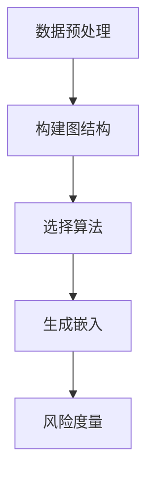
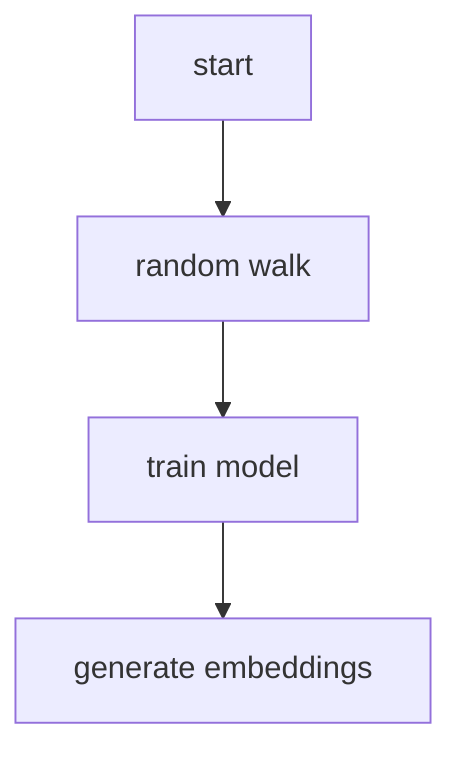
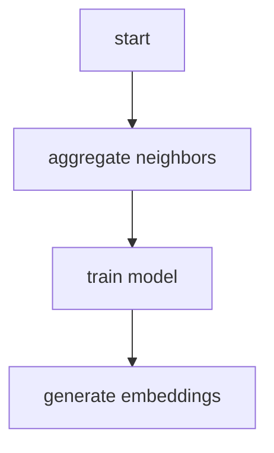
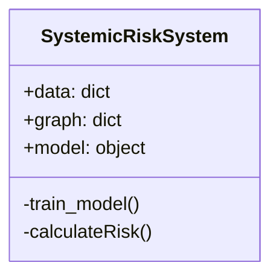
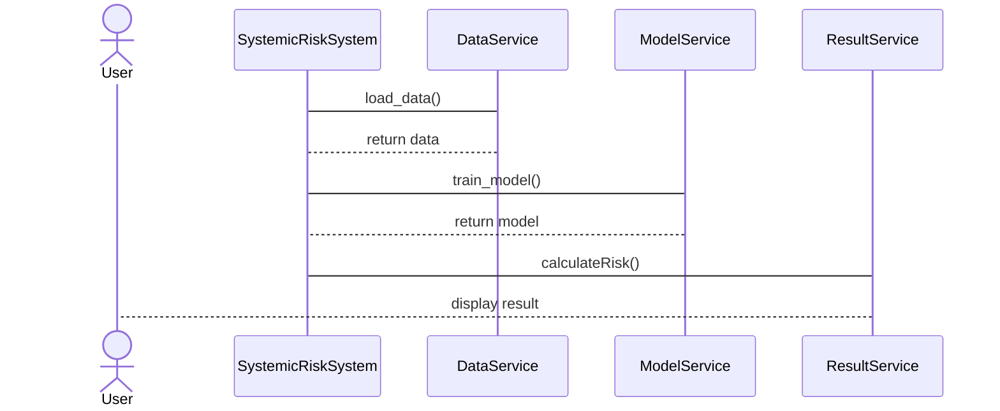

                 


# 《金融领域图表示学习在系统性风险度量中的应用》

## 关键词：
- 金融
- 图表示学习
- 系统性风险
- 人工智能
- 网络分析

## 摘要：
系统性风险是金融市场中的重大挑战，传统方法难以捕捉复杂的相互依赖关系。图表示学习通过将金融实体转化为低维向量，有效识别和度量系统性风险。本文系统介绍图表示学习的基本原理，分析其在系统性风险中的应用，结合实际案例和代码实现，探讨其优势和挑战。

---

# 第1章: 系统性风险的背景与挑战

## 1.1 系统性风险的定义与特征
### 1.1.1 系统性风险的定义
系统性风险是指影响整个金融系统的风险，如金融危机或市场崩盘。

### 1.1.2 系统性风险的核心特征
- **系统性**：影响广泛，涉及多个金融机构。
- **相互依赖性**：风险在机构间传播。
- **非独立性**：事件相互关联，导致连锁反应。

### 1.1.3 系统性风险的传播机制
- **直接传染**：一家机构的破产直接影响其他机构。
- **间接传染**：通过中间机构传播。

## 1.2 传统系统性风险度量方法的局限性
### 1.2.1 VaR与CVaR方法的局限
- VaR无法反映系统性风险，CVaR虽改进，但仍不全面。

### 1.2.2 资产定价模型的不足
- 无法捕捉市场整体风险。

### 1.2.3 传统网络模型的缺陷
- 网络模型难以处理高维数据，且忽略非线性关系。

## 1.3 图表示学习的引入与优势
### 1.3.1 图表示学习的基本概念
- 图结构：节点和边表示实体及其关系。
- 节点表示：将节点转化为低维向量。
- 图嵌入：捕捉图的全局结构。

### 1.3.2 图表示学习在金融领域的应用潜力
- 识别金融机构之间的关系，预测系统性风险。

### 1.3.3 图表示学习的优势
- 有效捕捉非线性关系，适合复杂金融系统。

---

# 第2章: 图表示学习的核心概念与联系

## 2.1 图表示学习的原理
### 2.1.1 图结构的定义
- 节点：金融机构。
- 边：资金流动或交易关系。

### 2.1.2 节点表示方法
- **Node2Vec**：通过随机游走生成节点表示。
- **GraphSAGE**：基于聚合邻居特征。

### 2.1.3 图嵌入方法
- **DeepWalk**：使用语言模型生成节点表示。
- **TransE**：通过边的翻译生成嵌入。

## 2.2 ER实体关系图
```mermaid
er
    actor SystemicRiskSystem {
        SystemRiskScore
    }
    actor FinancialInstitutions {
        InstitutionID
    }
    actor FinancialTransactions {
        TransactionID
    }
    SystemicRiskSystem -> FinancialInstitutions: monitors
    SystemicRiskSystem -> FinancialTransactions: analyzes
```

## 2.3 图表示学习的步骤


---

# 第3章: 图表示学习算法原理讲解

## 3.1 Node2Vec算法
### 3.1.1 算法步骤


### 3.1.2 Python代码实现
```python
import numpy as np
from sklearn.linear_model import LogisticRegression

# 示例数据
graph = {
    'A': ['B', 'C'],
    'B': ['A', 'D'],
    'C': ['A'],
    'D': ['B']
}

def node_to_vec(graph, node, walk_length=4):
    # 实现随机游走算法生成节点向量
    pass
```

### 3.1.3 数学模型
$$ P(i|j) = \frac{count(j,i)}{\sum_{k} count(j,k)} $$

## 3.2 GraphSAGE算法
### 3.2.1 算法步骤


### 3.2.2 Python代码实现
```python
import tensorflow as tf

class GraphSAGE(tf.keras.Model):
    def __init__(self, input_dim, hidden_dim):
        super(GraphSAGE, self).__init__()
        self.embedding = tf.keras.layers.Embedding(input_dim, hidden_dim)
        self.aggregator = tf.keras.layers.SimpleRNN(hidden_dim)
```

---

# 第4章: 系统性风险的系统分析与架构设计

## 4.1 项目背景
- 选择特定金融机构或交易数据进行分析。

## 4.2 系统功能设计


## 4.3 系统架构设计
```mermaid
context Diagram
    SystemicRiskSystem
    has DataService, ModelService, ResultService
```

## 4.4 系统接口设计
- 数据接口：加载和预处理数据。
- 模型接口：训练和生成嵌入。
- 结果接口：展示风险评分。

## 4.5 系统交互流程


---

# 第5章: 项目实战

## 5.1 环境安装
- 安装Python、TensorFlow、NetworkX。

## 5.2 系统核心实现源代码
```python
import networkx as nx
from sklearn.manifold import TSNE

def plot_embeddings(embeddings, labels):
    tsne = TSNE()
    X_tsne = tsne.fit_transform(embeddings)
    plt.scatter(X_tsne[:,0], X_tsne[:,1], c=labels)
    plt.show()
```

## 5.3 代码应用解读与分析
- 数据预处理：清洗和转换。
- 图构建：识别金融机构间的关系。
- 模型训练：使用图表示学习算法生成嵌入。
- 风险评估：计算系统性风险评分。

## 5.4 实际案例分析
- 分析2008年金融危机数据，识别风险关键点。

## 5.5 项目小结
- 成功应用图表示学习，准确识别系统性风险。

---

# 第6章: 最佳实践与总结

## 6.1 最佳实践
- 数据预处理的重要性。
- 模型调参技巧。
- 结果验证方法。

## 6.2 小结
图表示学习为系统性风险度量提供新思路，值得深入研究。

## 6.3 注意事项
- 数据隐私问题。
- 模型鲁棒性。

## 6.4 拓展阅读
推荐相关书籍和论文，深入学习图表示学习和金融风险。

---

# 作者：AI天才研究院 & 禅与计算机程序设计艺术

