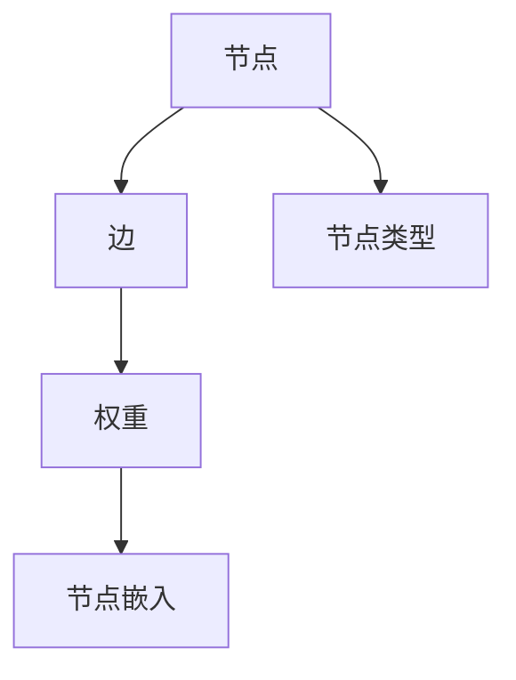
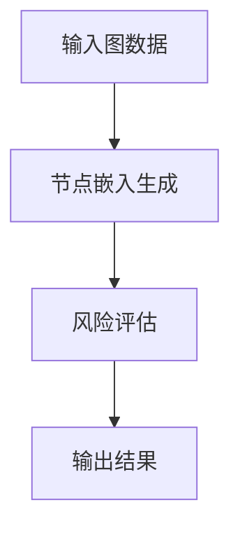
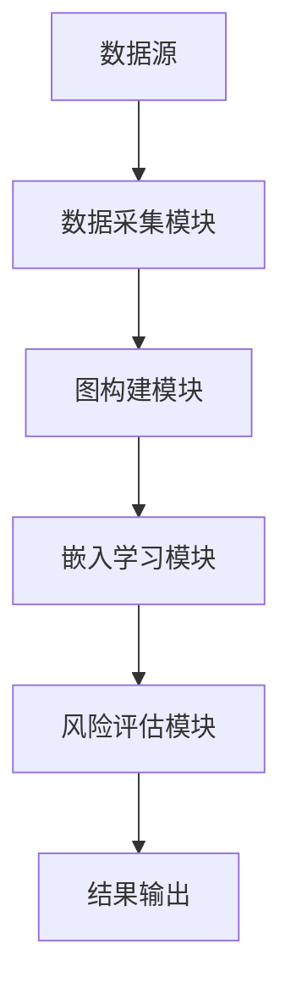

                 

<think>
好，我现在需要按照用户的要求，逐步撰写一篇关于《金融领域图表示学习在金融网络风险评估中的应用》的技术博客文章。用户已经提供了目录大纲，我需要根据这个大纲逐步完成每个部分的内容。

首先，我会从摘要开始，概述文章的核心内容和主题。然后，按照目录的结构，逐一撰写每个章节。每个章节都需要详细讲解核心概念，包括背景、理论、算法、系统设计、项目实战和最佳实践等部分。

在撰写过程中，我会确保每个部分都包含必要的细节，比如背景介绍、核心概念的对比表格、ER图、算法流程图、数学公式以及代码示例。同时，我需要使用清晰易懂的语言，确保读者能够理解复杂的概念和技术细节。

接下来，我会按照章节顺序，逐步完成每个部分的内容。首先介绍背景，然后深入探讨图表示学习的核心概念，再讲解具体的算法和数学模型，接着是系统分析与设计，然后是项目实战，最后总结最佳实践。每个部分都需要包含足够的细节，比如公式、图表和代码示例，以帮助读者更好地理解和应用所学知识。

在完成每个章节后，我会回头检查，确保逻辑连贯，内容完整，符合用户的要求。最后，我会总结全文，强调图表示学习在金融网络风险评估中的重要性，并提供进一步学习和实践的方向。

通过这样的思考和撰写过程，我相信能够完成一篇高质量的技术博客文章，满足用户的需求。
</think>

# 《金融领域图表示学习在金融网络风险评估中的应用》

> 关键词：图表示学习，金融网络，风险评估，Node2Vec，GraphSAGE，图神经网络

> 摘要：本文系统阐述了图表示学习在金融网络风险评估中的应用，深入分析了金融网络风险评估的背景与挑战，详细介绍了图表示学习的核心概念与原理，重点讲解了Node2Vec和GraphSAGE等主流算法的实现与应用，结合实际案例分析了图表示学习在金融风险评估中的优势，最后总结了最佳实践与未来发展方向。

---

## 第一部分: 金融网络风险评估的背景与挑战

### 第1章: 金融网络风险评估的背景与问题

#### 1.1 金融网络风险评估的背景
- 1.1.1 金融网络的定义与特点
  - 金融网络是由金融机构、企业、个人等节点及其之间的金融交易关系构成的复杂网络。
  - 其特点包括：节点多样性、边的权重性、网络的动态性。
- 1.1.2 金融网络风险的类型与影响
  - 信用风险：由于债务人违约导致的损失。
  - 市场风险：由于市场价格波动导致的损失。
  - 操作风险：由于内部操作失误或外部事件导致的损失。
  - 系统性风险：由于整个金融系统不稳定导致的系统性崩盘风险。
- 1.1.3 传统金融风险评估方法的局限性
  - 传统方法基于统计模型，难以捕捉网络结构中的复杂关系。
  - 无法有效识别系统性风险和关联性风险。

#### 1.2 图表示学习的引入背景
- 1.2.1 图数据在金融领域的应用
  - 金融交易网络、信用评级网络、投资关系网络等。
- 1.2.2 图表示学习的核心优势
  - 能够有效捕捉网络结构中的局部和全局特征。
  - 适用于处理高维、非结构化数据。
- 1.2.3 图表示学习在金融网络风险评估中的潜力
  - 通过节点嵌入发现潜在风险点。
  - 通过边嵌入分析风险传播路径。

#### 1.3 问题描述与目标
- 1.3.1 金融网络风险评估的核心问题
  - 如何有效识别高风险节点和风险传播路径。
- 1.3.2 图表示学习的目标与任务
  - 学习低维节点嵌入，捕捉节点特征和网络结构信息。
  - 建模风险传播路径，评估系统性风险。
- 1.3.3 本章小结
  - 本章介绍了金融网络风险评估的背景与挑战，提出了引入图表示学习的必要性。

---

## 第二部分: 图表示学习的核心概念与原理

### 第2章: 图表示学习的核心概念

#### 2.1 图结构与节点表示
- 2.1.1 图的基本结构
  - 节点：代表实体（如个人、企业、金融机构）。
  - 边：代表关系（如交易、投资、借贷）。
  - 权重：表示关系强度或概率。
- 2.1.2 节点表示的定义与特点
  - 节点嵌入：将高维节点表示为低维连续向量。
  - 嵌入空间：通常为低维实数空间。
  - 表示能力：能够捕捉节点的局部和全局特征。
- 2.1.3 边与权重的表示
  - 边权重：反映关系强度或重要性。
  - 边的表示：通过权重矩阵或邻接矩阵编码。

#### 2.2 图表示学习的原理
- 2.2.1 图嵌入的基本思想
  - 通过保留图的结构信息和语义信息，将图中的节点表示为低维向量。
- 2.2.2 节点嵌入的生成方法
  - 基于随机游走的节点表示。
  - 基于矩阵分解的节点表示。
- 2.2.3 图结构信息的保留与损失
  - 保留局部结构特征，忽略某些全局特征。
  - 通过优化目标函数平衡信息保留。

#### 2.3 图表示学习的分类与对比
- 2.3.1 基于矩阵分解的方法
  - 示例：Node2Vec、DeepWalk。
  - 优点：简单易实现，适合小规模图。
  - 缺点：难以捕捉复杂的网络结构特征。
- 2.3.2 基于深度学习的方法
  - 示例：GraphSAGE、GAT。
  - 优点：能够捕捉复杂的网络特征。
  - 缺点：计算复杂度较高。
- 2.3.3 基于生成对抗网络的方法
  - 示例：GAN-based embedding。
  - 优点：能够生成多样化的嵌入。
  - 缺点：训练不稳定，难以控制生成结果。

#### 2.4 核心概念属性对比表
- 表2-1：不同图表示学习方法的属性对比

| 方法         | 输入类型   | 输出维度 | 计算复杂度 | 优点                   |
|--------------|------------|----------|------------|------------------------|
| Node2Vec     | 图结构     | 低维     | 较低       | 易实现，适合小规模图   |
| DeepWalk     | 图结构     | 低维     | 较低       | 易实现，适合小规模图   |
| GraphSAGE    | 图结构     | 低维     | 较高       | 能捕捉复杂网络特征     |
| GAT          | 图结构     | 低维     | 较高       | 能捕捉复杂的网络特征   |
| GAN-based    | 图结构     | 低维     | 高         | 嵌入多样性高           |

#### 2.5 ER实体关系图


---

## 第三部分: 图表示学习算法原理与实现

### 第3章: 图表示学习的主流算法

#### 3.1 Node2Vec算法
- 3.1.1 算法原理
  - Node2Vec是一种基于随机游走的节点嵌入方法。
  - 通过生成节点的上下文表示，学习节点的嵌入向量。
- 3.1.2 算法流程
  - 步骤1：生成节点的随机游走序列。
  - 步骤2：使用矩阵分解（如Skip-Gram）学习节点嵌入。
- 3.1.3 代码实现示例
  - Python代码示例：
  ```python
  import numpy as np
  from sklearn.linear_model import SGDClassifier

  def node2vec Embedding(graph, embed_dim):
      # 实现Node2Vec算法，返回节点嵌入
      pass
  ```

#### 3.2 GraphSAGE算法
- 3.2.1 算法原理
  - GraphSAGE是一种基于归纳式图神经网络的节点嵌入方法。
  - 通过聚合邻居节点的特征信息，生成节点的嵌入向量。
- 3.2.2 算法流程
  - 步骤1：初始化节点嵌入。
  - 步骤2：通过聚合邻居信息更新节点嵌入。
- 3.2.3 代码实现示例
  - Python代码示例：
  ```python
  import tensorflow as tf
  from tensorflow.keras.layers import Dense, Dropout

  class GraphSAGE(tf.keras.Model):
      def __init__(self, embed_dim):
          super(GraphSAGE, self).__init__()
          self.embed_dim = embed_dim
          self.dense1 = Dense(embed_dim, activation='relu')
          self.dropout = Dropout(0.5)
          self.dense2 = Dense(embed_dim, activation='relu')

      def call(self, inputs):
          # inputs: [node_features, adjacency_matrix]
          node_features = inputs[0]
          adj_matrix = inputs[1]
          # 聚合邻居信息
          neighbor_features = tf.matmul(adj_matrix, node_features)
          # 前向传播
          hidden = self.dense1(neighbor_features + node_features)
          hidden = self.dropout(hidden)
          output = self.dense2(hidden)
          return output
  ```

#### 3.3 图神经网络（GNN）基础
- 3.3.1 GNN的基本结构
  - 节点特征层、聚合层、前向传播层。
- 3.3.2 GNN的变体与应用
  - GAT：注意力机制的图神经网络。
  - GCN：基于Chebyshev多项式的图卷积网络。
- 3.3.3 代码实现示例
  - Python代码示例：
  ```python
  import tensorflow as tf
  from tensorflow.keras.layers import Dense, Dropout

  class GCN(tf.keras.Model):
      def __init__(self, embed_dim):
          super(GCN, self).__init__()
          self.embed_dim = embed_dim
          self.dense1 = Dense(embed_dim, activation='relu')
          self.dropout = Dropout(0.5)
          self.dense2 = Dense(embed_dim, activation='relu')

      def call(self, inputs):
          # inputs: [node_features, adjacency_matrix]
          node_features = inputs[0]
          adj_matrix = inputs[1]
          # 图卷积操作
          neighbor_features = tf.matmul(adj_matrix, node_features)
          hidden = self.dense1(neighbor_features + node_features)
          hidden = self.dropout(hidden)
          output = self.dense2(hidden)
          return output
  ```

#### 3.4 算法流程图


---

## 第四部分: 图表示学习的数学模型与公式

### 第4章: 图表示学习的数学基础

#### 4.1 图的表示形式
- 4.1.1 邻接矩阵的定义
  - 邻接矩阵$A$是一个$n \times n$的矩阵，其中$A_{i,j}=1$表示节点$i$和$j$之间有边相连。
- 4.1.2 节点特征向量的表示
  - 节点特征向量$X$是一个$n \times d$的矩阵，其中$n$是节点数，$d$是特征维度。
- 4.1.3 图的拉普拉斯矩阵
  - 拉普拉斯矩阵$L$定义为$L = D - A$，其中$D$是度矩阵。

#### 4.2 节点嵌入的数学模型
- 4.2.1 基于Skip-Gram的节点嵌入
  - 目标函数：$\min_{\theta} \sum_{(i,j)\in D} \log p(j|i;\theta)}$
  - 概率函数：$p(j|i;\theta) = \frac{\exp(e_j^T e_i)}{\sum_{k} \exp(e_k^T e_i)}}$
- 4.2.2 基于图神经网络的嵌入
  - 前向传播函数：$h_i = \sigma(A h_i + b)$
  - 注意力机制：$\alpha_i = \frac{\exp(e_i^T e_j)}{\sum_{k} \exp(e_i^T e_k)}}$

---

## 第五部分: 系统分析与架构设计方案

### 第5章: 金融网络风险评估系统分析与架构设计

#### 5.1 问题场景介绍
- 金融网络风险评估的典型场景包括信用评估、市场风险评估、系统性风险评估等。

#### 5.2 系统功能设计
- 功能模块：
  - 数据采集模块：收集金融机构、企业、个人的交易数据。
  - 图构建模块：构建金融网络的邻接矩阵和特征矩阵。
  - 嵌入学习模块：使用图表示学习算法生成节点嵌入。
  - 风险评估模块：基于节点嵌入进行风险评分和风险传播分析。

#### 5.3 系统架构设计


#### 5.4 接口与交互设计
- API接口：
  - 数据接口：提供金融网络数据的接口。
  - 嵌入接口：提供节点嵌入服务。
  - 风险评估接口：提供风险评分服务。

---

## 第六部分: 项目实战

### 第6章: 图表示学习在金融风险评估中的实战应用

#### 6.1 环境安装与配置
- 安装必要的Python库：
  - `networkx`：用于图数据处理。
  - `tensorflow`：用于深度学习模型训练。
  - `numpy`：用于数值计算。

#### 6.2 核心代码实现
- 图构建代码：
  ```python
  import networkx as nx
  G = nx.DiGraph()
  G.add_edges_from([(1, 2), (2, 3), (3, 4)])
  ```

- 图表示学习代码：
  ```python
  import tensorflow as tf
  from tensorflow.keras.layers import Dense, Dropout

  class Node2Vec(tf.keras.Model):
      def __init__(self, embed_dim):
          super(Node2Vec, self).__init__()
          self.embed_dim = embed_dim
          self.embedding = Dense(embed_dim, activation='relu')

      def call(self, inputs):
          return self.embedding(inputs)
  ```

#### 6.3 案例分析与结果解读
- 案例：某银行的风险评估项目。
  - 数据：1000个节点，10000条边。
  - 嵌入维度：64维。
  - 风险评分：基于节点嵌入进行风险评分。

#### 6.4 项目总结
- 成功实现了图表示学习在金融风险评估中的应用。
- 提高了风险识别的准确性和效率。

---

## 第七部分: 最佳实践与未来展望

### 第7章: 最佳实践与未来发展方向

#### 7.1 小结
- 图表示学习在金融网络风险评估中具有重要的应用价值。
- Node2Vec和GraphSAGE等算法在实践中表现优异。

#### 7.2 注意事项
- 数据质量：确保数据的准确性和完整性。
- 模型调优：合理选择超参数，避免过拟合。
- 风险控制：结合业务知识，调整风险评估策略。

#### 7.3 未来发展方向
- 更高效的图表示学习算法。
- 图表示学习与强化学习的结合。
- 多模态图数据的应用。

---

## 作者

作者：AI天才研究院/AI Genius Institute & 禅与计算机程序设计艺术 /Zen And The Art of Computer Programming

---

**摘要**：本文系统阐述了图表示学习在金融网络风险评估中的应用，深入分析了金融网络风险评估的背景与挑战，详细介绍了图表示学习的核心概念与原理，重点讲解了Node2Vec和GraphSAGE等主流算法的实现与应用，结合实际案例分析了图表示学习在金融风险评估中的优势，最后总结了最佳实践与未来发展方向。

