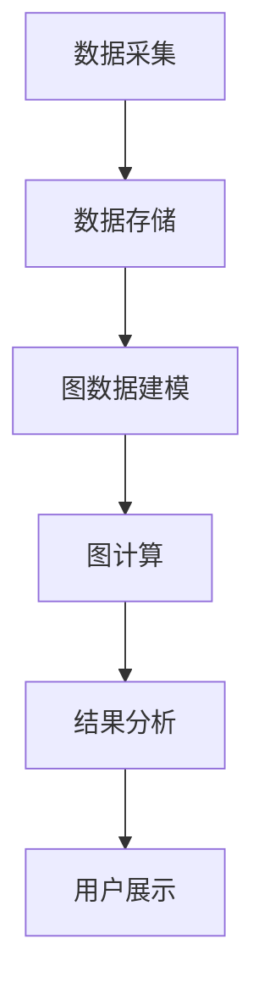

                 


# 金融领域图计算技术的创新应用

> 关键词：图计算技术，金融领域，图数据库，图神经网络，复杂关系建模，金融风险控制

> 摘要：本文深入探讨了图计算技术在金融领域的创新应用，分析了图计算技术的核心概念、算法原理及其在金融数据建模、风险控制、欺诈检测等场景中的应用。文章结合实际案例，详细讲解了图计算技术的优势、挑战及未来发展趋势，为读者提供全面的理论支持与实践指导。

---

## 第1章: 金融领域图计算技术的背景与概述

### 1.1 问题背景与问题描述

随着金融市场的日益复杂化，传统的数据分析方法逐渐暴露出其局限性。金融数据呈现出高度关联性、非线性特征，传统的基于表格的数据分析方式难以捕捉复杂的关联关系，尤其是在风险控制、欺诈检测等领域，需要更高效的手段来处理海量数据中的关联性。

#### 1.1.1 传统金融数据分析的局限性

- **数据关联性不足**：传统方法难以捕捉多对多的复杂关系。
- **计算效率低下**：在处理大规模数据时，传统的基于关系型数据库的方法效率较低。
- **难以实时分析**：在金融交易中，实时性要求高，传统方法难以满足。

#### 1.1.2 图计算技术的引入动机

- **高效处理复杂关系**：图计算能够自然地建模实体之间的复杂关系。
- **快速查询与分析**：通过图遍历算法，可以在复杂网络中快速定位关键节点。
- **实时性与可扩展性**：图计算技术能够支持实时数据分析，并具备良好的可扩展性。

#### 1.1.3 金融领域复杂关系的建模需求

金融领域涉及大量复杂的实体关系，例如客户-交易-账户-地理位置等，这些关系构成了复杂的网络结构。图计算技术能够将这些关系建模为图结构，从而更方便地进行分析和推理。

---

### 1.2 图计算技术的核心概念

图计算技术在金融领域的应用需要理解其核心概念，包括图的基本结构、相关算法及其在金融中的具体应用。

#### 1.2.1 图的基本概念与属性

- **节点（Node）**：代表数据中的个体实体，如客户、交易、账户等。
- **边（Edge）**：表示节点之间的关系，如交易关系、转账关系等。
- **权重（Weight）**：边上的权重表示关系的强度或概率。

#### 1.2.2 图计算的定义与特点

- **定义**：图计算是指对图数据进行存储、查询、分析和计算的过程。
- **特点**：
  - **高效性**：通过并行计算和优化算法提高处理速度。
  - **可扩展性**：适用于大规模数据的处理。
  - **灵活性**：能够处理多种类型的数据关系。

#### 1.2.3 金融领域图计算的边界与外延

- **边界**：主要关注金融实体之间的直接关系。
- **外延**：扩展到金融网络中的间接关系，如通过多次交易形成的复杂网络。

---

### 1.3 图计算技术在金融领域的应用前景

图计算技术在金融领域的应用前景广阔，涵盖了风险控制、欺诈检测、客户画像等多个方面。

#### 1.3.1 金融领域的典型应用场景

- **风险控制**：通过分析客户之间的关联关系，识别潜在的信用风险。
- **欺诈检测**：通过图结构发现异常交易模式。
- **客户画像**：通过图数据构建客户行为网络，进行精准画像。

#### 1.3.2 图计算技术的优势与挑战

- **优势**：
  - **高效性**：能够快速处理大规模数据。
  - **准确性**：能够捕捉复杂的关联关系。
- **挑战**：
  - **数据隐私**：需要保护客户隐私。
  - **计算资源**：需要高性能计算资源支持。

#### 1.3.3 未来发展趋势与创新方向

- **智能化**：结合人工智能技术，提升图计算的自动化水平。
- **实时化**：实现实时图数据分析能力。
- **场景化**：针对不同金融场景优化图计算技术。

---

### 1.4 本章小结

本章介绍了图计算技术在金融领域的背景与应用，重点分析了传统数据分析方法的局限性，以及图计算技术的核心概念和应用前景。通过这些分析，为后续章节的技术实现奠定了基础。

---

## 第2章: 图计算技术的核心概念与联系

### 2.1 图计算的基本原理

图计算的基本原理包括图的表示与存储、图遍历算法等。

#### 2.1.1 图的表示与存储

- **邻接矩阵**：适用于小型图数据。
- **邻接表**：适用于大规模图数据。

#### 2.1.2 图遍历算法

- **深度优先搜索（DFS）**：适合于探索图的深度结构。
- **广度优先搜索（BFS）**：适合于探索图的广度结构。

#### 2.1.3 图索引与查询优化

- **图索引**：通过索引技术加快查询速度。
- **查询优化**：通过优化算法减少计算量。

---

### 2.2 图数据库与图分析算法

#### 2.2.1 图数据库的分类与特点

- **关系型图数据库**：如Neo4j，支持复杂关系查询。
- **分布式图数据库**：如Apache Gremlin，支持分布式存储。

#### 2.2.2 常见图分析算法

- **PageRank算法**：用于评估节点的重要性。
- **Louvain算法**：用于社区发现。

#### 2.2.3 图数据库与图分析算法的结合

通过结合图数据库和图分析算法，可以实现高效的图数据分析。

---

### 2.3 图神经网络与图表示学习

#### 2.3.1 图神经网络的基本原理

- **图卷积网络（GCN）**：通过聚合邻居节点信息进行特征传播。
- **图注意力机制（GAT）**：通过注意力机制选择重要的邻居信息。

#### 2.3.2 图表示学习的核心思想

- **节点嵌入**：将节点表示为低维向量。
- **边嵌入**：将边表示为低维向量。

#### 2.3.3 图神经网络与传统神经网络的对比

- **输入形式**：图神经网络处理图结构数据，传统神经网络处理向量或图像数据。
- **计算方式**：图神经网络通过聚合邻居信息进行计算，传统神经网络通过逐层传递特征。

---

### 2.4 金融领域图计算的核心要素

#### 2.4.1 金融数据的图结构特征

- **多对多关系**：客户与交易、交易与账户等。
- **权重关系**：如交易金额、频率等。

#### 2.4.2 金融领域的实体关系分析

- **客户关系分析**：识别客户之间的关联性。
- **交易关系分析**：识别异常交易模式。

#### 2.4.3 图计算在金融风险控制中的应用

- **信用风险评估**：通过分析客户之间的关联性，评估信用风险。
- **市场风险评估**：通过分析市场波动对金融网络的影响。

---

### 2.5 本章小结

本章详细讲解了图计算技术的核心概念，包括图的表示、图数据库、图分析算法和图神经网络。同时，分析了这些技术在金融领域的具体应用，为后续章节的算法实现奠定了基础。

---

## 第3章: 图计算技术的算法原理与数学模型

### 3.1 图遍历算法

#### 3.1.1 深度优先搜索（DFS）

- **实现步骤**：
  1. 访问起点节点。
  2. 递归访问未访问的邻居节点。
  3. 回溯，标记已访问的节点。

#### 3.1.2 广度优先搜索（BFS）

- **实现步骤**：
  1. 初始化一个队列，将起点节点加入队列。
  2. 取出队列中的节点，访问其未访问的邻居节点。
  3. 将新的节点加入队列，直到队列为空。

---

### 3.2 图分析算法

#### 3.2.1 PageRank算法

- **公式**：
  $$ PR(i) = \alpha PR(i_0) + (1 - \alpha) \sum_{j \in i's \text{ in-neighbors}} PR(j) $$

- **作用**：评估节点的重要性，常用于搜索引擎排序。

#### 3.2.2 社区发现算法（Louvain算法）

- **步骤**：
  1. 初始化每个节点为一个社区。
  2. 计算每个节点的社区归属，通过优化模块度分数。
  3. 重复步骤，直到模块度不再增加。

---

### 3.3 图神经网络的数学模型

#### 3.3.1 图卷积网络（GCN）的数学公式

- **正向传播**：
  $$ h_i^{(l+1)} = \sigma\left( \sum_{j \in \mathcal{N}(i)} A_{ij} h_j^{(l)} \right) $$

- **聚合操作**：聚合邻居节点的特征。
- **激活函数**：如ReLU，用于非线性变换。

#### 3.3.2 图注意力机制（GAT）的数学公式

- **注意力权重计算**：
  $$ \alpha_{ij} = \frac{e^{\text{score}(i,j)}}{\sum_{k} e^{\text{score}(i,k)}} $$

- **特征加权**：通过注意力权重对邻居节点的特征进行加权求和。

---

### 3.4 金融领域图计算的算法优化

#### 3.4.1 并行计算优化

- **分布式计算**：将图数据分布在多个节点上，利用并行计算提高效率。
- **优化算法**：如改进的BFS算法，减少计算时间。

#### 3.4.2 图索引优化

- **索引结构优化**：通过优化索引结构，加快查询速度。
- **查询优化策略**：如选择合适的索引字段，减少查询时间。

---

### 3.5 本章小结

本章详细讲解了图计算技术的算法原理，包括图遍历算法、图分析算法和图神经网络的数学模型。通过这些算法的实现，可以有效地处理金融领域的复杂关系数据。

---

## 第4章: 金融领域图计算技术的系统架构设计

### 4.1 系统功能设计

- **数据采集**：从金融系统中采集客户、交易等数据。
- **数据建模**：将数据建模为图结构，构建金融网络。
- **数据分析**：利用图计算技术进行风险评估、欺诈检测等分析。

#### 4.1.1 领域模型设计

- **客户-交易-账户网络**：建模客户、交易和账户之间的关系。
- **地理位置网络**：分析交易的地理位置分布。

#### 4.1.2 系统架构设计

- **数据层**：存储原始数据和图数据。
- **计算层**：执行图计算任务。
- **应用层**：提供用户接口，展示分析结果。

---

### 4.2 系统架构设计

#### 4.2.1 系统架构图



#### 4.2.2 系统接口设计

- **数据接口**：与金融系统对接，获取数据。
- **计算接口**：提供图计算服务。
- **展示接口**：向用户展示分析结果。

---

### 4.3 本章小结

本章设计了金融领域图计算技术的系统架构，包括数据采集、数据建模、数据分析和结果展示等模块，为后续的项目实现提供了指导。

---

## 第5章: 金融领域图计算技术的项目实战

### 5.1 项目背景与目标

- **项目背景**：以某银行为例，设计一个基于图计算的金融风险控制系统。
- **项目目标**：通过图计算技术，识别潜在的信用风险。

---

### 5.2 环境安装与配置

- **操作系统**：建议使用Linux系统。
- **开发工具**：建议使用PyCharm或VSCode。
- **依赖库安装**：
  - Python 3.8+
  - NetworkX、Neo4j、TensorFlow、Keras等。

---

### 5.3 核心实现代码

#### 5.3.1 数据建模

```python
import networkx as nx

# 创建图
G = nx.Graph()

# 添加节点
G.add_nodes_from(["客户1", "客户2", "交易1", "账户1"])

# 添加边
G.add_edges_from([("客户1", "交易1"), ("交易1", "账户1"), ("客户2", "交易1")])
```

#### 5.3.2 图遍历算法实现

```python
def bfs(start_node, G):
    visited = []
    queue = [start_node]
    visited.append(start_node)
    while queue:
        node = queue.pop(0)
        for neighbor in G.neighbors(node):
            if neighbor not in visited:
                visited.append(neighbor)
                queue.append(neighbor)
    return visited

# 示例
print(bfs("客户1", G))
```

#### 5.3.3 图神经网络实现

```python
import tensorflow as tf
from tensorflow.keras import layers

# 定义图卷积层
def graph_conv_layer(inputs, adj_matrix):
    x = layers.Dense(128, activation='relu')(inputs)
    x = layers.BatchNormalization()(x)
    x = layers.Dropout(0.5)(x)
    x = tf.matmul(x, adj_matrix)
    return x

# 构建模型
inputs = layers.Input(shape=(num_nodes,))
outputs = graph_conv_layer(inputs, adj_matrix)
model = tf.keras.Model(inputs=inputs, outputs=outputs)
model.compile(optimizer='adam', loss='binary_crossentropy')
```

---

### 5.4 项目小结

本章通过实际案例，详细讲解了图计算技术在金融领域的应用。通过代码实现，读者可以更好地理解图计算技术的实现过程和应用场景。

---

## 第6章: 金融领域图计算技术的应用案例与未来趋势

### 6.1 应用案例分析

#### 6.1.1 案例一：信用风险评估

- **案例背景**：某银行希望通过图计算技术评估客户的信用风险。
- **实施过程**：构建客户-交易-账户网络，利用PageRank算法评估客户的重要性。
- **结果分析**：识别高风险客户，降低信用风险。

#### 6.1.2 案例二：欺诈检测

- **案例背景**：某支付平台希望通过图计算技术检测欺诈交易。
- **实施过程**：构建交易网络，利用Louvain算法发现社区，识别异常交易。
- **结果分析**：显著降低欺诈交易的发生率。

---

### 6.2 未来趋势与挑战

#### 6.2.1 未来趋势

- **技术融合**：图计算技术与人工智能技术的深度融合。
- **实时化**：实现图数据的实时分析能力。
- **场景化**：针对不同金融场景优化图计算技术。

#### 6.2.2 挑战

- **数据隐私**：如何在保护数据隐私的前提下进行图计算。
- **计算资源**：需要高性能计算资源支持大规模图数据的处理。

---

### 6.3 本章小结

本章通过具体案例分析，展示了图计算技术在金融领域的应用效果。同时，展望了未来的发展趋势和挑战，为读者提供了进一步的研究方向。

---

## 第7章: 总结与展望

### 7.1 总结

图计算技术在金融领域的应用前景广阔，能够有效地解决传统数据分析方法的局限性。通过图计算技术，可以更高效地处理复杂关系数据，提升金融分析的准确性和实时性。

### 7.2 展望

未来，随着人工智能技术的发展，图计算技术将更加智能化和场景化。同时，如何在保护数据隐私的前提下进行图计算，以及如何优化图计算的性能，将是研究的重点方向。

---

## 作者：AI天才研究院/AI Genius Institute & 禅与计算机程序设计艺术 /Zen And The Art of Computer Programming

---

**附录**：代码实现的详细说明和相关文献资料。

---

通过以上内容，本文系统地介绍了图计算技术在金融领域的创新应用，从理论到实践，为读者提供了全面的指导和参考。

