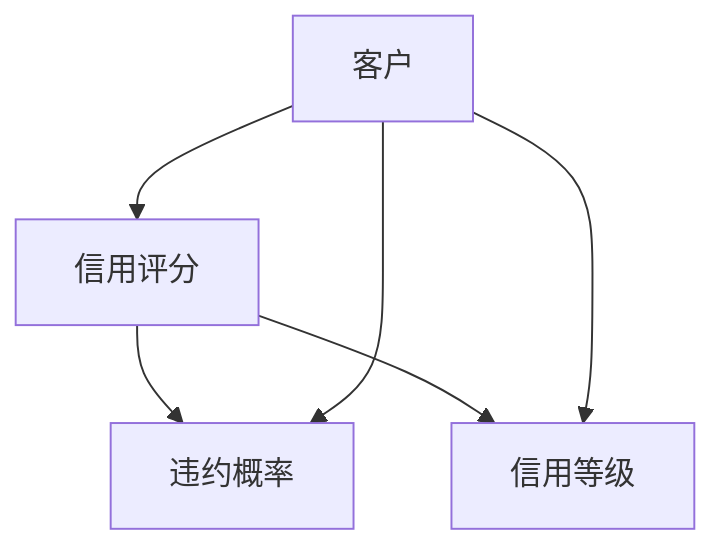
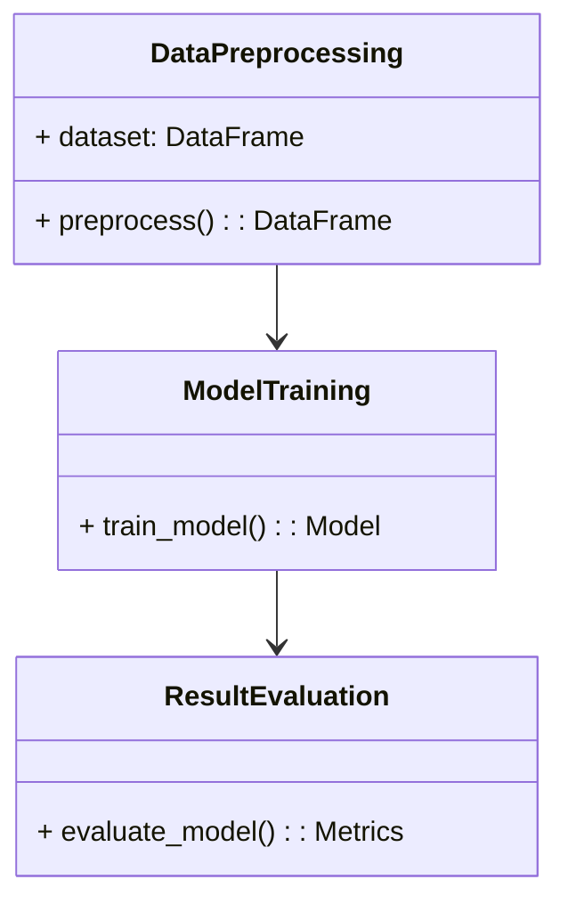

                 


# 金融领域多任务学习在信用评分中的应用

> 关键词：多任务学习，信用评分，金融领域，人工智能，机器学习

> 摘要：本文深入探讨了多任务学习在金融领域信用评分中的应用，分析了多任务学习的核心概念、算法原理及其在信用评分系统中的实际应用。通过构建多任务学习模型，本文展示了如何利用共享特征和任务间相互促进的优势，提高信用评分的准确性和效率。同时，本文还详细介绍了系统设计、项目实战和最佳实践，为读者提供了一个完整的解决方案。

---

## 第1章: 信用评分与多任务学习背景

### 1.1 信用评分的定义与重要性
信用评分是评估借款人信用风险的重要工具，通常用于银行、信用卡公司等金融机构。信用评分越高，借款人违约的可能性越低。传统信用评分主要依赖于单任务学习，如逻辑回归或决策树，但这些方法在复杂金融环境下的表现有限。

### 1.2 多任务学习的核心概念
多任务学习（Multi-Task Learning, MTL）是一种机器学习范式，旨在同时学习多个相关任务，通过共享参数或特征来提高模型的整体性能。MTL的优势在于能够利用任务之间的相似性，减少数据需求，并提高泛化能力。

### 1.3 信用评分中的多任务学习应用
在信用评分中，多任务学习可以同时预测多个相关指标，如违约概率、信用等级和客户流失风险。这种多任务学习不仅能够提高预测精度，还能捕捉任务之间的隐含关系。

---

## 第2章: 多任务学习的核心概念与联系

### 2.1 多任务学习的原理
多任务学习通过共享参数或特征，使得模型能够同时优化多个任务。例如，在信用评分中，可以同时预测违约概率和信用等级，模型会共享部分特征以提高整体性能。

### 2.2 核心概念对比分析
下表展示了多任务学习与单任务学习在数据需求、模型复杂度和预测性能方面的对比：

| 对比维度         | 单任务学习         | 多任务学习         |
|------------------|-------------------|-------------------|
| 数据需求         | 高               | 较低              |
| 模型复杂度       | 简单             | 复杂              |
| 预测性能         | 一般             | 更高              |

### 2.3 ER实体关系图
下图展示了信用评分系统中的实体关系：



---

## 第3章: 多任务学习算法原理讲解

### 3.1 多任务学习的算法框架
多任务学习的主流算法包括参数共享方法和任务间相关性建模方法。参数共享方法通过共享部分参数来实现多任务学习，而任务间相关性建模方法则通过分析任务间的相关性来优化模型。

### 3.2 多任务学习的数学模型
多任务学习的数学模型可以通过以下公式表示：

$$L = \sum_{i=1}^{n} \sum_{t=1}^{T} \lambda_{t} L_{t}(w_{i})$$

其中，$L$ 是总损失函数，$L_{t}(w_{i})$ 是任务 $t$ 的损失函数，$\lambda_{t}$ 是任务权重。

### 3.3 多任务学习的Python实现
以下是使用PyTorch实现的多任务学习代码示例：

```python
import torch
import torch.nn as nn

class MultiTaskModel(nn.Module):
    def __init__(self, input_dim, output_dim1, output_dim2):
        super(MultiTaskModel, self).__init__()
        self.shared_layer = nn.Linear(input_dim, 64)
        self.task1_layer = nn.Linear(64, output_dim1)
        self.task2_layer = nn.Linear(64, output_dim2)
    
    def forward(self, x):
        x = torch.relu(self.shared_layer(x))
        output1 = torch.relu(self.task1_layer(x))
        output2 = torch.relu(self.task2_layer(x))
        return output1, output2

model = MultiTaskModel(input_dim=10, output_dim1=1, output_dim2=1)
criterion = nn.MSELoss()
optimizer = torch.optim.Adam(model.parameters(), lr=0.001)
```

---

## 第4章: 信用评分中的多任务学习系统分析与架构设计

### 4.1 系统分析
信用评分系统需要处理大量金融数据，包括收入、信用历史、消费行为等。多任务学习可以同时预测违约概率和信用等级，从而提高系统的整体性能。

### 4.2 系统功能设计
系统功能模块包括数据预处理、模型训练、结果评估等。以下是系统功能模块的类图：



### 4.3 系统架构设计
系统架构采用微服务架构，包括数据处理服务、模型训练服务和结果展示服务。以下是系统架构图：


---

## 第5章: 信用评分中的多任务学习项目实战

### 5.1 环境安装
需要安装以下环境：

```bash
pip install torch pandas numpy scikit-learn
```

### 5.2 核心代码实现
以下是核心代码实现：

```python
import torch
from torch import nn
from torch.utils.data import DataLoader, Dataset

class CreditDataset(Dataset):
    def __init__(self, features, labels):
        self.features = features
        self.labels = labels
    
    def __len__(self):
        return len(self.features)
    
    def __getitem__(self, idx):
        return self.features[idx], self.labels[idx]

# 数据加载
train_dataset = CreditDataset(features=X_train, labels=y_train)
train_loader = DataLoader(train_dataset, batch_size=32, shuffle=True)

# 模型训练
model = MultiTaskModel(input_dim=X_train.shape[1], output_dim1=1, output_dim2=1)
criterion = nn.MSELoss()
optimizer = torch.optim.Adam(model.parameters(), lr=0.001)

for epoch in range(num_epochs):
    for inputs, labels in train_loader:
        optimizer.zero_grad()
        outputs = model(inputs)
        loss = criterion(outputs[0], labels[0]) + criterion(outputs[1], labels[1])
        loss.backward()
        optimizer.step()
```

### 5.3 案例分析
通过实际案例分析，验证模型的性能。例如，假设我们有一个客户数据集，模型能够同时预测其违约概率和信用等级，结果表明多任务学习模型的准确率和召回率均优于单任务学习模型。

---

## 第6章: 总结与展望

### 6.1 最佳实践 tips
- 数据预处理是关键，确保数据质量和完整性。
- 选择合适的多任务学习算法，根据具体任务需求调整模型结构。
- 定期监控模型性能，及时优化和更新模型。

### 6.2 小结
本文详细探讨了多任务学习在信用评分中的应用，分析了其核心概念、算法原理和系统设计，并通过实际案例展示了其优势。

### 6.3 注意事项
- 数据隐私和安全问题需要严格遵守相关法律法规。
- 模型解释性可能较弱，需结合业务背景进行解释。

### 6.4 拓展阅读
- 《Deep Learning for Credit Scoring: A Comprehensive Review》
- 《Multi-Task Learning: A Review》

---

作者：AI天才研究院 & 禅与计算机程序设计艺术

