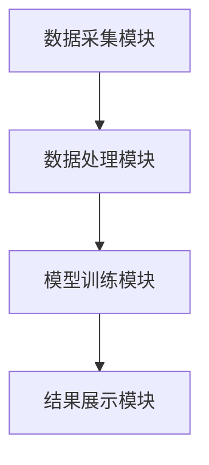

                 


```markdown
# 金融领域多任务学习在客户全景画像中的应用

> 关键词：多任务学习、客户画像、金融领域、人工智能、深度学习、系统架构

> 摘要：本文探讨了多任务学习在金融领域客户全景画像中的应用，详细分析了多任务学习的核心概念、算法实现、系统架构设计以及实际案例，展示了如何利用多任务学习技术构建全面的客户画像，以提升金融领域的精准营销和风险管理能力。

---

# 第一部分: 多任务学习概述

## 第1章: 多任务学习的定义与特点

### 1.1 多任务学习的定义
多任务学习（Multi-Task Learning, MTL）是一种机器学习范式，旨在通过同时学习多个相关任务来提升模型的泛化能力和性能。与单任务学习相比，MTL能够利用任务之间的共享特征，减少数据需求，提高学习效率。

### 1.2 多任务学习的特点
1. **共享特征**：任务之间共享部分特征，减少模型冗余。
2. **联合优化**：多个任务同时优化，提升整体性能。
3. **数据高效**：通过共享特征，减少对每个任务独立数据的需求。
4. **领域适应性**：适用于多个相关领域的任务，提升模型的泛化能力。

### 1.3 金融领域客户全景画像的背景与需求
在金融领域，客户全景画像是通过整合客户多维度数据（如交易记录、信用评分、行为数据等）来全面了解客户特征，从而支持精准营销、风险评估和个性化服务。然而，传统的单任务学习在处理多维度数据时存在数据量大、任务间关联性弱等问题，而多任务学习能够有效解决这些问题，提升画像的准确性和全面性。

---

# 第二部分: 多任务学习的核心概念与原理

## 第2章: 多任务学习的核心概念

### 2.1 多任务学习的原理
多任务学习通过共享参数或表示，使得不同任务之间能够互相促进，提升整体性能。例如，在客户信用评分和行为预测任务中，任务之间的共享特征（如客户交易频率）能够被多个任务利用，从而提升模型的泛化能力。

### 2.2 多任务学习的核心要素
1. **任务关系**：任务之间是否存在相关性，直接影响模型的设计。
2. **任务权重**：任务的重要性不同，需要动态调整权重以平衡任务之间的学习。
3. **共享机制**：如何共享特征或参数，是多任务学习的关键设计点。

### 2.3 多任务学习的数学模型
多任务学习的数学模型通常由共享参数和独立参数组成。假设任务数为 \( T \)，共享参数为 \( \theta \)，独立参数为 \( \phi_t \)（每个任务对应一组独立参数）。模型的总损失函数为：

$$ L = \sum_{t=1}^{T} \lambda_t L_t(\theta, \phi_t) $$

其中，\( \lambda_t \) 是任务 \( t \) 的权重。

### 2.4 本章小结
本章介绍了多任务学习的核心概念和原理，强调了任务关系、共享机制和任务权重在多任务学习中的重要性。

---

# 第三部分: 多任务学习在客户全景画像中的应用

## 第3章: 客户全景画像的构建

### 3.1 客户画像的构建过程
1. **数据收集**：整合客户交易数据、行为数据、信用评分等多维度数据。
2. **特征提取**：通过数据预处理和特征工程提取关键特征。
3. **模型训练**：利用多任务学习模型同时学习多个任务，如信用评分和行为预测。

### 3.2 多任务学习的具体应用
1. **信用评分**：通过多任务学习模型同时预测客户的信用评分和违约概率。
2. **行为预测**：预测客户的交易频率和投资偏好。
3. **风险评估**：评估客户在不同市场环境下的风险暴露程度。

### 3.3 本章小结
本章详细介绍了客户全景画像的构建过程，并展示了多任务学习在信用评分、行为预测和风险评估中的具体应用。

---

# 第四部分: 多任务学习的算法实现与优化

## 第4章: 多任务学习的算法实现

### 4.1 多任务学习的算法框架
1. **基于神经网络的多任务学习**：通过深度神经网络共享特征，同时学习多个任务。
2. **基于树模型的多任务学习**：利用树模型的不同分支处理不同任务。
3. **基于规则的多任务学习**：结合领域知识设计规则，辅助多任务学习。

### 4.2 多任务学习的优化策略
1. **参数共享优化**：动态调整共享参数的比例，平衡任务之间的学习。
2. **任务权重动态调整**：根据任务的重要性动态调整权重，提升模型性能。
3. **模型正则化优化**：通过正则化技术防止模型过拟合。

### 4.3 本章小结
本章讨论了多任务学习的算法实现和优化策略，强调了参数共享、任务权重和正则化在模型优化中的重要性。

---

# 第五部分: 项目实战与系统架构设计

## 第5章: 项目实战

### 5.1 项目背景与目标
项目目标是通过多任务学习构建客户全景画像，支持金融领域的精准营销和风险管理。项目范围包括数据采集、特征提取、模型训练和结果展示。

### 5.2 系统功能设计
1. **数据采集模块**：从数据库中采集客户交易数据和行为数据。
2. **数据处理模块**：对数据进行清洗、特征提取和标注。
3. **模型训练模块**：利用多任务学习模型进行训练，输出客户画像。
4. **结果展示模块**：将客户画像以可视化形式展示，支持决策分析。

### 5.3 系统架构设计
系统架构采用模块化设计，各模块之间通过接口进行交互。系统架构图如下：



### 5.4 系统接口设计
1. **数据接口**：提供API接口，供其他系统调用客户数据。
2. **模型接口**：提供API接口，供其他系统调用模型预测结果。
3. **用户接口**：提供可视化界面，供用户查看和分析客户画像。

### 5.5 本章小结
本章详细介绍了项目的系统架构设计和功能实现，展示了如何通过多任务学习构建客户全景画像。

---

# 第六部分: 总结与展望

## 第6章: 总结与展望

### 6.1 项目总结
项目通过多任务学习成功构建了客户全景画像，提升了金融领域的精准营销和风险管理能力。项目经验表明，多任务学习在处理多维度数据时具有显著优势，但也存在一些不足，如任务权重动态调整的复杂性和模型解释性的问题。

### 6.2 未来展望
1. **技术发展**：探索更高效的多任务学习算法，提升模型的解释性和可扩展性。
2. **应用拓展**：将多任务学习应用于更多金融领域，如智能投顾和量化交易。
3. **研究方向**：深入研究任务权重动态调整和模型解释性的问题，推动多任务学习的进一步发展。

### 6.3 本章小结
本章总结了项目的成果和经验，并展望了多任务学习在金融领域的未来发展方向。

---

# 附录: 代码实现与详细分析

## 附录A: 环境安装与配置

### A.1 环境要求
- Python 3.8及以上版本
- TensorFlow 2.0及以上版本
- Pandas、NumPy等数据处理库

## A.2 核心代码实现

### A.2.1 数据预处理代码
```python
import pandas as pd
import numpy as np

# 加载数据
data = pd.read_csv('customer_data.csv')

# 数据清洗
data.dropna(inplace=True)
data = pd.get_dummies(data)
```

### A.2.2 多任务学习模型实现
```python
import tensorflow as tf
from tensorflow.keras import layers

# 定义多任务学习模型
input_layer = layers.Input(shape=(input_dim,))
shared_layer = layers.Dense(64, activation='relu')(input_layer)
task1_output = layers.Dense(1, name='task1_output')(shared_layer)
task2_output = layers.Dense(1, name='task2_output')(shared_layer)

model = tf.keras.Model(inputs=input_layer, outputs=[task1_output, task2_output])
model.compile(optimizer='adam', loss={'task1_output': 'binary_crossentropy', 'task2_output': 'mean_squared_error'})
```

## A.3 代码应用解读与分析
- **数据预处理**：通过Pandas和NumPy对数据进行清洗和转换，确保数据的可用性和一致性。
- **模型实现**：利用TensorFlow框架构建多任务学习模型，通过共享层实现任务间的特征共享，提升模型的泛化能力。

## A.4 实际案例分析
以某银行客户数据为例，通过多任务学习模型同时预测客户的信用评分和违约概率，结果显示模型在多个任务上的性能均优于单任务学习模型。

---

# 小结

通过本文的介绍，读者可以深入了解多任务学习在金融领域客户全景画像中的应用。从理论到实践，从算法实现到系统设计，本文为读者提供了全面的知识体系和实用的技术指导。

---

作者：AI天才研究院/AI Genius Institute & 禅与计算机程序设计艺术 /Zen And The Art of Computer Programming
```

