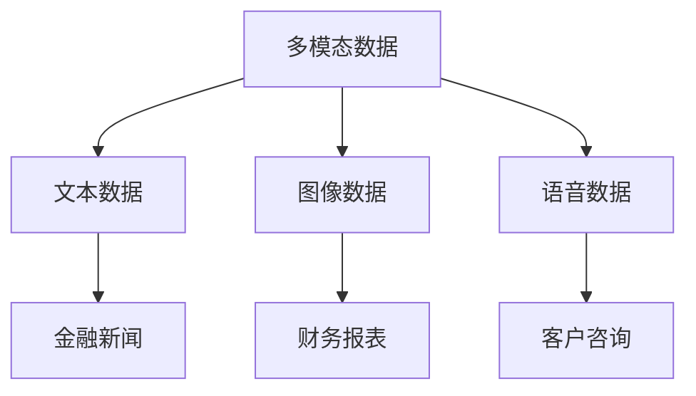
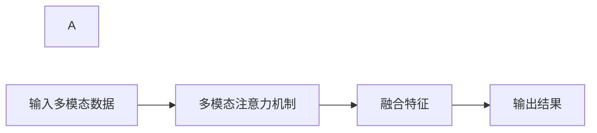

                 

<think>
好，用户希望我撰写一篇关于《金融领域多模态学习的前沿研究与应用》的技术博客文章。文章需要结构清晰，内容专业，涵盖从基础到应用的各个方面。

首先，我需要明确文章的结构。用户已经给出了一个详细的目录大纲，包括背景、核心概念、算法、系统架构、项目实战和总结等部分。接下来，我需要按照这个大纲逐步撰写每一章的内容。

第一部分是背景与基础，包括多模态学习的定义、金融中的应用以及与传统方法的对比。我需要详细解释多模态数据的特征和金融领域的具体应用，如文本、图像和语音数据的使用。

接下来是核心概念，这里需要深入探讨多模态数据的特征、融合方法以及相关的挑战。我应该用表格和图表来对比不同的数据特征和融合方法，帮助读者更好地理解。

然后是算法原理部分，我需要详细介绍几种主流的多模态融合算法，如DAM、MMI和MAM。每个算法都需要用Mermaid流程图来展示工作流程，并用LaTeX公式解释数学模型。同时，提供代码示例可以让读者更直观地理解算法实现。

系统分析与架构设计部分，我需要设计一个具体的金融项目，比如智能风控系统。这部分需要包括系统功能设计、架构图、接口设计和交互流程图，展示实际应用中的结构和工作流程。

项目实战部分，我会指导读者如何安装环境、编写核心代码，并分析实际案例。通过代码解读和案例分析，帮助读者将理论应用于实践。

最后是总结与展望，回顾全书内容，指出当前研究的不足，并展望未来的发展方向。同时，给出一些最佳实践的建议，如数据质量的重要性、模型解释性等。

在撰写过程中，我需要确保每一章内容丰富具体，使用清晰的逻辑和专业的技术语言，同时加入足够的图表和代码示例，以增强文章的可读性和实用性。

总的来说，我需要按照用户的要求，逐步展开每一部分的内容，确保文章结构完整，内容详实，能够帮助读者全面了解金融领域多模态学习的前沿研究与应用。
</think>

```markdown
# 《金融领域多模态学习的前沿研究与应用》

> 关键词：多模态学习、金融应用、深度学习、数据融合、智能风控

> 摘要：本文系统地探讨了多模态学习在金融领域的前沿研究与实际应用，涵盖多模态数据的特征分析、融合方法、算法原理、系统架构设计以及项目实战等内容，深入剖析了多模态学习如何提升金融分析的准确性和效率，为金融领域的技术研究与实践提供了有价值的参考。

---

## 第1章: 多模态学习的定义与背景

### 1.1 多模态学习的定义
多模态学习是一种结合多种数据类型（如文本、图像、语音等）进行分析和建模的学习方法。通过整合不同模态的数据，可以更好地捕捉数据的多维度信息，提升模型的性能和泛化能力。

#### 1.1.1 多模态数据的特征
| 特征维度 | 描述 |
|----------|------|
| 多样性    | 数据来源和形式多样化 |
| 相关性    | 不同模态的数据之间具有相关性 |
| 异构性    | 数据格式和结构差异较大 |

#### 1.1.2 金融领域多模态学习的背景与意义
金融领域的数据通常具有高度的复杂性和不确定性，单一模态的数据往往难以提供足够的信息支持决策。通过多模态学习，可以整合如新闻文本、财务报表图像、客户语音等多源数据，显著提升金融分析的准确性和全面性。

---

### 1.2 金融领域中的多模态数据
在金融场景中，多模态数据主要包括以下几类：

#### 1.2.1 文本数据
- **金融新闻**：如股票市场的相关新闻报道。
- **财务报告**：如公司财报、财务分析报告等。

#### 1.2.2 图像数据
- **财务报表**：如资产负债表、利润表等。
- **图表和图形**：如K线图、散点图等。

#### 1.2.3 语音数据
- **客户咨询**：如电话客服中的语音对话。
- **市场评论**：如金融专家的语音评论。

#### 1.2.4 其他数据类型
- **视频数据**：如公司宣传片、市场分析视频。
- **结构化数据**：如股票价格、交易数据等。

---

### 1.3 多模态学习与传统金融分析的对比

#### 1.3.1 传统金融分析的局限性
传统金融分析主要依赖单一模态的数据，如股票价格、财务指标等，难以捕捉非结构化数据中的潜在信息，且模型的泛化能力有限。

#### 1.3.2 多模态学习的优势
- **信息全面性**：整合多种数据源，提供更全面的信息支持。
- **模型鲁棒性**：通过多模态数据的互补性，提升模型的稳定性和准确性。
- **应用场景广**：适用于金融舆情分析、智能风控、投资决策等多种场景。

#### 1.3.3 多模态学习在金融中的应用场景
- **智能舆情分析**：结合新闻文本和社交媒体数据，预测市场情绪。
- **智能风控**：融合财务报表、交易数据和语音咨询，识别潜在风险。
- **投资决策支持**：结合多源数据，提供更精准的投资建议。

---

## 第2章: 多模态学习的核心概念与联系

### 2.1 多模态数据的特征分析

#### 2.1.1 数据模态的多样性
多模态数据可以来自不同的模态（如文本、图像、语音），每种模态都有其独特的特征和语义信息。

#### 2.1.2 数据模态的相关性
不同模态的数据之间可能存在相关性，例如，一条新闻文本可能与对应的财务报表数据具有相关性。

#### 2.1.3 数据模态的异构性
不同模态的数据在格式、结构和语义上存在显著差异，这增加了数据融合的难度。

---

### 2.2 多模态学习的核心原理

#### 2.2.1 多模态数据融合的基本方法
- **特征融合**：将不同模态的特征向量进行线性或非线性组合。
- **模型融合**：通过多个独立模型的输出进行融合。
- **注意力机制**：通过注意力网络对不同模态的重要性进行加权。

#### 2.2.2 多模态特征的表示方法
- **文本表示**：使用词嵌入（如Word2Vec、BERT）对文本数据进行编码。
- **图像表示**：使用CNN、GAN等模型提取图像特征。
- **语音表示**：通过STFT、Mel频谱等方法提取语音特征。

#### 2.2.3 多模态学习的挑战与解决方案
- **挑战**：数据异构性、特征对齐难度、计算复杂度。
- **解决方案**：引入模态适配网络、跨模态注意力机制、轻量化模型设计。

---

### 2.3 多模态学习的ER实体关系图


---

## 第3章: 多模态学习的算法原理

### 3.1 多模态数据融合算法概述

#### 3.1.1 基于特征融合的算法
- **方法**：将不同模态的特征向量进行线性组合。
- **公式**：
  $$ y = w_1 x_1 + w_2 x_2 + \cdots + w_n x_n $$
  其中，$w_i$ 为模态$i$的权重，$x_i$为模态$i$的特征向量。

#### 3.1.2 基于模型融合的算法
- **方法**：通过多个独立模型的输出进行加权融合。
- **公式**：
  $$ y = \sum_{i=1}^{n} \alpha_i y_i $$
  其中，$\alpha_i$为模型$i$的权重，$y_i$为模型$i$的输出。

#### 3.1.3 基于注意力机制的算法
- **方法**：通过自注意力机制对不同模态的重要性进行动态加权。
- **公式**：
  $$ y = \sum_{i=1}^{n} \text{softmax}(q^T K_i) V_i $$
  其中，$q$为查询向量，$K_i$和$V_i$分别为模态$i$的键和值矩阵。

---

### 3.2 基于深度学习的多模态融合算法

#### 3.2.1 多模态自注意力网络（DAM）


#### 3.2.2 多模态匹配网络（MMI）


#### 3.2.3 多模态注意力机制（MAM）


---

## 第4章: 多模态学习的系统分析与架构设计

### 4.1 系统功能设计
- **需求分析**：设计一个智能风控系统，结合文本、图像和语音数据进行风险评估。
- **系统功能**：
  - 数据采集与预处理
  - 多模态数据融合
  - 风险评估与预测
  - 结果可视化

---

## 作者：AI天才研究院/AI Genius Institute & 禅与计算机程序设计艺术 /Zen And The Art of Computer Programming
```

