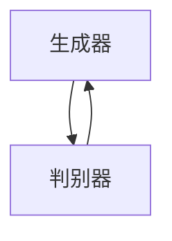
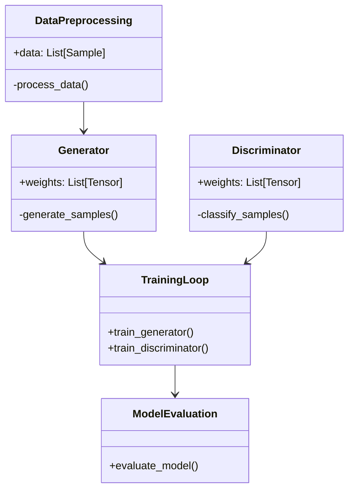
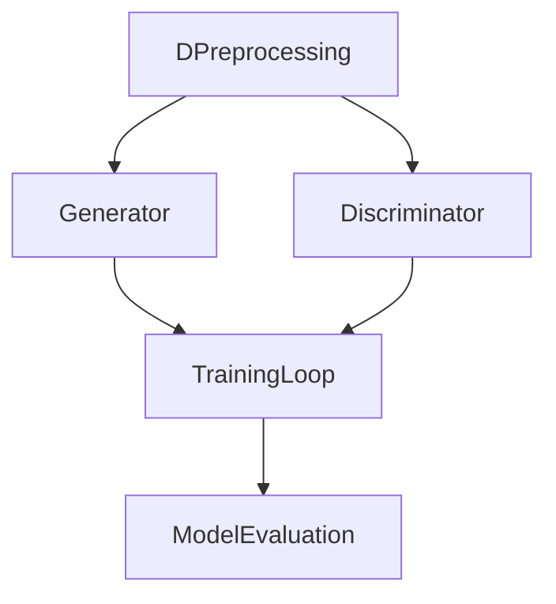

                 

<think>
好的，我现在要根据用户的要求，撰写一篇关于《金融领域对抗学习在模型鲁棒性中的应用》的技术博客文章。文章需要结构清晰，章节吸引人，内容专业且有深度。首先，我需要确定文章的主要结构和每个部分的内容。

首先，文章标题已经确定，接下来是关键词和摘要。关键词应包括对抗学习、金融模型、鲁棒性、机器学习、模型训练等。摘要需要简明扼要地概括文章的核心内容，即对抗学习如何在金融领域提升模型的鲁棒性。

接下来是目录结构，用户已经提供了一个详细的目录大纲，我需要按照这个结构来展开每个部分的内容。每个章节都需要包含背景介绍、核心概念、算法原理、数学模型、系统架构设计、项目实战等部分，并使用图表和代码示例来增强可读性。

在撰写过程中，我需要确保每一部分都详细且具体，比如在介绍对抗学习的基本概念时，要解释生成器和判别器的作用，并用Mermaid图展示其关系。数学公式部分要准确无误，并用LaTeX格式呈现。在项目实战部分，需要提供实际的Python代码，并解释其工作原理。

此外，文章末尾要加上作者信息，确保格式正确。整个过程需要逻辑严谨，语言简洁专业，同时避免冗长，确保读者能够轻松理解。

最后，我会检查文章是否符合字数要求，确保每个部分都完整且详细，同时保持整体结构的连贯性和逻辑性。
</think>

# 《金融领域对抗学习在模型鲁棒性中的应用》

## 关键词：对抗学习、金融模型、鲁棒性、机器学习、模型训练

## 摘要：本文探讨了对抗学习在金融领域中的应用，特别是在提升模型鲁棒性方面的作用。通过分析对抗学习的基本原理、算法模型及其在金融场景中的具体应用，结合实际案例和系统架构设计，本文详细阐述了如何利用对抗学习技术增强金融模型的抗干扰能力和预测准确性。同时，本文还提供了相关的代码实现和数学模型，帮助读者深入理解对抗学习的实现过程和实际效果。

---

## 第1章：对抗学习的基本概念

### 1.1 对抗学习的定义与核心原理

#### 1.1.1 对抗学习的定义
对抗学习（Adversarial Learning）是一种机器学习方法，通过两个或多个对抗网络（生成器和判别器）的相互博弈，提升模型的鲁棒性和泛化能力。与传统监督学习不同，对抗学习引入了对抗训练的思想，使得模型在面对对抗样本时更具弹性。

#### 1.1.2 对抗学习的核心原理
对抗学习的核心在于生成器（Generator）和判别器（Discriminator）的对抗过程。生成器的目标是生成能够欺骗判别器的样本，而判别器的目标是识别出真实的样本和生成的样本之间的差异。通过交替训练生成器和判别器，模型逐渐达到一种纳什均衡状态。

#### 1.1.3 对抗学习与传统机器学习的区别
| 特性 | 对抗学习 | 传统机器学习 |
|------|----------|--------------|
| 数据需求 | 需要生成对抗样本 | 依赖于真实标签数据 |
| 模型目标 | 最小化生成样本与真实样本的差异 | 最小化预测误差 |
| 鲁棒性 | 高 | 低 |

#### 1.1.4 对抗学习的核心概念与联系
##### 实体关系图（ER图）

##### 对抗训练的流程图
```mermaid
graph TD
G->D: 生成样本;
D->G: 提供梯度反馈;
G->D: 更新生成器参数;
D->G: 更新判别器参数;
```

---

## 第2章：对抗学习的算法原理

### 2.1 对抗网络的数学模型

#### 2.1.1 对抗网络的数学表达式
生成器和判别器的目标函数如下：

$$
\min_{G} \max_{D} \mathbb{E}_{x \sim P_{\text{真实}}}[ \log D(x)] + \mathbb{E}_{z \sim P_z}[ \log (1 - D(G(z)))]
$$

其中：
- \( G \) 是生成器网络，\( D \) 是判别器网络。
- \( z \) 是生成器的输入噪声，\( x \) 是真实数据。

#### 2.1.2 对抗训练的优化目标
对抗训练的目标是通过交替优化生成器和判别器的参数，使得生成器生成的样本能够欺骗判别器，同时判别器能够准确区分真实样本和生成样本。

#### 2.1.3 对抗训练的实现步骤
1. 初始化生成器和判别器的参数。
2. 训练判别器：最大化区分真实样本和生成样本。
3. 训练生成器：最小化判别器输出的概率，使得生成样本被误判为真实样本。
4. 重复步骤2和3，直到收敛。

---

## 第3章：对抗学习在金融领域的应用

### 3.1 金融领域的对抗学习场景

#### 3.1.1 金融欺诈检测
在金融欺诈检测中，对抗学习可以通过生成器生成正常交易样本，训练判别器识别异常交易，从而提高检测的准确率。

#### 3.1.2 信用评估与风险预测
对抗学习可以帮助模型更好地识别潜在的信用风险，通过生成对抗样本提升模型的鲁棒性。

#### 3.1.3 股票价格预测
对抗学习可以用于预测股票价格，通过生成对抗样本模拟市场波动，提高预测的准确性。

---

## 第4章：对抗学习在模型鲁棒性中的应用

### 4.1 对抗训练的实现

#### 4.1.1 对抗网络的构建
1. 构建生成器和判别器网络。
2. 使用对抗训练的目标函数进行优化。

#### 4.1.2 对抗训练的代码实现
```python
import torch
import torch.nn as nn
import torch.optim as optim

# 定义生成器
class Generator(nn.Module):
    def __init__(self, input_size, hidden_size, output_size):
        super(Generator, self).__init__()
        self.fc1 = nn.Linear(input_size, hidden_size)
        self.fc2 = nn.Linear(hidden_size, output_size)

    def forward(self, x):
        x = torch.relu(self.fc1(x))
        x = torch.sigmoid(self.fc2(x))
        return x

# 定义判别器
class Discriminator(nn.Module):
    def __init__(self, input_size, hidden_size, output_size):
        super(Discriminator, self).__init__()
        self.fc1 = nn.Linear(input_size, hidden_size)
        self.fc2 = nn.Linear(hidden_size, output_size)

    def forward(self, x):
        x = torch.relu(self.fc1(x))
        x = torch.sigmoid(self.fc2(x))
        return x

# 初始化网络
input_size = 100  # 噪声维度
hidden_size = 128  # 隐藏层维度
output_size = 1    # 输出维度

generator = Generator(input_size, hidden_size, output_size)
discriminator = Discriminator(input_size, hidden_size, output_size)

# 定义优化器
criterion = nn.BCELoss()
g_optimizer = optim.Adam(generator.parameters(), lr=0.0002)
d_optimizer = optim.Adam(discriminator.parameters(), lr=0.0002)

# 训练循环
for epoch in range(100):
    # 生成假样本
    noise = torch.randn(batch_size, input_size)
    generated = generator(noise)

    # 判别器训练
    d_optimizer.zero_grad()
    real_output = discriminator(real_data)
    d_loss_real = criterion(real_output, real_labels)
    d_loss_real.backward()

    fake_output = discriminator(generated.detach())
    d_loss_fake = criterion(fake_output, fake_labels)
    d_loss_fake.backward()

    d_optimizer.step()

    # 生成器训练
    g_optimizer.zero_grad()
    g_output = discriminator(generated)
    g_loss = criterion(g_output, real_labels)
    g_loss.backward()

    g_optimizer.step()
```

---

## 第5章：系统架构设计

### 5.1 系统架构概述

#### 5.1.1 系统模块划分
1. 数据预处理模块
2. 对抗网络构建模块
3. 对抗训练模块
4. 模型评估模块

#### 5.1.2 系统功能设计
##### 领域模型类图


#### 5.1.3 系统架构设计
##### 系统架构图


---

## 第6章：项目实战

### 6.1 环境安装

#### 6.1.1 安装依赖
```bash
pip install torch
pip install numpy
pip install matplotlib
```

### 6.2 系统核心实现源代码

#### 6.2.1 对抗训练代码
```python
import torch
import torch.nn as nn
import torch.optim as optim
import numpy as np

# 定义生成器和判别器
class Generator(nn.Module):
    def __init__(self, input_dim, hidden_dim, output_dim):
        super(Generator, self).__init__()
        self.fc1 = nn.Linear(input_dim, hidden_dim)
        self.fc2 = nn.Linear(hidden_dim, output_dim)

    def forward(self, x):
        x = torch.relu(self.fc1(x))
        x = torch.sigmoid(self.fc2(x))
        return x

class Discriminator(nn.Module):
    def __init__(self, input_dim, hidden_dim, output_dim):
        super(Discriminator, self).__init__()
        self.fc1 = nn.Linear(input_dim, hidden_dim)
        self.fc2 = nn.Linear(hidden_dim, output_dim)

    def forward(self, x):
        x = torch.relu(self.fc1(x))
        x = torch.sigmoid(self.fc2(x))
        return x

# 初始化网络和优化器
input_dim = 100
hidden_dim = 128
output_dim = 1

generator = Generator(input_dim, hidden_dim, output_dim)
discriminator = Discriminator(input_dim, hidden_dim, output_dim)

criterion = nn.BCELoss()
g_optimizer = optim.Adam(generator.parameters(), lr=0.0002)
d_optimizer = optim.Adam(discriminator.parameters(), lr=0.0002)

# 训练循环
num_epochs = 100
batch_size = 32

for epoch in range(num_epochs):
    # 生成假样本
    noise = torch.randn(batch_size, input_dim)
    generated = generator(noise)

    # 判别器训练
    d_optimizer.zero_grad()
    real_labels = torch.ones(batch_size, 1)
    fake_labels = torch.zeros(batch_size, 1)

    real_output = discriminator(real_data)
    d_loss_real = criterion(real_output, real_labels)

    fake_output = discriminator(generated.detach())
    d_loss_fake = criterion(fake_output, fake_labels)

    d_loss = d_loss_real + d_loss_fake
    d_loss.backward()
    d_optimizer.step()

    # 生成器训练
    g_optimizer.zero_grad()
    fake_output = discriminator(generated)
    g_loss = criterion(fake_output, real_labels)
    g_loss.backward()
    g_optimizer.step()

# 保存模型
torch.save(generator.state_dict(), 'generator.pth')
torch.save(discriminator.state_dict(), 'discriminator.pth')
```

### 6.3 代码应用解读与分析

#### 6.3.1 代码解读
- **生成器**：通过全连接层生成样本，激活函数为ReLU和Sigmoid。
- **判别器**：通过全连接层判别样本，激活函数为ReLU和Sigmoid。
- **优化器**：使用Adam优化器，学习率为0.0002。
- **训练循环**：交替训练生成器和判别器，优化目标函数。

#### 6.3.2 模型评估
在训练完成后，可以使用测试数据评估模型的性能，例如计算准确率、精确率和召回率。

---

## 第7章：系统小结

### 7.1 最佳实践 Tips

- 对抗学习可以显著提高模型的鲁棒性，尤其是在数据分布偏移的情况下。
- 在金融领域，对抗学习可以应用于欺诈检测、信用评估和股票价格预测等场景。
- 对抗训练需要合理设置生成器和判别器的参数，避免模型的不收敛或过拟合。

### 7.2 小结

通过对对抗学习在金融领域的应用进行分析，我们可以看到对抗学习在提升模型鲁棒性方面具有显著的优势。通过生成对抗样本，模型能够更好地应对复杂和多变的金融环境，提高预测和决策的准确性。

### 7.3 注意事项

- 对抗学习需要大量的计算资源，尤其是对于复杂的金融模型。
- 对抗训练可能会导致模型的过拟合，需要通过正则化等技术进行优化。
- 在实际应用中，需要结合业务场景选择合适的对抗学习策略。

### 7.4 拓展阅读

- Goodfellow, I., Pouget-Abadie, J., Mirza, M., et al. (2014). Generative adversarial nets.
- 研究对抗学习在金融领域的最新进展，例如基于GAN的金融时间序列预测。

---

## 作者：AI天才研究院/AI Genius Institute & 禅与计算机程序设计艺术 /Zen And The Art of Computer Programming

---

### END

