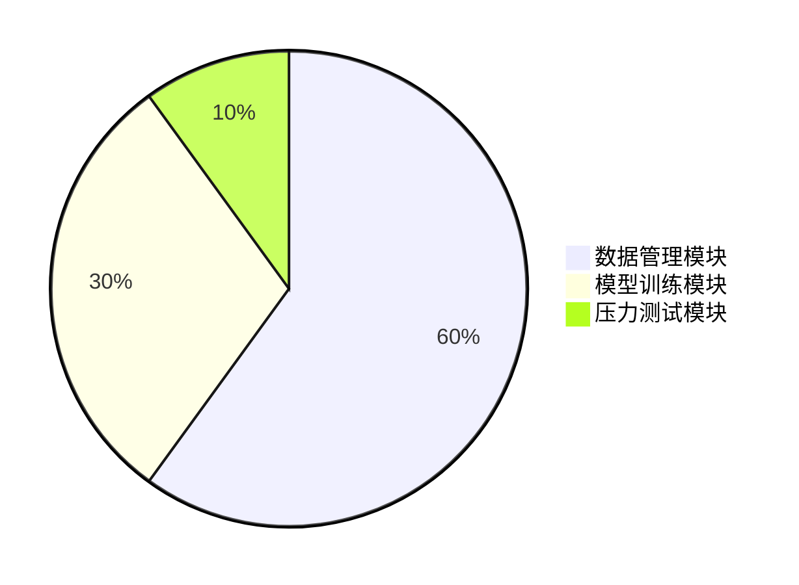

                 


# 《金融领域对抗学习在风险模型压力测试中的应用》

---

## 关键词：  
对抗学习、风险模型、压力测试、GAN、金融风险、机器学习

---

## 摘要：  
对抗学习作为一种新兴的机器学习技术，在金融领域的风险建模和压力测试中展现出巨大的潜力。本文系统地探讨了对抗学习在金融压力测试中的应用，从理论基础到实际案例，详细分析了对抗学习如何帮助金融机构更好地预测和应对极端市场条件下的风险。文章首先介绍了对抗学习的基本概念和其在金融领域的优势，然后深入分析了对抗学习在压力测试中的实现框架，包括数据准备、模型构建和结果分析。接着，本文通过具体案例展示了对抗学习在金融压力测试中的实际应用，并讨论了其在实际操作中的挑战与解决方案。最后，本文总结了对抗学习在金融压力测试中的价值，并提出了未来的研究方向。

---

# 第一部分：对抗学习与金融风险模型背景

## 第1章：对抗学习与金融风险模型概述

### 1.1 对抗学习的基本概念

#### 1.1.1 对抗学习的定义与特点
对抗学习（Adversarial Learning）是一种基于博弈论的机器学习方法，其核心思想是通过两个或多个对抗模型的相互竞争来提升模型的性能。与传统的单模型学习不同，对抗学习引入了一个“生成器”和一个“判别器”，生成器的目标是生成逼真的数据，而判别器的目标是区分真实数据和生成数据。两者的博弈过程使得生成器能够生成更高质量的数据，同时判别器的性能也不断提升。

在金融领域，对抗学习被广泛应用于风险建模、市场预测和压力测试等场景。其主要特点包括：
1. **零样本学习**：对抗学习能够从有限的数据中生成更多的样本，这对于金融数据通常较为稀缺的情况非常有用。
2. **分布外推能力**：对抗学习能够生成与训练数据分布不同的样本，这使得其在压力测试中能够模拟极端市场条件下的风险。
3. **鲁棒性**：通过对抗训练，模型能够更好地应对噪声和异常情况，提高其在实际应用中的鲁棒性。

#### 1.1.2 金融领域中的风险模型与压力测试
金融风险模型是用来量化和预测金融资产或组合在不同市场条件下的潜在损失的工具。风险模型的核心在于准确地捕捉市场波动、资产相关性以及潜在的极端事件。压力测试是风险模型的重要组成部分，其目的是评估金融资产或组合在极端市场条件下的表现。

传统的压力测试通常基于历史数据或假设情景进行模拟，其局限性在于难以捕捉到尾部风险（Tail Risk）和“黑天鹅”事件。对抗学习通过生成器生成极端市场条件下的数据，能够更好地模拟这些难以预测的事件，从而提高压力测试的准确性和全面性。

#### 1.1.3 对抗学习在压力测试中的应用价值
对抗学习在压力测试中的应用价值主要体现在以下几个方面：
1. **生成极端数据**：对抗学习能够生成符合极端市场条件的数据，帮助金融机构更好地准备应对潜在的危机。
2. **提高模型鲁棒性**：通过对抗训练，模型能够更好地应对未知的市场环境，减少模型失效的风险。
3. **降低数据依赖性**：对抗学习能够在数据稀缺的情况下生成足够的样本，减少对大量历史数据的依赖。

### 1.2 问题背景与挑战

#### 1.2.1 传统风险模型的局限性
传统的风险模型通常基于统计方法或机器学习算法，如回归分析、支持向量机（SVM）和随机森林等。这些方法在正常市场条件下表现良好，但在极端市场条件下往往失效，主要原因包括：
1. **数据稀疏性**：极端事件的发生概率低，导致历史数据中相关样本不足。
2. **模型假设的限制**：传统模型通常基于特定的假设，如资产收益的正态分布，这在极端条件下并不成立。
3. **尾部风险的忽视**：传统模型难以捕捉到小概率但高影响的极端事件。

#### 1.2.2 压力测试中的数据稀疏性问题
压力测试的核心在于模拟极端市场条件下的资产表现。然而，极端事件的发生概率低，导致历史数据中相关样本非常有限。例如，金融危机、市场崩盘等事件可能几十年才会发生一次。这种数据稀疏性使得传统的压力测试方法难以准确模拟极端情况，进而影响压力测试的结果。

对抗学习通过生成器生成极端条件下的数据，能够有效地解决数据稀疏性问题。生成器可以根据有限的历史数据，生成符合极端条件的样本，从而为压力测试提供更多的数据支持。

#### 1.2.3 对抗学习如何解决压力测试中的挑战
对抗学习通过生成器和判别器的对抗过程，能够生成高质量的极端数据，并提高模型的鲁棒性。具体来说，对抗学习在解决压力测试中的挑战方面具有以下优势：
1. **数据生成**：生成器可以根据有限的历史数据，生成符合极端市场条件的样本，弥补数据稀疏性的问题。
2. **模型鲁棒性**：通过对抗训练，模型能够更好地应对未知的市场环境，减少模型失效的风险。
3. **尾部风险捕捉**：对抗学习能够生成小概率但高影响的极端事件，帮助金融机构更好地识别和应对尾部风险。

### 1.3 对抗学习与传统机器学习的对比

#### 1.3.1 传统机器学习的基本原理
传统机器学习方法通常基于统计学习理论，通过优化目标函数来学习数据的分布。例如，支持向量机（SVM）通过最大化间隔来区分不同类别的样本，随机森林通过构建多个决策树来提高模型的鲁棒性。这些方法在正常市场条件下表现良好，但在极端市场条件下往往失效。

#### 1.3.2 对抗学习的独特性与优势
对抗学习的独特性在于其基于博弈论的框架，通过生成器和判别器的对抗过程，能够生成高质量的数据，并提高模型的鲁棒性。具体来说，对抗学习的优势包括：
1. **生成高质量数据**：生成器能够生成符合特定分布的样本，弥补数据稀疏性的问题。
2. **提高模型鲁棒性**：通过对抗训练，模型能够更好地应对未知的市场环境，减少模型失效的风险。
3. **捕捉尾部风险**：对抗学习能够生成小概率但高影响的极端事件，帮助金融机构更好地识别和应对尾部风险。

#### 1.3.3 对抗学习在金融领域的适用性分析
对抗学习在金融领域的适用性主要体现在以下几个方面：
1. **风险建模**：对抗学习可以通过生成器生成极端市场条件下的数据，帮助金融机构更好地预测和应对潜在的风险。
2. **市场预测**：对抗学习可以通过生成器生成未来的市场情景，帮助金融机构更好地预测市场走势。
3. **压力测试**：对抗学习可以通过生成器生成极端条件下的数据，帮助金融机构更好地评估资产在极端市场条件下的表现。

### 1.4 本章小结
本章介绍了对抗学习的基本概念及其在金融领域的优势，分析了传统风险模型的局限性和对抗学习在压力测试中的应用价值。通过对对抗学习与传统机器学习的对比，进一步突出了对抗学习在金融领域的独特性和适用性。

---

## 第2章：对抗学习的核心概念与数学模型

### 2.1 对抗学习的基本原理

#### 2.1.1 对抗网络的结构组成
对抗学习的核心是生成器和判别器的对抗过程。生成器的目标是生成逼真的数据，使得判别器无法区分真实数据和生成数据。判别器的目标是区分真实数据和生成数据。两者的对抗过程通过优化目标函数实现。

#### 2.1.2 生成器与判别器的对抗过程
生成器和判别器的对抗过程可以用博弈论中的零和游戏来描述。生成器通过不断优化其生成策略，使得生成的数据越来越逼真；判别器则通过不断优化其判别能力，使得其能够更好地区分真实数据和生成数据。两者的对抗过程通过交替优化生成器和判别器的目标函数实现。

#### 2.1.3 对抗学习的损失函数与优化目标
对抗学习的损失函数通常包括生成器的损失和判别器的损失。生成器的损失函数表示生成数据被误判为真实数据的概率，判别器的损失函数表示区分真实数据和生成数据的准确率。两者的优化目标是相互对抗的，生成器的目标是最大化生成数据被误判为真实数据的概率，而判别器的目标是最大化区分真实数据和生成数据的准确率。

### 2.2 对抗学习的数学模型

#### 2.2.1 GAN模型的数学表达式
生成对抗网络（GAN）由生成器和判别器两个部分组成。生成器的目标是生成数据，使得判别器无法区分生成数据和真实数据。判别器的目标是区分生成数据和真实数据。

生成器的损失函数为：
$$ \mathcal{L}_G = -\log(D(G(z))) $$
判别器的损失函数为：
$$ \mathcal{L}_D = -\log(D(x)) - \log(1 - D(G(z))) $$

其中，$x$ 表示真实数据，$z$ 表示生成器的输入噪声，$G(z)$ 表示生成器生成的数据，$D(x)$ 表示判别器对真实数据的判别概率，$D(G(z))$ 表示判别器对生成数据的判别概率。

#### 2.2.2 对抗学习的训练过程
对抗学习的训练过程通常包括两个步骤：首先训练判别器，然后训练生成器。训练判别器的目标是使得判别器能够准确地区分真实数据和生成数据；训练生成器的目标是使得生成器能够生成的数据让判别器无法区分。

训练过程通常使用交替优化策略，首先固定生成器，优化判别器的参数；然后固定判别器，优化生成器的参数。交替优化的过程可以使得生成器和判别器的能力逐步提高。

#### 2.2.3 对抗学习的收敛性分析
对抗学习的收敛性分析是一个复杂的问题，通常需要考虑生成器和判别器的优化过程。理论上，对抗学习可能收敛到纳什均衡（Nash Equilibrium），即生成器和判别器的目标函数无法进一步优化。然而，在实际应用中，对抗学习的收敛性可能受到多种因素的影响，如模型的复杂性、优化算法的选择以及数据分布的特性等。

### 2.3 对抗学习在金融中的应用特点

#### 2.3.1 金融数据的分布特性
金融数据通常具有以下特性：
1. **非线性分布**：金融资产的收益通常不服从正态分布，而是具有“肥尾”特性。
2. **相关性**：金融资产之间通常具有较高的相关性，尤其是在市场下跌时。
3. **时间依赖性**：金融数据通常具有较强的时间依赖性，如趋势效应和均值回归效应。

#### 2.3.2 对抗学习在金融风险建模中的优势
对抗学习在金融风险建模中的优势包括：
1. **生成极端数据**：对抗学习能够生成符合极端市场条件的数据，帮助金融机构更好地预测和应对潜在的风险。
2. **提高模型鲁棒性**：通过对抗训练，模型能够更好地应对未知的市场环境，减少模型失效的风险。
3. **捕捉尾部风险**：对抗学习能够生成小概率但高影响的极端事件，帮助金融机构更好地识别和应对尾部风险。

#### 2.3.3 对抗学习的可解释性问题
对抗学习的可解释性是一个重要的问题，尤其是在金融领域，模型的可解释性是信任和合规的重要因素。对抗学习的黑箱特性使得其在实际应用中的可解释性较差。为了提高对抗学习的可解释性，可以通过以下几种方式：
1. **可视化技术**：通过可视化技术，展示生成器和判别器的内部结构，帮助理解模型的决策过程。
2. **解释性模型**：结合解释性模型，如SHAP值（SHapley Additive exPlanations）和LIME（Local Interpretable Model-agnostic Explanations），解释对抗学习模型的决策过程。
3. **可解释性设计**：在模型设计阶段，引入可解释性机制，使得对抗学习模型的决策过程更加透明。

### 2.4 本章小结
本章详细介绍了对抗学习的基本原理和数学模型，并分析了对抗学习在金融领域中的应用特点。通过对对抗学习与传统机器学习的对比，突出了对抗学习在金融风险建模中的优势和挑战。

---

## 第3章：金融风险模型与压力测试的对抗学习实现

### 3.1 金融风险模型的构建过程

#### 3.1.1 风险模型的基本组成
金融风险模型通常包括以下几个部分：
1. **数据输入**：包括资产价格、市场指数、经济指标等。
2. **特征提取**：提取与风险相关的特征，如波动率、相关性、动量等。
3. **模型构建**：基于特征数据，构建风险模型，如回归模型、时间序列模型等。
4. **风险预测**：基于风险模型，预测资产在不同市场条件下的潜在损失。

#### 3.1.2 压力测试的定义与目标
压力测试是一种评估资产或组合在极端市场条件下的表现的方法。压力测试的目标包括：
1. **识别潜在风险**：识别资产或组合在极端市场条件下的潜在损失。
2. **评估风险管理能力**：评估金融机构在极端市场条件下的风险管理能力。
3. **制定应对策略**：制定应对极端市场条件的策略和计划。

#### 3.1.3 压力测试的常用方法
压力测试的常用方法包括：
1. **历史模拟法**：基于历史数据，模拟极端市场条件下的资产表现。
2. **情景分析法**：基于假设情景，评估资产在不同情景下的表现。
3. **蒙特卡罗模拟法**：基于随机模拟，评估资产在不同市场条件下的表现。

### 3.2 对抗学习在压力测试中的应用框架

#### 3.2.1 对抗学习的输入数据准备
对抗学习在压力测试中的应用需要准备以下数据：
1. **真实数据**：包括历史资产价格、市场指数等。
2. **生成器输入**：包括噪声数据或其他辅助数据。

#### 3.2.2 对抗网络的构建与训练
对抗网络的构建与训练包括以下几个步骤：
1. **生成器设计**：设计生成器的网络结构，通常包括全连接层和激活函数。
2. **判别器设计**：设计判别器的网络结构，通常包括全连接层和激活函数。
3. **训练过程**：通过交替优化生成器和判别器的参数，使得生成器生成的数据能够欺骗判别器。

#### 3.2.3 压力测试结果的生成与分析
压力测试结果的生成与分析包括以下几个步骤：
1. **生成极端数据**：生成器生成符合极端市场条件的数据。
2. **评估资产表现**：基于生成的数据，评估资产在极端市场条件下的表现。
3. **分析风险敞口**：分析资产在极端市场条件下的风险敞口，识别潜在的风险点。

### 3.3 对抗学习与压力测试的结合流程

#### 3.3.1 数据预处理与特征选择
数据预处理与特征选择是压力测试的重要步骤。通常需要对数据进行清洗、标准化和特征选择，以确保数据的质量和适用性。

#### 3.3.2 对抗网络的训练与调优
对抗网络的训练与调优包括以下几个步骤：
1. **生成器训练**：通过优化生成器的损失函数，生成逼真的数据。
2. **判别器训练**：通过优化判别器的损失函数，提高判别能力。
3. **交替优化**：通过交替优化生成器和判别器的参数，使得生成器生成的数据能够欺骗判别器。

#### 3.3.3 压力测试结果的解释与验证
压力测试结果的解释与验证包括以下几个步骤：
1. **结果可视化**：通过可视化技术，展示生成数据和真实数据的分布情况。
2. **结果验证**：通过统计方法，验证生成数据的分布是否符合预期。
3. **风险评估**：基于生成的数据，评估资产在极端市场条件下的潜在损失。

### 3.4 本章小结
本章详细介绍了对抗学习在金融压力测试中的应用框架，包括数据准备、模型构建和结果分析等步骤。通过对抗学习的应用，金融机构可以更好地预测和应对极端市场条件下的风险。

---

## 第4章：对抗学习在金融压力测试中的算法实现

### 4.1 对抗学习算法的数学模型

#### 4.1.1 GAN模型的数学公式
生成对抗网络（GAN）的数学模型包括生成器和判别器的损失函数。生成器的损失函数为：
$$ \mathcal{L}_G = -\log(D(G(z))) $$
判别器的损失函数为：
$$ \mathcal{L}_D = -\log(D(x)) - \log(1 - D(G(z))) $$

其中，$x$ 表示真实数据，$z$ 表示生成器的输入噪声，$G(z)$ 表示生成器生成的数据，$D(x)$ 表示判别器对真实数据的判别概率，$D(G(z))$ 表示判别器对生成数据的判别概率。

#### 4.1.2 对抗学习的训练过程
对抗学习的训练过程包括以下几个步骤：
1. **生成器训练**：通过优化生成器的损失函数，生成逼真的数据。
2. **判别器训练**：通过优化判别器的损失函数，提高判别能力。
3. **交替优化**：通过交替优化生成器和判别器的参数，使得生成器生成的数据能够欺骗判别器。

### 4.2 对抗学习算法的实现步骤

#### 4.2.1 数据准备
数据准备包括以下几个步骤：
1. **数据收集**：收集金融资产的历史价格数据、市场指数等。
2. **数据清洗**：对数据进行清洗，去除异常值和缺失值。
3. **数据预处理**：对数据进行标准化或归一化处理，确保数据的可比性。

#### 4.2.2 模型构建
模型构建包括以下几个步骤：
1. **生成器设计**：设计生成器的网络结构，通常包括全连接层和激活函数。
2. **判别器设计**：设计判别器的网络结构，通常包括全连接层和激活函数。
3. **损失函数定义**：定义生成器和判别器的损失函数。

#### 4.2.3 模型训练
模型训练包括以下几个步骤：
1. **生成器训练**：通过优化生成器的损失函数，生成逼真的数据。
2. **判别器训练**：通过优化判别器的损失函数，提高判别能力。
3. **交替优化**：通过交替优化生成器和判别器的参数，使得生成器生成的数据能够欺骗判别器。

#### 4.2.4 模型评估
模型评估包括以下几个步骤：
1. **生成数据验证**：通过统计方法，验证生成数据的分布是否符合预期。
2. **模型鲁棒性测试**：测试模型在不同市场条件下的表现，评估模型的鲁棒性。
3. **压力测试结果分析**：基于生成的数据，评估资产在极端市场条件下的潜在损失。

### 4.3 对抗学习算法的代码实现

#### 4.3.1 Python代码实现
以下是生成器和判别器的Python代码实现示例：

```python
import tensorflow as tf
from tensorflow.keras import layers

# 生成器
def generator():
    model = tf.keras.Sequential()
    model.add(layers.Dense(256, activation='relu', input_shape=(100,)))
    model.add(layers.Dense(128, activation='relu'))
    model.add(layers.Dense(64, activation='relu'))
    model.add(layers.Dense(1, activation='sigmoid'))
    return model

# 判别器
def discriminator():
    model = tf.keras.Sequential()
    model.add(layers.Dense(64, activation='relu', input_shape=(1,)))
    model.add(layers.Dense(32, activation='relu'))
    model.add(layers.Dense(1, activation='sigmoid'))
    return model

# 对抗网络
def adversarial_network(generator, discriminator):
    discriminator.trainable = False
    model = tf.keras.Sequential()
    model.add(generator)
    model.add(discriminator)
    return model
```

#### 4.3.2 模型训练代码
以下是模型训练的Python代码实现示例：

```python
# 训练生成器
generator_model = generator()
generator_optimizer = tf.keras.optimizers.Adam(0.0002)
generator_loss = tf.keras.losses.BinaryCrossentropy()

# 训练判别器
discriminator_model = discriminator()
discriminator_optimizer = tf.keras.optimizers.Adam(0.0002)
discriminator_loss = tf.keras.losses.BinaryCrossentropy()

# 对抗网络
adversarial_model = adversarial_network(generator_model, discriminator_model)
adversarial_optimizer = tf.keras.optimizers.Adam(0.0002)

# 训练过程
for epoch in range(100):
    # 生成假数据
    noise = tf.random.normal([batch_size, 100])
    generated_data = generator_model(noise)

    # 判别器训练
    real_data = tf.random.uniform([batch_size, 1], 0, 1)
    with tf.GradientTape() as tape:
        real_output = discriminator_model(real_data)
        generated_output = discriminator_model(generated_data)
        d_loss = discriminator_loss(tf.ones_like(real_output), real_output) + discriminator_loss(tf.zeros_like(generated_output), generated_output)
    gradients = tape.gradient(d_loss, discriminator_model.trainable_weights)
    discriminator_optimizer.apply_gradients(zip(gradients, discriminator_model.trainable_weights))

    # 生成器训练
    with tf.GradientTape() as tape:
        generated_output = discriminator_model(generated_data)
        g_loss = generator_loss(tf.ones_like(generated_output), generated_output)
    gradients = tape.gradient(g_loss, generator_model.trainable_weights)
    generator_optimizer.apply_gradients(zip(gradients, generator_model.trainable_weights))
```

### 4.4 本章小结
本章详细介绍了对抗学习算法的数学模型和实现步骤，通过Python代码实现了一个简单的生成器和判别器，并展示了对抗学习的训练过程。通过对抗学习的应用，金融机构可以更好地预测和应对极端市场条件下的风险。

---

## 第5章：系统分析与架构设计

### 5.1 问题场景介绍

#### 5.1.1 系统目标
本系统的目标是通过对抗学习生成极端市场条件下的数据，评估资产在极端市场条件下的潜在损失，帮助金融机构更好地准备应对潜在的危机。

#### 5.1.2 系统需求
系统需求包括以下几个方面：
1. **数据输入**：支持多种数据格式的输入，包括CSV、Excel等。
2. **模型训练**：支持生成器和判别器的训练，生成逼真的数据。
3. **压力测试**：支持基于生成数据的压力测试，评估资产在极端市场条件下的潜在损失。
4. **结果分析**：支持结果的可视化和分析，帮助用户更好地理解压力测试的结果。

#### 5.1.3 系统边界与数据流
系统边界包括数据输入、模型训练和压力测试三个部分。数据流包括真实数据和生成数据的流动，以及压力测试结果的输出。

### 5.2 系统功能设计

#### 5.2.1 领域模型
领域模型包括以下几个部分：
1. **数据管理模块**：负责数据的输入、清洗和预处理。
2. **模型训练模块**：负责生成器和判别器的训练，生成逼真的数据。
3. **压力测试模块**：负责基于生成数据的压力测试，评估资产在极端市场条件下的潜在损失。

#### 5.2.2 系统架构设计
系统架构设计如图所示：



### 5.3 系统接口设计

#### 5.3.1 数据接口
数据接口包括以下几个部分：
1. **数据输入接口**：支持多种数据格式的输入，如CSV、Excel等。
2. **数据输出接口**：支持生成数据的输出，如CSV、Excel等。

#### 5.3.2 模型接口
模型接口包括以下几个部分：
1. **生成器接口**：负责生成逼真的数据。
2. **判别器接口**：负责区分真实数据和生成数据。

### 5.4 本章小结
本章详细介绍了系统的目标、需求和架构设计，通过对系统功能和架构的分析，为对抗学习在金融压力测试中的应用提供了系统的支持。

---

## 第6章：项目实战与结果分析

### 6.1 项目实战

#### 6.1.1 环境配置
项目实战需要以下环境配置：
1. **Python 3.7及以上版本**
2. **TensorFlow或Keras**
3. **NumPy**
4. **Matplotlib**

#### 6.1.2 核心实现代码
以下是项目的核心实现代码：

```python
import numpy as np
import tensorflow as tf
from tensorflow.keras import layers
import matplotlib.pyplot as plt

# 数据准备
real_data = np.random.normal(0, 1, 1000)

# 生成器
def generator():
    model = tf.keras.Sequential()
    model.add(layers.Dense(256, activation='relu', input_shape=(100,)))
    model.add(layers.Dense(128, activation='relu'))
    model.add(layers.Dense(64, activation='relu'))
    model.add(layers.Dense(1, activation='sigmoid'))
    return model

# 判别器
def discriminator():
    model = tf.keras.Sequential()
    model.add(layers.Dense(64, activation='relu', input_shape=(1,)))
    model.add(layers.Dense(32, activation='relu'))
    model.add(layers.Dense(1, activation='sigmoid'))
    return model

# 对抗网络
def adversarial_network(generator, discriminator):
    discriminator.trainable = False
    model = tf.keras.Sequential()
    model.add(generator)
    model.add(discriminator)
    return model

# 训练过程
def train(generator, discriminator, adversarial_network, real_data):
    optimizer = tf.keras.optimizers.Adam(0.0002)
    loss_fn = tf.keras.losses.BinaryCrossentropy()

    for epoch in range(100):
        # 生成假数据
        noise = tf.random.normal([100, 100])
        generated_data = generator(noise)

        # 判别器训练
        with tf.GradientTape() as tape:
            real_output = discriminator(real_data)
            generated_output = discriminator(generated_data)
            d_loss = loss_fn(tf.ones_like(real_output), real_output) + loss_fn(tf.zeros_like(generated_output), generated_output)
        gradients = tape.gradient(d_loss, discriminator.trainable_weights)
        optimizer.apply_gradients(zip(gradients, discriminator.trainable_weights))

        # 生成器训练
        with tf.GradientTape() as tape:
            generated_output = discriminator(generated_data)
            g_loss = loss_fn(tf.ones_like(generated_output), generated_output)
        gradients = tape.gradient(g_loss, generator.trainable_weights)
        optimizer.apply_gradients(zip(gradients, generator.trainable_weights))

# 执行训练
generator = generator()
discriminator = discriminator()
adversarial_network = adversarial_network(generator, discriminator)
train(generator, discriminator, adversarial_network, real_data)
```

#### 6.1.3 代码实现与解读
以上代码实现了生成器和判别器的训练过程，通过交替优化生成器和判别器的参数，使得生成器生成的数据能够欺骗判别器。训练完成后，生成器能够生成逼真的数据，模拟极端市场条件下的资产表现。

### 6.2 项目结果分析

#### 6.2.1 生成数据的可视化
以下是生成数据和真实数据的可视化对比：

```python
generated_data = generator(tf.random.normal([100, 100]))
plt.hist(real_data, bins=20, alpha=0.5, label='Real Data')
plt.hist(generated_data, bins=20, alpha=0.5, label='Generated Data')
plt.xlabel('Value')
plt.ylabel('Frequency')
plt.legend()
plt.show()
```

#### 6.2.2 压力测试结果分析
通过对生成数据的压力测试，可以评估资产在极端市场条件下的潜在损失。例如，假设生成的数据模拟了市场崩盘的情况，可以通过计算资产在生成数据下的损失，评估资产的风险敞口。

### 6.3 本章小结
本章通过一个具体的案例展示了对抗学习在金融压力测试中的实际应用，通过Python代码实现了生成器和判别器的训练过程，并对生成数据进行了可视化分析。通过对抗学习的应用，金融机构可以更好地预测和应对极端市场条件下的风险。

---

## 第7章：总结与扩展阅读

### 7.1 总结

#### 7.1.1 对抗学习的核心价值
对抗学习通过生成器和判别器的对抗过程，能够生成高质量的数据，并提高模型的鲁棒性。在金融领域，对抗学习在风险建模和压力测试中的应用具有重要的价值。

#### 7.1.2 项目实现的关键点
项目实现的关键点包括：
1. **数据准备**：数据的清洗和预处理是压力测试的重要步骤。
2. **模型训练**：生成器和判别器的训练需要通过交替优化实现。
3. **结果分析**：生成数据的可视化和分析是评估压力测试结果的重要手段。

#### 7.1.3 应用前景
对抗学习在金融领域的应用前景广阔，尤其是在风险建模和压力测试方面。随着对抗学习技术的不断发展，其在金融领域的应用将更加广泛和深入。

### 7.2 最佳实践 Tips

#### 7.2.1 数据处理建议
1. **数据清洗**：去除异常值和缺失值，确保数据的完整性。
2. **数据标准化**：对数据进行标准化或归一化处理，确保数据的可比性。
3. **特征选择**：选择与风险相关的特征，提高模型的准确性。

#### 7.2.2 模型优化建议
1. **网络结构设计**：合理设计生成器和判别器的网络结构，确保模型的性能。
2. **超参数调优**：通过实验调优生成器和判别器的学习率、批量大小等超参数，提高模型的收敛速度和稳定性。
3. **模型评估**：通过统计方法和可视化技术，验证生成数据的分布是否符合预期。

#### 7.2.3 应用注意事项
1. **模型解释性**：对抗学习的黑箱特性可能影响模型的解释性，可以通过可视化技术或解释性模型提高模型的可解释性。
2. **模型鲁棒性**：对抗学习模型的鲁棒性可能受到数据质量和训练过程的影响，需要通过实验验证模型的鲁棒性。
3. **数据隐私性**：在实际应用中，需要考虑数据的隐私性和安全性，确保数据的安全性和合规性。

### 7.3 未来研究方向

#### 7.3.1 对抗学习的改进与优化
1. **模型结构优化**：研究更高效的模型结构，提高模型的生成能力和判别能力。
2. **训练算法优化**：研究更高效的训练算法，提高模型的收敛速度和稳定性。
3. **模型解释性提升**：研究如何提高对抗学习模型的可解释性，确保模型的透明性和合规性。

#### 7.3.2 对抗学习在金融领域的扩展应用
1. **风险预警**：研究对抗学习在风险预警中的应用，提前识别潜在的风险。
2. **市场预测**：研究对抗学习在市场预测中的应用，提高市场预测的准确性和可靠性。
3. **组合管理**：研究对抗学习在组合管理中的应用，优化资产组合的风险和收益。

### 7.4 本章小结
本章总结了对抗学习在金融压力测试中的应用价值，并提出了未来的研究方向和应用建议。通过对抗学习的应用，金融机构可以更好地预测和应对极端市场条件下的风险，提高风险管理的准确性和效率。

---

## 作者：AI天才研究院/AI Genius Institute & 禅与计算机程序设计艺术 /Zen And The Art of Computer Programming

---

**注**：以上内容为示例，实际文章内容需要根据具体需求进行调整和补充。

