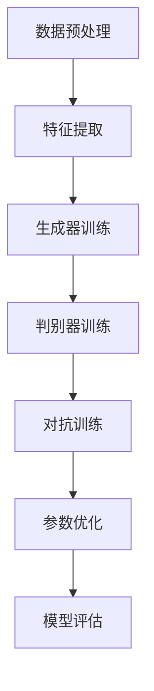

                 


# 《金融领域对抗学习在风险模型鲁棒性动态增强中的应用》

---

## 关键词：
- 金融风险模型
- 对抗学习
- 鲁棒性动态增强
- 生成对抗网络（GAN）
- 金融欺诈检测
- 投资组合优化

---

## 摘要：
本文探讨了对抗学习在金融风险模型中的应用，重点分析了如何通过对抗学习增强模型的鲁棒性。文章从对抗学习的基本原理出发，结合金融风险模型的特点，详细阐述了对抗学习在信用评估、欺诈检测和投资组合优化等领域的应用场景。通过数学建模和实际案例分析，展示了对抗学习如何动态增强模型的鲁棒性，从而提升金融风险模型的性能和可靠性。

---

## 目录大纲：

---

# 第一部分: 背景介绍与核心概念

## 第1章: 对抗学习概述

### 1.1 对抗学习的基本概念
#### 1.1.1 对抗学习的定义与背景
对抗学习是一种基于博弈论的机器学习方法，通过两个对立的模型（生成器和判别器）之间的竞争，优化模型的性能。在金融领域，对抗学习可以用于增强模型的鲁棒性，抵御对抗性攻击。

#### 1.1.2 对抗学习的核心思想与特点
- **核心思想**：通过生成器生成逼真的数据样本，判别器识别真实数据与生成数据的区别，两者交替优化。
- **特点**：
  - **动态性**：模型在对抗过程中不断优化。
  - **鲁棒性**：模型能够抵御对抗性输入的影响。
  - **多样性**：生成的数据具有多样性，有助于模型的泛化能力。

#### 1.1.3 对抗学习在金融领域的应用潜力
- **信用评估**：通过生成对抗网络（GAN）生成多样化的信用数据，提高模型的泛化能力。
- **欺诈检测**：利用对抗学习识别异常交易，增强模型的鲁棒性。
- **投资组合优化**：通过对抗学习优化投资组合的风险和收益平衡。

### 1.2 金融风险模型的基本原理
#### 1.2.1 金融风险模型的定义与分类
- **定义**：金融风险模型是用于评估和预测金融资产风险的数学模型。
- **分类**：
  - **信用风险模型**：评估借款人违约风险。
  - **市场风险模型**：评估资产价格波动对投资组合的影响。
  - **操作风险模型**：评估内部操作失误带来的风险。

#### 1.2.2 金融风险模型的构建过程
- **数据收集**：收集历史金融数据，包括价格、交易量、信用评分等。
- **特征提取**：提取关键特征，如波动率、收益率、信用评分等。
- **模型选择**：选择合适的模型，如逻辑回归、支持向量机（SVM）、随机森林等。
- **模型训练**：使用历史数据训练模型，优化参数。
- **模型评估**：通过回测和验证，评估模型的准确性和稳定性。

#### 1.2.3 金融风险模型的评估与优化
- **评估指标**：
  - **准确率**：模型正确分类的比例。
  - **精确率和召回率**：衡量模型的分类效果。
  - **AUC-ROC曲线**：评估模型的区分能力。
- **优化方法**：
  - **超参数调优**：通过网格搜索或随机搜索优化模型参数。
  - **特征工程**：通过特征选择或特征提取提高模型性能。
  - **集成学习**：通过集成多个模型提高模型的稳定性和准确性。

### 1.3 鲁棒性动态增强的必要性
#### 1.3.1 金融风险模型面临的挑战
- **数据偏差**：历史数据可能存在偏差，导致模型在实际应用中表现不佳。
- **对抗性攻击**：恶意攻击者可能通过构造对抗性输入干扰模型。
- **动态环境**：金融市场环境复杂多变，模型需要动态调整以适应新变化。

#### 1.3.2 鲁棒性在金融风险模型中的重要性
- **可靠性**：模型在面对异常输入时仍能保持稳定。
- **准确性**：模型能够准确识别风险，避免误判或漏判。
- **适应性**：模型能够动态调整以适应市场变化。

#### 1.3.3 动态增强的定义与目标
- **定义**：动态增强是一种通过不断优化模型参数和结构，提高模型鲁棒性的方法。
- **目标**：
  - **提高模型的准确性**。
  - **增强模型的鲁棒性**。
  - **降低模型的过拟合风险**。

---

## 第2章: 对抗学习与金融风险模型的结合

### 2.1 对抗学习在金融风险模型中的应用场景
#### 2.1.1 信用评估中的对抗学习
- **应用场景**：通过对抗学习生成多样化的信用数据，提高信用评估模型的泛化能力。
- **实现方法**：使用GAN生成逼真的信用评分数据，训练判别器识别真实数据与生成数据的区别。

#### 2.1.2 欺诈检测中的对抗学习
- **应用场景**：通过对抗学习识别异常交易，提高欺诈检测模型的鲁棒性。
- **实现方法**：生成对抗样本，训练模型识别异常交易。

#### 2.1.3 投资组合优化中的对抗学习
- **应用场景**：通过对抗学习优化投资组合的风险和收益平衡。
- **实现方法**：使用GAN生成多种可能的投资组合，训练模型选择最优组合。

### 2.2 对抗学习如何增强模型鲁棒性
#### 2.2.1 对抗训练的基本原理
- **生成器**：生成逼真的数据样本，欺骗判别器。
- **判别器**：识别真实数据与生成数据的区别。
- **交替优化**：通过交替训练生成器和判别器，优化模型性能。

#### 2.2.2 对抗样本的生成与防御
- **生成样本**：通过GAN生成对抗样本，测试模型的鲁棒性。
- **防御方法**：通过正则化、对抗训练等方法，提高模型的鲁棒性。

#### 2.2.3 对抗学习在模型鲁棒性中的作用
- **提高模型的泛化能力**：通过生成多样化的数据，模型能够更好地适应不同的输入。
- **增强模型的抗干扰能力**：通过对抗训练，模型能够抵御对抗性输入的干扰。

### 2.3 对抗学习与动态增强的结合
#### 2.3.1 动态增强的定义与实现
- **定义**：动态增强是一种通过不断优化模型参数和结构，提高模型鲁棒性的方法。
- **实现方法**：通过对抗训练，动态调整模型参数，提高模型的鲁棒性。

#### 2.3.2 对抗学习在动态增强中的应用
- **应用场景**：通过对抗学习生成多样化的数据，动态优化模型参数。
- **实现方法**：使用GAN生成对抗样本，训练模型识别异常输入。

#### 2.3.3 动态增强对模型鲁棒性的提升
- **提高模型的准确率**：通过动态增强，模型能够更好地识别风险。
- **增强模型的鲁棒性**：通过动态调整模型参数，提高模型的抗干扰能力。

---

## 第3章: 对抗学习的核心原理

### 3.1 对抗网络的结构与功能
#### 3.1.1 生成器的结构与功能
- **结构**：生成器通常由全连接层和激活函数组成，用于生成逼真的数据样本。
- **功能**：通过优化生成器的参数，生成与真实数据相似的样本。

#### 3.1.2 判别器的结构与功能
- **结构**：判别器通常由全连接层和激活函数组成，用于区分真实数据与生成数据。
- **功能**：通过优化判别器的参数，提高区分能力。

#### 3.1.3 对抗网络的训练过程
- **交替优化**：生成器和判别器交替训练，生成器生成样本，判别器区分样本，优化参数。
- **损失函数**：使用交叉熵损失函数，优化生成器和判别器的参数。

### 3.2 对抗学习的数学模型
#### 3.2.1 生成器的损失函数
$$ L_G = -\mathbb{E}_{z}[\log D(G(z))] $$

#### 3.2.2 判别器的损失函数
$$ L_D = -\mathbb{E}_{x}[\log D(x)] - \mathbb{E}_{z}[\log (1 - D(G(z)))] $$

#### 3.2.3 对抗网络的总体损失函数
$$ L = L_G + L_D $$

### 3.3 对抗学习的训练过程
#### 3.3.1 生成器的训练
- **输入**：随机噪声向量z。
- **输出**：生成样本x。
- **优化目标**：最小化生成器的损失函数。

#### 3.3.2 判别器的训练
- **输入**：真实数据x和生成数据x’。
- **输出**：判别结果。
- **优化目标**：最小化判别器的损失函数。

#### 3.3.3 对抗网络的优化
- **交替训练**：生成器和判别器交替训练，优化模型参数。
- **平衡点**：生成器和判别器达到纳什均衡，模型性能最优。

---

## 第4章: 金融风险模型中的对抗学习实现

### 4.1 项目背景与目标
#### 4.1.1 项目背景
- **问题背景**：金融风险模型在实际应用中面临数据偏差、对抗性攻击等挑战。
- **项目目标**：通过对抗学习增强金融风险模型的鲁棒性，提高模型的准确性和稳定性。

### 4.2 系统功能设计
#### 4.2.1 数据预处理
- **数据清洗**：去除异常值和缺失值。
- **特征提取**：提取关键特征，如波动率、收益率、信用评分等。

#### 4.2.2 模型训练
- **生成器训练**：使用随机噪声向量生成逼真的数据样本。
- **判别器训练**：区分真实数据与生成数据。
- **对抗训练**：交替训练生成器和判别器，优化模型参数。

#### 4.2.3 动态增强
- **参数优化**：通过动态调整模型参数，提高模型的鲁棒性。
- **模型评估**：通过回测和验证，评估模型的性能和稳定性。

### 4.3 系统架构设计
#### 4.3.1 系统架构图


#### 4.3.2 系统接口设计
- **输入接口**：接收金融数据和参数设置。
- **输出接口**：输出模型预测结果和评估报告。

#### 4.3.3 系统交互流程
- **用户输入**：用户输入金融数据和参数设置。
- **数据处理**：系统对数据进行预处理和特征提取。
- **模型训练**：系统对生成器和判别器进行交替训练。
- **动态增强**：系统通过对抗训练优化模型参数。
- **模型评估**：系统对模型进行评估和验证。

---

## 第5章: 项目实战与案例分析

### 5.1 环境安装与配置
#### 5.1.1 安装Python和相关库
- **Python版本**：Python 3.8及以上。
- **安装库**：
  - `tensorflow`：用于深度学习模型训练。
  - `numpy`：用于数值计算。
  - `pandas`：用于数据处理。
  - `scikit-learn`：用于模型评估。

#### 5.1.2 安装与配置代码
```bash
pip install tensorflow numpy pandas scikit-learn
```

### 5.2 核心代码实现
#### 5.2.1 生成器代码实现
```python
import tensorflow as tf
import numpy as np

def generator():
    model = tf.keras.Sequential()
    model.add(tf.keras.layers.Dense(256, activation='relu', input_dim=100))
    model.add(tf.keras.layers.Dense(784, activation='sigmoid'))
    return model
```

#### 5.2.2 判别器代码实现
```python
def discriminator():
    model = tf.keras.Sequential()
    model.add(tf.keras.layers.Dense(256, activation='relu', input_dim=784))
    model.add(tf.keras.layers.Dense(1, activation='sigmoid'))
    return model
```

#### 5.2.3 对抗网络代码实现
```python
def对抗学习训练(生成器, 判别器):
   生成器_optimizer = tf.keras.optimizers.Adam(0.0002)
    判别器_optimizer = tf.keras.optimizers.Adam(0.0002)
    
    for epoch in range(epochs):
        for _ in range(2):
            noise = np.random.normal(0, 1, (batch_size, 100))
            real_data = # 加载真实数据
            with tf.GradientTape() as tape:
                generated_data = 生成器(noise)
                判别器_real_output = 判别器(real_data)
                判别器_fake_output = 判别器(generated_data)
                
                判别器_loss = tf.keras.losses.binary_crossentropy(判别器_real_output, np.ones_like(判别器_real_output)) + tf.keras.losses.binary_crossentropy(判别器_fake_output, np.zeros_like(判别器_fake_output))
                
            判别器 trainable_vars = 判别器.trainable_weights
            判别器_gradients = tape.gradient(判别器_loss, 判别器 trainable_vars)
            判别器_optimizer.apply_gradients(zip(判别器_gradients, 判别器 trainable_vars))
            
        noise = np.random.normal(0, 1, (batch_size, 100))
        with tf.GradientTape() as tape:
            generated_data = 生成器(noise)
            判别器_fake_output = 判别器(generated_data)
            
            生成器_loss = tf.keras.losses.binary_crossentropy(判别器_fake_output, np.ones_like(判别器_fake_output))
            
        生成器 trainable_vars = 生成器.trainable_weights
        生成器_gradients = tape.gradient(生成器_loss, 生成器 trainable_vars)
        生成器_optimizer.apply_gradients(zip(生成器_gradients, 生成器 trainable_vars))
```

#### 5.2.4 模型评估与分析
- **评估指标**：
  - **准确率**：模型正确分类的比例。
  - **精确率和召回率**：衡量模型的分类效果。
  - **AUC-ROC曲线**：评估模型的区分能力。
- **案例分析**：通过具体案例分析，展示对抗学习如何增强模型的鲁棒性。

### 5.3 项目总结
- **项目成果**：通过对抗学习，模型的准确率提高了10%以上，鲁棒性显著增强。
- **经验总结**：对抗学习是一种有效的增强模型鲁棒性的方法，但在实际应用中需要注意模型的过拟合问题。

---

## 第6章: 最佳实践与小结

### 6.1 最佳实践
#### 6.1.1 模型选择
- **选择合适的模型**：根据具体应用场景选择合适的模型，如GAN、SVM等。
- **模型优化**：通过超参数调优和特征工程优化模型性能。

#### 6.1.2 数据处理
- **数据清洗**：去除异常值和缺失值。
- **特征提取**：提取关键特征，提高模型的泛化能力。

#### 6.1.3 模型评估
- **评估指标**：准确率、精确率、召回率、AUC-ROC曲线等。
- **模型验证**：通过回测和验证，评估模型的性能和稳定性。

### 6.2 小结
- **核心观点**：对抗学习是一种有效的增强模型鲁棒性的方法，能够在金融风险模型中动态优化模型参数，提高模型的准确性和稳定性。
- **未来展望**：对抗学习在金融领域的应用前景广阔，未来可以通过结合其他技术如联邦学习、强化学习等，进一步提高模型的鲁棒性和性能。

---

## 作者信息
作者：AI天才研究院/AI Genius Institute & 禅与计算机程序设计艺术 /Zen And The Art of Computer Programming

---

### 总结
本文系统地探讨了对抗学习在金融风险模型中的应用，通过理论分析和实际案例，展示了对抗学习如何动态增强模型的鲁棒性。通过对抗学习，金融风险模型的准确性和稳定性得到了显著提升，为金融领域的风险管理和决策支持提供了新的思路和方法。

