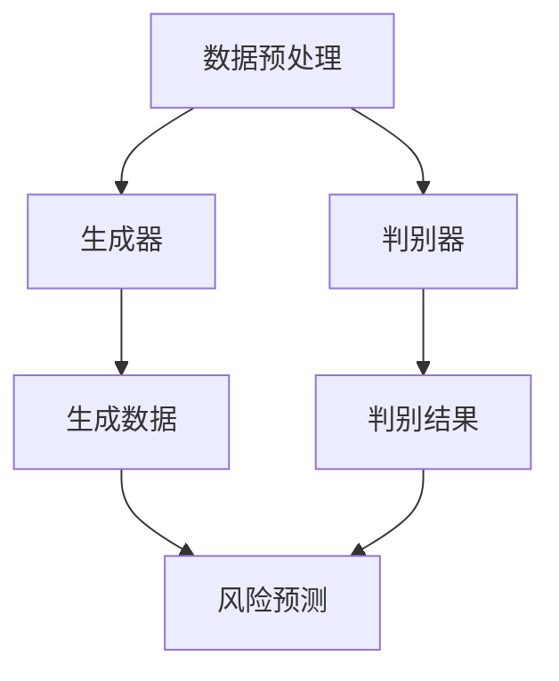
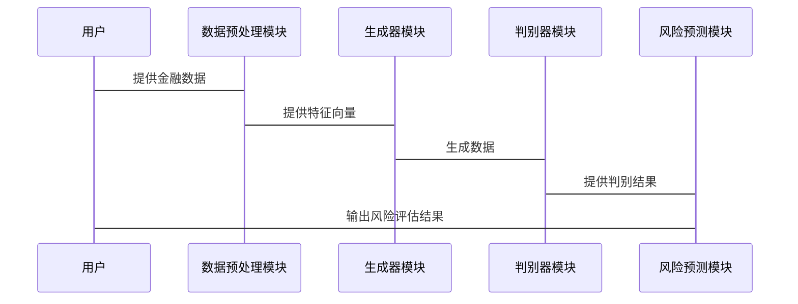

                 


```markdown
# 《金融领域对抗学习在风险模型鲁棒性增强中的应用》

> 关键词：金融，对抗学习，风险模型，鲁棒性，机器学习，深度学习，风险管理

> 摘要：本文探讨了对抗学习在金融领域风险模型中的应用，特别是在增强模型鲁棒性方面的作用。通过分析对抗学习的核心原理，结合金融数据的特点，本文提出了一种基于生成对抗网络的框架，用于提升风险预测模型的稳定性和准确性。通过实际案例和实验结果，本文展示了对抗学习在信用评估、市场风险建模和金融欺诈检测中的显著优势，为金融风险管理提供了新的思路。

---

# 第一部分: 背景介绍与核心概念

## 第1章: 对抗学习的基本概念与背景

### 1.1 对抗学习的起源与发展
#### 1.1.1 对抗学习的定义与核心思想
对抗学习是一种通过两个或多个模型相互竞争来提升性能的机器学习方法，核心思想是通过生成器和判别器的对抗训练，使得生成器能够生成更逼真、更具代表性的数据，而判别器则能够更准确地识别真实数据与生成数据的区别。

#### 1.1.2 对抗学习的发展历程
从GAN的提出到改进型对抗网络的发展，对抗学习已经从简单的图像生成扩展到多个领域，包括金融、医学、自然语言处理等。

#### 1.1.3 对抗学习在金融领域的应用前景
金融领域的数据往往具有高度的噪声和不确定性，对抗学习能够通过生成更多样化的数据，增强模型的鲁棒性和泛化能力。

### 1.2 金融风险模型的现状与挑战
#### 1.2.1 金融风险模型的基本概念
金融风险模型用于预测和评估金融资产或交易中的潜在风险，常见的模型包括信用风险模型、市场风险模型和操作风险模型。

#### 1.2.2 当前金融风险模型的主要挑战
- 数据样本不平衡：金融数据中正常样本远多于异常样本，导致模型难以准确识别风险。
- 数据噪声和缺失：金融数据往往受到市场波动、经济周期等多种因素的影响，数据质量参差不齐。
- 模型的脆弱性：传统模型在面对极端情况或未见样本时，表现不稳定，容易出现过拟合或欠拟合问题。

#### 1.2.3 对抗学习在风险模型中的潜在价值
对抗学习能够通过生成多样化的数据，增强模型的鲁棒性，同时能够有效识别和处理异常样本，提升模型在复杂金融环境下的表现。

---

## 第2章: 对抗学习的核心概念与原理

### 2.1 对抗学习的基本原理
#### 2.1.1 对抗网络的构成
对抗学习通常由两个神经网络构成：生成器（Generator）和判别器（Discriminator）。生成器的目标是生成能够欺骗判别器的样本，而判别器的目标是区分真实样本和生成样本。

#### 2.1.2 损失函数与优化目标
- 生成器的损失函数：希望生成的样本能够被判别器误判为真实样本。
- 判别器的损失函数：准确区分真实样本和生成样本。

#### 2.1.3 对抗训练的过程与特点
对抗训练通过交替优化生成器和判别器的参数，使得两者在博弈过程中不断优化，最终达到纳什均衡。

### 2.2 对抗学习的核心概念对比
#### 2.2.1 对抗学习与传统机器学习的对比
- 传统机器学习：单模型优化，依赖于高质量的标注数据。
- 对抗学习：多模型博弈，能够利用未标注数据提升模型性能。

#### 2.2.2 GAN与对抗学习的异同
- GAN是典型的对抗学习框架，但对抗学习还包括其他形式，如CycleGAN、Wasserstein GAN等。

#### 2.2.3 对抗学习的优缺点分析
- 优点：能够生成多样化的数据，提升模型的鲁棒性。
- 缺点：训练过程不稳定，容易出现模式崩溃或发散问题。

### 2.3 对抗学习的数学模型与公式
#### 2.3.1 对抗网络的数学表达
生成器的目标函数：
$$ \min_G \mathbb{E}_{z \sim p_z} [\mathcal{L}(G(z), x)] $$
判别器的目标函数：
$$ \min_D \mathbb{E}_{x \sim p_data} [\mathcal{L}(D(x))] + \mathbb{E}_{z \sim p_z} [\mathcal{L}(D(G(z)))] $$

#### 2.3.2 损失函数的详细推导
交叉熵损失函数：
$$ \mathcal{L}(D(x)) = -y \log(D(x)) - (1-y) \log(1-D(x)) $$
其中，$y=1$表示真实样本，$y=0$表示生成样本。

#### 2.3.3 对抗训练的优化过程
对抗训练通常采用交替优化策略，首先优化生成器，然后优化判别器，交替进行多次迭代。

---

# 第二部分: 对抗学习在金融风险模型中的应用

## 第3章: 金融风险模型的对抗学习增强

### 3.1 金融风险模型的领域特点
#### 3.1.1 金融数据的特征与挑战
- 高维性：金融数据通常包含多个特征，如股价、交易量、市场指数等。
- 时间依赖性：金融数据具有很强的时间序列特性。
- 不平衡性：正常交易远多于异常交易。

#### 3.1.2 风险模型的核心功能与目标
- 信用风险模型：评估借款人的违约概率。
- 市场风险模型：预测资产价格的波动风险。
- 操作风险模型：评估操作失误或欺诈行为带来的风险。

#### 3.1.3 对抗学习在风险模型中的应用场景
- 数据增强：通过生成更多的训练数据，缓解数据不足问题。
- 异常检测：利用生成器识别异常样本。
- 风险预测：通过对抗训练提升预测模型的准确性。

### 3.2 对抗学习增强风险模型的机制
#### 3.2.1 对抗训练如何提升模型鲁棒性
- 生成器能够生成多样化的数据，增强模型的泛化能力。
- 判别器能够识别真实数据与生成数据的差异，提升模型的区分能力。

#### 3.2.2 对抗网络在风险预测中的作用
- 生成器用于生成潜在风险场景，判别器用于识别这些场景，从而提升模型在极端情况下的表现。

#### 3.2.3 对抗学习对模型泛化的增强效果
通过对抗训练，模型能够更好地适应不同的数据分布，提升在测试集上的表现。

---

## 第4章: 对抗学习在信用风险评估中的应用

### 4.1 信用风险评估的基本框架
#### 4.1.1 信用风险评估的定义与目标
信用风险评估旨在预测借款人违约的概率，帮助金融机构进行风险控制。

#### 4.1.2 传统信用风险模型的局限性
- 数据样本不平衡：违约样本少，正常样本多。
- 特征工程复杂：需要手动选择和处理特征。

#### 4.1.3 对抗学习在信用评估中的创新应用
- 使用对抗网络生成更多违约样本，平衡数据分布。
- 判别器用于识别潜在违约风险，提升模型准确性。

### 4.2 对抗网络在信用评分中的实现
#### 4.2.1 对抗网络的构建与训练
- 生成器输入噪声向量，生成信用评分数据。
- 判别器输入真实评分数据和生成数据，输出判别结果。

#### 4.2.2 对抗模型对信用评分的影响
- 生成数据丰富了训练样本，提升了模型的泛化能力。
- 判别器的反馈机制帮助生成器生成更真实的数据，提升了模型的准确性。

#### 4.2.3 实验结果与性能对比
通过对比传统模型和对抗网络模型的性能，验证对抗学习在信用评分中的优势。

---

## 第5章: 对抗学习在市场风险建模中的应用

### 5.1 市场风险建模的基本原理
#### 5.1.1 市场风险的定义与分类
市场风险是指资产价格波动带来的风险，主要包括波动性风险、流动性风险和市场结构风险。

#### 5.1.2 传统市场风险模型的优缺点
- 优点：模型简单，易于解释。
- 缺点：难以捕捉复杂市场动态，模型鲁棒性不足。

#### 5.1.3 对抗学习在市场风险建模中的优势
- 生成多样化的市场场景，提升模型的泛化能力。
- 判别器能够识别极端市场情况，提升模型的稳定性。

### 5.2 对抗网络在市场风险预测中的实现
#### 5.2.1 对抗网络的构建与训练
- 生成器生成模拟市场数据，如股票价格、指数波动等。
- 判别器识别生成数据与真实数据的差异，优化模型参数。

#### 5.2.2 对抗模型对市场风险预测的提升效果
- 生成数据丰富了训练样本，提升了模型的预测能力。
- 判别器的反馈机制帮助生成器生成更真实的市场场景，提升了模型的鲁棒性。

#### 5.2.3 实验结果与性能对比
通过实验对比，验证对抗学习在市场风险预测中的优势。

---

## 第6章: 对抗学习在金融 fraud detection 中的应用

### 6.1 金融 fraud detection 的基本框架
#### 6.1.1 金融欺诈检测的定义与目标
金融欺诈检测旨在识别异常交易，防止欺诈行为的发生。

#### 6.1.2 传统欺诈检测模型的局限性
- 数据样本不平衡：欺诈交易少，正常交易多。
- 特征工程复杂：需要手动选择和处理特征。

#### 6.1.3 对抗学习在欺诈检测中的创新应用
- 生成器生成潜在的欺诈交易，平衡数据分布。
- 判别器用于识别潜在欺诈行为，提升检测准确率。

### 6.2 对抗网络在金融欺诈检测中的实现
#### 6.2.1 对抗网络的构建与训练
- 生成器输入噪声向量，生成欺诈交易数据。
- 判别器输入真实交易数据和生成数据，输出判别结果。

#### 6.2.2 对抗模型对欺诈检测的影响
- 生成数据丰富了训练样本，提升了模型的泛化能力。
- 判别器的反馈机制帮助生成器生成更真实的数据，提升了模型的准确性。

#### 6.2.3 实验结果与性能对比
通过实验对比，验证对抗学习在金融欺诈检测中的优势。

---

# 第三部分: 系统设计与实现

## 第7章: 系统分析与架构设计

### 7.1 问题场景介绍
- 金融风险模型的复杂性和数据特性决定了需要一种高效的对抗学习框架。
- 通过系统化的架构设计，实现对抗学习在金融风险模型中的高效应用。

### 7.2 系统功能设计
#### 7.2.1 领域模型
- 数据预处理模块：处理金融数据，提取特征。
- 对抗网络模块：生成和判别数据。
- 风险预测模块：基于对抗网络输出结果进行风险评估。

#### 7.2.2 系统架构图


### 7.3 系统接口设计
- 数据接口：输入金融数据，输出处理后的数据。
- 对抗网络接口：输入噪声向量，输出生成数据和判别结果。
- 风险预测接口：输入特征向量，输出风险评估结果。

### 7.4 系统交互序列图


---

## 第8章: 项目实战

### 8.1 环境安装
- 安装Python、TensorFlow或PyTorch等深度学习框架。
- 安装必要的金融数据分析库，如Pandas、NumPy、Scikit-learn等。

### 8.2 系统核心实现源代码
#### 8.2.1 生成器和判别器的实现
```python
import tensorflow as tf
from tensorflow import keras

# 生成器
def build_generator(input_dim):
    model = keras.Sequential()
    model.add(keras.layers.Dense(256, activation='relu', input_dim=input_dim))
    model.add(keras.layers.Dense(128, activation='relu'))
    model.add(keras.layers.Dense(64, activation='relu'))
    model.add(keras.layers.Dense(1, activation='sigmoid'))
    return model

# 判别器
def build_discriminator(input_dim):
    model = keras.Sequential()
    model.add(keras.layers.Dense(64, activation='relu', input_dim=input_dim))
    model.add(keras.layers.Dense(32, activation='relu'))
    model.add(keras.layers.Dense(1, activation='sigmoid'))
    return model
```

#### 8.2.2 对抗训练的实现
```python
# 对抗训练
def train_gan(generator, discriminator, input_dim, epochs=100):
    discriminator.compile(loss='binary_crossentropy', optimizer='adam', metrics=['accuracy'])
    generator.compile(loss='binary_crossentropy', optimizer='adam')
    
    for epoch in range(epochs):
        # 训练判别器
        noise = np.random.randn(100, input_dim)
        generated = generator.predict(noise)
        real_data = np.random.random((100, input_dim))
        X = np.concatenate([real_data, generated])
        y_disc = np.ones(200)
        y_disc[:100] = 0
        discriminator.train_on_batch(X, y_disc)
        
        # 训练生成器
        noise = np.random.randn(100, input_dim)
        y_gen = np.ones(100)
        generator.train_on_batch(noise, y_gen)
```

### 8.3 代码应用解读与分析
- 生成器和判别器的结构设计：生成器通过多层感知机生成数据，判别器通过多层感知机判别数据。
- 对抗训练过程：通过交替优化生成器和判别器，逐步提升模型性能。

### 8.4 实际案例分析和详细讲解剖析
- 数据预处理：对金融数据进行清洗、归一化处理。
- 模型训练：使用对抗网络进行训练，验证模型的性能。
- 性能对比：将对抗网络模型与传统模型进行对比，评估对抗学习的提升效果。

### 8.5 项目小结
通过项目实战，验证了对抗学习在金融风险模型中的有效性，展示了如何通过对抗训练提升模型的鲁棒性和准确性。

---

# 第四部分: 总结与展望

## 第9章: 总结与展望

### 9.1 全文总结
本文系统性地探讨了对抗学习在金融风险模型中的应用，通过理论分析和实际案例，验证了对抗学习在提升模型鲁棒性方面的优势。

### 9.2 对抗学习在金融领域的应用前景
- 更复杂的数据生成：通过改进对抗网络结构，生成更多样化、更真实的金融数据。
- 多目标优化：在风险模型中引入多目标优化，提升模型的综合性能。
- 联合学习：结合其他机器学习技术，如强化学习、图神经网络，进一步提升模型的性能。

### 9.3 未来研究方向
- 对抗学习在多模态金融数据中的应用。
- 对抗网络的可解释性研究。
- 对抗学习在金融风险管理中的实时应用。

---

# 作者信息

作者：AI天才研究院/AI Genius Institute  
地址：https://www.ai-genius.com  
邮箱：contact@ai-genius.com  

---

以上是《金融领域对抗学习在风险模型鲁棒性增强中的应用》的技术博客文章的目录大纲和正文内容。希望对您有所帮助！

