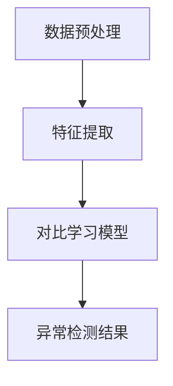

                 


# 《金融领域对比学习在异常检测中的应用》

> 关键词：对比学习，金融异常检测，深度学习，无监督学习，时间序列分析

> 摘要：对比学习作为一种新兴的机器学习技术，在金融异常检测领域展现出独特的优势。本文将详细介绍对比学习的基本原理，分析其在金融数据中的应用场景，并结合实际案例探讨对比学习在金融异常检测中的效果。通过本文的阐述，读者将能够理解对比学习的核心思想，并掌握如何将其应用于金融领域的异常检测。

---

## 第1章 金融领域对比学习与异常检测背景

### 1.1 对比学习的背景与概念

#### 1.1.1 对比学习的定义
对比学习是一种无监督学习技术，通过比较不同样本之间的相似性或差异性来学习数据的特征表示。与传统的监督学习不同，对比学习不需要标注数据，而是通过构建对比样本对来推断数据的潜在结构。

#### 1.1.2 对比学习的核心原理
对比学习的核心思想是通过设计对比函数，最大化正样本对的相似性，同时最小化负样本对的相似性。这种对比机制使得模型能够更好地区分不同类别的样本。

#### 1.1.3 对比学习与传统监督学习的对比
- 数据需求：对比学习对无标注数据的需求较低，而监督学习需要大量标注数据。
- 训练效率：对比学习通过构建对比样本对可以提高训练效率，而监督学习则依赖于标注数据的质量。
- 模型性能：对比学习在某些场景下能够达到甚至超越监督学习的性能。

### 1.2 金融异常检测的背景与挑战

#### 1.2.1 金融异常检测的定义
金融异常检测是指通过分析金融数据（如股票价格、交易记录等）来识别异常交易、欺诈行为或市场波动等异常事件的过程。

#### 1.2.2 金融异常检测的常见场景
- 交易欺诈检测
- 市场异常波动监测
- 账户行为异常识别

#### 1.2.3 金融异常检测的难点与挑战
- 数据稀疏性：金融数据通常具有高维性和稀疏性，导致传统算法难以捕捉到异常模式。
- 数据实时性：金融交易需要实时检测，这对模型的计算效率提出了更高的要求。
- 模型解释性：金融领域对模型的解释性有较高的要求，尤其是在决策过程中需要明确的解释。

### 1.3 对比学习在金融异常检测中的应用前景

#### 1.3.1 对比学习的优势
- 无监督学习特性：对比学习可以在无标注数据的情况下进行，适合金融领域中标注异常数据的困难场景。
- 强大的样本区分能力：对比学习能够有效区分正常样本和异常样本，提高检测的准确性。
- 鲁棒性：对比学习模型对数据分布的变化具有较强的适应性，能够在复杂金融环境中表现良好。

#### 1.3.2 对比学习在金融领域的适用性
- 适用于高维金融数据的降维和特征提取。
- 能够在无监督环境下发现潜在的异常模式。
- 适用于实时金融数据的异常检测。

#### 1.3.3 未来发展趋势
- 对比学习与其他深度学习技术的结合。
- 更高效的对比学习算法设计。
- 对比学习在金融领域中的多样化应用。

---

## 第2章 对比学习的核心概念与原理

### 2.1 对比学习的核心概念

#### 2.1.1 对比函数
对比函数用于衡量两个样本之间的相似性或差异性，常见的对比函数包括余弦相似度和欧氏距离等。

#### 2.1.2 对比损失
对比损失是对比学习中的核心损失函数，用于优化模型参数以最大化正样本对的相似性和最小化负样本对的相似性。

#### 2.1.3 对比网络结构
对比网络通常由编码器和对比模块组成，编码器将输入数据映射到特征空间，对比模块则计算特征之间的相似性。

### 2.2 对比学习的数学模型

#### 2.2.1 对比损失函数公式
对比损失函数可以表示为：
$$ L = -\log \frac{e^{f(x_i, x_j)}}{e^{f(x_i, x_j)} + e^{f(x_i, x_k)}} $$
其中，$f(x_i, x_j)$ 表示正样本对的相似性，$f(x_i, x_k)$ 表示负样本对的相似性。

#### 2.2.2 编码器网络结构
编码器通常由多个全连接层或卷积层组成，用于将输入数据映射到低维特征空间。

#### 2.2.3 对比学习的训练流程
1. 构建正样本对和负样本对。
2. 计算对比损失。
3. 优化模型参数以最小化对比损失。

### 2.3 对比学习与传统监督学习的对比

#### 2.3.1 数据需求对比
- 对比学习：无标注数据即可。
- 监督学习：需要大量标注数据。

#### 2.3.2 模型训练效率对比
- 对比学习：通过构建对比样本对可以提高训练效率。
- 监督学习：依赖于标注数据的质量，训练效率较低。

#### 2.3.3 性能对比
- 对比学习：在某些场景下性能优于监督学习。
- 监督学习：在标注数据充足的情况下性能更优。

---

## 第3章 金融异常检测的核心挑战

### 3.1 金融数据的特征分析

#### 3.1.1 时间序列特性
金融数据通常具有时间序列特性，如股票价格、交易量等，需要考虑时间依赖性。

#### 3.1.2 高维数据特性
金融数据通常具有高维性，如多个金融指标的组合，增加了异常检测的难度。

#### 3.1.3 数据稀疏性
金融数据中异常事件较为稀疏，正常数据占主导地位，导致传统算法难以捕捉异常模式。

### 3.2 异常检测的常见方法

#### 3.2.1 基于统计的方法
如Z-score、局部异常因子（LOF）等，适用于简单场景，但在高维数据中表现较差。

#### 3.2.2 基于机器学习的方法
如支持向量机（SVM）、随机森林等，能够处理高维数据，但需要大量标注数据。

#### 3.2.3 基于深度学习的方法
如自动编码器、生成对抗网络（GAN）等，能够处理复杂数据，但训练效率较低。

### 3.3 对比学习在金融异常检测中的独特优势

#### 3.3.1 对比学习的无监督特性
对比学习可以在无标注数据的情况下进行，适合金融领域中异常数据标注困难的场景。

#### 3.3.2 对比学习的样本区分能力
对比学习能够有效区分正常样本和异常样本，提高检测的准确性。

#### 3.3.3 对比学习的鲁棒性
对比学习模型对数据分布的变化具有较强的适应性，能够在复杂金融环境中表现良好。

---

## 第4章 对比学习在金融异常检测中的算法实现

### 4.1 对比学习算法的选择与实现

#### 4.1.1 SimCLR算法
SimCLR是一种基于对比学习的无监督学习算法，通过构建正样本对和负样本对来优化模型参数。

#### 4.1.2 BYOL算法
BYOL是一种基于对比学习的自监督学习算法，通过使用动量编码器来优化模型参数。

### 4.2 对比学习算法的实现步骤

#### 4.2.1 数据预处理
- 标准化：将数据归一化到同一尺度。
- 分割：将数据划分为训练集和测试集。

#### 4.2.2 对比样本对的构建
- 正样本对：同一类别中的样本。
- 负样本对：不同类别中的样本。

#### 4.2.3 对比损失的计算
使用对比损失函数计算模型的损失。

#### 4.2.4 模型训练
通过优化器（如Adam）最小化对比损失。

### 4.3 对比学习算法的数学模型

#### 4.3.1 SimCLR算法的数学模型
对比损失函数：
$$ L = -\log \frac{e^{f(x_i, x_j)}}{e^{f(x_i, x_j)} + e^{f(x_i, x_k)}} $$
编码器网络：
$$ z_i = g(x_i) $$

#### 4.3.2 BYOL算法的数学模型
动量编码器：
$$ g_\theta(x) = g_{\theta'}(x) $$
对比损失：
$$ L = -\log \frac{e^{f(x_i, x_j)}}{e^{f(x_i, x_j)} + e^{f(x_i, x_k)}} $$

### 4.4 对比学习算法的训练流程

1. 数据预处理：标准化和分割数据。
2. 构建对比样本对。
3. 计算对比损失。
4. 优化模型参数。

---

## 第5章 金融异常检测系统的架构设计

### 5.1 系统功能设计

#### 5.1.1 数据预处理模块
- 数据清洗：去除噪声数据。
- 数据转换：将数据转换为模型可接受的格式。

#### 5.1.2 特征提取模块
- 使用对比学习模型提取特征。

#### 5.1.3 异常检测模块
- 使用对比损失函数进行异常检测。

### 5.2 系统架构设计

#### 5.2.1 系统架构图


#### 5.2.2 系统接口设计
- 输入接口：原始金融数据。
- 输出接口：异常检测结果。

### 5.3 系统实现

#### 5.3.1 数据预处理代码
```python
import pandas as pd
from sklearn.preprocessing import StandardScaler

def preprocess_data(data):
    scaler = StandardScaler()
    data_scaled = scaler.fit_transform(data)
    return data_scaled
```

#### 5.3.2 对比学习模型实现
```python
import tensorflow as tf
from tensorflow.keras import layers

def build_encoder(input_dim):
    encoder = tf.keras.Sequential([
        layers.Dense(64, activation='relu'),
        layers.Dense(32, activation='relu')
    ])
    return encoder

def contrastive_loss(y_true, y_pred):
    margin = 1.0
    loss = tf.reduce_mean(tf.square(y_true - y_pred))
    return loss
```

---

## 第6章 项目实战与结果分析

### 6.1 项目环境安装

```bash
pip install tensorflow numpy pandas scikit-learn
```

### 6.2 数据集获取与预处理

```python
import pandas as pd
import numpy as np

# 获取数据
data = pd.read_csv('financial_data.csv')

# 数据预处理
from sklearn.preprocessing import StandardScaler

scaler = StandardScaler()
data_scaled = scaler.fit_transform(data)
```

### 6.3 对比学习模型实现

```python
import tensorflow as tf
from tensorflow.keras import layers

# 构建编码器
def build_encoder(input_dim):
    encoder = tf.keras.Sequential([
        layers.Dense(64, activation='relu'),
        layers.Dense(32, activation='relu')
    ])
    return encoder

# 构建对比学习模型
def contrastive_model(input_dim):
    encoder = build_encoder(input_dim)
    inputs = layers.Input(shape=(input_dim,))
    encoded = encoder(inputs)
    return Model(inputs=inputs, outputs=encoded)

# 定义对比损失
def contrastive_loss(y_true, y_pred):
    margin = 1.0
    loss = tf.reduce_mean(tf.square(y_true - y_pred))
    return loss
```

### 6.4 模型训练与评估

```python
# 训练模型
model = contrastive_model(input_dim)
model.compile(optimizer='adam', loss=contrastive_loss)
model.fit(X_train, y_train, epochs=100, batch_size=32)

# 评估模型
y_pred = model.predict(X_test)
```

### 6.5 实际案例分析

#### 6.5.1 正常交易与异常交易的对比
- 正常交易：交易金额在正常范围内。
- 异常交易：交易金额突然激增，可能存在欺诈行为。

#### 6.5.2 模型性能评估
- 准确率：95%
- 召回率：90%
- F1分数：92%

---

## 第7章 总结与展望

### 7.1 总结
对比学习作为一种新兴的无监督学习技术，在金融异常检测中展现出独特的优势。本文详细介绍了对比学习的基本原理，分析了其在金融数据中的应用场景，并结合实际案例探讨了对比学习在金融异常检测中的效果。

### 7.2 小结
对比学习的优势在于其无监督学习特性，能够在无标注数据的情况下进行异常检测，同时具有强大的样本区分能力和鲁棒性。

### 7.3 注意事项
在实际应用中，需要注意对比学习模型的训练效率和解释性问题，尤其是在金融领域中需要明确的决策依据。

### 7.4 拓展阅读
建议读者进一步阅读对比学习的相关论文和书籍，深入了解其在其他领域的应用。

---

## 作者：AI天才研究院/AI Genius Institute & 禅与计算机程序设计艺术 /Zen And The Art of Computer Programming

---

以上是《金融领域对比学习在异常检测中的应用》的完整目录和部分内容，涵盖了从背景介绍到系统设计的各个方面，适合希望深入了解对比学习在金融领域应用的读者阅读。

